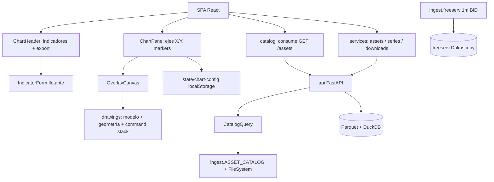
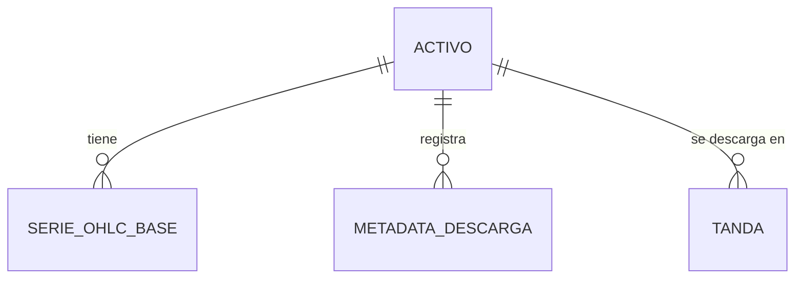
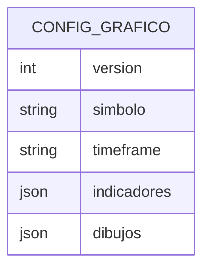
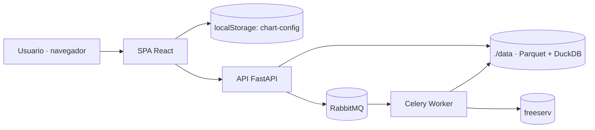
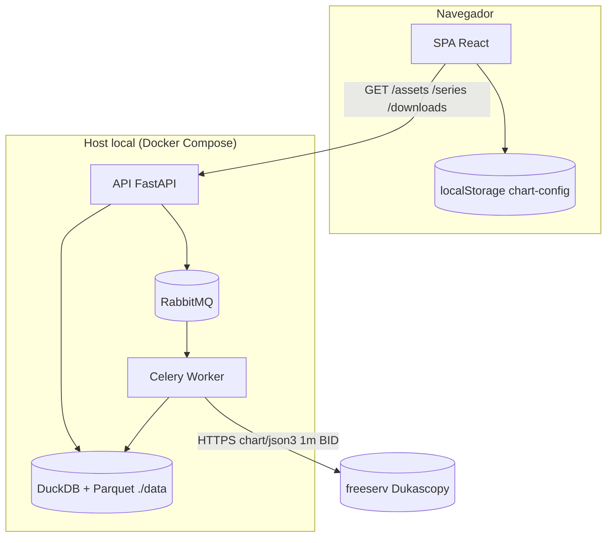

# Arquitectura del Sistema: Mejoras UX (Ciclo 03)

> Fuente: `_docs/plan.md`, `_docs/requirements.md`
> Base: `_docs/iterations/01-mvp/architecture.md` y `_docs/iterations/02-optimizacion-descarga/architecture.md`
> Fecha: 2026-09-29
> Estado: Borrador

## 1. Resumen ejecutivo

Se **conserva el monolito modular con worker asíncrono y SPA React** (ADR-001,
ADR-003). Este ciclo no toca el pipeline de datos: interviene la **capa de
presentación** (gráfico, indicadores, dibujos, Descarga y Abrir) y el
**catálogo de activos**. Los cambios clave son: una **capa de dibujos editable**
con undo/redo sobre el overlay custom (ADR-017), **persistencia de la
configuración del gráfico** en `localStorage` versionado por activo+timeframe
(ADR-018), un **formulario flotante de indicadores** (ADR-019), el **retiro de
`"1s"`** del contrato `Timeframe` (ADR-020) y la **unificación del catálogo** vía
el `GET /assets` existente (ADR-021). Sin dependencias nuevas (RNF-006).

## 2. Restricciones que guían el diseño

| Origen | Restricción | Impacto arquitectónico |
|--------|-------------|------------------------|
| RNF-005 | Navegadores de escritorio modernos | SPA client-side; overlay en canvas |
| RNF-006 | Costo $0 (solo OSS) | Sin librería de dibujo comercial; `localStorage` nativo |
| RNF-007 | 2 semanas | Incremento acotado; sin tocar backend de datos |
| ADR-005 | `lightweight-charts` v4 | Dibujos en overlay custom (no nativo) |
| RI-003 (01-mvp) | Dibujos no persistidos | **Modificado** por RI-201 (persistencia en navegador, no backend) |
| ADR-012 / contrato | `Timeframe` con `"1s"` | Retiro coordinado API + espejo TS (ADR-020) |
| RNF-004 | UTC exclusivo | Marcas/dibujos en tiempo UTC |
| Cuota navegador | Límite de `localStorage` | Esquema versionado; migrable a IndexedDB |

## 3. Estilo arquitectónico

### Elegido
**Monolito modular + SPA** — sin cambio respecto a 01-mvp (ADR-001).

### Justificación
- RNF-007/RNF-006: un solo despliegue, sin infraestructura nueva.
- RF-016 (extensible): las nuevas piezas (`drawings`, `chart-config`) respetan las
  fronteras de `charting`, `state`, `components`, `catalog`.
- Es un **incremento de UI**, no un rediseño: el estilo se mantiene.

### Alternativas descartadas
| Alternativa | Por qué se descartó |
|-------------|---------------------|
| Librería de charting con dibujos nativos (TradingView Charting Library) | No OSS → RNF-006 |
| Persistir dibujos en backend | Fuera de alcance (RF-W-201); RNF-007 |
| Migrar la capa de dibujo a DOM overlay | Reescritura del overlay actual; mayor riesgo (R-202) |

## 4. Vista lógica (módulos y capas)

| Módulo | Responsabilidad | Requisitos que cubre |
|--------|-----------------|----------------------|
| `charting/drawings` (nuevo) | Modelo de dibujo, geometría editable, hit-testing, command stack (undo/redo), serialización | RF-209, RF-210, RF-212, RF-213, RNF-202 |
| `charting/OverlayCanvas` (extendido) | Render e interacción de edición (handles) | RF-212, RF-213 |
| `state/chart-config` (nuevo) | Persistencia versionada por activo+timeframe | RF-204, RI-201, RNF-201 |
| `components/IndicatorForm` (nuevo) | Formulario flotante de indicadores; reemplaza panel inferior | RF-201, RF-202, RF-203 |
| `components/ChartHeader` (refactor) | Botón de indicadores + export en el header | RF-203, RF-205 |
| `components/ChartPane` | Ejes (X hora:minuto, Y 5 decimales), markers a 10 pips, paleta de dibujos | RF-206, RF-207, RF-208, RF-209 |
| `components/DownloadScreen/History` (refactor) | Centrado, activo en historial | RF-214, RF-215 |
| `components/ChartSelector` (refactor) | Centrado, `1m` (sin `1s`) | RF-218, RF-219 |
| `catalog` (refactor) | Consumir `GET /assets`; eliminar espejo | RF-220, RX-202, RI-202 |
| `contracts/ohlc` (front + back) | Retiro de `"1s"` de `Timeframe` | RF-219 |
| `ingest.catalog` + `ingest.freeserv` | 5 pares nuevos + `instrument_id` | RF-216, RF-217, RX-201 |
| `api` | `GET /assets` existente sirve el catálogo ampliado | RF-220, RI-202 |

## 5. Vista de datos

### Modelo entidad-relación (backend, sin cambio)

### Entidad cliente (nueva)

| Entidad | Persistencia | Sensibilidad | Volumen estimado | Retención |
|---------|--------------|--------------|------------------|-----------|
| ACTIVO | catálogo en código (backend) | pública | ~12 | — |
| SERIE_OHLC_BASE (1 m) | `{symbol}.1m.parquet` | pública | ~726k velas/activo (2 a) | Indefinida local |
| METADATA_DESCARGA | tabla DuckDB | interna | 1 registro/tanda | Indefinida |
| CONFIG_GRAFICO | `localStorage` del navegador | interna (sin PII) | 1 entrada / activo+timeframe | Local del navegador |

Clave de `CONFIG_GRAFICO`: `fxtrad.chart.v{n}.{symbol}.{timeframe}` (ADR-018).

## 6. Vista de integración

| Sistema externo | Protocolo | Dirección | Datos intercambiados | Requisito |
|-----------------|-----------|-----------|----------------------|-----------|
| freeserv `chart/json3` | HTTPS/JSONP | Entrada | OHLC 1 m BID de los 5 pares nuevos | RX-201, ADR-013/014 |
| API `GET /assets` | HTTP REST | Interna | Catálogo con cobertura/estado (fuente única) | RF-220, RX-202, RI-202 |
| API `GET /series` / `/downloads` | HTTP REST | Interna | Series OHLC, historial | RX-002, RI-002 |
| `localStorage` | Web Storage | Interna | Configuración de gráfico | RI-201 |

## 7. Vista física / despliegue

| Entorno | Propósito | Infraestructura |
|---------|-----------|-----------------|
| Dev / uso personal | Desarrollo y uso | Docker Compose local (ADR-009) |

Sin staging/prod dedicados (app personal, RNF-005).

## 8. Stack tecnológico

| Capa | Tecnología | Versión | Justificación | ADR |
|------|-----------|---------|---------------|-----|
| Frontend | React + Vite + TypeScript | existente | ADR-003 | ADR-003 |
| Gráficos | `lightweight-charts` | ^4.2.3 | ADR-005, RNF-001 | ADR-005 |
| Capa de dibujo | Overlay canvas custom | — | RF-209/210/212/213, RNF-202 | ADR-017 |
| Persistencia cliente | Web Storage (`localStorage`) | nativo | RI-201, RNF-201 | ADR-018 |
| Backend | Python + FastAPI | existente | ADR-002; `GET /assets` | ADR-002 |
| Catálogo | `ingest.ASSET_CATALOG` fuente única | existente | RF-220, RI-202 | ADR-021 |
| Descarga | `dukascopy-python` (1 m BID) | existente | RX-201, ADR-013/014 | ADR-010 |
| Infra | Docker Compose | existente | RNF-006/007 | ADR-009 |
| Observabilidad / CI-CD | structlog / GitHub Actions | existente | ADR-008/011 | ADR-008 |

**No se añade ninguna dependencia nueva.**

## 9. Atributos de calidad y su cobertura

| RNF | Meta | Componente/Práctica que lo satisface | Cómo se verifica |
|-----|------|--------------------------------------|------------------|
| RNF-201 | Config persistente y versionada | `state/chart-config` (ADR-018) | Test de round-trip y recarga |
| RNF-202 | Edición de dibujos a 60 FPS | OverlayCanvas + command stack (ADR-017) | Profiling de drag y `requestAnimationFrame` |
| RNF-203 | 0 regresiones | CI GitHub Actions + suites (ADR-008) | `pytest` + `vitest` en verde |
| RNF-204 | Tokens de diseño unificados | Design system frontend (tokens) | Revisión de tokens y axe-core |
| RNF-205 | Activos nuevos con misma latencia/contrato | `ingest` + `FREESERV_INSTRUMENT` | Smoke de descarga/consulta por par |
| RNF-001 | 60 FPS de UI | `lightweight-charts` + overlay (ADR-005/017) | Profiling de pan/zoom |
| RNF-004 | UTC exclusivo | Marcas/dibujos en epoch UTC | Test de coordenadas de dibujo |
| RNF-005 | Navegadores desktop | SPA client-side (ADR-003) | Smoke de navegador |
| RNF-006 | Costo $0 | Stack OSS, sin dependencias nuevas | Auditoría de licencias |
| RNF-007 | 2 semanas | Alcance de UI acotado | Cierre de iteración |
| ACC-201 | Accesibilidad axe-core | ADR-011 + contratos ARIA en `_docs/ux` | axe-core en CI |

## 10. Riesgos arquitectónicos

| ID | Riesgo | Impacto | Mitigación |
|----|--------|---------|------------|
| R-202 | La edición de dibujos exige reescribir el overlay | Alto | Extender `OverlayCanvas` + `overlay-geometry` (ADR-017), no reescribir |
| R-203 | Corrupción/migración del esquema de config | Medio | Versión en la clave y migración explícita (ADR-018) |
| R-204 | Retiro de `"1s"` rompe contrato/tests | Alto | Cambio coordinado API + espejo TS + tests (ADR-020) |
| R-201 | Par nuevo no soportado por Dukascopy | Medio | Verificación por par; excluir solo el no soportado |
| R-205 | Alcance UI > 2 semanas | Medio | Respetar el orden de prioridad del insumo |

## 11. Decisiones registradas (ADRs)

| ADR | Título | Estado |
|-----|--------|--------|
| ADR-001…011 | Arquitectura y decisiones base de 01-mvp | Aceptados |
| ADR-012…016 | Base 1 m, paginación, BID, tandas, Celery | Aceptados |
| ADR-017 | Capa de dibujos editable con patrón Command (undo/redo) | Propuesto |
| ADR-018 | Persistencia de configuración del gráfico en `localStorage` | Propuesto |
| ADR-019 | Formulario flotante de indicadores y supresión del panel inferior | Propuesto |
| ADR-020 | Retiro de `"1s"` del contrato `Timeframe` | Propuesto |
| ADR-021 | Catálogo único vía `GET /assets` | Propuesto |

## 12. Diagrama C4 (contenedores)

