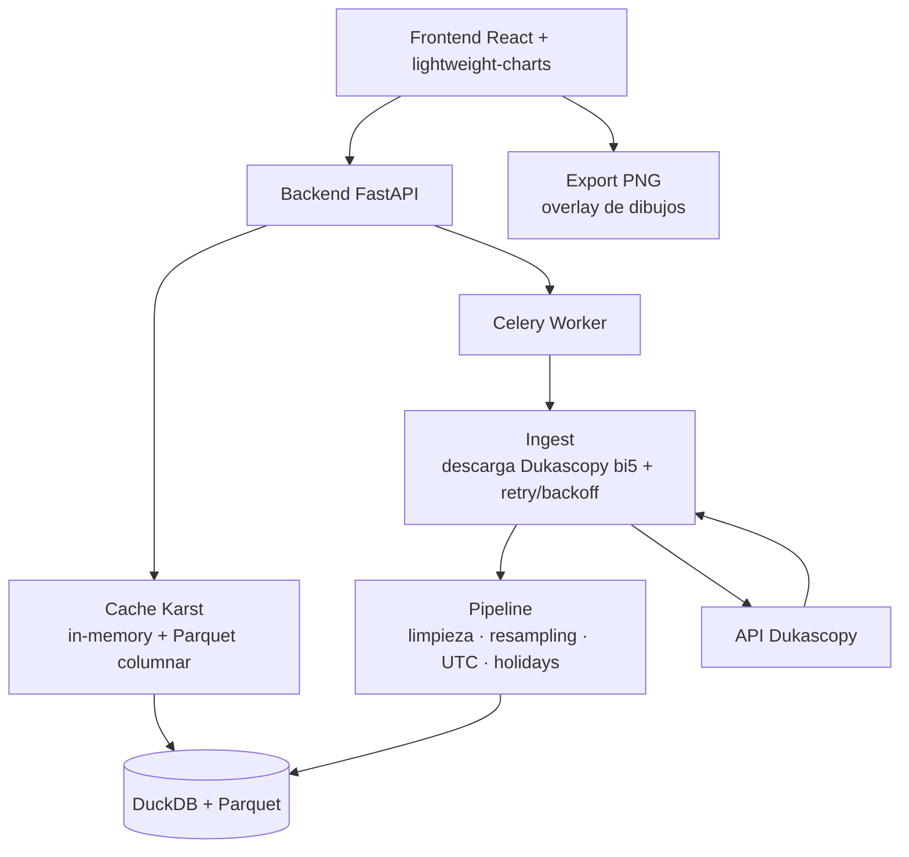
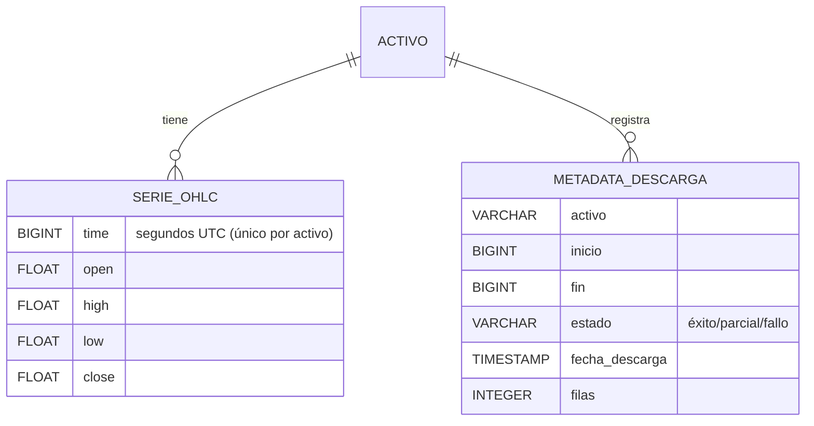
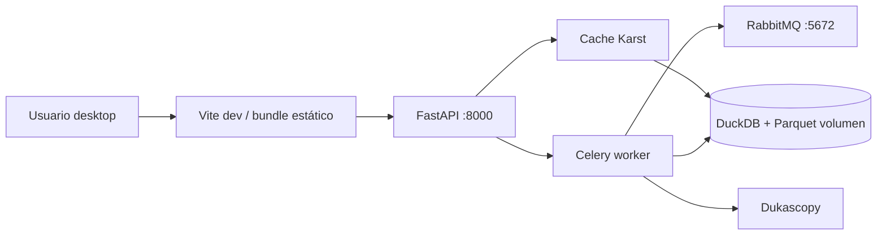
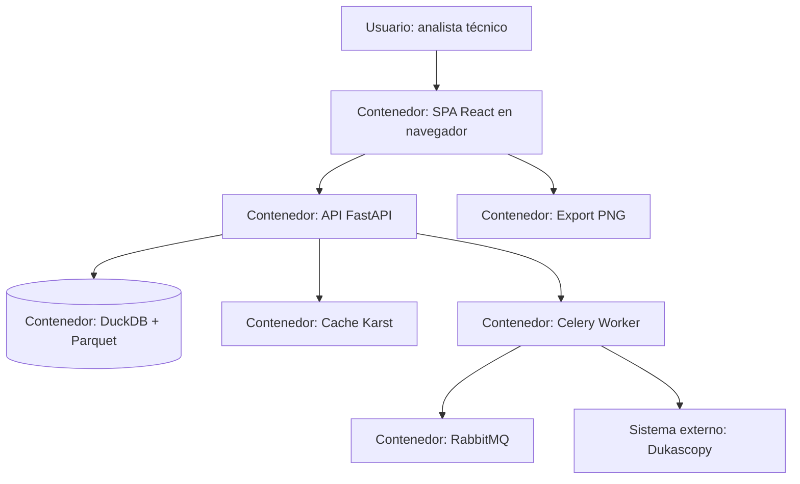

# Arquitectura del Sistema: Plataforma de Análisis Técnico (estilo TradingView)

> Fuente: `_docs/plan.md`, `_docs/requirements.md`
> Fecha: 2026-09-17
> Estado: Aprobado

## 1. Resumen ejecutivo

Monolito modular de uso personal-local: un backend Python (FastAPI) con módulos de descarga (Celery), pipeline y storage (DuckDB + Parquet), y un frontend React SPA con `lightweight-charts` (open-source) para velas a 60 FPS. El contrato de datos OHLC se fija en el pipeline y se consume directamente por la librería de gráficos (RNF-008), evitando transformaciones ad-hoc. Costo $0 (RNF-006), desplegable con Docker Compose para un solo usuario en la máquina local (RNF-005, RNF-007).

## 2. Restricciones que guían el diseño

| Origen | Restricción | Impacto arquitectónico |
|--------|-------------|------------------------|
| project.md | Parquet como formato de archivo | Módulo `storage` basado en Parquet por activo (ADR-004) |
| project.md | DuckDB como motor de consulta | Motor de consulta/ETL en backend (ADR-004) |
| Usuario | Stack: Python backend + React/Vite frontend | Backend FastAPI (ADR-002), SPA React (ADR-003) |
| Usuario | Presupuesto $0, solo open source | Stack 100% OSS; adios SaaS (ADR-008) |
| Usuario | MVP en 2 semanas | Monolito modular, no microservicios (ADR-001) |
| Usuario | UTC exclusivo en timestamps | Pipeline normaliza a segundos UTC (RNF-004) |
| project.md | Navegadores de escritorio modernos | SPA client-side; canvas en navegador (RNF-005) |
| Por diseño | Sin PII ni datos de clientes | Sin capa de identidad; datos públicos de mercado |

## 3. Estilo arquitectónico

### Elegido
Monolito modular (backend unificado + frontend SPA), con límites internos claros entre `ingest`, `pipeline`, `storage`, `api` y `export`, y cola asíncrona para descargas.

### Justificación
- RNF-007 (2 semanas, 1 desarrollador): un solo proceso despliegable, iteración rápida, cero fricción operacional.
- RNF-006 ($0): sin infraestructura distribuida que pagar/mainitener.
- RF-016 (extensible): fronteras por módulos e interfaces explícitas permiten añadir características sin reescrituras.
- R-002 (volumen 18M filas): resuelto por caché + renderizado del navegador, no por escala horizontal (innecesaria aquí).

### Alternativas descartadas

| Alternativa | Por qué se descartó |
|-------------|---------------------|
| Microservicios | Sobrecarga operacional/red sin casos de uso; viola RNF-007 y RNF-006 (ADR-001) |
| Serverless | Límites de duración/cold start incompatibles con descargas largas y ETL pesado (ADR-001) |
| ETL en script + HTML plano | Violaría RF-016 (sin fronteras) y la requisito de visualización en SPA (ADR-001) |

## 4. Vista lógica (módulos y capas)

| Módulo | Responsabilidad | Requisitos que cubre |
|--------|-----------------|----------------------|
| `ingest` | Descarga bi5 de Dukascopy (activo + rango), retry/backoff de 20 s, tarea Celery | RF-001, RF-002, RX-001, RNF-003 |
| `pipeline` | Limpieza (time/OHLC), imputación, exclusión weekend/holidays, resampling 1m/5m/15m/1h/4h/1d, normalización UTC | RF-003, RF-004, RF-009, RNF-004 |
| `storage` | Persistencia Parquet + DuckDB, incremental sin duplicados, metadatos de descarga | RF-005, RF-006, RI-001, RI-002 |
| `api` | Exposición REST de activos, rangos y series (contrato OHLC de lightweight-charts) | RF-007, RF-008, RF-009, RX-002, RNF-008 |
| `export` | Captura PNG del grafo + dibujos (lienzo overlay) | RF-015, RI-003 |
| `charting` (frontend) | Velas, zoom/pan, overlay dibujos, indicadores, 3 gráficos sincronizados | RF-010…RF-014, RNF-001 |
| `extensibility` (transversal) | Interfaces de módulos/indicadores reutilizables | RF-016 |

La **interfaz pública y las dependencias permitidas por módulo** están
documentadas en `_docs/module-interfaces.md` (TASK-042) y verificadas por
`backend/tests/test_module_interfaces.py`.

## 5. Vista de datos

### Modelo entidad-relación

### Entidades

| Entidad | Persistencia | Sensibilidad | Volumen estimado | Retención |
|---------|--------------|--------------|------------------|-----------|
| Activo | DuckDB (catálogo) + Parquet por activo | Pública (mercado) | Decenas de activos | Ilimitada |
| Serie OHLC | Parquet por activo, consultado vía DuckDB | Pública | ~18M filas/activo (2 años @ 1s); ≈45M seg de mercado | 2 años móviles (RNF-003) |
| Metadatos de descarga | Tabla DuckDB | Interna | 1 fila por descarga | Ilimitada |
| Dibujos/estrategias | **No** persistencia interna (solo PNG exportado) | Interna | n/a | Efímeros (RI-003) |

## 6. Vista de integración

| Sistema externo | Protocolo | Dirección | Datos intercambiados | Requisito |
|-----------------|-----------|-----------|----------------------|-----------|
| Dukascopy data API | HTTP (bi5, formato Dukascopy) | Saliente (descarga) | Timeframes 1s, UTC; OHLC bid/ask agregado a OHLC | RX-001, RF-001/002 |
| Backend → frontend | HTTP REST (JSON) | Interna (localhost) | Catálogo de activos, series OHLC por rango/timeframe | RX-002, RF-007/008/009 |

## 7. Vista física / despliegue

| Entorno | Propósito | Infraestructura |
|---------|-----------|-----------------|
| Dev / uso personal (único) | MVP local, uso personal en desktop | Docker Compose: frontend + backend + worker + RabbitMQ; volumen `data/` con DuckDB/Parquet |

*Staging/Prod dedicados fuera de alcance (app personal, RNF-005): el mismo compose es el entorno de uso.*

## 8. Stack tecnológico

| Capa | Tecnología | Versión | Justificación | ADR |
|------|-----------|---------|---------------|-----|
| Frontend | React + Vite + TypeScript | React 18 / Vite 5 / TS 5 | Restricción usuario; RNF-005, RNF-007 | ADR-003 |
| Gráficos | lightweight-charts | v4 (MIT) | RNF-001, RNF-002, RNF-008, R-005 | ADR-005 |
| Backend | Python + FastAPI + Uvicorn | Python 3.12 | Restricción usuario; RNF-006/007; integra pandas/duckdb | ADR-002 |
| ETL | pandas + duckdb | estables | RF-003/005/009, RNF-004 | ADR-002, ADR-004 |
| Cola/mensajería | Celery + RabbitMQ | estables | R-001, R-002, descargas asíncronas | ADR-006 |
| Caché | Karst (in-memory + Parquet col) | propio | RNF-001, RNF-002 | ADR-007 |
| Persistencia | Parquet + DuckDB | 1.x | RF-005 (obligatorio), RNF-002 | ADR-004 |
| Export | Canvas `toBlob` PNG | nativo | RF-015, RNF-006 | ADR-005 |
| Observabilidad | stdlib logging + structlog | estable | RNF-007, RNF-006 | ADR-008 |
| CI/CD | GitHub Actions + Docker | estable | RNF-007 | ADR-008 |
| Infra local | Docker Compose | 2.x | RNF-005/007, desplegable local | ADR-009 |

## 9. Atributos de calidad y su cobertura

| RNF | Meta | Componente/Práctica que lo satisface | Cómo se verifica |
|-----|------|--------------------------------------|------------------|
| RNF-001 | Pan/zoom fluido (60 FPS) | lightweight-charts (ADR-005) + Cache Karst (ADR-007) | KPI-2; prueba manual y `requestAnimationFrame` profiling |
| RNF-002 | ~18M filas/activo | DuckDB columnar (ADR-004) + caché por ventana (ADR-007) | Prueba de carga con dataset 2 años |
| RNF-003 | Ventana 2 años desde descarga | Módulo `ingest` (ADR-006) permite rango completo | KPI-1; verificación de rango descargado |
| RNF-004 | UTC exclusivo | Módulo `pipeline` normaliza (ADR-002) | Prueba de fixture con TZ no-UTC |
| RNF-005 | Navegadores desktop modernos | SPA React client-side (ADR-003), sin plugins | Smoke test en navegadores objetivo |
| RNF-006 | Costo $0 | Stack 100% OSS (ADR-001…009) | Auditoría de licencias en inventario de stack |
| RNF-007 | MVP en 2 semanas | Monolito modular (ADR-001) + CI (ADR-008) | Cierre de hitos por semana (plan §2) |
| RNF-008 | Datos consumibles sin hacks | Contrato OHLC fijado en pipeline y lightweight-charts (ADR-005, ADR-007) | Contrato de tipos compartido; sin transformación en frontend |

## 10. Riesgos arquitectónicos

| ID | Riesgo | Impacto | Mitigación |
|----|--------|---------|------------|
| AR-1 | Dukascopy degrada/bloquea descargas masivas | Retraso en obtener datos | Retry/backoff 20 s en Celery (ADR-006); descargas incrementales |
| AR-2 | 18M filas degrada la UI | RNF-001 incumplido | Caché por ventana (ADR-007) + renderizado canvas nativo (ADR-005) |
| AR-3 | Contrato de datos incompatible con lightweight-charts | RNF-008 incumplido | Contrato OHLC definido contra la librería antes del ETL (R-005) |
| AR-4 | Overlay de dibujos custom rookie en 2 semanas | RF-011/012 atrasan | Alcance ajustado; protocolo de dibujos simple, dibujos efímeros (RI-003) |
| AR-5 | Datos sucios/gaps de Dukascopy | Pipeline errático | Pipeline con imputación y exclusión weekend/holidays (RF-004) |

## 11. Decisiones registradas (ADRs)

| ADR | Título | Estado |
|-----|--------|--------|
| ADR-001 | Estilo arquitectónico (monolito modular) | Aceptado |
| ADR-002 | Backend en Python + FastAPI | Aceptado |
| ADR-003 | Frontend en React + Vite + TypeScript | Aceptado |
| ADR-004 | Persistencia en Parquet + DuckDB | Aceptado |
| ADR-005 | Gráficos con lightweight-charts + overlay dibujos | Aceptado |
| ADR-006 | Cola de descargas con Celery + RabbitMQ | Aceptado |
| ADR-007 | Caché de series (Karst) | Aceptado |
| ADR-008 | Observabilidad + CI/CD | Aceptado |
| ADR-009 | Despliegue local con Docker Compose | Aceptado |
| ADR-010 | Transporte FreeServ/Dukascopy en Python | Aceptado |
| ADR-011 | Accesibilidad automatizada con axe-core | Aceptado |

## 12. Diagrama C4 (nivel 2, contenedores)

