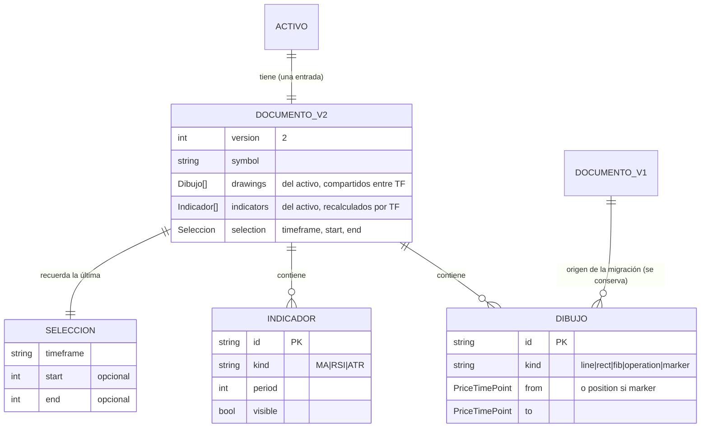
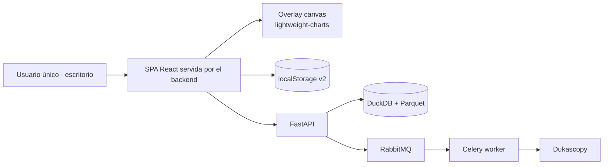
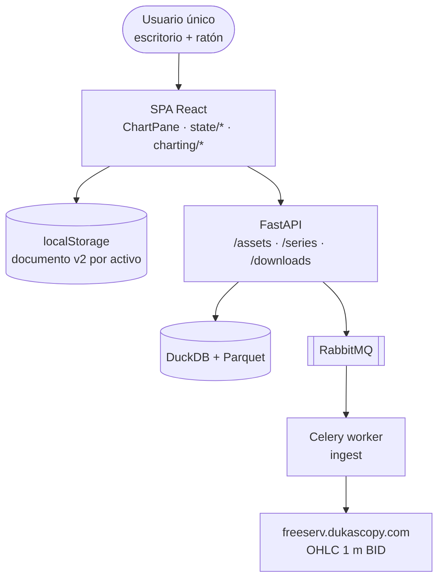

# Arquitectura del Sistema: Mejoras UX del Gráfico y Cierre de Deuda (Ciclo 05)

> Fuente: `_docs/plan.md`, `_docs/requirements.md`, `_docs/glossary.md`
> Base: `_docs/iterations/04-dibujo-referencia-operacion/architecture.md`, `03-mejoras-ux/`, `02-…`, `01-mvp/`
> Decisiones de sesión: `_docs/session-handoff.md` (D-1…D-9)
> Fecha: 2026-10-06
> Estado: Aprobado

## 1. Resumen ejecutivo

Se **conserva el monolito modular con worker asíncrono y SPA React** (ADR-001, ADR-003). Este
ciclo es **100 % frontend** (0 tareas backend): no toca el pipeline de datos, ni los contratos de
API, ni la persistencia en servidor. La decisión que ordena todo el diseño es que el **dibujo
deja de ser un artefacto del timeframe** y pasa a ser del **activo**, lo que obliga a un
**documento de configuración v2 con migración aditiva** desde la clave
`fxtrad.chart.v1.{activo}.{TF}` (RI-401, RNF-401). Alrededor de esa decisión se ordenan las demás:
la **selección del gráfico** pasa a ser estado persistido con la URL como fuente preferente
(RF-401, RI-402), se **retira Multigráfico** (RF-409) y se concentra la superficie del gráfico en
un solo panel con selector de timeframe, eje en dos filas y menú contextual de vela (RF-406/407/408).

Un hallazgo del análisis merece registro: los dibujos **ya están anclados en `(tiempo, precio)`**
(`from`/`to` y `position` son `PriceTimePoint`), así que compartirlos entre timeframes **no exige
reproyectar geometría** — solo cambiar el alcance de la clave y unificar el contrato de documento,
que hoy está duplicado entre `chart-config` (producción) y `DrawingDocument` (solo tests, ADR-027).

## 2. Restricciones que guían el diseño

| Origen | Restricción | Impacto arquitectónico |
|--------|-------------|------------------------|
| RI-003 / ADR-018 | Los dibujos y la configuración no se guardan en el backend | Toda la persistencia vive en `localStorage`; la migración es cliente |
| RNF-304 (04) / RNF-401 | No perder ningún dibujo ya persistido | Migración **aditiva al leer**: nunca se borran las claves v1 |
| RNF-007 | 2 semanas | 0 cambios de backend; 3 ADRs y ~6 archivos tocados + 1 nuevo |
| RNF-006 / RX-401 | Sin dependencias nuevas | Selector, eje, menú contextual y migración propios |
| `contracts/ohlc.ts` | Los TF válidos son `1m, 5m, 15m, 1h, 4h, 1d` | El selector usa el contrato; `30 m` se retira del glosario (D-6) |
| ADR-017 | El overlay de dibujos es canvas propio sin DOM | El menú contextual es un componente posicionado, no un `contextmenu` nativo del canvas |
| RNF-001/202/403 | 60 FPS con la figura activa | El cambio de TF recarga la serie visible, no el histórico completo; frame batch intacto |
| RNF-005 / S-1 (04) | Escritorio con ratón | El clic derecho es aceptable; el menú contextual no sustituye atajos de teclado |
| RNF-204 (03) | Tokens como fuente única con anti-drift | `drawLine` se corrige en `tokens.ts` **y** `tokens.css` (RNF-405) |
| Cuota de `localStorage` | Límite del navegador | El documento v2 **reduce** el número de entradas (una por activo en vez de una por activo+TF) |

## 3. Estilo arquitectónico

### Elegido

Monolito modular (backend Python/FastAPI + worker Celery) con SPA React, **sin cambios en el
backend**. Dentro del frontend, el gráfico se organiza como **documento → modelo → geometría →
proyección → render → interacción**, con la lógica de dominio (migración, deduplicación,
formateo del eje) en **módulos puros sin DOM**, testeables de forma unitaria.

### Justificación

- RI-003 y RI-401 confinan el cambio al cliente: no hay frontera de servicio que justificar, y el
  backend no participa (0 tareas). Un microservicio o un servicio de preferencias sería
  infraestructura nueva sin requisito (RNF-006/007).
- La migración y el deduplicado son lógica pura sobre datos serializados: sacarlos a un módulo
  propio permite verificarlos con tests unitarios sin navegador (RNF-401), siguiendo el patrón ya
  establecido por `overlay-geometry` y `axis-format` (ADR-017).

### Alternativas descartadas

| Alternativa | Por qué se descartó |
|-------------|---------------------|
| Persistir dibujos y preferencias en el backend | RI-003 y `RF-W-405` (OUT); añade API, migración y sincronización sin requisito |
| IndexedDB en lugar de `localStorage` | Volumen real de pocos KB por activo; `localStorage` ya está integrado y probado (RNF-201) |
| Mantener los dibujos por activo+TF y "unir en lectura" | Deja la misma figura en varios TF a la vez y complica la edición (duplicados divergentes) |
| Conservar Multigráfico y arreglarlo | El usuario decide retirarlo (D-3); mantenerlo duplica el mantenimiento del gráfico |
| Librería de menú contextual o de fechas (`dayjs`, `date-fns`) | RX-401 y RNF-006: el formateo y el posicionamiento son ~40 líneas propias |

## 4. Vista lógica (módulos y capas)

```mermaid
graph TD
  subgraph Frontend
    APP[App.tsx<br/>router hash] --> RT[routes.ts]
    APP --> CP[ChartPane<br/>selector TF + eje + menú]
    APP --> UCC[state/use-chart-config]
    CP --> AX[axis-format]
    CP --> OG[overlay-geometry]
    CP --> OP[operation-geometry]
    CP --> DW[charting/drawings<br/>validación + color]
    UCC --> CC[state/chart-config v2<br/>DrawingDocument]
    UCC --> MG[state/migrate-chart-config<br/>NUEVO · puro]
    MG --> CC
    CC --> DW
    CP --> TK[styles/tokens]
    RT -.->|sin SCR-005| APP
  end
  subgraph Backend — sin cambios
    API[FastAPI] --> ING[ingest]
    W[Celery worker] --> ING
  end
  CP --> API
```

| Módulo | Responsabilidad | Requisitos que cubre |
|--------|-----------------|----------------------|
| **`state/chart-config` (v2)** | Contrato único del documento (`DrawingDocument` reutilizado y extendido): `version:2`, `symbol`, `drawings`, `indicators`, `selection`; clave `fxtrad.chart.v2.{symbol}`; (de)serialización y validación | RI-401, RI-402, RNF-401 |
| **`state/migrate-chart-config` (NUEVO, puro)** | `migrateFromV1(storage, symbol, timeframes)`: lee las claves v1 del activo, une los `drawings` **deduplicando por `id`** y toma los indicadores del TF de la selección; nunca borra v1 | RI-401, RNF-401 |
| `state/use-chart-config` | Adapta el hook al documento por activo: firma `load(symbol)` / `save(symbol, input)`, expone y actualiza `selection` | RI-402, RF-401 |
| `app/routes.ts` | `parseChartQuery` con **fallback** al documento persistido; `ROUTES` y `ScreenId` sin `SCR-005` | RF-401, RF-409 |
| `App.tsx` | Resuelve la selección (URL > persistido > defecto), la escribe al cambiar de TF y elimina la rama de Multigráfico | RF-401, RF-403, RF-409 |
| `components/ChartPane` | Selector de TF junto a Indicadores; eje X en dos filas; menú contextual de vela; entrada numérica de Entrada/SL | RF-403, RF-406, RF-407, RF-408, RF-410 |
| `charting/axis-format` | Formateo del eje temporal en dos filas (fecha / `hh:mm`) con umbral de separación | RF-407 |
| `components/MultiChart/` | **Eliminado**: carpeta, ruta, entrada de navegación y tests | RF-409 |
| `charting/drawings` | Conserva `DRAWING_KINDS`, `isOverlayShape` y `colorForShape`; **cede** el contrato de documento a `state/chart-config` | Q-STR-02, RF-404 |
| `styles/tokens.ts` + `tokens.css` | `drawLine` con contraste ≥4.5:1 sobre `#0A0C10` | RNF-405 |
| Backend (FastAPI, `ingest`, worker) | **Sin cambios** | — |

## 5. Vista de datos

### Modelo (cliente, ciclo 05)



### Migración v1 → v2 (aditiva al leer)

1. Al abrir un activo, si **no** existe `fxtrad.chart.v2.{symbol}`, se recorren los seis TF de
   `TIMEFRAMES` leyendo `fxtrad.chart.v1.{symbol}.{tf}`.
2. Los `drawings` de todos los TF se **unen deduplicando por `id`** (una figura dibujada en `1h`
   y otra en `15m` conviven; la misma figura nunca cuenta dos veces).
3. Los `indicators` se toman del **TF de la selección** recuperada (o del primer TF con datos).
4. La `selection` inicial sale de RI-402 (última selección) o de los valores por defecto.
5. Se escribe el documento v2. **Las claves v1 no se borran** (RNF-401): quedan como respaldo y
   la migración es idempotente (si el v2 ya existe, no se recalcula).

### Matriz de persistencia / sensibilidad / volumen

| Entidad | Persistencia | Sensibilidad | Volumen estimado | Retención |
|---------|--------------|--------------|------------------|-----------|
| ACTIVO | catálogo en código (backend) | pública | ~12 | — |
| SERIE_OHLC_BASE (1 m) | `{symbol}.1m.parquet` | pública | ~726k velas/activo (2 años) | Indefinida local |
| METADATA_DESCARGA | tabla DuckDB | interna | 1 registro/tanda | Indefinida |
| **DOCUMENTO_V2** | `localStorage`, clave `fxtrad.chart.v2.{symbol}` | interna (sin PII) | 1 entrada por activo (antes 1 por activo+TF) | Local del navegador |
| **SELECCION** | dentro de DOCUMENTO_V2 | interna (sin PII) | 1 por activo | Local del navegador |
| **ÚLTIMA SELECCIÓN (puntero)** | `localStorage`, clave `fxtrad.chart.last` | interna (sin PII) | 1 global | Local del navegador |
| DOCUMENTO_V1 | `localStorage`, `fxtrad.chart.v1.{symbol}.{TF}` | interna (sin PII) | 6 por activo | **Se conserva** como respaldo (RNF-401) |

## 6. Vista de integración

| Sistema externo | Protocolo | Dirección | Datos intercambiados | Requisito |
|-----------------|-----------|-----------|----------------------|-----------|
| `freeserv` `chart/json3` | HTTPS/JSONP | Entrada | OHLC 1 m BID | RX-001, ADR-013/014 |
| API `GET /assets` | HTTP REST | Interna | Catálogo (fuente única) | RF-220, ADR-021 |
| API `GET /series` / `/downloads` | HTTP REST | Interna | Series OHLC, historial | RX-002, RI-002 |
| `localStorage` | Web Storage | Interna | Documento v2 (dibujos, indicadores, selección) | RI-401, RI-402 |
| **Ninguna integración nueva en este ciclo** | — | — | — | **RX-401** |

## 7. Vista física / despliegue



| Entorno | Propósito | Infraestructura |
|---------|-----------|-----------------|
| Dev / uso personal | Desarrollo y uso único | Docker Compose local (ADR-009) |
| Validación visual | Verificar el ciclo a ojo: cambio de TF, dibujos entre TF y menú contextual | Mismo entorno; criterio de cierre KPI-401 |
| Staging / prod dedicados | **No aplica**: el proyecto es de un usuario y se sirve en local | ADR-009 (mismo Compose) |

**Sin cambios de despliegue en el ciclo 05** (ADR-009 vigente).

## 8. Stack tecnológico

| Capa | Tecnología | Versión | Justificación | ADR |
|------|-----------|---------|---------------|-----|
| Frontend | React + Vite + TypeScript | existente | RF-401…411 | ADR-003 |
| Gráficos | `lightweight-charts` | ^4.2.3 | RF-407 (eje X), RNF-001 | ADR-005 |
| Capa de dibujo | Overlay canvas custom | existente | RF-404, RF-408 | ADR-017 |
| Selector de TF / eje / menú | Componentes y formateo propios | nuevo | RF-406/407/408 · RX-401 | ADR-029 |
| Persistencia cliente | Web Storage, documento **v2 por activo** | nativo | RI-401, RNF-401 | ADR-018 · **ADR-027** |
| Selección de gráfico | URL (hash) + fallback persistido | nativo | RF-401, RI-402 | **ADR-028** |
| Color | Tokens TS + CSS con anti-drift | existente | RNF-405 (TECH-302) | ADR-024 (04) |
| Backend | Python + FastAPI | existente | Sin cambios en el ciclo | ADR-002 |
| Descarga | `dukascopy-python` (1 m BID) | existente | Sin cambios en el ciclo | ADR-010/013 |
| Infra | Docker Compose | existente | RNF-006/007 | ADR-009 |
| Observabilidad / CI-CD | structlog / GitHub Actions | existente | RNF-402 | ADR-008 |

## 9. Atributos de calidad y su cobertura

| RNF | Meta | Componente/Práctica que lo satisface | Cómo se verifica |
|-----|------|--------------------------------------|------------------|
| RNF-401 | 0 dibujos perdidos al migrar | Migración aditiva + dedupe por `id`; claves v1 intactas | Test unitario de `migrate-chart-config` con documento v1 mixto (line/rect/fib/marker/operation en varios TF) + round-trip |
| RNF-402 | 0 regresiones | CI GitHub Actions (ADR-008) y `make ci` | `vitest` completo en verde (baseline 458) + backend intacto (546) |
| RNF-403 | 60 FPS con la figura activa | Overlay canvas + frame batch (ADR-017); al cambiar de TF solo se recarga la serie visible | `ChartPane.test.tsx` › *frame budget* con la operación activa (heredado 04) |
| RNF-404 | Cambio de TF medido | Medición manual registrada en el AUDIT LOG del cierre | Tiempo de cambio en caliente documentado en `status.md` |
| RNF-405 | `drawLine` ≥4.5:1 | `tokens.ts` + `tokens.css` con anti-drift (patrón ADR-024) | `tokens.test.ts` (contraste medido) + `format:check`/lint en CI |
| RNF-007 | 2 semanas | 0 tareas backend; 3 ADRs, 1 módulo nuevo | Cierre del ciclo |
| RI-402 | Selección recuperable | Precedencia URL > persistido > defecto | Test de ida y vuelta navegando fuera y volviendo a `/chart` |

## 10. Riesgos arquitectónicos

| ID | Riesgo | Impacto | Mitigación |
|----|--------|---------|------------|
| R-401 | La migración pierde o duplica dibujos | Alto | Migración aditiva idempotente + dedupe por `id` + test de round-trip con v1 mixto |
| R-402 | Retirar Multigráfico rompe RF-310 o deja tests huérfanos | Medio | Modificación explícita de RF-310 en `traceability.md`; borrado de carpeta, ruta y tests en una sola tarea |
| R-403 | El aviso de cobertura es correcto y se oculta información | Medio | Diagnosticar antes de tocar (PA-1); si es correcto, se conserva con texto más claro |
| R-404 | El fallback persistido oculta un enlace explícito (`/chart?symbol=X`) | Medio | Precedencia estricta URL > persistido; test de que un query explícito gana |
| R-405 | El documento v2 se escribe antes de terminar la migración y queda a medias | Bajo | `save` atómico por documento y migración completa antes del primer `save` |
| R-406 | El eje de dos filas se solapa a zoom de 2 años | Bajo | Umbral de separación en `axis-format` + captura al cierre |

## 11. Índice de ADRs

| ADR | Título | Estado |
|-----|--------|--------|
| **ADR-027** | Documento de configuración **v2 por activo** (dibujos compartidos) con migración aditiva desde v1 | Aceptado |
| **ADR-028** | La **selección de gráfico** es estado persistido, con la URL como fuente preferente | Aceptado |
| **ADR-029** | **Retirada de Multigráfico** y concentración en un único panel de gráfico | Aceptado |
| **ADR-030** | **Puntero de la última selección** de gráfico (`fxtrad.chart.last`) | Aceptado |

ADRs heredados vigentes: ADR-001…026 (ver `_docs/adr/`). ADR-027 **modifica** ADR-018/ADR-023 y
ADR-029 **modifica** RF-310 (ciclo 04); ADR-030 **complementa** ADR-028 con el puntero de la última
selección; ninguno se deroga.

**Sobre las citas a `plan.md` (resuelve PA-4):** `_docs/plan.md` es siempre el plan del **ciclo
vigente** (hoy el 05). Las referencias `_docs/plan.md` de ADR-001…026 corresponden al plan del
ciclo en que se tomaron, archivado en `_docs/iterations/<NN>-<nombre>/plan.md`; las de decisiones
de sesión (`D-X`) se cualificaron explícitamente en ADR-022 y ADR-025, porque los identificadores
`D-X` se reinician en cada ciclo.

## 12. Diagrama C4 (nivel 2 — contenedores)


