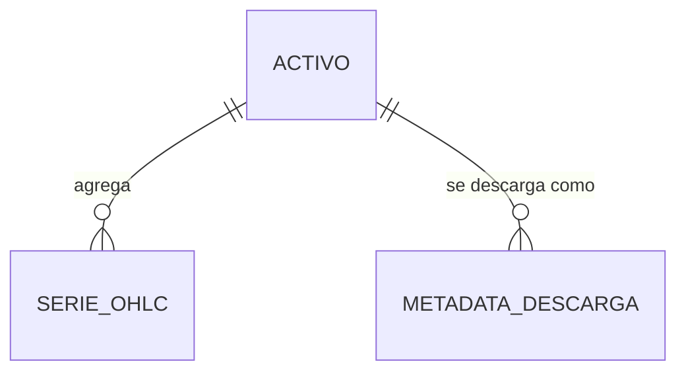
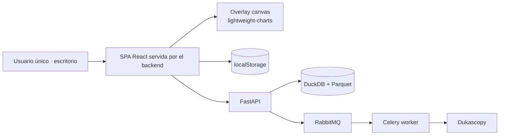
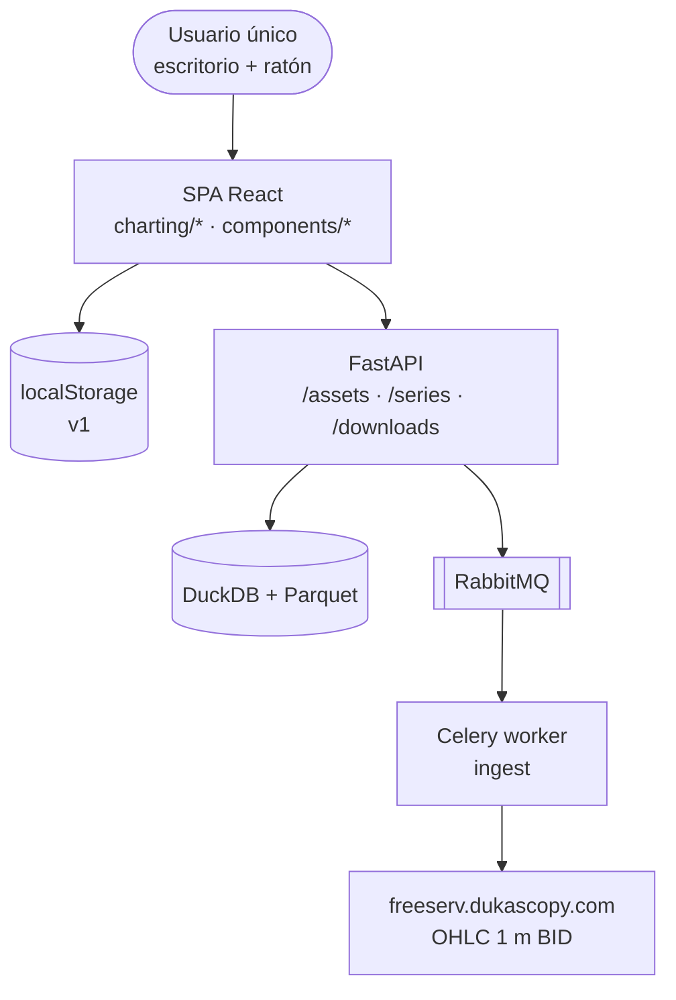

# Arquitectura del Sistema: Dibujo Referencia de Operación (Ciclo 04)

> Fuente: `_docs/plan.md`, `_docs/requirements.md`
> Base: `_docs/iterations/01-mvp/architecture.md`, `02-optimizacion-descarga/`, `03-mejoras-ux/`
> Decisiones de sesión: `_docs/session-handoff.md` (D-1…D-8)
> Fecha: 2026-10-01
> Estado: Aprobado

## 1. Resumen ejecutivo

Se **conserva el monolito modular con worker asíncrono y SPA React** (ADR-001, ADR-003).
Este ciclo es **100 % frontend** (0 tareas backend): no toca el pipeline de datos, ni los
contratos de API, ni la persistencia en servidor. La única capacidad nueva es una
**herramienta de dibujo que representa una operación de trading** (Entrada, SL y tres
objetivos) sobre el overlay existente. La decisión que ordena todo el diseño es que los
**niveles y las etiquetas se derivan de dos anclas** y se calculan como **datos** en un
módulo puro (`charting/operation-geometry`), separado del render. El esquema de
persistencia **no cambia**: la ampliación es aditiva sobre la versión 1 (ADR-023).

## 2. Restricciones que guían el diseño

| Origen | Restricción | Impacto arquitectónico |
|--------|-------------|------------------------|
| RF-W-306 / D-1 | Backtesting **automatizado** fuera de alcance | Sin motor de ejecución, sin métricas de estrategia |
| Insumo §Integración.7 | Reutilizar la funcionalidad existente del Fibonacci | `kind` nuevo que **hereda** handles, hit-testing y command stack en vez de duplicarlos |
| Insumo §Integración.8 | No alterar las herramientas existentes | `fib`, `line`, `rect`, `marker` intactos; tests de regresión de sus tests |
| RX-301 / RNF-006 | Sin dependencias nuevas | Ni librería de dibujos, ni librería de layout de etiquetas: layout propio (~40 líneas) |
| ADR-005 | `lightweight-charts` no trae dibujo nativo | La operación se pinta en el overlay custom, no en el chart |
| ADR-018 + RNF-304 | No perder dibujos ya persistidos | Cambio **aditivo** en v1; ni bump de `CHART_CONFIG_VERSION` ni de la clave de `localStorage` |
| ADR-021 / RNF-204 | Los tokens son la fuente única de color | 3 tokens nuevos en `tokens.ts` **y** `tokens.css` (test de anti-drift) |
| RNF-007 | 2 semanas | 0 cambios de backend; 1 módulo nuevo y 8 archivos tocados |
| RNF-005 / S-1 | Escritorio con ratón | Sin gestos táctiles, sin `long-press`, sin hover-dependencia nueva |
| Cuota navegador | Límite de `localStorage` | La operación añade **0 campos**: 2 puntos por figura |

## 3. Estilo arquitectónico

### Elegido

Monolito modular (backend Python/FastAPI + worker Celery) con SPA React. Dentro del
frontend, el overlay de dibujos se organiza como **modelo → geometría → proyección →
render → interacción**, con la lógica de dominio en módulos puros sin DOM.

### Justificación

- El backend no participa: RF-311 persiste en el navegador y no hay entidad nueva
  (ADR-018). No hay frontera que justificar → no aporta nada un microservicio.
- `operation-geometry` sin DOM ni canvas es lo que hace verificables RF-303, RF-305 y
  RNF-301 con tests unitarios, en línea con el patrón ya establecido en `overlay-geometry`
  y `axis-format` (ADR-017).

### Alternativas descartadas

| Alternativa | Por qué se descartó |
|-------------|---------------------|
| Motor de backtesting / microservicio de estrategias | `RF-W-306`: automatizado fuera de alcance; el backtesting es **manual** (D-1) |
| Persistir operaciones en backend | `RF-W-201`; RNF-007 |
| Librería de dibujo con edición nativa | No OSS → RNF-006; ya descartada en ADR-017 |
| Migrar el overlay a DOM | Reescritura y pérdida de rendimiento (ADR-017) |

## 4. Vista lógica (módulos y capas)

```mermaid
graph TD
  subgraph Frontend
    CP[ChartPane<br/>paleta + creación] --> OP{{operation-geometry<br/>NUEVO · puro}}
    OG[overlay-geometry<br/>proyección + hit-test] --> OP
    OC[OverlayCanvas<br/>render canvas] --> OG
    DE[drawing-edit<br/>handles + Shift] --> OP
    DR[drawing-history<br/>undo/redo]
    DW[drawings<br/>modelo + serialización]
    CC[state/chart-config<br/>persistencia v1]
    TK[styles/tokens<br/>drawOp*]
    CP --> DE
    CP --> DW
    CP --> DR
    DR --> DE
    DE --> OG
    OG --> OC
    OC --> TK
    DW --> TK
    DW --> CC
  end
  subgraph Backend — sin cambios
    API[FastAPI] --> ING[ingest]
    W[Celery worker] --> ING
  end
  CP --> API
```

| Módulo | Responsabilidad | Requisitos que cubre |
|--------|-----------------|----------------------|
| **`charting/operation-geometry` (NUEVO)** | Funciones puras: `operationDirection`, `operationRisk`, `operationLevels` (5 niveles derivados), `operationLevelColors`, `layoutOperationLabels` (separación mínima + línea guía) | RF-302, RF-303, RF-304, RF-305, RF-308, RF-309, RNF-301 |
| `overlay-geometry` (extendido) | `kind:'operation'` en la unión `OverlayShape`; `projectShape` proyecta 5 líneas + etiquetas; `hitTestFragment` impacta si **cualquier** línea está a ≤ radio | RF-303, RF-306 |
| `OverlayCanvas` (extendido) | Rama de render: 5 líneas con color por nivel + etiquetas (nombre + precio) | RF-308, RF-309 |
| `drawing-edit` (extendido) | `'operation'` en `ResizableShape`: hereda handles, mover/redimensionar, `Shift` H/V | RF-305, RF-307 |
| `drawing-history` | Sin cambios: el command stack ya envuelve toda mutación | RF-307 |
| `drawings` (extendido) | `'operation'` en `DRAWING_KINDS`; `isOverlayShape` la acepta de forma **aditiva** | RF-311, RNF-304 |
| `state/chart-config` | Sin cambios: persiste `{version:1, indicators, drawings}` con la operación dentro de `drawings` | RF-311, RNF-304 |
| `styles/tokens` + `tokens.css` | `drawOpSl`, `drawOpEntry`, `drawOpTp` | RF-309, RNF-305 |
| `ChartPane` + `DrawTool` | `ChartToolType` + entrada en `TOOL_DESCRIPTORS` + creación con 2 clics + guards | RF-301, RF-302, RF-310 |
| Backend (FastAPI, `ingest`, worker) | **Sin cambios** | — |

**Puntos de contacto verificados en código** (9 archivos, 1 nuevo):

| Archivo | Punto exacto |
|---------|--------------|
| `charting/operation-geometry.ts` | **NUEVO** — dirección, R, niveles, colores por nivel, layout |
| `charting/overlay-geometry.ts` | `:28` unión `OverlayShape` · `:105` `projectShape` · `:154` `hitTestFragment` |
| `charting/drawings.ts` | `:18` `DRAWING_KINDS` · `:41` `colorForShape` · `:66` `isOverlayShape` · `:70` guarda de redimensionado |
| `charting/drawing-edit.ts` | `:35` `ResizableShape` (`Extract<…, 'line'\|'rect'\|'fib'>`) · `:46` `isResizableShape` |
| `components/OverlayCanvas/OverlayCanvas.tsx` | `:143` ramas de render |
| `components/ChartPane/ChartPane.tsx` | `:77` descriptor · `:539` mapeo de creación · `:557` y `:712` guards |
| `components/DrawTool/DrawTool.tsx` | `:5` unión `ChartToolType` |
| `styles/tokens.ts` + `tokens.css` | `COLOR_TOKENS`, `DRAWING_COLOR_ROLES` (`:32`) |

`ResizableShape` se define con `Extract<OverlayShape, {kind: 'line' | 'rect' | 'fib'}>`, así
que el tipo se amplía **añadiendo `'operation'`** a ese `Extract`; la guarda de
`drawing-edit.ts:131` (que solo concierne a `marker`) no se toca.

## 5. Vista de datos

### Modelo entidad-relación (cliente, ciclo 04)

```mermaid
erDiagram
  CONFIG_GRAFICO ||--o{ INDICADOR : configura
  CONFIG_GRAFICO ||--o{ DIBUJO : contiene
  DIBUJO ||--o| OPERACION : "es"
  OPERACION {
    string id PK
    PriceTimePoint from "Entrada"
    PriceTimePoint to "Stop Loss"
  }
  OPERACION ..> NIVEL : "deriva 5 (no persistido)"
  NIVEL {
    string clave "SL|Entrada|TP1.382|TP1.5|TP2"
    string etiqueta
    float precio
    float multiplicador "1.382|1.5|2|nulo"
  }
```

### Modelo (backend, sin cambio)



| Entidad | Persistencia | Sensibilidad | Volumen estimado | Retención |
|---------|--------------|--------------|------------------|-----------|
| ACTIVO | catálogo en código (backend) | pública | ~12 | — |
| SERIE_OHLC_BASE (1 m) | `{symbol}.1m.parquet` | pública | ~726k velas/activo (2 años) | Indefinida local |
| METADATA_DESCARGA | tabla DuckDB | interna | 1 registro/tanda | Indefinida |
| CONFIG_GRAFICO | `localStorage`, clave `fxtrad.chart.v1.{symbol}.{timeframe}` | interna (sin PII) | 1 entrada / activo+timeframe | Local del navegador |
| **OPERACION** (nueva) | **dentro de `CONFIG_GRAFICO.drawings`**; solo `id`, `from`, `to` | interna (sin PII) | Decenas / activo+timeframe | Local del navegador |
| **NIVEL** (derivada) | **no se persiste**; se recalcula en cada proyección | — | 5 por operación | — |

**Clave del diseño (ADR-023):** la operación añade **0 campos** al documento. La forma
persistida sigue siendo `{version, indicators, drawings}`; `isOverlayShape` acepta el `kind`
nuevo, de modo que los documentos v1 existentes se siguen leyendo sin migración ni descarte
(RNF-304, KPI-305). El **desenlace** (cumplido/invalidado) tampoco se persiste: se lee del
precio (RF-312).

## 6. Vista de integración

| Sistema externo | Protocolo | Dirección | Datos intercambiados | Requisito |
|-----------------|-----------|-----------|----------------------|-----------|
| `freeserv` `chart/json3` | HTTPS/JSONP | Entrada | OHLC 1 m BID | RX-201, ADR-013/014 |
| API `GET /assets` | HTTP REST | Interna | Catálogo (fuente única) | RF-220, ADR-021 |
| API `GET /series` / `/downloads` | HTTP REST | Interna | Series OHLC, historial | RX-002, RI-002 |
| `localStorage` | Web Storage | Interna | Configuración de gráfico (incluye operaciones) | RI-201, RF-311 |
| **Ninguna integración nueva en este ciclo** | — | — | — | **RX-301** |

## 7. Vista física / despliegue



| Entorno | Propósito | Infraestructura |
|---------|-----------|-----------------|
| Dev / uso personal | Desarrollo y uso único | Docker Compose local (ADR-009) |
| Validación visual | Levantar el sistema y validar la herramienta a ojo | Mismo entorno; criterio de cierre KPI-304 |

**Sin cambios de despliegue en el ciclo 04** (ADR-009 vigente).

## 8. Stack tecnológico

| Capa | Tecnología | Versión | Justificación | ADR |
|------|-----------|---------|---------------|-----|
| Frontend | React + Vite + TypeScript | existente | ADR-003 · RF-310 | ADR-003 |
| Gráficos | `lightweight-charts` | ^4.2.3 | ADR-005 · RNF-001 | ADR-005 |
| Capa de dibujo | Overlay canvas custom | — | RF-306/307 · RNF-302 | ADR-017 · **ADR-022** |
| Geometría de la operación | Módulo puro propio (~1 archivo) | nuevo | RF-303/305 · RNF-301 · **RX-301** (sin librería) | **ADR-022** |
| Color | Tokens TS + CSS con anti-drift | — | RF-309 · RNF-305 | ADR-018 (03, RNF-204) · **ADR-024** |
| Layout de etiquetas | Propio, separación mínima + línea guía | nuevo | RNF-301 · RX-301 | **ADR-025** |
| Persistencia cliente | Web Storage (`localStorage`) v1 | nativo | RI-201 · RF-311 · RNF-304 | ADR-018 · **ADR-023** |
| Backend | Python + FastAPI | existente | Sin cambios en el ciclo | ADR-002 |
| Descarga | `dukascopy-python` (1 m BID) | existente | Sin cambios en el ciclo | ADR-010/013 |
| Infra | Docker Compose | existente | RNF-006/007 | ADR-009 |
| Observabilidad / CI-CD | structlog / GitHub Actions | existente | RNF-303 | ADR-008 |

## 9. Atributos de calidad y su cobertura

| RNF | Meta | Componente/Práctica que lo satisface | Cómo se verifica |
|-----|------|--------------------------------------|------------------|
| RNF-301 | 5 etiquetas siempre visibles, sin solape | `layoutOperationLabels` (separación mínima + línea guía) | Unit test con niveles a ~14 px; captura a zoom de 2 años |
| RNF-302 | 60 FPS con la figura activa | `frame-batch` (coalescing) + 5 niveles O(1) por frame | `ChartPane.test.tsx` › *frame budget* con la operación activa |
| RNF-303 | 0 regresiones | CI GitHub Actions (ADR-008) | `vitest` completo en verde (baseline 393) |
| RNF-304 | No perder dibujos previos | Cambio aditivo en v1 (ADR-023) + `isOverlayShape` acepta el `kind` | Round-trip con documento v1 mixto (line/rect/fib/marker + operation) |
| RNF-305 | Contraste + tokens sin deriva | 3 tokens en `tokens.ts` **y** `tokens.css` (ADR-024) | Test de anti-drift + contraste medido **5.61 / 16.56 / 6.53 : 1** sobre `#0A0C10` |
| RNF-201 | Config persistente y versionada | `state/chart-config` (ADR-018) | Test de round-trip (heredado 03) |
| RNF-202 | Edición de dibujos a 60 FPS | OverlayCanvas + command stack (ADR-017) | Profiling de arrastre (heredado 03) |
| RNF-204 | Tokens como fuente única | Design system frontend | Anti-drift (heredado 03) |
| RNF-001 / RNF-004 | 60 FPS de UI · UTC exclusivo | `lightweight-charts` + overlay · epoch UTC en `PriceTimePoint` | Profiling · test de coordenadas |
| RNF-005 / RNF-006 / RNF-007 | Escritorio moderno · $0 OSS · 2 semanas | SPA · stack OSS sin dependencias nuevas · alcance frontend | Smoke · auditoría de licencias · cierre |
| ACC-201 | Accesibilidad axe-core | ADR-011 + contrato ARIA de la paleta | axe-core en CI (heredado 03) |

## 10. Riesgos arquitectónicos

| ID | Riesgo | Impacto | Mitigación |
|----|--------|---------|------------|
| R-301 | Ampliar el esquema hace que se descarten los dibujos ya persistidos | Alto | ADR-023: aditivo en v1, sin bump de versión ni de clave; test de round-trip mixto |
| R-302 | Etiquetas ilegibles a zoom amplio (~1,2 px/pip) | Medio | ADR-025: separación mínima + línea guía (RNF-301) |
| R-303 | Hit-test de 5 líneas con radio pequeño: seleccionar una TP mueve la figura | Medio | Radio por línea coherente con `fib` + test de selección de figura completa (RF-306) |
| R-304 | Token añadido solo en `tokens.ts` | Bajo | Test de anti-drift existente; ambos ficheros en la misma tarea |
| R-305 | Arrastrar el color mate y las etiquetas de ratio del `fib` a la operación | Medio | `kind` propio con su propia proyección (ADR-022); `fib` intacto |

## 11. Decisiones registradas (ADRs)

| ADR | Título | Estado |
|-----|--------|--------|
| ADR-022 | `kind: 'operation'` con niveles y etiquetas derivados (no extiende `fib`) | Aceptado |
| ADR-023 | Ampliación **aditiva** del esquema de documentos en v1, sin bumpar versión | Aceptado |
| ADR-024 | Tres tokens de rol para la operación, reutilizando valores del design system | Aceptado |
| ADR-025 | Etiquetas siempre visibles con separación mínima y línea guía | Aceptado |
| ADR-026 | Política de control de versiones (perfil `git-profile.toml`) | Aceptado |

ADRs heredados vigentes: ADR-001…021 (ver `_docs/adr/`). Los decisores de este ciclo son
el arquitecto y el Tech Lead, con el usuario como stakeholder (plan.md §4).

## 12. Diagrama C4 (nivel 2 — contenedores)


