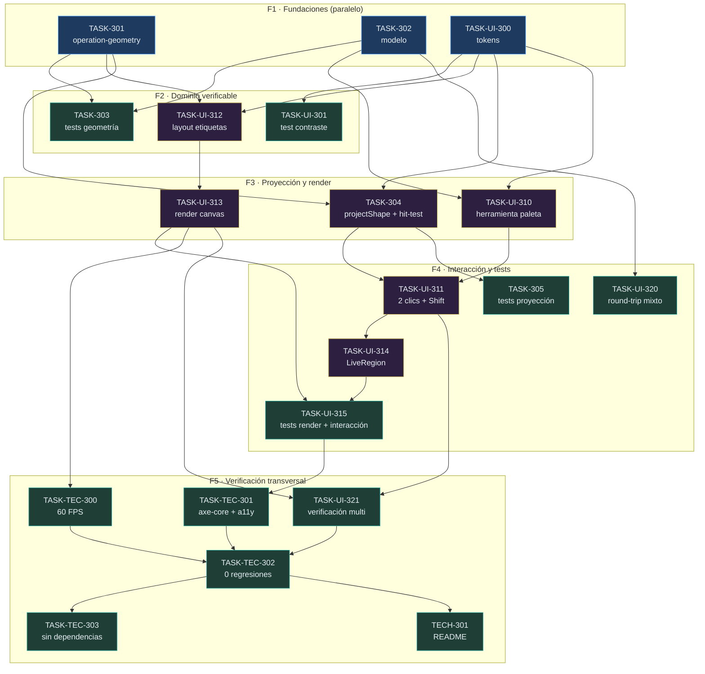

# Backlog del Proyecto: Dibujo Referencia de Operación (Ciclo 04)

> Fuente: `_docs/requirements.md`, `_docs/architecture.md`, `_docs/adr/` (ADR-001…025),
> `_docs/plan.md`, `_docs/ux/`
> Fecha: 2026-10-01
> Método de estimación: **Fibonacci** (1/2/3/5/8/13) — heredado del ciclo 03
> Cadencia: **Kanban (flujo continuo, 1 dev fullstack)** — heredada del ciclo 03
> IDs: prefijo `3xx` = ciclo 04 (el ciclo 03 usó `2xx`, igual que sus RF `2xx`)
> Estado inicial: **0/20 ✅**

## 1. Resumen

| Métrica | Valor |
|---------|-------|
| Épicas de dominio | 1 |
| Épicas de UI | 3 (1 transversal + 2 por pantalla) |
| Épicas técnicas | 1 |
| Historias | 4 |
| Tareas frontend | 9 |
| Tareas test | 10 |
| Tareas docs | 1 |
| Tareas backend / bd / infra | 0 (el ciclo es 100 % frontend) |
| Esfuerzo total | **56 puntos** |
| Ruta crítica | TASK-301 → TASK-UI-312 → TASK-UI-313 → TASK-UI-315 → TASK-TEC-301 → TASK-TEC-302 → TASK-TEC-303 (7 tareas, 23 pts) |
| Estado | 0 ✅ · 20 📥 |

> Contraste con el ciclo 03: 121 puntos. La diferencia es coherente con el alcance —este
> ciclo añade **un** tipo de dibujo y no toca backend, contratos, API ni despliegue.

## 2. Leyenda

- **Prioridad:** M (Must) · S (Should) · C (Could) · W (Won't)
- **Estado:** 📥 Backlog · 🔨 Doing · 👀 Review · ✅ Done · 🔴 Blocked
- **Estimación (Fibonacci):** 1 · 2 · 3 · 5 · 8 · 13
- **Capa:** `backend` · `frontend` · `bd` · `infra` · `docs` · `test`
- **Anclaje de código:** las rutas y líneas citadas se verificaron en el repo el 2026-10-01.

---

## 3. Épicas de dominio

### EP-301: Modelo y geometría de la operación

- **Tipo:** Dominio
- **Requisitos cubiertos:** RF-301, RF-302, RF-303, RF-304, RF-305, RF-306, RF-307, RI-301
- **Prioridad:** Must
- **Descripción:** El dominio de este ciclo es la aritmética riesgo/objetivo de una
  operación de trading. Se modela como un `kind` de dibujo propio con **dos anclas** (ADR-022)
  y todo lo demás **derivado**: dirección, `R` y los cinco niveles. Las funciones viven en un
  módulo puro (`charting/operation-geometry.ts`) sin DOM ni canvas, que es lo que hace
  verificables RF-303 y RF-305 con tests unitarios.
- **Criterio de aceptación de la épica:** dado un documento de dibujos con una operación
  (Entrada `1.10000`, SL `1.09500`), cuando se deserializa y se proyecta, entonces se
  recuperan las dos anclas y los derivados se recalculan idénticos: SL `1.09500`,
  Entrada `1.10000`, TP 1.382 `1.10691`, TP 1.5 `1.10750`, TP 2 `1.11000`.

#### HU-301: Anotar la operación con dos anclas y cinco niveles derivados

- **Requisito origen:** RF-301, RF-302, RF-303, RF-304, RF-305, RF-306, RF-307, RI-301
- **Capa:** frontend (+ test)
- **Prioridad:** Must
- **Como** analista técnico **quiero** definir una operación con dos clics y que sus cinco
  niveles se calculen solos **para** no calcular a mano dónde va el SL y qué precio
  corresponde a 1.382R, 1.5R y 2R.
- **Criterios de aceptación:**
  - **Dado** la herramienta activa, **cuando** se hacen dos clics, **entonces** la figura
    queda definida por los precios de Entrada y SL (RF-301).
  - **Dado** una operación, **cuando** se comparan Entrada y SL, **entonces** la dirección
    se deduce sola y los TP quedan al lado correcto (RF-302).
  - **Dado** Entrada `1.10000` y SL `1.09500`, **cuando** se proyecta, **entonces** los
    niveles quedan en `1.09500`, `1.10000`, `1.10691`, `1.10750` y `1.11000` (RF-303).
  - **Dado** una operación proyectada, **cuando** se inspecciona el gráfico, **entonces**
    solo aparecen esas 5 líneas; el 1:1 no se dibuja (RF-304).
  - **Dado** una operación, **cuando** se mueve el SL, **entonces** la dirección, los niveles
    y sus precios se recalculan manteniendo la proporción sobre `R` (RF-305).
  - **Dado** una operación, **cuando** se pulsa sobre cualquiera de sus líneas, **entonces**
    se selecciona y se mueve o se borra la figura completa (RF-306).
  - **Dado** una operación serializada, **cuando** se deserializa, **entonces** se recuperan
    las dos anclas y los derivados se recalculan idénticos (RI-301).

**Tareas:**

| ID | Tarea | Capa | Est. | Deps | DoD | Estado |
|----|-------|------|------|------|-----|--------|
| TASK-301 | `charting/operation-geometry.ts`: `OPERATION_TP_MULTIPLIERS` = `[1.382, 1.5, 2]`, `operationDirection`, `operationRisk`, `operationLevels` (5 niveles ordenados por precio con etiqueta y color) | frontend | 3 | — | Módulo puro sin DOM ni canvas; `operationLevels` devuelve exactamente 5 niveles y **no incluye** el 1:1; el ejemplo `1.10000`/`1.09500` produce los 5 precios de RF-303 | 📥 |
| TASK-302 | Ampliar el modelo de dibujos: `'operation'` en `DRAWING_KINDS` (`drawings.ts:18`), en la unión `OverlayShape` (`overlay-geometry.ts:28`), en `isOverlayShape` (`:66`) y en `isResizableShape` (`drawing-edit.ts:46`), `ResizableShape` vía `Extract` (`:35`), y `case 'operation'` en `colorForShape` (`drawings.ts:41`) | frontend | 3 | — | `tsc --noEmit` limpio bajo `strict` (el `switch` de `colorForShape` no tiene `default`, así que la rama nueva es obligatoria); `isOverlayShape` acepta la figura y `deserializeDrawings` la conserva en round-trip; **las dos guardas** (`drawings.ts:70` y `drawing-edit.ts:46`) quedan coherentes entre sí | 📥 |
| TASK-303 | Tests de `operation-geometry.test.ts` (nuevo) + extender `drawings.test.ts` (round-trip con `operation`, `isOverlayShape`, `colorForShape`) y `drawing-edit.test.ts` (`isResizableShape`) | test | 3 | TASK-301, TASK-302 | Cubren: dirección Long y Short · `R` · los 5 precios del ejemplo de RF-303 · que el 1:1 **no** aparece · `Entrada == SL` (R = 0, sin NaN) · `operation` en `DRAWING_KINDS` y aceptada por `isOverlayShape` · `isResizableShape` devuelve `true` | 📥 |
| TASK-304 | `overlay-geometry`: rama `operation` en `projectShape` (`:105`) que emita las 5 líneas proyectadas y sus etiquetas, y en `hitTestFragment` (`:154`) impacto si **cualquiera** de las 5 líneas entra en el radio | frontend | 5 | TASK-301, TASK-UI-300 | `projectShape` de una operación devuelve 5 líneas con la `y` correcta según el mapper; `hitTestFragment` impacta sobre cualquiera de las 5 con radio 6 px; `line`/`rect`/`fib`/`marker` **sin cambios de comportamiento** (sus tests intactos) | 📥 |
| TASK-305 | Tests de `overlay-geometry.test.ts`: proyección de las 5 líneas, hit-test por línea, y caso `zeroRisk` | test | 3 | TASK-304 | Verifica las 5 `y` proyectadas con un mapper conocido; el hit-test acierta sobre cada una de las 5 y **falla** fuera del radio; `Entrada == SL` no produce NaN ni dibuja TP | 📥 |

---

## 4. Épicas de UI

### EP-UI-300: Tokens de la operación (fundación transversal)

- **Tipo:** UI (transversal)
- **Requisito origen:** RF-309, RNF-305 (+ RNF-204)
- **Prioridad:** Must
- **Justificación:** Va **primero**. El color lo consumen el render, las etiquetas y las
  pruebas de contraste; además `RNF-205` exige que el anti-drift siga verde, lo que obliga a
  tocar `tokens.ts` **y** `tokens.css` en la misma tarea (riesgo R-304).
- **Criterios UX no negociables:** contraste WCAG AA verificado sobre los **dos** fondos
  reales; sin colores literales en el componente; todo token duplicado en TS y CSS.

**Tareas:**

| ID | Tarea | Capa | Est. | Deps | DoD | Estado |
|----|-------|------|------|------|-----|--------|
| TASK-UI-300 | `tokens.ts`: `drawOpSl` `#EF5350`, `drawOpEntry` `#E6EDF3`, `drawOpTp` `#26A69A` en `COLOR_TOKENS`, y `OPERATION_TOKENS` con `labelMinGap` 20px, `labelOffset` 4px, `labelPadX` 4px, `labelPadY` 2px, `labelRadius` 4px, `hitRadius` 6px, `leaderWidth` 1px, `tpMultipliers` `[1.382, 1.5, 2]`. Reflejar los mismos valores en `tokens.css` | frontend | 2 | — | Anti-drift de `styles/__tests__/tokens.test.ts` verde; los 3 colores **reutilizan** `color-down`/`color-up`/`color-text` (ningún color nuevo en el sistema); `OPERATION_TOKENS` sigue el patrón de `AXIS_TOKENS`/`MARKER_TOKENS` | 📥 |
| TASK-UI-301 | Test de contraste de los 3 tokens + `textMuted` sobre `#0A0C10` **y** `#161B22`, y test del anti-drift | test | 2 | TASK-UI-300 | En `styles/__tests__/tokens.test.ts`: los 4 colores ≥4.5:1 en ambos fondos (medido: 5.61/16.56/6.53/6.36 sobre `#0A0C10`; 4.96/14.64/5.77/5.62 sobre `#161B22`), y el test **falla** si alguien inserta un valor en un solo fichero | 📥 |

### EP-UI-301: Herramienta y figura en el gráfico (SCR-004)

- **Tipo:** UI
- **Pantalla origen:** SCR-004 (`_docs/ux/wireframes/SCR-004-grafico-principal.md`)
- **Journey:** J-008, J-009 (extiende J-003, J-005)
- **Persona:** P-001 (Analista técnico)
- **Requisito origen:** RF-301, RF-302, RF-303, RF-304, RF-305, RF-306, RF-307, RF-308,
  RF-309, RF-310, RF-312, RNF-301
- **Prioridad:** Must
- **Criterios UX no negociables:**
  - **Estados** de `interaction-specs.md`: `inactivo`, `pending` (preview en vivo),
    `created`, `zeroRisk`, `preview-cancel`. Los 5 estados de pantalla (loading, empty,
    error, success, partial) se heredan **sin cambio**: la operación no tiene red.
  - **Contraste WCAG AA** verificado sobre los 2 fondos (TASK-UI-301).
  - **Teclado:** herramienta alcanzable con Tab, `aria-pressed`, `aria-label` = *"Operación:
    2 clics (Entrada, SL)"*; `Escape` cancela el trazo en curso; `Delete` borra la figura
    seleccionada; `Ctrl+Z`/`Ctrl+Shift+Z` deshacen.
  - **Componentes reutilizados:** `DrawTool` (variante nueva), `DrawingHandle`,
    `LiveRegion`. **No reinventar** chips, handles ni región live.
  - **Anuncio obligatorio:** cada mutación anuncia los 5 valores en `LiveRegion`; el texto
    sale de la **misma** función pura que dibuja los niveles.
- **Criterio de aceptación de la épica:** dado un gráfico con datos, cuando se selecciona la
  herramienta "Operación" y se hacen dos clics, entonces aparece una figura de 5 líneas
  etiquetadas a 5 decimales, con las etiquetas sin solape, y `LiveRegion` anuncia los
  valores; cuando se arrastra cualquiera de los dos handles, entonces los TP se recalculan
  y `Ctrl+Z` revierte.

#### HU-UI-301: Herramienta, figura y edición de la operación en el gráfico

- **Requisito origen:** RF-306, RF-307, RF-308, RF-309, RF-310, RF-312, RNF-301
- **Capa:** frontend (+ test)
- **Prioridad:** Must
- **Como** analista técnico **quiero** crear una operación desde la paleta y ajustarla con sus
  dos handles **para** leer su relación riesgo/beneficio y si se cumplió o se invalidó.
- **Criterios de aceptación:**
  - **Dado** el gráfico, **cuando** se abre la paleta, **entonces** la herramienta está
    disponible junto a las demás y en cada panel del Multigráfico (RF-310).
  - **Dado** una operación, **cuando** se pulsa sobre cualquiera de sus líneas, **entonces**
    se selecciona y se mueve o se borra la figura completa (RF-306).
  - **Dado** una operación, **cuando** se arrastra cualquiera de sus dos handles, **entonces**
    la figura se actualiza y la acción es reversible (RF-307).
  - **Dado** una operación, **cuando** se inspecciona el gráfico, **entonces** cada nivel
    muestra nombre y precio a 5 decimales, a la derecha del segundo ancla (RF-308).
  - **Dado** una operación, **cuando** se inspecciona el gráfico, **entonces** cada nivel
    usa su color y los tres TP son del mismo verde (RF-309).
  - **Dado** una operación, **cuando** el precio la recorre, **entonces** el usuario puede
    determinar si se cumplió o se invalidó leyendo los niveles marcados (RF-312).
  - **Dado** una operación cuyos niveles quedan a ~14 px (zoom de 2 años), **cuando** se
    renderiza, **entonces** las 5 etiquetas son legibles y ninguna se solapa (RNF-301).

**Tareas:**

| ID | Tarea | Capa | Est. | Deps | DoD | Estado |
|----|-------|------|------|------|-----|--------|
| TASK-UI-310 | Herramienta: `'operation'` en `ChartToolType` (`DrawTool.tsx:5`) y entrada en `TOOL_DESCRIPTORS` (`ChartPane.tsx:77`) con icono `◎` y `ariaLabel` "Operación: 2 clics (Entrada, SL)", **colocada después de `Φ`** | frontend | 2 | TASK-302, TASK-UI-300 | El botón aparece en la barra en la posición acordada; `aria-pressed` refleja el estado activo; `title` = `ariaLabel`; el texto visible del panel es "Operación" | 📥 |
| TASK-UI-311 | Creación en 2 clics en `ChartPane.tsx:539` (1.º = Entrada, 2.º = SL) + guards de creación (`:557`) y edición (`:712`) + `Shift` H/V con `constrainToAxis` | frontend | 3 | TASK-UI-310, TASK-304 | Dos clics crean **una** figura; con la herramienta activa en cualquier otro modo no se cuela; `Shift` restringe a H o a V; `Escape` en `pending` cancela (comportamiento heredado, no se añade lógica nueva) | 📥 |
| TASK-UI-312 | `layoutOperationLabels` en `operation-geometry.ts`: recorrido de arriba abajo con separación mínima de 20 px, corrección desde el final si la última se sale, y marca qué etiqueta quedó desplazada | frontend | 5 | TASK-301, TASK-UI-300 | Función pura (entrada: 5 niveles proyectados + mapper + minGap; salida: 5 posiciones + flag de guía); con niveles a ~14 px ninguna queda a menos de 20 px y **todas** las desplazadas llevan guía; el reparto cabe dentro del área visible | 📥 |
| TASK-UI-313 | Render en `OverlayCanvas.tsx`: 5 líneas de extremo a extremo con el color de su nivel, 5 chips de etiqueta (fondo `color-surface` opaco, `radius-sm`, padding `2px 4px`, **sin borde**; nombre en `color-text-muted`, precio en el color del nivel con `font-num` tabular a 5 decimales vía `PRICE_FORMAT`) y línea guía de 1 px en las desplazadas | frontend | 5 | TASK-UI-312 | Las 5 líneas llegan al borde izquierdo y derecho; cada chip lleva nombre y precio correcto; la precisión viene de `AXIS_TOKENS.priceDecimals` y **no** está hardcodeada; ningún color literal en el archivo; `fib` sigue pintando igual | 📥 |
| TASK-UI-314 | `LiveRegion`: anunciar los 5 valores al crear, mover y ajustar; `"Operación compra. Entrada 1.10000, SL 1.09500, TP 1.382 1.10691, TP 1.5 1.10750, TP 2 1.11000"`, y aviso `"Atención: entrada y SL coinciden; R = 0."` en `zeroRisk` | frontend | 2 | TASK-UI-311 | El texto se deriva de `operationLevels` (misma fuente que el render, no puede desincronizarse); el preview en vivo **no** se anuncia en cada movimiento del ratón, solo al confirmar; se anuncia también el borrado | 📥 |
| TASK-UI-315 | Tests de `OverlayCanvas.test.tsx` (5 líneas, chips con nombre y precio, línea guía en las desplazadas, `zeroRisk`) + `ChartPane.test.tsx` (creación en 2 clics, `aria-pressed`, `aria-label`, preview en vivo, `Escape`, `zeroRisk`, `Shift`) | test | 5 | TASK-UI-313, TASK-UI-314 | Sigue el patrón de los tests existentes del archivo (p. ej. *"strokes every fibonacci level with its label"*, *"shows a preview of the pending shape while drawing"*, *"cancels a pending draw with Escape"*); los casos de RF-308 tienen el precio exacto esperado, no un `toBeTruthy` | 📥 |

### EP-UI-302: Persistencia de la operación y Multigráfico (SCR-005)

- **Tipo:** UI
- **Pantalla origen:** SCR-005 (`_docs/ux/wireframes/SCR-005-multigrafico.md`)
- **Journey:** J-010 (extiende J-005)
- **Persona:** P-001
- **Requisito origen:** RF-311, RNF-304, RF-310
- **Prioridad:** Must
- **Criterio de aceptación de la épica:** dado un documento de dibujos existente que
  contiene línea, rectángulo, Fibonacci, marcador **y** una operación, cuando se abre la app
  con la nueva versión, entonces todas las formas anteriores siguen presentes y la
  operación aparece íntegra con sus 5 niveles derivados.
- ⚠️ **Esta épica no tiene tareas de implementación, y es intencional.** ADR-023 decidió
  mantener la versión 1 del documento sin migración ni cambio de clave: en cuanto
  `isOverlayShape` acepta el `kind` nuevo (TASK-302), la persistencia funciona sin tocar
  `state/chart-config.ts`. Lo que queda es **verificarlo**, y esa verificación es el objeto
  de TASK-UI-320.

**Tareas:**

| ID | Tarea | Capa | Est. | Deps | DoD | Estado |
|----|-------|------|------|------|-----|--------|
| TASK-UI-320 | Test de round-trip de un documento v1 **mixto** (line/rect/fib/marker + operation) en `chart-config.test.ts`, y verificación de que `CHART_CONFIG_VERSION` sigue en 1 y `chartConfigKey` no cambia | test | 2 | TASK-302 | El documento mixto sobrevive `serialize`/`deserialize` sin pérdida; `deserializeChartConfig` sigue rechazando versiones desconocidas (política de descarte de ADR-018, ahora **latente**); la clave sigue siendo `fxtrad.chart.v1.{symbol}.{timeframe}`; **ningún** dibujo previo se pierde (KPI-305, RF-311, RNF-304) | 📥 |
| TASK-UI-321 | Verificación en Multigráfico (KPI-304): la herramienta y las etiquetas funcionan pane a pane, con la separación mínima cumplida en cada pane | test | 2 | TASK-UI-311, TASK-UI-313 | En cada pane: la herramienta está en su paleta y una operación dibuja sus 5 etiquetas; con dos panes de distinta escala, ninguna etiqueta se solapa en ninguno de los dos (cada pane usa **su** mapper) | 📥 |

---

## 5. Épicas técnicas (transversales)

### EP-TEC-300: Verificación transversal del ciclo

- **Tipo:** Técnica
- **Requisito origen:** RNF-302, RNF-303, RX-301, ACC-201
- **Prioridad:** Must
- **Justificación:** El ciclo no puede declararse cerrado sin evidencia de que no degrada nada
  (`RNF-303`, KPI-302), de que no pierde rendimiento (`RNF-302`, KPI-303) y de que no
  introduce dependencias (`RX-301`, RNF-006).

#### HU-TEC-300: El ciclo no degrada nada existente

- **Requisito origen:** RNF-302, RNF-303, RX-301, ACC-201
- **Capa:** test
- **Prioridad:** Must
- **Como** mantenedor del código **quiero** que el ciclo añada la operación sin tocar el
  comportamiento de las herramientas existentes ni la persistencia previa **para** poder
  aprobarlo sin miedo a regresiones.
- **Criterios de aceptación:**
  - **Dado** el cierre del ciclo, **cuando** se ejecutan las suites, **entonces** frontend
    queda en verde con ≥393 tests (baseline + nuevos) (RNF-303).
  - **Dado** una operación activa, **cuando** se hace pan/zoom o se arrastra, **entonces** la
    interacción se mantiene a 60 FPS sin frames caídos (RNF-302).
  - **Dado** el build, **cuando** se instalan dependencias, **entonces** no se añade ningún
    paquete nuevo (RX-301).
  - **Dado** el gráfico con la operación visible, **cuando** axe-core audita la pantalla,
    **entonces** no hay violaciones (ACC-201).

**Tareas:**

| ID | Tarea | Capa | Est. | Deps | DoD | Estado |
|----|-------|------|------|------|-----|--------|
| TASK-TEC-300 | Test de frame budget con la figura **activa**, siguiendo el patrón del test existente *"sustains the frame budget while editing (dragging) a drawing (RNF-202)"* | test | 3 | TASK-UI-313 | Un caso más en `ChartPane.test.tsx` que arrastra la operación con 5 niveles y afirma el mismo presupuesto de frames; 0 frames caídos (KPI-303, RNF-002 heredado) | 📥 |
| TASK-TEC-301 | Auditoría axe-core con la operación visible + verificación de `aria-pressed`, `aria-label` y del anuncio en `LiveRegion` | test | 2 | TASK-UI-315 | 0 violaciones en `ChartPane`; el botón expone `aria-pressed` y el `aria-label` que explica los 2 clics; un lector de pantalla recibe los 5 valores al crear y al mover un handle | 📥 |
| TASK-TEC-302 | Suite completa en verde + revisión de que los tests de `fib`, `line`, `rect` y `marker` siguen intactos y en verde | test | 2 | TASK-UI-321, TASK-TEC-300, TASK-TEC-301 | `vitest` completo en verde con ≥393 tests; el recuento nuevo se documenta; los tests de las 4 herramientas previas **no se modifican** salvo que sea estrictamente necesario (OE-3) | 📥 |
| TASK-TEC-303 | Verificación de `RX-301`: `package.json` sin dependencias nuevas y backend sin cambios en el ciclo | test | 1 | TASK-TEC-302 | `git diff` de `package.json` y del árbol `backend/` vacío respecto al inicio del ciclo; el grafo de dependencias no cambia | 📥 |
| TECH-301 | Corregir el recuento de tests del frontend en `README.md` (dice 392; la ejecución real da 393) — deuda que diferiste al cierre del ciclo | docs | 1 | TASK-TEC-302 | El número del README coincide con la salida real de `vitest` tras este ciclo, con el total nuevo incluido; no queda el gap 2 abierto | 📥 |

---

## 6. Grafo de dependencias



## 7. Ruta crítica

```
TASK-301 (3) ─▶ TASK-UI-312 (5) ─▶ TASK-UI-313 (5) ─▶ TASK-UI-315 (5) ─▶ TASK-TEC-301 (2) ─▶ TASK-TEC-302 (2) ─▶ TASK-TEC-303 (1)
   │                ▲
   ├──▶ TASK-304 (5) ─▶ TASK-305 (3)      TASK-UI-300 (2) ─▶ TASK-UI-312
   └──▶ TASK-303 (3)                              TASK-UI-300 (2) ─▶ TASK-UI-310 ─▶ TASK-UI-311 ─▶ TASK-UI-314
```

**7 tareas · 23 puntos.** Dos hojas cuelgan de `TASK-TEC-302` y ambas valen 1 punto
(`TASK-TEC-303` y `TECH-301`), así que ambas cierran la ruta crítica con la misma longitud.

El tramo que realmente domina el ciclo es `TASK-UI-312 → TASK-UI-313 → TASK-UI-315`: tres
tareas de 5 puntos encadenadas, las tres de la zona de render y layout. Es ahí donde
concentrar el esfuerzo de descomposición durante la implementación, aunque la épica ya las
separa en tareas independientes.

**Tareas que pueden empezar en paralelo hoy** (sin ninguna dependencia):
`TASK-301`, `TASK-302` y `TASK-UI-300` — las tres de la fase F1.

## 8. Deuda técnica y elementos sin tarea

| ID | Descripción | Justificación | Prioridad |
|----|-------------|---------------|-----------|
| TECH-304 | Sanear `format:check`: formatear 10 ficheros del frontend y alinear el test anti-drift de tokens | `make lint-frontend` (= `eslint` + `tsc --noEmit` + `prettier --check`) falla, luego el job `frontend` de CI no puede ponerse verde. Deuda de los ciclos 01–03, **no** regresión del 04: los 10 ficheros ya fallaban en `0422923` y `tokens.css` se rompió en `cb0a6bd` (TASK-UI-200, ciclo 03) al añadir `--axis-x-format` con comillas dobles contra un `.prettierrc` con `singleQuote: true`. Sin impacto funcional: eslint, tsc, build y los 458 tests pasan | Must (ciclo 05) |
| TECH-303 | Entrada numérica de Entrada/SL (formulario) para dar ruta por teclado y precio exacto al pip | **No hay RF que lo pida.** A zoom de 2 años (1,2 px/pip) no se puede colocar el SL en `1.09500` con precisión de pip. Requiere requisitos propios; documentado en `ux/user-journeys.md` §Brechas y `ux/design-system.md` §7 | Should (ciclo 05) |
| TECH-302 | `drawLine` (`#4A6572`) está en **3.16:1**, por debajo de 4.5:1 | **Preexistente del ciclo 03**, no textual (se distingue por forma) y ajeno a este ciclo. Ya anotado en ADR-024 y `ux/design-system.md` §7 | Should (ciclo 05) |
| RF-W-301 | Series de operaciones y métricas de estrategia | Fuera de alcance declarado (`plan.md` §3.2) | Won't |
| RF-W-304 | Niveles de TP configurables | Fuera de alcance; los multiplicadores son fijos (S-6) | Won't |

### DoD de TECH-304

| Campo | Valor |
|-------|-------|
| Capa | `frontend` (formato) + `test` (1 aserción) |
| Est. | 1 punto (XS) |
| Requisito origen | Ninguno → `TECH-XXX` por regla 1 |
| Deps | Ninguna |
| Ficheros | `App.tsx`, `use-drawing-history.ts`, `ChartToolbar.test.tsx`, `DownloadForm.tsx`, `IndicatorForm.test.tsx`, `IndicatorForm.tsx`, `LiveRegion.tsx`, `config.ts`, `assets.test.ts`, `tokens.css`, `tokens.test.ts` |
| ADRs | Ninguno nuevo (respeta ADR-008 / CI) |

**Criterios de aceptación:**

1. `npm run format:check` sale con código 0.
2. `npm run lint` y `npm run typecheck` siguen en verde.
3. `npm test` en verde, con el recuento real anotado (458 si no cambian los tests).
4. `git diff -w` del commit solo muestra salto de línea y el cambio de comillas de
   `--axis-x-format`; **cero cambios de lógica**.
5. `make lint-frontend` completo en verde (equivalente al job `frontend` de CI).

## 9. Cobertura UX

| Pantalla UX | Épica asignada | Tareas | Estado |
|-------------|----------------|--------|--------|
| SCR-004 Gráfico principal | EP-UI-301 | TASK-UI-310, 311, 312, 313, 314, 315 (+ TASK-UI-320 para persistencia) | 📥 |
| SCR-005 Multigráfico | EP-UI-302 | TASK-UI-321 (+ TASK-UI-310, que lo hace posible) | 📥 |
| SCR-001, SCR-002, SCR-003, SCR-006 | — (sin épica) | — | Correcto: este ciclo no las toca |

**Pantallas sin épica:** ninguna de las afectadas. Las 4 restantes quedan sin épica **a
propósito**, porque `_docs/ux/interaction-specs.md` las declara heredadas sin cambios.

**Componentes sin tarea:** ninguno.

| Componente UX | Tarea que lo implementa |
|---------------|------------------------|
| CMP-021 `OperationDrawing` | TASK-301 (geometría) + TASK-UI-313 (render) |
| CMP-022 `OperationLabels` | TASK-UI-312 (layout) + TASK-UI-313 (chips) |
| `DrawTool` + variante `operación` | TASK-UI-310 |
| `LiveRegion` (CMP-020, reutilizado) | TASK-UI-314 |
| `DrawingHandle` (CMP-018, reutilizado) | TASK-UI-311 |
| `EditableDrawing` (CMP-019, reutilizado) | TASK-UI-311 |

**Journeys sin historia:** ninguno. J-008 y J-009 → HU-UI-301; J-010 → HU-UI-302.

## 10. Decisiones de planificación

- **DP-1:** El ciclo **no tiene épica de backend ni de base de datos.** No es un descuido:
  ADR-023 decidió que la ampliación es aditiva, así que `state/chart-config.ts` no se toca y
  no hay migración ni esquema nuevo. Las 0 tareas backend del resumen son consecuencia de
  una decisión de diseño, no de un descuido de cobertura.
- **DP-2:** Los tokens van en **EP-UI-300 antes que el render**, aunque la épica tenga solo 4
  puntos. Es la única forma de que `RNF-205` (anti-drift) y las pruebas de contraste tengan
  algo que medir, y `RNF-005` es Must.
- **DP-3:** Se **heredan** método de estimación (Fibonacci), cadencia (Kanban, 1 dev) y
  esquema de IDs (`3xx`) del ciclo 03, para que la comparación 56 vs 121 puntos sea válida.
- **DP-4:** Ninguna tarea supera 5 puntos: el umbral XL se reserva para trabajo con
  incertidumbre arquitectónica, y aquí la arquitectura ya está decidida en 4 ADR.
- **DP-5:** Los tests de las 4 herramientas preexistentes **no se tocan** salvo necesidad
  estrictamente demonstrable (OE-3, RF-W-306). Si `TASK-TEC-302` obliga a modificarlos,
  eso es un hallazgo y se reporta.
- **DP-6:** `TECH-301` recoge el gap 2 que diferiste explícitamente al cierre del ciclo
  (README dice 392 tests frontend; la ejecución real da 393). Va al final porque su valor
  depende del recuento final.
- **DP-7:** `TECH-304` (saneado de `format:check`) queda para el **ciclo 05** y **no altera
  las métricas del ciclo 04**, que sigue cerrado en 20 tareas · 56 pts. Se prioriza como
  **Must** de ciclo 05 pese a ser mecánica (1 punto), porque el job `frontend` de CI en rojo
  destruye la señal: entrena al equipo a ignorar el gate y acaba enmascarando regresiones
  reales. Al ejecutarla hay que realinear `tokens.test.ts` (compara el texto crudo con
  `toContain`), o el fallo de lint se convierte en un fallo de tests.

## 11. Preguntas abiertas

Ninguna bloqueante. Las tres brechas de UX (entrada numérica, contraste de `drawLine`,
series de operaciones) están registradas en §8 y ninguna tiene RF que la respalde, así que
no bloquean la ejecución de este ciclo.