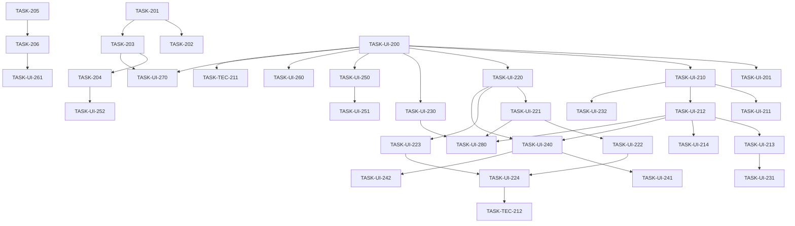

# Backlog del Proyecto: Mejoras UX (Ciclo 03)

> Fuente: `_docs/requirements.md`, `_docs/architecture.md`, `_docs/adr/`, `_docs/ux/`
> Fecha: 2026-09-29
> Método de estimación: Fibonacci (1/2/3/5/8/13)
> Cadencia: Kanban (flujo continuo, 1 dev)

## 1. Resumen

| Métrica | Valor |
|---------|-------|
| Épicas de dominio | 2 |
| Épicas de UI | 9 |
| Épicas técnicas | 1 |
| Historias | 11 |
| Tareas backend | 4 |
| Tareas frontend | 24 |
| Tareas test | 6 |
| Tareas docs | 1 |
| Esfuerzo total | 121 puntos |
| Ruta crítica | TASK-UI-220 → UI-221 → UI-222 → UI-240 → UI-241 |

## 2. Leyenda

- **Prioridad:** M (Must) · S (Should) · C (Could) · W (Won't)
- **Estado:** 📥 Backlog · 🔨 Doing · 👀 Review · ✅ Done · 🔴 Blocked
- **Estimación (Fibonacci):** 1 · 2 · 3 · 5 · 8 · 13
- **Capa:** `backend` · `frontend` · `bd` · `infra` · `docs` · `test`

---

## 3. Épicas de dominio

### EP-201: Catálogo de activos ampliado y unificado
- **Tipo:** Dominio
- **Requisitos cubiertos:** RF-216, RF-217, RF-220, RX-201, RX-202, RI-202
- **Prioridad:** Must
- **Descripción:** Ampliar la lista forex con 5 pares y declarar `GET /assets` como fuente única del catálogo.
- **Criterio de aceptación de la épica:** Los 5 pares se descargan y consultan; el frontend no mantiene catálogo duplicado.

#### HU-201: Catálogo con 5 pares forex nuevos
- **Requisito origen:** RF-216, RF-217
- **Capa:** backend
- **Prioridad:** Must
- **Como** analista técnico **quiero** disponer de GBPJPY, EURJPY, AUDUSD, USDCAD y EURGBP **para** analizar más instrumentos.
- **Criterios de aceptación:**
  - Dado el catálogo canónico, Cuando se consulta, Entonces incluye los 5 pares nuevos.
  - Dado un par nuevo, Cuando se descarga 1 m, Entonces Dukascopy responde OHLC BID sin errores.

| ID | Tarea | Capa | Est. | Deps | DoD | Estado |
|----|-------|------|------|------|-----|--------|
| TASK-201 | Añadir los 5 pares a `ingest.ASSET_CATALOG` | backend | 3 | — | Catálogo con 12 activos; tests de catálogo verdes | 📥 |
| TASK-202 | Añadir `instrument_id` de los 5 pares en `ingest.freeserv.FREESERV_INSTRUMENT` | backend | 5 | TASK-201 | `instrument_id_for` resuelve los 5; test unitario + verificación empírica 1 m BID | 📥 |
| TASK-203 | Verificar contrato `GET /assets` con el catálogo ampliado | backend | 3 | TASK-201 | Test de contrato `AssetRow` incluye los 5 pares | 📥 |
| TASK-204 | Consumir `GET /assets` y eliminar el espejo `frontend/src/catalog/index.ts` | frontend | 5 | TASK-203 | Sin catálogo duplicado; `services/assets` usado; tests actualizados | 📥 |

#### HU-202: Catálogo único expuesto al frontend
- **Requisito origen:** RF-220, RX-202, RI-202
- **Capa:** fullstack
- **Prioridad:** Must
- **Como** analista **quiero** que las pantallas reflejen siempre el catálogo del backend **para** no tener listas desincronizadas.
- **Criterios de aceptación:**
  - Dado el frontend, Cuando lista activos, Entonces los obtiene de `GET /assets`.
  - Dado un cambio en el catálogo backend, Cuando se recarga, Entonces la UI lo refleja sin código duplicado.
- **Tareas:** la implementación de UI de esta historia vive en **EP-UI-207** (`TASK-UI-270`).

### EP-202: Contrato temporal sin `1s`
- **Tipo:** Dominio
- **Requisitos cubiertos:** RF-219
- **Prioridad:** Must
- **Descripción:** Retirar `"1s"` del contrato `Timeframe` (API + espejo TS), deuda del ciclo 02.
- **Criterio de aceptación de la épica:** Ninguna referencia a `1s` en contrato, UI ni tests.

#### HU-203: Contrato `Timeframe` coherente con la base 1 m
- **Requisito origen:** RF-219 (ADR-020)
- **Capa:** fullstack
- **Prioridad:** Must
- **Como** analista **quiero** que no exista un timeframe inválido **para** no solicitar series imposibles.
- **Criterios de aceptación:**
  - Dado el contrato backend, Cuando se inspecciona `Timeframe`, Entonces no contiene `"1s"`.
  - Dado el espejo TS y la UI, Cuando se inspecciona, Entonces no queda ninguna referencia a `1s`.

| ID | Tarea | Capa | Est. | Deps | DoD | Estado |
|----|-------|------|------|------|-----|--------|
| TASK-205 | Retirar `"1s"` de `contracts/ohlc.Timeframe` (backend) + tests | backend | 2 | — | Literal sin `1s`; tests backend verdes | 📥 |
| TASK-206 | Retirar `"1s"` de `contracts/ohlc.ts` TIMEFRAMES (frontend) + tests | frontend | 2 | TASK-205 | Espejo sin `1s`; tests frontend verdes | 📥 |

---

## 4. Épicas de UI

### EP-UI-200: Fundaciones UX (transversal)
- **Tipo:** UI (transversal)
- **Requisito origen:** RNF-204, ACC-201
- **Prioridad:** Must
- **Justificación:** Base para toda la UI del ciclo; evita re-trabajo y fija contraste/a11y.
- **Criterios UX no negociables:** tokens con contraste WCAG AA; foco visible; ARIA base.

| ID | Tarea | Capa | Est. | Deps | DoD | Estado |
|----|-------|------|------|------|-----|--------|
| TASK-UI-200 | Tokens del design system (dibujos, popover, formato de ejes, sombras, íconos) | frontend | 3 | — | Tokens consumibles desde código; contraste axe-core verificado | 📥 |
| TASK-UI-201 | Setup de accesibilidad base (foco, roles ARIA, `aria-live`) | frontend | 2 | TASK-UI-200 | Foco visible; regiones live; skip link | 📥 |

### EP-UI-201: Gráfico · indicadores a petición
- **Tipo:** UI
- **Pantalla origen:** SCR-004 (wireframes/SCR-004-grafico-principal.md)
- **Journey:** J-004
- **Persona:** P-001
- **Requisito origen:** RF-201, RF-202, RF-203
- **Prioridad:** Must
- **Criterios UX no negociables:**
  - Estados: loading, empty, error, success, partial (interaction-specs.md SCR-004).
  - Contraste WCAG AA verificado.
  - Navegación por teclado (toolbar + popover); `Escape` cierra.
  - Componentes reutilizados: ChartHeader, IndicatorForm, IndicatorItem, Button.

#### HU-UI-201: Indicadores solo a petición, sin panel inferior
- **Requisito origen:** RF-201, RF-202, RF-203
- **Capa:** frontend
- **Prioridad:** Must
- **Como** analista **quiero** agregar indicadores desde un formulario flotante **para** que no ocupen espacio ni se carguen por defecto.
- **Criterios de aceptación:**
  - Dado un gráfico recién abierto, Cuando carga, Entonces no muestra indicadores.
  - Dado el botón "Indicadores", Cuando se pulsa, Entonces abre el formulario flotante.
  - Dado el formulario, Cuando se cierra, Entonces libera espacio y los indicadores persisten.

| ID | Tarea | Capa | Est. | Deps | DoD | Estado |
|----|-------|------|------|------|-----|--------|
| TASK-UI-210 | `ChartHeader` (botón indicadores + export + ajustar) | frontend | 3 | TASK-UI-200 | Componente con estados; a11y; reutilizado en SCR-004/005 | 📥 |
| TASK-UI-211 | Estado inicial sin indicadores por defecto | frontend | 2 | TASK-UI-210 | Gráfico abre sin indicadores; test de estado inicial | 📥 |
| TASK-UI-212 | `IndicatorForm` flotante (mostrar/ocultar, configurar, eliminar) | frontend | 5 | TASK-UI-210, TASK-UI-201 | Popover no modal; `aria-expanded`; `Escape`; persiste al cerrar | 📥 |
| TASK-UI-213 | Eliminar `IndicatorPanel` inferior | frontend | 2 | TASK-UI-212 | Panel inferior removido; sin regresión en indicadores | 📥 |
| TASK-UI-214 | Tests de estados y a11y del formulario | test | 2 | TASK-UI-212 | Vitest + axe-core verdes para el popover | 📥 |

### EP-UI-202: Gráfico · dibujos editables + undo/redo
- **Tipo:** UI
- **Pantalla origen:** SCR-004
- **Journey:** J-003
- **Persona:** P-001
- **Requisito origen:** RF-208, RF-209, RF-210, RF-212, RF-213, RNF-202
- **Prioridad:** Must
- **Criterios UX no negociables:**
  - Estados de SCR-004; handles con target ≥24px.
  - Colores de dibujo desde tokens (no solo color); mutaciones anunciadas en `aria-live`.
  - Componentes reutilizados: EditableDrawing, DrawingHandle, DrawTool.
- **Decisión:** undo/redo **incluido** en el ciclo (ADR-017).

#### HU-UI-202: Dibujar, mover, redimensionar y deshacer
- **Requisito origen:** RF-208, RF-209, RF-210, RF-212, RF-213
- **Capa:** frontend
- **Prioridad:** Must
- **Como** analista **quiero** editar y deshacer mis dibujos **para** ajustar la estrategia sin recrearla.
- **Criterios de aceptación:**
  - Dado un dibujo colocado, Cuando se arrastra, Entonces se mueve.
  - Dado un dibujo, Cuando se arrastra un handle, Entonces se redimensiona.
  - Dada una operación, Cuando se pulsa `Ctrl+Z`, Entonces se revierte.
  - Dada una marca, Cuando se coloca, Entonces queda fuera del rango de la vela (10 pips).

| ID | Tarea | Capa | Est. | Deps | DoD | Estado |
|----|-------|------|------|------|-----|--------|
| TASK-UI-220 | Modelo de dibujo + serialización + paleta mate (tokens) | frontend | 5 | TASK-UI-200 | Modelo serializable; colores desde tokens; tests unitarios | 📥 |
| TASK-UI-221 | Geometría editable + hit-testing + handles (mover/redimensionar) | frontend | 8 | TASK-UI-220 | Arrastre y handles funcionando; target ≥24px | 📥 |
| TASK-UI-222 | Command stack undo/redo + atajos `Ctrl+Z`/`Ctrl+Shift+Z` | frontend | 5 | TASK-UI-221 | Cada mutación reversible; botones accesibles | 📥 |
| TASK-UI-223 | Marcadores compra/venta con offset 10 pips + `Shift` H/V | frontend | 5 | TASK-UI-220 | Marca fuera de la vela; línea H/V con `Shift` | 📥 |
| TASK-UI-224 | Tests de edición + profiling 60 FPS | test | 3 | TASK-UI-222, TASK-UI-223 | Tests verdes; profiling de arrastre ≥60 FPS | 📥 |

### EP-UI-203: Gráfico · ejes, header y layout
- **Tipo:** UI
- **Pantalla origen:** SCR-004
- **Journey:** J-002, J-006
- **Persona:** P-001
- **Requisito origen:** RF-202, RF-205, RF-206, RF-207
- **Prioridad:** Must
- **Criterios UX no negociables:** eje Y a la derecha con 5 decimales; eje X `{día} {HH:mm}`; sin panel inferior; export en header.

#### HU-UI-203: Ejes precisos y export en el header
- **Requisito origen:** RF-202, RF-205, RF-206, RF-207
- **Capa:** frontend
- **Prioridad:** Must
- **Como** analista **quiero** leer fecha/hora y precios con precisión **para** tomar decisiones sin ambigüedad.
- **Criterios de aceptación:**
  - Dado el gráfico, Cuando se inspecciona el eje Y, Entonces muestra 5 decimales a la derecha.
  - Dado el eje X, Cuando se inspecciona, Entonces muestra `{día} {HH:mm}`.
  - Dado el header, Cuando se inspecciona, Entonces el export está junto a los indicadores.

| ID | Tarea | Capa | Est. | Deps | DoD | Estado |
|----|-------|------|------|------|-----|--------|
| TASK-UI-230 | Eje X `{día} {HH:mm}` + eje Y 5 decimales a la derecha | frontend | 5 | TASK-UI-200 | Ejes configurados; test de formato | 📥 |
| TASK-UI-231 | Ampliar el área del gráfico a pantalla completa (H + V) | frontend | 3 | TASK-UI-213 | Sin panel inferior; canvas ocupa todo el alto | 📥 |
| TASK-UI-232 | Export desde el header (dispara SCR-006) | frontend | 3 | TASK-UI-210 | Botón en header; modal existente reutilizado | 📥 |

### EP-UI-204: Persistencia de configuración del gráfico
- **Tipo:** UI (transversal)
- **Pantalla origen:** SCR-004
- **Journey:** J-007
- **Persona:** P-001
- **Requisito origen:** RF-204, RI-201, RNF-201 (ADR-018)
- **Prioridad:** Must
- **Criterios UX no negociables:** restauración silenciosa; migración/descarte por versión; sin pérdida de config al navegar.

#### HU-UI-204: Conservar la configuración entre hojas y recargas
- **Requisito origen:** RF-204, RI-201
- **Capa:** frontend
- **Prioridad:** Must
- **Como** analista **quiero** volver a Gráfico y encontrar todo como lo dejé **para** no repetir la configuración.
- **Criterios de aceptación:**
  - Dado un gráfico configurado, Cuando cambio de hoja y vuelvo, Entonces se restaura.
  - Dado el navegador recargado, Cuando vuelvo a Gráfico, Entonces activo, timeframe, indicadores y dibujos se conservan.

| ID | Tarea | Capa | Est. | Deps | DoD | Estado |
|----|-------|------|------|------|-----|--------|
| TASK-UI-240 | Módulo `state/chart-config` (`localStorage` versionado, clave activo+timeframe) | frontend | 5 | TASK-UI-212, TASK-UI-220 | Esquema versionado; API `save/load`; tests unitarios | 📥 |
| TASK-UI-241 | Guardar/restaurar al cambiar de hoja y recargar | frontend | 5 | TASK-UI-240 | Restauración verificada al navegar y recargar | 📥 |
| TASK-UI-242 | Tests round-trip + migración/descarte de esquema | test | 3 | TASK-UI-240 | Tests de round-trip y versión obsoleta | 📥 |

### EP-UI-205: Descarga (centrado + activo)
- **Tipo:** UI
- **Pantalla origen:** SCR-002
- **Journey:** J-001
- **Persona:** P-001
- **Requisito origen:** RF-214, RF-215
- **Prioridad:** Must
- **Criterios UX no negociables:** estados de SCR-002; tabla con `<th scope>`; labels visibles.

#### HU-UI-205: Descarga centrada e identificable
- **Requisito origen:** RF-214, RF-215
- **Capa:** frontend
- **Prioridad:** Must
- **Como** analista **quiero** ver el activo en el historial y la pantalla centrada **para** ubicar cada descarga.
- **Criterios de aceptación:**
  - Dado la pantalla Descarga, Cuando se abre, Entonces formulario y tabla están centrados.
  - Dado el historial, Cuando se lista, Entonces cada fila muestra el activo.

| ID | Tarea | Capa | Est. | Deps | DoD | Estado |
|----|-------|------|------|------|-----|--------|
| TASK-UI-250 | Centrar formulario y tabla del historial | frontend | 2 | TASK-UI-200 | Layout centrado; responsive desktop | 📥 |
| TASK-UI-251 | Columna **Activo** en el historial | frontend | 3 | TASK-UI-250 | Columna con datos de `GET /downloads`; a11y tabla | 📥 |
| TASK-UI-252 | Selector de activos desde `GET /assets` (5 pares visibles) | frontend | 3 | TASK-204 | Los 5 pares aparecen; sin lista hardcodeada | 📥 |

### EP-UI-206: Abrir (centrado + 1 m)
- **Tipo:** UI
- **Pantalla origen:** SCR-003
- **Journey:** J-002
- **Persona:** P-001
- **Requisito origen:** RF-218, RF-219
- **Prioridad:** Must
- **Criterios UX no negociables:** radios de timeframe con `<fieldset>/<legend>`; sin `1s`; centrado.

#### HU-UI-206: Abrir sin `1s` y centrado
- **Requisito origen:** RF-218, RF-219
- **Capa:** frontend
- **Prioridad:** Must
- **Como** analista **quiero** que Abrir no ofrezca `1s` **para** elegir solo timeframes válidos.
- **Criterios de aceptación:**
  - Dado el selector de timeframe, Cuando se inspecciona, Entonces no aparece `1s`.
  - Dado la pantalla Abrir, Cuando se abre, Entonces el formulario está centrado.

| ID | Tarea | Capa | Est. | Deps | DoD | Estado |
|----|-------|------|------|------|-----|--------|
| TASK-UI-260 | Centrar el formulario de Abrir | frontend | 2 | TASK-UI-200 | Layout centrado | 📥 |
| TASK-UI-261 | Timeframe sin `1s` en Abrir (consume contrato) | frontend | 2 | TASK-206, TASK-UI-260 | No hay `1s` en la UI; test de opciones | 📥 |

### EP-UI-207: Biblioteca sobre `GET /assets`
- **Tipo:** UI
- **Pantalla origen:** SCR-001
- **Journey:** J-001, J-002
- **Persona:** P-001
- **Requisito origen:** RF-220
- **Prioridad:** Must
- **Criterios UX no negociables:** estados de SCR-001; tabla con `<th scope>`; badge con texto además de color.

#### HU-UI-207: Biblioteca servida por el catálogo único
- **Requisito origen:** RF-220, RX-202
- **Capa:** frontend
- **Prioridad:** Must
- **Como** analista **quiero** que la biblioteca refleje el catálogo del backend **para** ver siempre los activos reales.
- **Criterios de aceptación:**
  - Dado el frontend, Cuando lista activos, Entonces los obtiene de `GET /assets`.
  - Dado un fallo del endpoint, Cuando se muestra, Entonces aparece estado de error con reintento.

| ID | Tarea | Capa | Est. | Deps | DoD | Estado |
|----|-------|------|------|------|-----|--------|
| TASK-UI-270 | SCR-001 Biblioteca lista desde `GET /assets` (estados loading/empty/error/partial) | frontend | 5 | TASK-204, TASK-UI-200 | Tabla con cobertura/estado; estados implementados; a11y | 📥 |

### EP-UI-208: Multigráfico hereda mejoras
- **Tipo:** UI
- **Pantalla origen:** SCR-005
- **Journey:** J-005
- **Persona:** P-001
- **Requisito origen:** RF-202, RF-203, RF-205…RF-212 (por pane)
- **Prioridad:** Should
- **Criterios UX no negociables:** cada pane replica ChartHeader/IndicatorForm/edición; tabs WAI-ARIA.

#### HU-UI-208: Panes con las mejoras del Gráfico
- **Requisito origen:** RF-202, RF-203, RF-205…RF-212
- **Capa:** frontend
- **Prioridad:** Should
- **Como** analista **quiero** que cada pane tenga las mejoras **para** analizar timeframes con las mismas herramientas.
- **Criterios de aceptación:**
  - Dado un pane, Cuando se abre, Entonces dispone de indicadores a petición, edición de dibujos y ejes precisos.
  - Dado el multigráfico, Cuando se añaden panes, Entonces se sincronizan (crosshair/scroll).

| ID | Tarea | Capa | Est. | Deps | DoD | Estado |
|----|-------|------|------|------|-----|--------|
| TASK-UI-280 | Propagar ChartHeader/IndicatorForm/edición a panes sincronizados | frontend | 5 | TASK-UI-212, TASK-UI-221, TASK-UI-230 | Panes con mejoras; sincronización intacta; tests | 📥 |

---

## 5. Épicas técnicas

### TEC-201: Calidad y accesibilidad
- **Origen:** RNF-202, RNF-203, ACC-201
- **Justificación:** Garantizar 0 regresiones, 60 FPS y WCAG AA antes del cierre.
- **Tareas:**

| ID | Tarea | Capa | Est. | Deps | DoD | Estado |
|----|-------|------|------|------|-----|--------|
| TASK-TEC-210 | Suites completas sin regresiones (backend + frontend) | test | 3 | — (al cierre) | `pytest` y `vitest` en verde | 📥 |
| TASK-TEC-211 | axe-core + navegación por teclado por pantalla | test | 3 | TASK-UI-200 | Sin violaciones críticas; teclado operativo | 📥 |
| TASK-TEC-212 | Profiling 60 FPS (edición de dibujos y pan/zoom) | test | 2 | TASK-UI-224 | Medición ≥60 FPS documentada | 📥 |
| TASK-TEC-213 | Documentación de cierre de iteración (README/status) | docs | 2 | — (al cierre) | Docs actualizadas a la iteración 03 | 📥 |

---

## 6. Grafo de dependencias

## 7. Ruta crítica

`TASK-UI-220` (5) → `TASK-UI-221` (8) → `TASK-UI-222` (5) → `TASK-UI-240` (5) → `TASK-UI-241` (5) = **28 puntos**.
Secundaria: `TASK-UI-200 → UI-210 → UI-212 → UI-213 → UI-231`.

## 8. Deuda técnica y tareas sin requisito

| ID | Descripción | Justificación | Prioridad |
|----|-------------|---------------|-----------|
| TASK-TEC-210 | Correr suites completas | Validación transversal (RNF-203) | Must |
| TASK-TEC-211 | axe-core + teclado | Requisito de a11y transversal (ACC-201) | Must |
| TASK-TEC-212 | Profiling 60 FPS | Verificación RNF-202 | Must |
| TASK-TEC-213 | Documentación de cierre | Higiene SDD de iteración | Should |

> No hay tareas `TECH-XXX` sin requisito fuera de las transversales anteriores.

## 9. Cobertura UX

| Pantalla | Épica | Tareas | Estado |
|----------|-------|--------|--------|
| SCR-001 Biblioteca | EP-UI-207 | 1 | 📥 |
| SCR-002 Descarga | EP-UI-205 | 3 | 📥 |
| SCR-003 Abrir | EP-UI-206 | 2 | 📥 |
| SCR-004 Gráfico | EP-UI-201/202/203/204 | 15 | 📥 |
| SCR-005 Multigráfico | EP-UI-208 | 1 | 📥 |
| SCR-006 Exportar | EP-UI-203 | 1 (TASK-UI-232) | 📥 |

**Pantallas sin épica:** ninguna ✅
**Componentes nuevos sin tarea:** ninguno (ChartHeader, IndicatorForm, DrawingHandle, EditableDrawing cubiertos) ✅

## 10. Decisiones de planificación

- **DP-1:** Undo/redo (RF-213) **incluido** en el ciclo, con command stack (ADR-017).
- **DP-2:** Persistencia por **activo+timeframe** en `localStorage` versionado (ADR-018).
- **DP-3:** `GET /assets` ya existe; el trabajo es de **frontend** (consumo + retiro del espejo) (ADR-021).
- **DP-4:** Orden del insumo respetado: Gráfico → Descarga → Abrir.
- **DP-5:** Requisitos heredados (01/02) no generan tareas nuevas.

## 11. Preguntas abiertas

- **PA-1:** Campos exactos de configuración de indicadores (defaults MA 20/50/200, RSI 14, ATR 14) a cerrar en `/sdd-implement`.
- **PA-2:** `instrument_id` exacto de Dukascopy para los 5 pares a confirmar en TASK-202.
