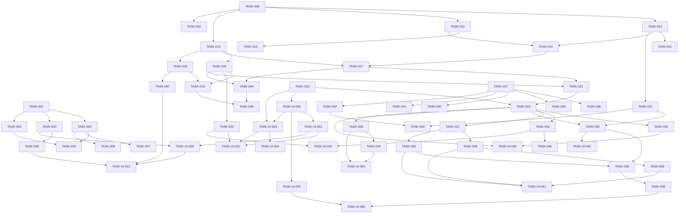

# Backlog del Proyecto: Plataforma de Análisis Técnico (estilo TradingView)

> Fuente: `_docs/requirements.md`, `_docs/architecture.md`, `_docs/adr/`, `_docs/ux/`
> Fecha: 2026-09-17
> Método de estimación: Tallas relativas XS-XL (XS=1 · S=2 · M=3 · L=5 · XL=8)
> Cadencia: Kanban / flujo continuo (un solo desarrollador)
> Versión: v2 (integra épicas de UI por pantalla y setup UX)

## 1. Resumen

| Métrica | Valor |
|---------|-------|
| Épicas de dominio | 4 (EP-001…EP-004) |
| Épicas de UI | 7 (EP-UI-000…EP-UI-006) |
| Épicas técnicas | 4 (TEC-001…TEC-004) |
| Historias | 23 (15 dominio + 8 UI) |
| Tareas backend | 23 |
| Tareas frontend | 29 |
| Tareas BD | 5 |
| Tareas infra | 5 |
| Esfuerzo total | 186 puntos |
| Ruta crítica | TASK-009 → TASK-010 → TASK-012 → TASK-014 → TASK-017 → TASK-021 → TASK-024 → TASK-027 → TASK-030 → TASK-035 → TASK-036 → TASK-UI-060 (~41 pts) |

> Nota de incrementalidad: se conservan los IDs de las 46 tareas v1 (compatibilidad con `_docs/status.md` y `/sdd-track`). Se añaden 15 tareas nuevas (TASK-047 + 14 `TASK-UI-XXX`).
>
> Deuda detectada en verificación (2026-09-24): `TASK-048` corrige que los marcadores compra/venta (RF-012, TASK-030) no se plasman en el navegador pese a pasar los tests unitarios.

## 2. Leyenda

- **Prioridad:** M (Must) · S (Should) · C (Could) · W (Won't)
- **Estado:** 📥 Backlog · 🔨 Doing · 👀 Review · ✅ Done · 🔴 Blocked
- **Estimación:** XS=1 · S=2 · M=3 · L=5 · XL=8
- **Capa:** `backend` · `frontend` · `bd` · `infra` · `docs` · `test`
- **Persona UX:** P-001 (Andrés, analista técnico)

## 3. Épicas de dominio

### EP-001: Ingesta Dukascopy
- **Tipo:** Dominio
- **Requisitos cubiertos:** RF-001, RF-002, RX-001, RNF-003
- **Prioridad:** Must
- **Descripción:** Descarga de datos históricos desde Dukascopy (bi5) para activo + rango, en timeframe base de 1 segundo UTC y ventana de hasta 2 años, ejecutada de forma asíncrona con reintentos.
- **Criterio de aceptación de la épica:** Dado un activo (forex/metal/petróleo) y un rango válido de hasta 2 años, cuando se solicita la descarga, entonces se encola una tarea y se obtienen los datos del rango en segundos UTC.

#### HU-001: Configurar descarga de datos históricos
- **Requisito origen:** RF-001, RX-001
- **Capa:** backend
- **Prioridad:** Must
- **Como** andrés (analista P-001) **quiero** seleccionar un activo y un rango de fechas para descargar sus datos históricos **para** disponer de la materia prima del análisis.
- **Criterios de aceptación:**
  - Dado un activo válido (forex/metal/petróleo) y un rango de fechas, cuando inicio la descarga, entonces se encola una tarea con ese activo y rango.
  - Dado un rango inválido (fin anterior a inicio), cuando inicio la descarga, entonces recibo un error de validación sin encolar nada.
- **Tareas:**

| ID | Tarea | Capa | Est. | Deps | DoD | Estado |
|----|-------|------|------|------|-----|--------|
| TASK-001 | Catálogo de activos + modelo de request de descarga | backend | S | — | Catálogo incluye ≥1 forex, 1 metal y 1 petróleo; esquema de request (activo, inicio, fin) validado con test unitario | ✅ |
| TASK-002 | Cliente Dukascopy (URL bi5 por hora, descarga y decodificación) | backend | L | TASK-001 | Descarga una hora de datos y los decodifica a OHLC sin error; test de integración contra una hora conocida | ✅ |
| TASK-003 | Endpoint POST /downloads que encola la tarea | backend | M | TASK-001 | POST responde 202 + task_id; test unitario con broker mockeado | ✅ |

#### HU-002: Descarga asíncrona con reintentos
- **Requisito origen:** RF-001, RX-001, RNF-003
- **Capa:** backend
- **Prioridad:** Must
- **Como** andrés **quiero** que la descarga corra en segundo plano con reintentos **para** no bloquear la interfaz y resistir fallos de red.
- **Criterios de aceptación:**
  - Dada una descarga en curso, cuando consulto su estado, entonces obtengo progreso/estado sin bloquear la UI.
  - Dado un fallo de red de Dukascopy, cuando ocurre, entonces la tarea reintenta con backoff de hasta 20 s y registra el resultado.
- **Tareas:**

| ID | Tarea | Capa | Est. | Deps | DoD | Estado |
|----|-------|------|------|------|-----|--------|
| TASK-004 | Celery + RabbitMQ y tarea download_asset | backend | M | TASK-001 | El compose levanta el worker; la tarea se registra y ejecuta de extremo a extremo en dev | ✅ |
| TASK-005 | Retry/backoff 20 s y manejo de fallos parciales | backend | M | TASK-002, TASK-004 | Un fallo HTTP simulado se reintenta con backoff de 20 s; el estado queda parcial/fallo en metadatos | ✅ |
| TASK-006 | Endpoint GET /downloads/{task_id} de estado | backend | S | TASK-003 | Devuelve estado (encolada/éxito/parcial/fallo) y filas obtenidas; test unitario | ✅ |

#### HU-003: Ingesta en 1 segundo UTC
- **Requisito origen:** RF-002, RNF-003
- **Capa:** backend
- **Prioridad:** Must
- **Como** andrés **quiero** que los datos se ingieran en 1 segundo UTC **para** garantizar consistencia temporal entre activos y timeframes.
- **Criterios de aceptación:**
  - Dado un rango válido, cuando se completa la descarga, entonces todos los timestamps están en segundos y en UTC.
  - Dado un rango mayor a 2 años, cuando se solicita, entonces se rechaza o se recorta con mensaje explícito.
- **Tareas:**

| ID | Tarea | Capa | Est. | Deps | DoD | Estado |
|----|-------|------|------|------|-----|--------|
| TASK-007 | Normalización de timestamps a segundos UTC | backend | S | TASK-002 | Un fixture con TZ no-UTC converge a epoch en segundos UTC; test unitario | ✅ |
| TASK-008 | Validación de ventana ≤ 2 años (RNF-003) | backend | S | TASK-002 | Una solicitud > 2 años se rechaza o recorta con mensaje; test unitario | ✅ |

### EP-002: Pipeline de limpieza, resampling e indicadores
- **Tipo:** Dominio
- **Requisitos cubiertos:** RF-003, RF-004, RF-009, RF-013, RNF-004, RNF-008
- **Prioridad:** Must
- **Descripción:** Limpieza de datos crudos al formato `time/open/high/low/close`, imputación de gaps, exclusión de fines de semana y feriados, resampling a los timeframes de visualización y cálculo de indicadores (MA, RSI, ATR).
- **Criterio de aceptación de la épica:** Dado un dataset crudo de 1 s, cuando se ejecuta el pipeline, entonces cada fila es OHLC válida en segundos UTC, sin filas en mercado cerrado, existen agregaciones correctas para 1m/5m/15m/1h/4h/1d y los indicadores MA/RSI/ATR se calculan sin error.

#### HU-004: Limpieza al formato OHLC
- **Requisito origen:** RF-003, RNF-004, RNF-008
- **Capa:** backend
- **Prioridad:** Must
- **Como** andrés **quiero** que los datos crudos se limpien a `time/open/high/low/close` **para** que el gráfico los consuma directamente sin transformaciones ad-hoc.
- **Criterios de aceptación:**
  - Dado un dataset crudo con NaN/gaps, cuando se ejecuta el pipeline, entonces cada fila tiene time (segundos), OHLC numérico y es consumible por la librería de visualización.
  - Dado un timestamp en cualquier zona, cuando se procesa, entonces queda expresado en UTC.
- **Tareas:**

| ID | Tarea | Capa | Est. | Deps | DoD | Estado |
|----|-------|------|------|------|-----|--------|
| TASK-009 | Contrato OHLC compartido (time/open/high/low/close) | backend | M | — | Tipos TS y modelo Pydantic alineados; contrato documentado; sin transformación ad-hoc en el frontend (RNF-008) | ✅ |
| TASK-010 | Pipeline de limpieza e imputación (gaps/NaN) | backend | L | TASK-009 | Un dataset crudo con NaN/gaps produce filas OHLC válidas; política PA-3 (eliminación NaN + FF acotado 60 s) testeada | ✅ |
| TASK-011 | Normalización UTC y validación de esquema | backend | S | TASK-010 | Todas las filas cumplen time BIGINT UTC y tipos numéricos; test de esquema | 📥 |

#### HU-005: Exclusión de fines de semana y feriados
- **Requisito origen:** RF-004
- **Capa:** backend
- **Prioridad:** Must
- **Como** andrés **quiero** excluir fines de semana y feriados **para** no interpretar gaps de mercado como señales falsas.
- **Criterios de aceptación:**
  - Dado un rango que incluye fin de semana o feriado, cuando se procesan los datos, entonces no existen filas en esos periodos.
- **Tareas:**

| ID | Tarea | Capa | Est. | Deps | DoD | Estado |
|----|-------|------|------|------|-----|--------|
| TASK-012 | Calendario de mercado (weekend + feriados) por activo | backend | M | TASK-009 | Calendario cubre fin de semana y feriados configurables; test sobre un rango de marzo 2026 | ✅ |
| TASK-013 | Filtro de periodos sin mercado en el pipeline | backend | S | TASK-012 | Un rango con fin de semana no produce filas en sábado/domingo; test específico | ✅ |

#### HU-006: Resampling a timeframes de visualización
- **Requisito origen:** RF-009, RNF-008
- **Capa:** backend
- **Prioridad:** Must
- **Como** andrés **quiero** timeframes 1m/5m/15m/1h/4h/1d derivados del 1 s **para** analizar el mismo activo en distintas escalas.
- **Criterios de aceptación:**
  - Dado un dataset de 1 s, cuando elijo 1h, entonces las velas se agregan correctamente a 1 hora.
- **Tareas:**

| ID | Tarea | Capa | Est. | Deps | DoD | Estado |
|----|-------|------|------|------|-----|--------|
| TASK-014 | Agregación OHLC a 1m/5m/15m/1h/4h/1d | backend | L | TASK-010, TASK-012 | Una vela 1h coincide con la agregación de 60 velas 1m; fixture verificada para cada timeframe | ✅ |

#### HU-016: Cálculo de indicadores en el pipeline
- **Requisito origen:** RF-013
- **Capa:** backend
- **Prioridad:** Must
- **Como** andrés **quiero** que MA, RSI y ATR se calculen en el pipeline **para** que el frontend solo renderice sin recomputar.
- **Criterios de aceptación:**
  - Dado un dataset limpiado, cuando se ejecuta el módulo de indicadores, entonces MA/RSI/ATR se calculan con los parámetros configurados y quedan disponibles para la API.
- **Tareas:**

| ID | Tarea | Capa | Est. | Deps | DoD | Estado |
|----|-------|------|------|------|-----|--------|
| TASK-031 | Cálculo de MA, RSI y ATR (defaults MA 20/50/200, RSI 14, ATR 14) | backend | M | TASK-010 | Valores MA/RSI/ATR validados contra un fixture de referencia; test unitario | ✅ |

### EP-003: Almacenamiento Parquet + DuckDB
- **Tipo:** Dominio
- **Requisitos cubiertos:** RF-005, RF-006, RI-001, RI-002, RNF-002
- **Prioridad:** Must
- **Descripción:** Persistencia de series OHLC en Parquet consultadas por DuckDB, con `time` único por activo, tabla de metadatos de descarga y soporte de descargas incrementales sin duplicar ni borrar.
- **Criterio de aceptación de la épica:** Dado un activo almacenado, cuando se consulta un rango, entonces los datos se recuperan desde Parquet vía DuckDB y una descarga incremental agrega periodos sin duplicar ni borrar filas.

#### HU-007: Persistir series OHLC
- **Requisito origen:** RF-005, RI-001, RNF-002
- **Capa:** bd
- **Prioridad:** Must
- **Como** andrés **quiero** que los datos se guarden en Parquet consultables con DuckDB **para** tener una base local eficiente y duradera.
- **Criterios de aceptación:**
  - Dado el proceso de almacenamiento, cuando se completa, entonces los datos son consultables vía DuckDB y persisten en Parquet.
  - Dado un intento de inserción duplicada (mismo time/activo), cuando se procesa, entonces se rechaza o completa sin duplicar.
- **Tareas:**

| ID | Tarea | Capa | Est. | Deps | DoD | Estado |
|----|-------|------|------|------|-----|--------|
| TASK-015 | Esquema SerieOHLC en Parquet por activo (time único) | bd | M | TASK-009 | Se crea un Parquet por activo con time BIGINT único; consulta DuckDB devuelve el rango | ✅ |
| TASK-016 | Capa de consulta DuckDB por activo/rango/timeframe | bd | M | TASK-015 | Una query parametrizada devuelve OHLC del rango; test con dataset de fixture | ✅ |
| TASK-017 | Parquet pre-resampling por timeframe | bd | M | TASK-014, TASK-015 | Los archivos por timeframe quedan persistidos y se consultan sin recomputar; test | ✅ |

#### HU-008: Descargas incrementales sin duplicados
- **Requisito origen:** RF-006, RI-002
- **Capa:** bd
- **Prioridad:** Must
- **Como** andrés **quiero** que las descargas incrementales completen lo existente sin duplicar ni borrar **para** mantener la base consistente a lo largo del tiempo.
- **Criterios de aceptación:**
  - Dado un activo con datos de ene–may 2026, cuando se descarga jun–jul 2026, entonces la base contiene enero a julio sin filas duplicadas.
- **Tareas:**

| ID | Tarea | Capa | Est. | Deps | DoD | Estado |
|----|-------|------|------|------|-----|--------|
| TASK-018 | Tabla MetadatosDescarga (activo, rango, estado, fecha, filas) | bd | S | TASK-015 | Tabla DuckDB creada; inserta y lee registros de descarga; test unitario | 📥 |
| TASK-019 | Upsert incremental por merge sobre `time` | bd | M | TASK-016, TASK-018 | Descargar un periodo nuevo sobre una base existente no duplica time ni borra filas; KPI-4 = 0 duplicados | 📥 |

### EP-004: API REST de datos
- **Tipo:** Dominio
- **Requisitos cubiertos:** RF-007, RF-008, RX-002, RNF-008
- **Prioridad:** Must
- **Descripción:** Exposición REST del catálogo de activos, de las series OHLC por activo/rango/timeframe y del historial de descargas, con un contrato de respuesta alineado a lightweight-charts.
- **Criterio de aceptación de la épica:** Dado el frontend, cuando solicita el catálogo, una serie por activo/rango/timeframe o el historial de descargas, entonces recibe OHLC válido en el contrato acordado.

#### HU-009: Catálogo de activos y carga por rango
- **Requisito origen:** RF-007, RF-008, RX-002
- **Capa:** backend
- **Prioridad:** Must
- **Como** andrés **quiero** listar los activos guardados y cargar un periodo específico **para** explorar solo el tramo que me interesa.
- **Criterios de aceptación:**
  - Dado un activo almacenado, cuando lo selecciono, entonces el gráfico carga sus datos.
  - Dado un activo y un rango 01/01/2026–31/01/2026, cuando lo solicito, entonces solo se devuelven datos dentro de ese rango.
- **Tareas:**

| ID | Tarea | Capa | Est. | Deps | DoD | Estado |
|----|-------|------|------|------|-----|--------|
| TASK-020 | Endpoint GET /assets (catálogo con cobertura y estado) | backend | S | TASK-016 | Devuelve el catálogo de activos con datos almacenados (contrato CMP-006); test unitario | 📥 |
| TASK-021 | Endpoint GET /series (activo, rango, timeframe) | backend | M | TASK-016, TASK-017 | Devuelve la serie OHLC del rango/timeframe y coincide con la consulta directa a DuckDB; test | ✅ |
| TASK-022 | Contrato de respuesta en TS types alineado a lightweight-charts | frontend | S | TASK-009 | Los tipos comparten esquema con TASK-009 y compilan sin transformaciones en el frontend | 📥 |

#### HU-017: Historial de descargas
- **Requisito origen:** RI-002
- **Capa:** backend
- **Prioridad:** Must
- **Como** andrés **quiero** consultar el historial de descargas (fecha, activo, rango, estado, filas) **para** saber si un rango ya existe y evitar descargas redundantes.
- **Criterios de aceptación:**
  - Dado un set de descargas previas, cuando solicito el historial, entonces obtengo la lista ordenada con estado y filas de cada una.
- **Tareas:**

| ID | Tarea | Capa | Est. | Deps | DoD | Estado |
|----|-------|------|------|------|-----|--------|
| TASK-047 | Endpoint GET /downloads (historial RI-002) | backend | S | TASK-018 | Devuelve historial (fecha, activo, rango, estado, filas) ordenado por fecha; test unitario | 📥 |

## 4. Épicas de UI

> Solo aplica porque existe `_docs/ux/`. Todas las tareas de UI heredan los criterios UX no negociables: estados de `interaction-specs.md` implementados, contraste WCAG AA verificado, navegación por teclado funcional y componentes del inventario reutilizados (no reinventar).

### EP-UI-000: Design system y setup base (transversal)
- **Tipo:** UI (transversal)
- **Requisito origen:** RNF-008, design-system.md, components.md, accessibility.md
- **Justificación:** Base para toda la UI; evita re-trabajo y garantiza contraste/teclado/ARIA desde el inicio.
- **Tareas:**

| ID | Tarea | Capa | Est. | Deps | DoD | Estado |
|----|-------|------|------|------|-----|--------|
| TASK-023 | Scaffold frontend React 18 + Vite 5 + TS 5 | frontend | S | — | La app levanta en dev; lint y typecheck en verde | ✅ |
| TASK-UI-000 | Setup tokens design system (color, tipografía, spacing, radius, shadow; dark único) | frontend | M | TASK-023 | Tokens consumibles desde código (design-system.md); ratios de contraste calculados ≥4.5:1 texto normal / ≥3:1 grande | ✅ |
| TASK-UI-001 | Primitivas form: Button (CMP-001), Input (CMP-002), Select (CMP-003), RadioGroup (CMP-004), DateRange (CMP-005) | frontend | L | TASK-UI-000 | Cada componente con estados default/hover/focus/error/disabled/loading según components.md; label visible siempre; contraste AA; test visual | ✅ |
| TASK-UI-002 | Feedback/overlay: StatusBanner (CMP-012), ProgressBar (CMP-013), Modal (CMP-014), Toast (CMP-015), Tab (CMP-011) con foco y roles | frontend | L | TASK-UI-000 | Estados por interacción (success/error/warning, `role=alert`/`aria-live`, focus trap en Modal); usa tokens | ✅ |
| TASK-UI-003 | Layout principal + routing (appbar 48px, rutas SCR-001…006, single-window, skip link) | frontend | M | TASK-023, TASK-UI-000 | Navegación entre las 6 pantallas funcionando; skip link presente y operativo (WCAG 2.4.1) | ✅ |
| TASK-UI-004 | Accesibilidad base (foco visible, ARIA raíz, contraste en CI, prefers-reduced-motion) | frontend | M | TASK-UI-003 | Foco visible (token color-focus), axe-core/Lighthouse en CI verde, `prefers-reduced-motion` deshabilita transiciones | ✅ |

### EP-UI-001: Pantalla SCR-001 (Biblioteca de activos)
- **Tipo:** UI
- **Pantalla origen:** SCR-001
- **Journey:** J-001, J-002
- **Persona:** P-001
- **Requisito origen:** RF-007
- **Prioridad:** Must
- **Criterios UX no negociables:**
  - Estados: loading, empty, error, success, partial (interaction-specs.md).
  - Contraste WCAG AA verificado; tabla con `<th scope>`; filas navegables por teclado.
  - Badges de estado con texto + color (no color solo).
  - Componentes del inventario reutilizados (Button, AssetList CMP-006, StatusBanner).
- **Tareas:**

| ID | Tarea | Capa | Est. | Deps | DoD | Estado |
|----|-------|------|------|------|-----|--------|
| TASK-UI-010 | Implementar SCR-001 (AssetList CMP-006: tabla cobertura/estado, acciones Graficar→SCR-003 y Actualizar→SCR-002, última descarga) | frontend | L | TASK-020, TASK-UI-001, TASK-UI-003 | 5 estados (loading/empty/error/success/partial) implementados; a11y tabla + teclado; CTA empty→SCR-002; contraste verificado | 📥 |

### EP-UI-002: Pantalla SCR-002 (Descargar datos)
- **Tipo:** UI
- **Pantalla origen:** SCR-002
- **Journey:** J-001
- **Persona:** P-001
- **Requisito origen:** RF-001, RF-002, RF-006 (+ RI-002 feedback de historial)
- **Prioridad:** Must
- **Criterios UX no negociables:**
  - Estados: loading(progreso), empty, error, success, partial.
  - Progreso con `role=progressbar` + `aria-valuenow`; región `aria-live`; errores inline + `role=alert`.
  - Labels visibles (nunca placeholder como único label); el resto de la app sigue navegable durante la descarga asíncrona.
  - Componentes reutilizados (Button, Input, Select, StatusBanner, ProgressBar).
- **Tareas:**

| ID | Tarea | Capa | Est. | Deps | DoD | Estado |
|----|-------|------|------|------|-----|--------|
| TASK-UI-020 | Form de descarga (activo, tipo, fecha inicio/fin; nota 1s UTC fija; validación inline; preserva valores en error) | frontend | M | TASK-003, TASK-UI-001 | Validación inline por campo (inicio≤fin, rango dentro de ventana 2 años RNF-003); valores preservados tras error; a11y labels; POST /downloads responde 202 + feedback | 📥 |
| TASK-UI-021 | Progreso asíncrono + historial + estados (éxito/fallo/parcial) + sugerencia de rango faltante (incremental RF-006) | frontend | L | TASK-006, TASK-047, TASK-UI-020 | ProgressBar determinista sin timeout visual; fila historial con estado/filas (GET /downloads); partial sugiere rango faltante; banners auto-dismiss success 5s | 📥 |

### EP-UI-003: Pantalla SCR-003 (Abrir gráfico)
- **Tipo:** UI
- **Pantalla origen:** SCR-003
- **Journey:** J-002
- **Persona:** P-001
- **Requisito origen:** RF-008, RF-009
- **Prioridad:** Must
- **Criterios UX no negociables:**
  - Estados: loading, empty, error, success, partial (cobertura discontinua → validación inline y rango útil exacto).
  - Radios de timeframe como radiobuttons reales con `<fieldset>/<legend>`.
  - Validación anunciada y con foco dirigido al campo en error.
  - Componentes reutilizados (Select, Input, RadioGroup, Button).
- **Tareas:**

| ID | Tarea | Capa | Est. | Deps | DoD | Estado |
|----|-------|------|------|------|-----|--------|
| TASK-026 | Selector de activo/rango/timeframe en la UI (navegación a SCR-004) | frontend | M | TASK-021, TASK-024 | Al cambiar la selección se carga el gráfico con los datos del rango (RF-007/008) | 📥 |
| TASK-UI-030 | Estados y validación de SCR-003 (cobertura desde GET /assets, rangos fuera de cobertura, empty→CTA SCR-002) | frontend | M | TASK-020, TASK-026 | Empty bloquea "Abrir gráfico" con CTA a SCR-002; rango fuera de cobertura rechazado inline con foco al campo; partial avisa rango útil exacto; a11y fieldsets | 📥 |

### EP-UI-004: Pantalla SCR-004 (Gráfico principal)
- **Tipo:** UI
- **Pantalla origen:** SCR-004
- **Journey:** J-002, J-003, J-004
- **Persona:** P-001
- **Requisito origen:** RF-009, RF-010, RF-011, RF-012, RF-013
- **Prioridad:** Must
- **Criterios UX no negociables:**
  - Estados: loading, empty, error, success, partial.
  - Renderizado 60 FPS (RNF-001); toolbar operativa por teclado; herramientas con `aria-pressed`.
  - Zoom alterno por teclado: `+`/`-` (zoom en cursor), `1` (ajustar vista).
  - Crosshair con leyenda OHLC textual accesible (el canvas no es accesible).
  - Componentes reutilizados (ChartPane CMP-007, ChartToolbar CMP-008, DrawTool CMP-009, IndicatorItem CMP-010).
- **Tareas:**

| ID | Tarea | Capa | Est. | Deps | DoD | Estado |
|----|-------|------|------|------|-----|--------|
| TASK-024 | Integración de lightweight-charts v4 con datos de la API (ChartPane base CMP-007) | frontend | M | TASK-021, TASK-023 | Renderiza velas reales de un activo; contrato OHLC sin transformación (RNF-008); smoke test | ✅ |
| TASK-025 | Zoom/pan fluido a 60 FPS con dataset de 2 años | frontend | M | TASK-024 | Pan/zoom continuo sin caídas perceptibles; profiling vía requestAnimationFrame (RNF-001) | ✅ |
| TASK-027 | Overlay canvas sincronizado con los ejes del gráfico | frontend | L | TASK-024 | El trazo se mantiene anclado a precio/tiempo durante zoom y pan; verificación manual | ✅ |
| TASK-028 | Herramientas de línea y rectángulo (crear/borrar) | frontend | L | TASK-027 | Se crean y borran líneas y rectángulos; persisten solo en sesión (RI-003) | ✅ |
| TASK-029 | Retrocesos de Fibonacci (crear/borrar) | frontend | M | TASK-028 | Niveles de Fibonacci dibujados y borrables con anclas correctas | ✅ |
| TASK-030 | Marcadores de entrada/salida (buy/sell) superpuestos | frontend | M | TASK-027 | Las marcas de compra/venta toman el precio de la barra bajo el cursor, son borrables y no persistentes (RI-003) | ✅ |
| TASK-048 | Fix: los marcadores compra/venta no se plasman al hacer clic en el gráfico (RF-012) | frontend | S | TASK-030 | Con Compra/Venta activo, un clic sobre una vela crea el marcador ▲/▼ anclado a tiempo+precio y se dibuja en el overlay; test de comportamiento + verificación en navegador | ✅ |
| TASK-032 | Render de indicadores y panel de parámetros | frontend | M | TASK-024, TASK-031 | Cambiar un parámetro (p. ej. periodo de MA) redibuja el indicador; verificación manual | ✅ |
| TASK-UI-040 | ChartPane CMP-007 con estados (loading/empty/error/success/partial) + leyenda OHLC accesible | frontend | M | TASK-024, TASK-025 | Overlays por estado (skeleton velas, "Sin datos en este periodo", retry); leyenda OHLC textual del crosshair; zoom en cursor a 60 FPS (KPI-2) | ✅ |
| TASK-UI-041 | ChartToolbar CMP-008 + DrawTool CMP-009 integrados (aria-pressed, atajos `+`/`-`/`1`, tooltip icon-only) | frontend | M | TASK-028, TASK-029, TASK-030 | Toolbar 100% por teclado; herramienta activa con `aria-pressed`; atajos operativos; targets ≥24px con espaciado 8px | ✅ |
| TASK-UI-042 | IndicatorItem CMP-010 + panel configuración con defaults (MA 20/50/200, RSI 14, ATR 14), overlay (MA/ATR) y panel (RSI) | frontend | M | TASK-032 | Añadir/quitar/reconfigurar redibuja; valores por defecto visibles; estados config-open/removed; a11y | 📥 |

### EP-UI-005: Pantalla SCR-005 (Multigráfico sincronizado)
- **Tipo:** UI
- **Pantalla origen:** SCR-005
- **Journey:** J-005
- **Persona:** P-001
- **Requisito origen:** RF-014
- **Prioridad:** Must
- **Criterios UX no negociables:**
  - Estados: loading, empty, error (aislamiento de pane), success, partial.
  - Mismo eje temporal en los 3 panes (UTC, RNF-004) para sincronización exacta.
  - Tabs con patrón WAI-ARIA `tablist/tab/tabpanel` y flechas direccionales; leyenda combinada textual.
  - Control "añadir" deshabilitado al llegar a 3 panes con tooltip explicativo.
  - Componentes reutilizados (ChartPane sync CMP-007, Tab CMP-011, Button).
- **Tareas:**

| ID | Tarea | Capa | Est. | Deps | DoD | Estado |
|----|-------|------|------|------|-----|--------|
| TASK-033 | Layout de 3 paneles de gráfico | frontend | M | TASK-024 | Se abren hasta 3 paneles de forma independiente, cada uno con su timeframe | 📥 |
| TASK-034 | Sincronización de crosshair/zoom entre paneles | frontend | M | TASK-033 | Mover crosshair o zoom en un panel refleja el cambio en los otros (misma ventana temporal UTC); verificación manual | 📥 |
| TASK-UI-050 | Tabs WAI-ARIA (tablist/tab/tabpanel), límite 3 panes con deshabilitado + tooltip, leyenda combinada textual | frontend | S | TASK-033, TASK-034 | Teclado operativo en tabs (flechas); al llegar a 3 panes el añadir se deshabilita; leyenda textual por pane | 📥 |

### EP-UI-006: Pantalla SCR-006 (Exportar imagen)
- **Tipo:** UI
- **Pantalla origen:** SCR-006
- **Journey:** J-006
- **Persona:** P-001
- **Requisito origen:** RF-015 (+ RI-003: la captura es la única vía de conservar la estrategia)
- **Prioridad:** Must
- **Criterios UX no negociables:**
  - Estados: loading (toBlob), empty (canvas sin contenido), error, success, partial.
  - Modal con focus trap y cierre con Escape; foco restaurado al cerrar.
  - Preview con alt descriptivo.
  - Default PNG @2x del viewport hasta cerrar P-2.
  - Componentes reutilizados (Modal CMP-014, RadioGroup, Button).
- **Tareas:**

| ID | Tarea | Capa | Est. | Deps | DoD | Estado |
|----|-------|------|------|------|-----|--------|
| TASK-035 | Composición del canvas de velas + indicadores + dibujos | frontend | M | TASK-030, TASK-032 | El lienzo compuesto incluye los tres elementos; verificado visualmente | ✅ |
| TASK-036 | Export PNG (toBlob) sin persistir dibujos | frontend | S | TASK-035 | Se descarga un PNG con gráfico+dibujos+indicadores; no queda registro interno (RI-003); formato/resolución definidos (P-2, default PNG 2x) | ✅ |
| TASK-UI-060 | Modal export (CMP-014): resolución/formato RadioGroup, preview, focus trap, Escape, estados | frontend | M | TASK-036, TASK-UI-002 | Modal con foco inicial al título y restauración al cerrar; Escape cierra; estados loading/empty/error/success/partial; descarga disparada + Toast | ✅ |

## 5. Épicas técnicas (transversales)

### TEC-001: Fundaciones, Docker Compose y CI/CD
- **Origen:** RNF-005, RNF-006, RNF-007 (ADR-008, ADR-009)
- **Justificación:** Entorno reproducible y portable que habilita el plazo del MVP, con verificación de compatibilidad de navegadores y auditoría de costo $0.
- **Tareas:**

| ID | Tarea | Capa | Est. | Deps | DoD | Estado |
|----|-------|------|------|------|-----|--------|
| TASK-037 | Monorepo (backend/frontend/worker) + lint/formato | infra | S | — | Estructura de carpetas creada; lint y formato configurados y ejecutables | 📥 |
| TASK-038 | Docker Compose (frontend, backend, worker, broker, volumen data/) | infra | M | TASK-037 | `docker compose up` levanta los 4 servicios con volumen `data/` (ADR-009) | 📥 |
| TASK-039 | GitHub Actions lint + tests | infra | S | TASK-037 | El workflow corre en push y pasa en verde | 📥 |
| TASK-040 | Auditoría de licencias OSS ($0) | infra | S | TASK-037 | Inventario sin componentes comerciales (RNF-006); documento de auditoría | 📥 |
| TASK-046 | Smoke test en navegadores de escritorio modernos | infra | S | TASK-026 | La app funciona en navegadores de escritorio modernos sin plugins (RNF-005) | 📥 |

### TEC-002: Observabilidad
- **Origen:** RNF-006, RNF-007 (ADR-008)
- **Justificación:** Diagnóstico rápido de fallos de descarga y pipeline sin costo, con logs estructurados y correlación de tareas.
- **Tareas:**

| ID | Tarea | Capa | Est. | Deps | DoD | Estado |
|----|-------|------|------|------|-----|--------|
| TASK-041 | Logging estructurado structlog por módulo + correlación Celery | backend | S | TASK-037 | Logs JSON con módulo y task_id de Celery; test de emisión | 📥 |

### TEC-003: Extensibilidad e interfaces
- **Origen:** RF-016 (ADR-001)
- **Justificación:** Fronteras de módulos e interfaces explícitas para agregar características sin reescribir componentes existentes.
- **Tareas:**

| ID | Tarea | Capa | Est. | Deps | DoD | Estado |
|----|-------|------|------|------|-----|--------|
| TASK-042 | Interfaces/contratos de módulos (ingest, pipeline, storage, api) | backend | S | TASK-037 | Cada módulo expone una interfaz documentada; test de import/contrato | 📥 |
| TASK-043 | Registro extensible de indicadores | backend | M | TASK-031, TASK-042 | Agregar un indicador nuevo no modifica código existente; test de registro | 📥 |

### TEC-004: Caché de series (Karst)
- **Origen:** RNF-001, RNF-002, RNF-008 (ADR-007)
- **Justificación:** Habilitar pan/zoom fluido sobre ~18M filas por activo sirviendo ventanas desde memoria/Parquet columnar.
- **Tareas:**

| ID | Tarea | Capa | Est. | Deps | DoD | Estado |
|----|-------|------|------|------|-----|--------|
| TASK-044 | Caché in-memory por ventana (activo + timeframe) | backend | L | TASK-016, TASK-017 | La segunda carga del mismo rango se sirve desde memoria; latencia < 2 s (KPI-3) | 📥 |
| TASK-045 | Invalidación de caché por actualización incremental | backend | M | TASK-019, TASK-044 | Tras una descarga incremental, la caché del activo se invalida y recarga | 📥 |

## 6. Grafo de dependencias

## 7. Ruta crítica

`TASK-009 → TASK-010 → TASK-012 → TASK-014 → TASK-017 → TASK-021 → TASK-024 → TASK-027 → TASK-030 → TASK-035 → TASK-036 → TASK-UI-060`

Esfuerzo: ~41 pts. Cualquier retraso en esta secuencia desplaza la entrega del MVP. Tramo de mayor peso individual: TASK-010, TASK-014, TASK-027 y las nuevas TASK-UI-001/002/010/021 (L=5). La pantalla SCR-004 (TASK-024→027→030) es el cuello de botella del frontend; el export (…→TASK-036→TASK-UI-060) es el último eslabón de la ruta.

## 8. Deuda técnica y tareas sin requisito

No hay tareas huérfanas: todas las tareas rastrean a un requisito (`RF/RNF/RI/RX`) o a una épica técnica/UI con origen explícito. No se registra deuda técnica `TECH-XXX` en este backlog.

## 9. Cobertura UX

| Pantalla UX | Épica asignada | Tareas | Estado |
|-------------|----------------|---------|--------|
| SCR-001 | EP-UI-001 | 1 (TASK-UI-010) | 📥 |
| SCR-002 | EP-UI-002 | 2 (TASK-UI-020, TASK-UI-021) | 📥 |
| SCR-003 | EP-UI-003 | 2 (TASK-026, TASK-UI-030) | 📥 |
| SCR-004 | EP-UI-004 | 11 (TASK-024…030, 032, TASK-UI-040/041/042) | 📥 |
| SCR-005 | EP-UI-005 | 3 (TASK-033, TASK-034, TASK-UI-050) | 📥 |
| SCR-006 | EP-UI-006 | 3 (TASK-035, TASK-036, TASK-UI-060) | 📥 |

**Pantallas sin épica:** ninguna ✅
**Componentes sin tarea:** ninguno ✅ (CMP-001…015 cubiertos; ver sección 4)

> Nota: `ImagePreview` y `Table` (mencionados en wireframes pero ausentes del inventario `components.md`) se implementan dentro de TASK-UI-060 y TASK-UI-010/TASK-UI-021 respectivamente.

## 10. Decisiones de planificación

- **DP-1:** Estimación por tallas relativas XS-XL; cadencia Kanban (un solo desarrollador).
- **DP-2:** Se conservan los IDs de las 46 tareas v1 para no romper `_docs/status.md` y `/sdd-track`; las 15 nuevas se numeran TASK-047 y TASK-UI-XXX.
- **DP-3:** El contrato OHLC (TASK-009) se ejecuta en Fase 0 para mitigar R-005/AR-3 y desbloquear pipeline, storage y API.
- **DP-4:** Las épicas de UI se organizan por pantalla (SCR-001…006) con jornadas J-001…J-006; el setup UX (EP-UI-000) precede a todas las pantallas.
- **DP-5:** Cada pantalla de UI hereda los estados de `interaction-specs.md` y los criterios de `accessibility.md` (WCAG AA) en su DoD; no se acepta una pantalla sin teclado/contraste/ARIA.
- **DP-6:** La cobertura/validación de SCR-003 (TASK-UI-030) depende de `GET /assets` (cobertura_start/end) y de poder navegar al chart (TASK-024).
- **DP-7:** El historial `GET /downloads` (TASK-047) se añade como tarea backend porque `components.md` lo declara contrato obligatorio para SCR-002 (RI-002).
- **DP-8:** El esfuerzo total (~184 pts) supera la capacidad nominal de 2 semanas (RNF-007). Se prioriza por ruta crítica; si el plazo aprieta, se difiere EP-UI-005 (SCR-005) y el pulido a11y fino (TASK-UI-004/050), siempre manteniendo los criterios WCAG mínimos de las pantallas entregadas.

## 11. Preguntas abiertas

- **PA-1 (P-1):** Meta numérica del KPI-1 (tiempo máximo de descarga de 2 años). Impacta: TASK-008, TASK-005.
- **PA-2 (P-2):** Formato exacto y resolución/dimensiones del PNG exportado. Impacta: TASK-036, TASK-UI-060 (se asume default PNG 2x).
- **PA-3 (P-3):** Política de imputación de NaN/gaps (forward-fill, eliminación, etc.). Impacta: TASK-010 (ruta crítica).