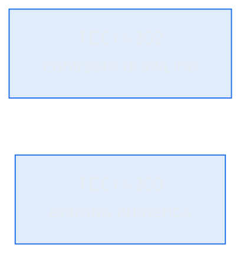

# Backlog del Proyecto: fxtrad

> Fuente: `_docs/requirements.md`, `_docs/architecture.md`, `_docs/adr/`, `_docs/ux/`
> Última actualización: 2026-10-02
> Ciclo actual: **05** (abierto, sin planificación todavía)

## 1. Resumen

El ciclo 04 (Dibujo Referencia de Operación) está **cerrado y archivado** en
`_docs/iterations/04-dibujo-referencia-operacion/`: 20/20 tareas · 56/56 pts · 19/19
requisitos propios 🟢 · ruta crítica 7/7 · CI en verde (run #31).

El ciclo 05 **arranca vacío**. Este backlog solo recoge la **deuda que el ciclo 04 dejó
explícitamente abierta** (ver §8 de su backlog archivado). No hay épicas, historias ni
requisitos nuevos: definirlos es trabajo de `/sdd-brainstorm` y `/sdd-plan`, no de este
documento.

**Brecha de producto más relevante que deja el ciclo 04:** no hay **series de operaciones**.
Probar una estrategia exige varias operaciones y hoy cada dibujo va suelto, sin relación entre
sí. Es candidata natural a propósito del ciclo 05.

## 2. Leyenda

| Símbolo | Significado |
|---------|-------------|
| 📥 | Backlog — sin empezar |
| 🔨 | Doing — en curso |
| 👀 | Review — en revisión |
| ✅ | Done — cerrado con DoD verificada |
| 🔴 | Blocked — bloqueado, con motivo registrado |
| **Must** | Bloquea el ciclo |
| **Should** | Importante, no bloqueante |
| **Could** | Deseable |
| **Won't** | Fuera de alcance |

## 3. Deuda heredada del ciclo 04

Tareas que el ciclo 04 identificó y difirió. Sus textos completos, con justificación y
riesgos, están en `_docs/iterations/04-dibujo-referencia-operacion/backlog.md` §8.

| ID | Descripción | Justificación | Prioridad | Estado |
|----|-------------|---------------|-----------|--------|
| TECH-302 | `drawLine` (`#4A6572`) está en **3.16:1**, por debajo de 4.5:1 | **Preexistente del ciclo 03**, no textual (se distingue por forma) y ajeno a la figura nueva. Corregirlo exige revisar la rampa de color del eje, no solo un token | Should | 📥 |
| TECH-303 | Entrada numérica de Entrada/SL (formulario) para dar ruta por teclado y precio exacto al pip | **No hay RF que lo pida.** A zoom de 2 años el pip no es legible, pero el usuario necesita Introduce precio exacto para colocar niveles | Should | 📥 |

> Ambas entradas came del backlog del ciclo 04. `/sdd-backlog` puede promoverlas a tarea con
> épica y trazabilidad propia, o dejarlas como deuda hasta que un requisito las pida.

## 4. Trabajo cerrado antes de este ciclo

| ID | Descripción | Prioridad | Estado |
|----|-------------|-----------|--------|
| TECH-301 | Recuento de tests del `README.md` al día (decía 392; la ejecución real daba 393) | Should | ✅ Done (ciclo 04) |
| TECH-304 | Sanear `format:check`: formatear 10 ficheros del frontend y alinear el test anti-drift | **Must** | ✅ Done (ciclo 04, `8c71dcb`) |

## 5. Grafo de dependencias

Sin dependencias entre las tareas heredadas: son independientes y de una sola sesión cada una.

## 6. Decisiones de planificación

Sin decisiones todavía: el ciclo 05 no tiene plan. Cuando `/sdd-brainstorm` y `/sdd-plan`
corran, sus decisiones (DP-*) se registran aquí.

## 7. Preguntas abiertas

1. **¿El ciclo 05 ataca las series de operaciones?** Es la brecha principal que deja el ciclo
   04 y la única que exige decisión de alcance.
2. **¿`TECH-302` y `TECH-303` entran como tareas del 05 o esperan a que un requisito las pida?**
3. ¿El spec `mark_buy _sell.md` (archivado con el ciclo 04) aporta algo no cubierto por la
   herramienta ya construida, o se descarta?