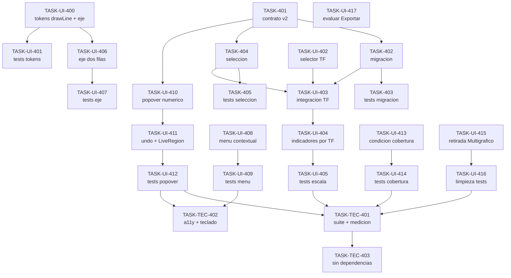

# Backlog del Proyecto: Mejoras UX del Gráfico y Cierre de Deuda (Ciclo 05)

> Fuente: `_docs/requirements.md`, `_docs/architecture.md`, `_docs/adr/`, `_docs/ux/`, `_docs/plan.md`
> Última actualización: 2026-10-06
> Ciclo actual: **05** — `mejoras-ux-grafico`

## 1. Resumen

| Métrica | Valor |
|---------|-------|
| Épicas | **10** — dominio 2 · UI 7 · técnica 1 |
| Historias | **9** |
| Tareas | **26** — `frontend` 13 · `test` 10 · `docs` 3 |
| Esfuerzo total | **76 pts** (XS=1 … XL=8) |
| Ruta crítica | **7 tareas · 24 pts** |
| Requisitos cubiertos | **19/19** (`RF-401…411`, `RNF-401…405`, `RI-401/402`, `RX-401`) |
| Cobertura UX | **3/3 pantallas afectadas** (SCR-004, SCR-005, SCR-006) |
| Deuda promovida | `TECH-302` → RNF-405 · `TECH-303` → RF-410 |

El ciclo 04 cerró con 20 tareas / 56 pts. Este ciclo planifica **76 pts** en el plazo de 2 semanas
de RNF-007 asumiendo que el MoSCoW (DP-3) define el orden de recorte si el plazo aprieta.

## 2. Leyenda

| Símbolo | Significado |
|---------|-------------|
| 📥 | Backlog — sin empezar |
| 🔨 | Doing — en curso |
| 👀 | Review — en revisión |
| ✅ | Done — cerrado con DoD verificada |
| 🔴 | Blocked — bloqueado, con motivo registrado |
| **Must / Should / Could / Won't** | Prioridad MoSCoW |
| **XS=1 · S=2 · M=3 · L=5 · XL=8** | Estimación relativa (Fibonacci) |
| **Capa:** `backend` · `frontend` · `bd` · `infra` · `docs` · `test` | Capa de la tarea |

## 3. Épicas de dominio

### EP-401: Documento de configuración v2 y migración

- **Tipo:** Dominio (datos)
- **Requisitos cubiertos:** RI-401, RNF-401, RF-404, RF-405
- **Prioridad:** **Must**
- **Descripción:** el dibujo deja de pertenecer al timeframe y pasa a pertenecer al **activo**. El
  documento de configuración se unifica en una versión **v2 por activo**
  (`DrawingDocument` reutilizado: `version`, `symbol`, `drawings`, `indicators`, `selection`) con
  **migración aditiva al leer** desde `fxtrad.chart.v1.{activo}.{TF}`; las claves v1 **no se
  borran** (ADR-027).
- **Criterio de aceptación de la épica:** dado un `localStorage` con documentos v1 de un activo en
  seis timeframes, cuando se abre el activo con la versión nueva, entonces existe
  `fxtrad.chart.v2.{activo}` con **todos** los dibujos una sola vez, los indicadores del TF de la
  selección, y las claves v1 siguen intactas.

#### HU-401: Que mis dibujos valgan en cualquier escala temporal

- **Requisito origen:** RF-404, RF-405, RI-401, RNF-401
- **Capa:** frontend (+ test)
- **Prioridad:** Must
- ****Como** analista técnico **quiero** que un dibujo hecho en 1h siga estando cuando cambio a 15m
  **para** comparar escalas sin redibujar y sin perder nada de lo ya guardado.
- **Criterios de aceptación:**
  - **Dado** un Fibonacci dibujado en GBPUSD 1h, **cuando** se cambia a 15m, **entonces** la figura
    sigue visible en las mismas coordenadas (RF-404).
  - **Dado** los indicadores MA/RSI/ATR activos en 1h, **cuando** se cambia a 15m, **entonces** se
    recalculan con las velas de 15m conservando tipo, parámetros y visibilidad (RF-405).
  - **Dado** un documento v1 con `line`, `rect`, `fib`, `marker` y `operation` en varios TF,
    **cuando** se abre la app, **entonces** todos los dibujos siguen presentes, sin duplicados, y
    las claves v1 no se borran (RI-401, RNF-401).

**Tareas:**

| ID | Tarea | Capa | Est. | Deps | DoD | Estado |
|----|-------|------|------|------|-----|--------|
| TASK-401 | Contrato único del documento **v2** en `state/chart-config.ts`: `DrawingDocument {version: 2, symbol, drawings, indicators, selection}`, clave `fxtrad.chart.v2.{symbol}`, (de)serialización y validación; `charting/drawings.ts` **cede** el contrato y conserva `DRAWING_KINDS`/`isOverlayShape`/`colorForShape` | frontend | 5 | — | `CHART_CONFIG_VERSION = 2`; la clave no contiene el TF; `deserializeChartConfig` devuelve `null` ante versión desconocida; `charting/` **no** importa `indicators/`; `tsc --noEmit` limpio bajo `strict`; sin dependencias nuevas | ✅ |
| TASK-402 | `state/migrate-chart-config.ts` (**nuevo, puro**): lee las claves v1 del activo en los seis `TIMEFRAMES`, une los `drawings` **deduplicando por `id`**, toma los `indicators` del TF de la selección (o del primero con datos), es **idempotente** y **no borra** v1 | frontend | 5 | TASK-401 | Módulo sin DOM ni `localStorage` directo (recibe un `Storage` inyectable); la misma figura presente en dos TF cuenta **una** vez; si ya hay v2 no recalcula; ninguna clave v1 se elimina | ✅ |
| TASK-403 | Tests de migración y de contrato v2 | test | 3 | TASK-402 | Documento v1 mixto (5 `kind`) en 3 TF → v2 con **0 pérdidas y 0 duplicados**; idempotencia (segunda pasada no cambia nada); claves v1 presentes tras migrar; un documento v3 no se interpreta como v2 | ✅ |

### EP-402: Sesión de gráfico (selección persistida)

- **Tipo:** Dominio (estado)
- **Requisitos cubiertos:** RF-401, RI-402
- **Prioridad:** **Must**
- **Descripción:** la selección (activo, timeframe y rango) es estado persistido y se resuelve con
  precedencia **URL explícita > selección persistida > valores por defecto** (ADR-028). Hoy el
  enlace de navegación apunta a `/chart` sin query y el gráfico cae a `EURUSD`/`1h`.
- **Criterio de aceptación de la épica:** dado una sesión en GBPUSD 15m, cuando se navega a otra
  hoja y se vuelve, entonces el gráfico muestra GBPUSD 15m.

#### HU-402: Retomar la sesión de análisis donde la dejé

- **Requisito origen:** RF-401, RI-402
- **Capa:** frontend (+ test)
- **Prioridad:** Must
- ****Como** analista técnico **quiero** volver a la hoja `Gráfico` y encontrar el mismo activo,
  timeframe y rango **para** no reconstruir el contexto cada vez que consulto otra hoja.
- **Criterios de aceptación:**
  - **Dado** una sesión en GBPUSD 15m, **cuando** se navega a `Biblioteca` y se vuelve por el
    enlace «Gráfico», **entonces** el gráfico muestra GBPUSD 15m (RF-401).
  - **Dado** un enlace explícito `/chart?symbol=GBPJPY`, **cuando** se abre, **entonces** carga
    GBPJPY aunque la memoria diga otra cosa (RI-402, precedencia).
  - **Dado** una sesión sin selección previa, **cuando** se abre `/chart`, **entonces** se aplican
    los valores por defecto sin error (RI-402).

**Tareas:**

| ID | Tarea | Capa | Est. | Deps | DoD | Estado |
|----|-------|------|------|------|-----|--------|
| TASK-404 | Resolución de la selección en `app/routes.ts` y `App.tsx`: `parseChartQuery` con *fallback* al `selection` del documento v2; escribir URL **y** `selection` al cambiar activo, TF o rango | frontend | 3 | TASK-401 | Precedencia estricta URL > persistido > defecto; un query explícito **nunca** se sobrescribe con el persistido; la URL activa queda siempre enriquecida; sin dependencias nuevas | ✅ |
| TASK-405 | Tests de precedencia y de ida y vuelta | test | 2 | TASK-404 | `/chart` sin query hidrata la última selección; `/chart?symbol=X` gana y pasa a ser la nueva; sin nada → `EURUSD`/`1h`; navegar fuera y volver conserva activo, TF y rango | ✅ |

## 4. Épicas de UI

> **Setup UX obligatorio:** `TASK-UI-000` (design system), `TASK-UI-001` (componentes base),
> `TASK-UI-002` (layout/routing) y `TASK-UI-003` (accesibilidad base) están **✅ Done en el ciclo
> 01** y archivadas en `_docs/iterations/01-mvp/`. La **fundación transversal de este ciclo** es
> `EP-UI-400` y su `TASK-UI-400` va **antes** de las pantallas.

### EP-UI-400: Fundación de tokens del ciclo (transversal)

- **Tipo:** UI (transversal)
- **Requisitos:** RNF-405, RF-407 (tokens de formato)
- **Prioridad:** Should
- **Justificación:** va **primero**: los consumen el render del eje, el menú contextual y los tests
  de contraste; el anti-drift obliga a tocar `tokens.ts` **y** `tokens.css` en la misma tarea.
- **Criterios UX no negociables:** contraste verificado en código; sin colores literales en los
  componentes; todo token duplicado en TS y CSS.

**Tareas:**

| ID | Tarea | Capa | Est. | Deps | DoD | Estado |
|----|-------|------|------|------|-----|--------|
| TASK-UI-400 | `tokens.ts` + `tokens.css`: `color-draw-line` de `#4A6572` a **`#7D8590`**; `AXIS_TOKENS` con `xFormatTop: '{día}'`, `xFormatBottom: '{HH:mm}'` y `axisRowGap: 12px`, retirando `xFormat` | frontend | 2 | — | Anti-drift verde; ningún componente escribe el color literal; `xFormat` ya no existe | ✅ |
| TASK-UI-401 | Tests de contraste y de formato del eje | test | 2 | TASK-UI-400 | `color-draw-line` ≥4.5:1 sobre `#0A0C10` (**5.25:1**) y sobre `#161B22` (**4.64:1**); el anti-drift falla si se edita un solo fichero; `xFormatTop`/`xFormatBottom` rinden `18-nov-25` / `00:15` | ✅ |

### EP-UI-401: Cambio de escala en el gráfico (SCR-004)

- **Tipo:** UI
- **Pantalla origen:** SCR-004 (`_docs/ux/wireframes/SCR-004-grafico-principal.md`)
- **Journey:** J-011 (extiende J-002)
- **Persona:** P-001
- **Requisitos:** RF-403, RF-405, RF-406, RNF-403
- **Prioridad:** **Must**
- **Criterios UX no negociables:**
  - Estados de `interaction-specs.md`: `switching-tf`, `tf-ready`, `tf-error`, además de
    loading/empty/error/success/partial.
  - `CMP-023`: `radiogroup` con `aria-label="Timeframe"`, un único TF activo, flechas ←/→ y
    `Home`/`End`, target ≥44×44 px, `disabled` durante la carga.
  - Los **dibujos permanecen** visibles durante el cambio y **no se animan** al re-proyectarse.
  - 60 FPS con la figura activa (RNF-403).

#### HU-UI-401: Cambiar de escala sin salir del gráfico

- **Requisito origen:** RF-403, RF-405, RF-406
- **Capa:** frontend (+ test)
- **Prioridad:** Must
- ****Como** analista técnico **quiero** cambiar de timeframe desde el propio gráfico **para**
  comparar escalas sin pasar por el formulario de `Abrir` y sin perder mis dibujos.
- **Criterios de aceptación:**
  - **Dado** GBPUSD en 1h, **cuando** se elige 15m en el selector, **entonces** la serie se recarga
    en 15m manteniendo activo y rango (RF-403).
  - **Dado** el gráfico abierto, **cuando** se inspecciona la cabecera, **entonces** los seis TF
    son seleccionables junto a Indicadores y el activo está marcado (RF-406).
  - **Dado** una operación activa, **cuando** se cambia de TF, **entonces** la interacción mantiene
    60 FPS sin frames caídos (RNF-403).

**Tareas:**

| ID | Tarea | Capa | Est. | Deps | DoD | Estado |
|----|-------|------|------|------|-----|--------|
| TASK-UI-402 | `CMP-023 TimeframeSelector`: control segmentado con las opciones de `TIMEFRAMES` | frontend | 3 | — | `role="radiogroup"` + `aria-label="Timeframe"`; `aria-checked` en el activo; flechas/`Home`/`End`; estado `disabled`; target ≥44 px; sin colores literales | ✅ |
| TASK-UI-403 | Integración del selector en `ChartHeader` + recarga de serie y estados `switching-tf`/`tf-ready`/`tf-error`; persistencia de la selección (URL + v2) y anuncio en `LiveRegion` | frontend | 5 | TASK-UI-402, TASK-402, TASK-404 | Selector a la izquierda de Indicadores; los dibujos siguen visibles durante la carga y no se mueven al re-proyectarse; el fallo del TF destino mantiene el anterior y no actualiza la selección; `LiveRegion` anuncia el TF | ✅ |
| TASK-UI-404 | Indicadores del activo recalculados con las velas del TF visible — **cerrada sin código: ya cubierta por TASK-401/TASK-UI-403** (DP-7) | frontend | — | TASK-UI-403 | Conserva tipo, parámetros y visibilidad; no se guarda una lista por TF; sin `NaN` con series cortas | ✅ |
| TASK-UI-405 | Tests de la épica | test | 5 | TASK-UI-404 | 1h→15m→1h conserva dibujos y selección; indicadores recalculados; `aria-checked` correcto; frame budget con la operación activa (0 frames caídos); camino de error del TF | ✅ |

### EP-UI-402: Eje X en dos filas (SCR-004)

- **Tipo:** UI
- **Pantalla origen:** SCR-004 · **Journey:** J-002 (extendido), J-013 · **Persona:** P-001
- **Requisitos:** RF-407
- **Prioridad:** Should
- **Criterios UX no negociables:** fecha arriba y `hh:mm` abajo con `axisRowGap`; **sin solape** a
  zoom de 2 años; la franja del eje crece de 28 px a ~40 px y el canvas cede ese alto; el eje Y no
  cambia.

#### HU-UI-402: Leer la fecha y la hora del eje sin apelotonamiento

- **Requisito origen:** RF-407
- **Capa:** frontend (+ test)
- **Prioridad:** Should
- ****Como** analista técnico **quiero** que el eje temporal muestre la fecha y la hora en dos
  filas **para** situar una vela sin descifrar una cadena comprimida.
- **Criterios de aceptación:**
  - **Dado** el eje temporal a cualquier zoom, **cuando** se renderiza, **entonces** la fecha va
    arriba y `hh:mm` abajo (RF-407).
  - **Dado** el zoom de 2 años, **cuando** se renderiza el eje, **entonces** las etiquetas no se
    solapan.

**Tareas:**

| ID | Tarea | Capa | Est. | Deps | DoD | Estado |
|----|-------|------|------|------|-----|--------|
| TASK-UI-406 | Render del eje X en dos filas en `charting/axis-format` + `ChartPane`, con la franja de ~40 px | frontend | 3 | TASK-UI-400 | Fecha arriba / `hh:mm` abajo con `axisRowGap`; el canvas cede el alto sin scroll; sin solape a zoom de 2 años; eje Y intacto | ✅ |
| TASK-UI-407 | Tests del eje | test | 2 | TASK-UI-406 | Formato por filas verificado; sin solape con ticks de 15m a zoom mínimo; el layout no se rompe con la franja nueva | ✅ |

### EP-UI-403: Menú contextual de vela (SCR-004)

- **Tipo:** UI
- **Pantalla origen:** SCR-004 · **Journey:** J-013 · **Persona:** P-001
- **Requisitos:** RF-408
- **Prioridad:** Should
- **Criterios UX no negociables:** `role="dialog"` con `aria-label="Datos de la vela"`; OHLC a 5
  decimales con `font-num`; **no sustituye** la leyenda `🎯`; cierra con `Escape`/clic fuera
  devolviendo el foco; reposiciona sin recortar el dato; sin `backdrop-filter` (RNF-403).

#### HU-UI-403: Ver el dato exacto de una vela concreta

- **Requisito origen:** RF-408
- **Capa:** frontend (+ test)
- **Prioridad:** Should
- ****Como** analista técnico **quiero** hacer clic derecho sobre una vela y ver su fecha, hora y
  OHLC **para** anotar el dato exacto sin depender de la puntería del cursor.
- **Criterios de aceptación:**
  - **Dado** una vela, **cuando** se hace clic derecho, **entonces** aparece un panel con fecha,
    hora, apertura, máximo, mínimo y cierre (RF-408).
  - **Dado** el panel abierto, **cuando** se pulsa `Escape` o se hace clic fuera, **entonces** se
    cierra y el foco vuelve al gráfico.

**Tareas:**

| ID | Tarea | Capa | Est. | Deps | DoD | Estado |
|----|-------|------|------|------|-----|--------|
| TASK-UI-408 | `CMP-024 CandleContextMenu`: panel con cabecera `fecha · hora` y OHLC en dos columnas | frontend | 5 | — | `role="dialog"` + `aria-label`; 5 decimales con `font-num`; reposiciona si no cabe (nunca recorta); `Escape`/clic fuera cierran y devuelven el foco; fondo y sombra estáticos | ✅ |
| TASK-UI-409 | Tests y accesibilidad del menú | test | 3 | TASK-UI-408 | Abre con los valores de la vela; cierra por `Escape` y clic fuera; foco devuelto; reposicionamiento en los 4 bordes; axe-core sin violaciones; no desborda el viewport | 📥 |

### EP-UI-404: Precios numéricos de la operación (SCR-004)

- **Tipo:** UI
- **Pantalla origen:** SCR-004 · **Journey:** J-009 (extendido) · **Persona:** P-001
- **Requisitos:** RF-410
- **Prioridad:** Should · **Promueve `TECH-303`**
- **Criterios UX no negociables:** `input` con **label visible** (nunca solo placeholder);
  `inputMode` decimal; error **inline** (`role="alert"`) y nunca en `alert()`; `Enter` aplica,
  `Tab` alterna campos, `Escape` cancela y devuelve el foco; la mutación pasa por el command stack.

#### HU-UI-404: Fijar Entrada y SL con precisión de pip

- **Requisito origen:** RF-410
- **Capa:** frontend (+ test)
- **Prioridad:** Should
- ****Como** analista técnico **quiero** escribir los precios de Entrada y SL por teclado **para**
  colocar la operación con exactitud sin pelear con el ratón a zoom de 2 años.
- **Criterios de aceptación:**
  - **Dado** una operación seleccionada, **cuando** se edita su Entrada o SL por teclado,
    **entonces** el precio se aplica con 5 decimales y la figura se recalcula (RF-410).
  - **Dado** el popover abierto, **cuando** se pulsa `Ctrl+Z`, **entonces** la edición se revierte.
  - **Dado** un valor inválido, **cuando** se intenta aplicar, **entonces** el error aparece inline
    y `Aplicar` está deshabilitado.

**Tareas:**

| ID | Tarea | Capa | Est. | Deps | DoD | Estado |
|----|-------|------|------|------|-----|--------|
| TASK-UI-410 | `CMP-025 OperationNumericFields`: popover anclado a la figura con dos campos y validación | frontend | 5 | TASK-401 | Labels visibles `Entrada`/`Stop Loss`; `inputMode` decimal; validación inline `role="alert"`; `Aplicar` deshabilitado si no es numérico o `Entrada == SL`; `Escape` cierra y devuelve el foco | ✅ |
| TASK-UI-411 | Integración con el command stack y `LiveRegion` | frontend | 3 | TASK-UI-410 | `Enter`/`Aplicar` mutan la figura por el command stack (`undo`/`redo` funcionan); se recalculan dirección, `R` y TP; el anuncio usa el mismo formato que las mutaciones del canvas | ✅ |
| TASK-UI-412 | Tests del popover numérico | test | 3 | TASK-UI-411 | `Tab` Entrada→SL, `Enter` aplica, `Escape` cancela; error inline asociado al campo; `Ctrl+Z` revierte; el anuncio contiene los 5 valores; sin regresión en los tests de la operación | ✅ |

### EP-UI-405: Aviso de cobertura honesto (SCR-004)

- **Tipo:** UI
- **Pantalla origen:** SCR-004 (estado `partial`) · **Journey:** J-002 (extendido) · **Persona:** P-001
- **Requisitos:** RF-402
- **Prioridad:** **Must**
- **Criterios UX no negociables:** el aviso aparece **solo** si faltan velas dentro del rango
  pedido; el redondeo al bucket del TF y los huecos de mercado fuera del rango **no** lo disparan;
  el texto del banner no cambia (la corrección está en la condición, no en la copia).

#### HU-UI-405: Confiar en el aviso de cobertura

- **Requisito origen:** RF-402
- **Capa:** frontend (+ test)
- **Prioridad:** Must
- ****Como** analista técnico **quiero** que el aviso de cobertura aparezca solo cuando de verdad
  faltan datos **para** no desconfiar de un banner que se equivoca.
- **Criterios de aceptación:**
  - **Dado** un rango cuyo borde cae fuera de la cobertura por el redondeo al bucket del TF,
    **cuando** se carga la serie, **entonces** **no** hay aviso (RF-402).
  - **Dado** un rango con velas realmente ausentes dentro, **cuando** se carga, **entonces** el
    aviso aparece.

**Tareas:**

| ID | Tarea | Capa | Est. | Deps | DoD | Estado |
|----|-------|------|------|------|-----|--------|
| TASK-UI-413 | Diagnóstico y corrección de la condición `partialCoverage` (`ChartPane.tsx:413`) | frontend | 2 | — | El aviso solo se dispara con velas ausentes **dentro** del rango; el desfase de bucket y el fin de semana no lo disparan; el diagnóstico (bucket vs hueco) queda escrito en el AUDIT LOG de la tarea | ✅ |
| TASK-UI-414 | Tests de borde de la cobertura | test | 2 | TASK-UI-413 | Borde desfasado por bucket → sin aviso; velas ausentes dentro → con aviso; fin de semana → sin aviso; los tests heredados del ciclo 04 se actualizan o sustituyen con criterio explícito | ✅ |

### EP-UI-406: Reducción de superficie (retirada y evaluación)

- **Tipo:** UI
- **Requisitos:** RF-409, RF-411
- **Prioridad:** Should (RF-409) · Could (RF-411)
- **Descripción:** se retira la pantalla `Multigráfico` con **todo** su andamiaje (`MultiChart`,
  `chart-sync`, props `sync`/`syncId`) y se evalúa `Exportar` con decisión documentada (ADR-029).
- **Criterios UX no negociables:** una pantalla retirada **no** se describe como vigente; el
  histórico queda en el archivo de su iteración; `RF-310` se lee como «Operación solo en Gráfico».

#### HU-UI-406: Una sola superficie de gráfico

- **Requisito origen:** RF-409, RF-411
- **Capa:** frontend (+ test, + docs)
- **Prioridad:** Should
- ****Como** analista técnico **quiero** que la aplicación tenga una sola pantalla de gráfico bien
  hecha **para** no elegir entre dos sitios que hacen lo mismo.
- **Criterios de aceptación:**
  - **Dado** la navegación, **cuando** se abre la app, **entonces** no existe «Multigráfico» ni la
    ruta `/multichart`, y la Operación sigue disponible en `Gráfico` (RF-409).
  - **Dado** `Exportar` (SCR-006), **cuando** se evalúa con el criterio acordado, **entonces** el
    cierre registra la decisión, su evidencia y, si procede, el requisito modificado (RF-411).

**Tareas:**

| ID | Tarea | Capa | Est. | Deps | DoD | Estado |
|----|-------|------|------|------|-----|--------|
| TASK-UI-415 | Retirada: `/multichart` fuera de `ROUTES` y `SCR-005` fuera de `ScreenId`; rama de `App.tsx`; borrar `components/MultiChart/` y `charting/chart-sync.ts`; quitar props `sync`/`syncId` de `ChartPane` | frontend | 3 | — | `tsc` y `eslint` limpios; no queda ninguna referencia a `/multichart`, `SCR-005` ni `chart-sync` en `src/`; la Operación sigue accesible en `Gráfico` | ✅ |
| TASK-UI-416 | Limpieza de tests y ajuste del recuento | test | 2 | TASK-UI-415 | Se borran los tests de `MultiChart`, de `chart-sync` y los 2 de `ChartPane` con `sync`; el recuento real de tests se anota en el commit; no quedan `skip` huérfanos | ✅ |
| TASK-UI-417 | Evaluación de `Exportar` (SCR-006) con decisión documentada | docs | 2 | — | Decisión mantener/retirar con la evidencia de uso y el criterio acordado; si es «retirar», se registra el requisito modificado y la tarea que la ejecuta; si es «mantener», se anota el motivo; entra en el AUDIT LOG del cierre | 📥 |

## 5. Épicas técnicas (transversales)

### EP-TEC-400: Verificación y cierre del ciclo

- **Tipo:** Técnica
- **Requisitos:** RNF-402, RNF-403, RNF-404, RX-401
- **Prioridad:** **Must**
- **Descripción:** los gates del manual §9.4 y las verificaciones transversales del ciclo.

| ID | Tarea | Capa | Est. | Deps | DoD | Estado |
|----|-------|------|------|------|-----|--------|
| TASK-TEC-401 | Suite completa + medición del cambio de TF + gate de calidad | test | 3 | TASK-UI-405, TASK-UI-412, TASK-UI-414, TASK-UI-416 | Frontend y backend en verde con el recuento real anotado; `quality_gate.py --level gate` **PASS** pegado en el AUDIT LOG; el tiempo de cambio de TF en caliente se mide y se registra (RNF-404) | ✅ |
| TASK-TEC-402 | Accesibilidad de los tres componentes nuevos | test | 2 | TASK-UI-409, TASK-UI-412 | axe-core sin violaciones en SCR-004 con la operación, el menú y el popover abiertos; recorrido completo **solo con teclado** con foco devuelto; contraste verificado a zoom 200 % (RNF-403) | 📥 |
| TASK-TEC-403 | Verificación de «sin dependencias nuevas» | test | 1 | TASK-TEC-401 | `git diff` de `frontend/package.json`, `frontend/package-lock.json` y `backend/` respecto a `e67ba78` **vacío** (RX-401) | ✅ |

## 6. Grafo de dependencias



> Diagrama en fichero suelto: `_docs/backlog-graph.mmd`.

## 7. Ruta crítica

```
TASK-401 (5) ─▶ TASK-402 (5) ─▶ TASK-UI-403 (5) ─▶ TASK-UI-404 (2) ─▶ TASK-UI-405 (5) ─▶ TASK-TEC-401 (3) ─▶ TASK-TEC-403 (1)
                     ▲                  ▲
                     │                  └── TASK-404 (3) ─▶ TASK-405 (2)
                     └── TASK-UI-402 (3)
```

**7 tareas · 26 puntos** (TASK-UI-405 absorbió los 2 pts de TASK-UI-404, cerrada sin código). El
tramo que dominó el ciclo fue `TASK-401 → TASK-402 → TASK-UI-403`: tres tareas de **5 puntos**
encadenadas (contrato, migración e integración del cambio de escala).

**Pueden empezar hoy en paralelo** (sin dependencias): `TASK-UI-400`, `TASK-UI-408` y `TASK-UI-417`;
`TASK-405` y `TASK-403` ya tienen sus dependencias ✅.

## 8. Deuda técnica

| ID | Descripción | Justificación | Prioridad | Estado |
|----|-------------|---------------|-----------|--------|
| TECH-302 | `drawLine` (`#4A6572`) en **3.16:1** | **Promovida**: entra como `RNF-405` y la cierran `TASK-UI-400` + `TASK-UI-401` (`#7D8590`, 5.25:1) | Should (ciclo 05) | 📥 → cubierta por EP-UI-400 |
| TECH-303 | Entrada numérica de Entrada/SL | **Promovida**: entra como `RF-410` y la cierran `TASK-UI-410/411/412` | Should (ciclo 05) | 📥 → cubierta por EP-UI-404 |
| TECH-301 | Recuento de tests del `README.md` | Resuelta en el ciclo 04 | Should | ✅ Done (ciclo 04) |
| TECH-304 | Sanear `format:check` | Resuelta en el ciclo 04 (`8c71dcb`) | Must | ✅ Done (ciclo 04) |
| **TECH-305** | Dos motivos de waiver imprecisos en `_docs/quality-profile.toml` (`benchmark_parquet.py` y `test_schema.py`) | Hallazgo `CR-002` WARNING-001: el waiver puede mantenerse, pero el **motivo** debe ser veraz | Should | 📥 **Fuera del ciclo 05** (D-8) |
| **TECH-306** | Partir `run_download_range` (110 líneas) y `resample_ohlc` (91) y dividir `ChartPane.tsx` (874) | Hallazgo `CR-002` WARNING-003: 8 funciones >50 líneas y 2 archivos >500 | Should | 📥 **Fuera del ciclo 05** (D-8) |
| **TECH-307** | Alinear `_docs/logging-contract.md` y el código (campos en inglés vs español) | Hallazgo `CR-002` WARNING-004: el contrato se contradice consigo mismo | Should | 📥 **Fuera del ciclo 05** (D-8) |
| RF-W-401 | Series de operaciones y métricas de estrategia | Fuera de alcance declarado (`plan.md` §3.2) | Won't | — |
| RF-W-404 | Mejora o sustituta del Multigráfico | Retirada, no mejorada (ADR-029) | Won't (ciclo 05) | — |

## 9. Cobertura UX

| Pantalla UX | Épica asignada | Tareas | Estado |
|-------------|----------------|--------|--------|
| SCR-004 Gráfico principal | EP-UI-401, EP-UI-402, EP-UI-403, EP-UI-404, EP-UI-405 | TASK-UI-402…414 | 📥 |
| SCR-005 Multigráfico | EP-UI-406 (**retirada**) | TASK-UI-415, TASK-UI-416 | 📥 |
| SCR-006 Exportar | EP-UI-406 (**evaluación**) | TASK-UI-417 | 📥 |
| SCR-001, SCR-002, SCR-003 | — | — | Correcto: heredadas sin cambios |

**Pantallas sin épica:** SCR-001/002/003, **a propósito**: `_docs/ux/interaction-specs.md` las
declara heredadas sin cambios. **Pantallas sin tarea frontend:** ninguna de las afectadas
(SCR-005 no lleva tarea de UI porque se retira). ⚠️ **Sin componente sin tarea.**

| Componente UX | Tarea que lo implementa |
|---------------|------------------------|
| CMP-023 `TimeframeSelector` | TASK-UI-402 (+ TASK-UI-403 integración) |
| CMP-024 `CandleContextMenu` | TASK-UI-408 |
| CMP-025 `OperationNumericFields` | TASK-UI-410 (+ TASK-UI-411 integración) |
| CMP-007 `ChartPane` (variante `single`) | TASK-UI-403, TASK-UI-406, TASK-UI-413, TASK-UI-415 (retira `sync`) |
| CMP-012 `StatusBanner` (reutilizado) | TASK-UI-413 (condición de `partial`) |
| CMP-021/022 (heredados) | Sin cambios; dejan de usarse en Multigráfico |

**Journeys sin historia:** ninguno. J-011 → HU-UI-401 · J-012 → HU-402 · J-013 → HU-UI-403 ·
J-009 extendido → HU-UI-404 · J-002 extendido → HU-UI-402 y HU-UI-405 · J-010 extendido → HU-401.

## 10. Decisiones de planificación (DP-*)

- **DP-1:** `TECH-302` y `TECH-303` se **promueven** a tareas con requisito propio (`RNF-405` y
  `RF-410`) en lugar de arrastrarse como deuda; dejan de ser «deuda sin requisito».
- **DP-2:** la fundación de tokens (`EP-UI-400`) se ejecuta en F1 **aunque sea Should**, porque el
  render del eje, el menú y los tests de contraste la consumen.
- **DP-3:** se planifican los **76 pts completos**. Si el plazo de 2 semanas aprieta, el orden de
  recorte lo marca el MoSCoW: primero `RF-411` (Could) y después los Should de UI pura (eje, menú,
  precios, retirada).
- **DP-4:** la retirada de Multigráfico incluye el andamiaje de sincronización (`chart-sync` y las
  props de `ChartPane`) porque queda sin consumidor; `CMP-011 Tab` no se borra, se documenta como
  componente del kit sin uso en producción.
- **DP-5:** la deuda de la auditoría `CR-002` (`TECH-305…307`) queda **fuera** del ciclo 05 y se
  registra en §8 para el ciclo siguiente.
- **DP-6:** el orden «backend antes que frontend» **no aplica**: el ciclo no tiene tareas de
  backend; la única capa de datos es `localStorage` y va en F2.
- **DP-7 *(ciclo 05, ejecución)*:** `TASK-UI-404` se cierra **sin código** como **ya cubierta** por
  `TASK-401` + `TASK-UI-403`: RF-405 ya se cumple porque `ChartPane` recalcula los indicadores con
  las velas cargadas (efecto con deps `[status, indicators]`, `ChartPane.tsx:500`) y el panel se
  remonta por `key={symbol:timeframe}` al cambiar de escala. Sus 2 pts pasan a `TASK-UI-405`
  (3 → 5), que es la tarea que **prueba** la épica.

## 11. Preguntas abiertas (PA-*)

1. **PA-1 ✅ resuelta:** sí era un falso positivo de borde. Diagnóstico y corrección en
   `TASK-UI-413` (ventana semanal de cierre `[viernes 19:00, lunes 00:00)` UTC) y bordes de
   viernes/domingo/día suelto probados en `TASK-UI-414`. Reabiertas ambas el 2026-10-06 al
   reproducirse el defecto con datos reales; cerradas de nuevo con la corrección.
2. **PA-2 ✅ resuelta:** se confirma la retirada de Multigráfico. La evaluación posterior con el
   código retirado (era multi-TF, no multi-activo, y `chart-sync` sin consumidor) está en
   `ADR-029` → «Evaluación de PA-2»; `RF-401` fue factor contribuyente, no causa.
3. **PA-3:** ¿Qué hace «viable» a `Exportar`? Criterio pendiente para `TASK-UI-417`.
4. **PA-4:** ¿Quién verifica los 12 frentes del insumo (KPI-401) y con qué guion de prueba manual?
