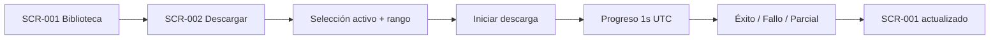
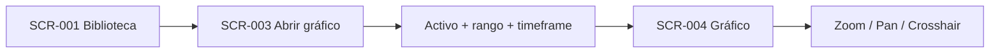
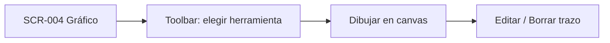
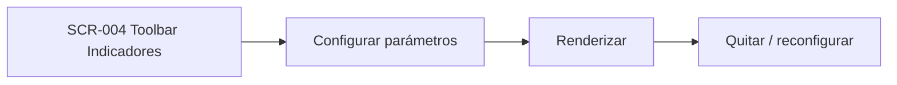
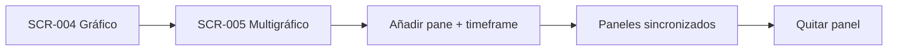
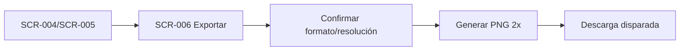

# Journeys

> Todos los journeys se rastrean a ≥ 1 RF de `_docs/requirements.md`.
> Persona única: P-001.

## J-001: Descargar datos nuevos desde Dukascopy

- **Persona:** P-001
- **Objetivo:** Obtener rango histórico confiable (1s UTC) de un activo y tenerlo disponible en la biblioteca.
- **RF cubiertos:** RF-001, RF-002, RF-006 (+ RI-002, feedback visual del estado)
- **Precondiciones:** Backend local corriendo; activo posiblemente parcial en la base.
- **Postcondiciones:** Rango descargado y limpio, registrado en metadatos; biblioteca actualizada sin duplicados.

### Puntos de dolor identificados
- Descarga asíncrona larga (retry/backoff 20 s, R-001): el usuario debe poder seguir navegando mientras corre.
- No saber si un rango ya existe provoca descargas redundantes → el "Historial" de la pantalla debe resolverlo.

### Oportunidades de mejora
- Estado visible de incrementales ("Faltan dic 2025–feb 2026") propuesto automáticamente.

## J-002: Cargar y analizar un activo

- **Persona:** P-001
- **Objetivo:** Ver velas japonesas de un activo con rango y timeframe elegidos.
- **RF cubiertos:** RF-007, RF-008, RF-009, RF-010
- **Precondiciones:** Activo existe en biblioteca local.
- **Postcondiciones:** Gráfico con velas y pan/zoom operativos.

### Puntos de dolor identificados
- Repetir la selección activo+rango+timeframe cada vez (memorizar "última vista" reduciría fricción — out de MVP sin persistencia, RI-003).

### Oportunidades de mejora
- Acciones rápidas de la biblioteca: "Graficar" preselecciona el mejor timeframe por disponibilidad.

## J-003: Dibujar y marcar compra/venta

- **Persona:** P-001
- **Objetivo:** Trazar líneas/rectángulos/Fibonacci y simular entradas/salidas.
- **RF cubiertos:** RF-011, RF-012
- **Precondiciones:** Gráfico cargado (J-002).
- **Postcondiciones:** Trazos visibles en el overlay; dibujos efímeros (RI-003 — no se persisten al cerrar).

### Puntos de dolor identificados
- RI-003 (no persistencia): si el navegador se cierra, se pierde el trabajo → el export (J-006) debe ser accesible en 1 clic.

### Oportunidades de mejora
- Auto-selección de simulador: el marcador compra guarda el precio de la barra bajo el cursor.

## J-004: Aplicar indicadores técnicos

- **Persona:** P-001
- **Objetivo:** Superponer medias móviles configurables, RSI y ATR.
- **RF cubiertos:** RF-013
- **Precondiciones:** Gráfico cargado (J-002).
- **Postcondiciones:** Indicador renderizado con sus parámetros; sobre la serie (MM/ATR) o en panel secundario (RSI).

### Puntos de dolor identificados
- Parámetros por defecto no evidentes → la pantalla de configuración debe mostrar valores sugeridos (MM 20/50/200, RSI 14, ATR 14 por convención).

## J-005: Comparar timeframes sincronizados

- **Persona:** P-001
- **Objetivo:** Ver hasta 3 gráficos del mismo activo en distintos timeframes con crosshair/scroll sincronizados.
- **RF cubiertos:** RF-014
- **Precondiciones:** Activo con datos de 1s (permite resampling a cualquier timeframe).
- **Postcondiciones:** ≤ 3 panes sincronizados del mismo activo.

### Puntos de dolor identificados
- Sincronización requiere consistencia de zona horaria (UTC exclusivo, RNF-004) → el eje temporal debe ser idéntico en los 3 panes.

## J-006: Exportar captura de estrategia

- **Persona:** P-001
- **Objetivo:** Obtener PNG (gráfico + dibujos + indicadores) para verificar/archivar la estrategia.
- **RF cubiertos:** RF-015 (+ RI-003: los dibujos solo se pueden recuperar vía imagen)
- **Precondiciones:** Gráfico con contenido (J-002…J-005).
- **Postcondiciones:** Archivo PNG descargado.

### Puntos de dolor identificados
- **P-2 abierta (plan §7.1):** resolución exacta sin definir → default asumido PNG 2x del viewport, ajustable al cerrar P-2.

### Oportunidades de mejora
- Incluir ticker + timeframe anotados en la imagen (legibilidad de la captura fuera de la app).