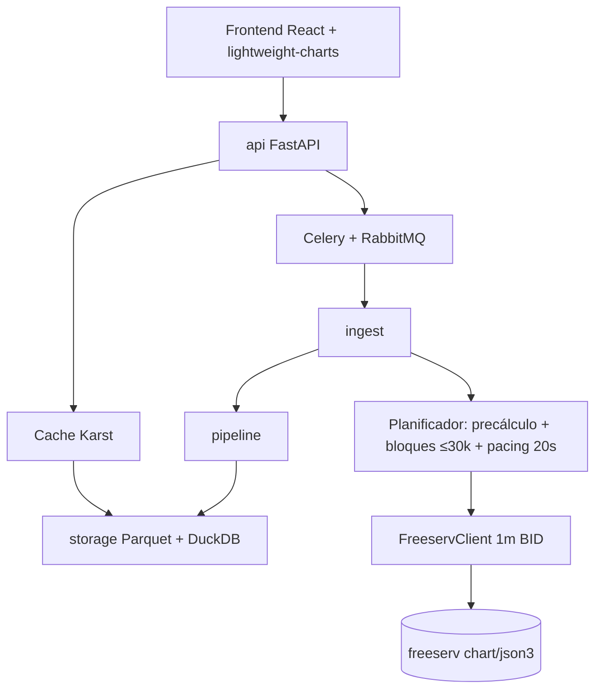
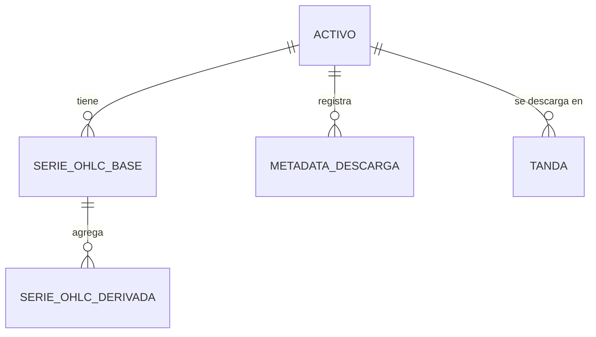
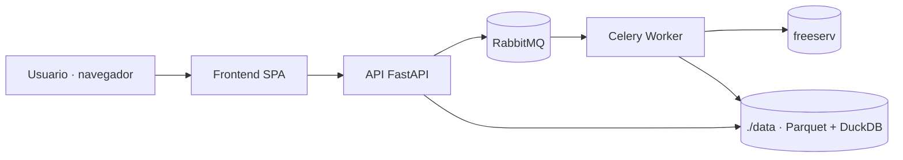
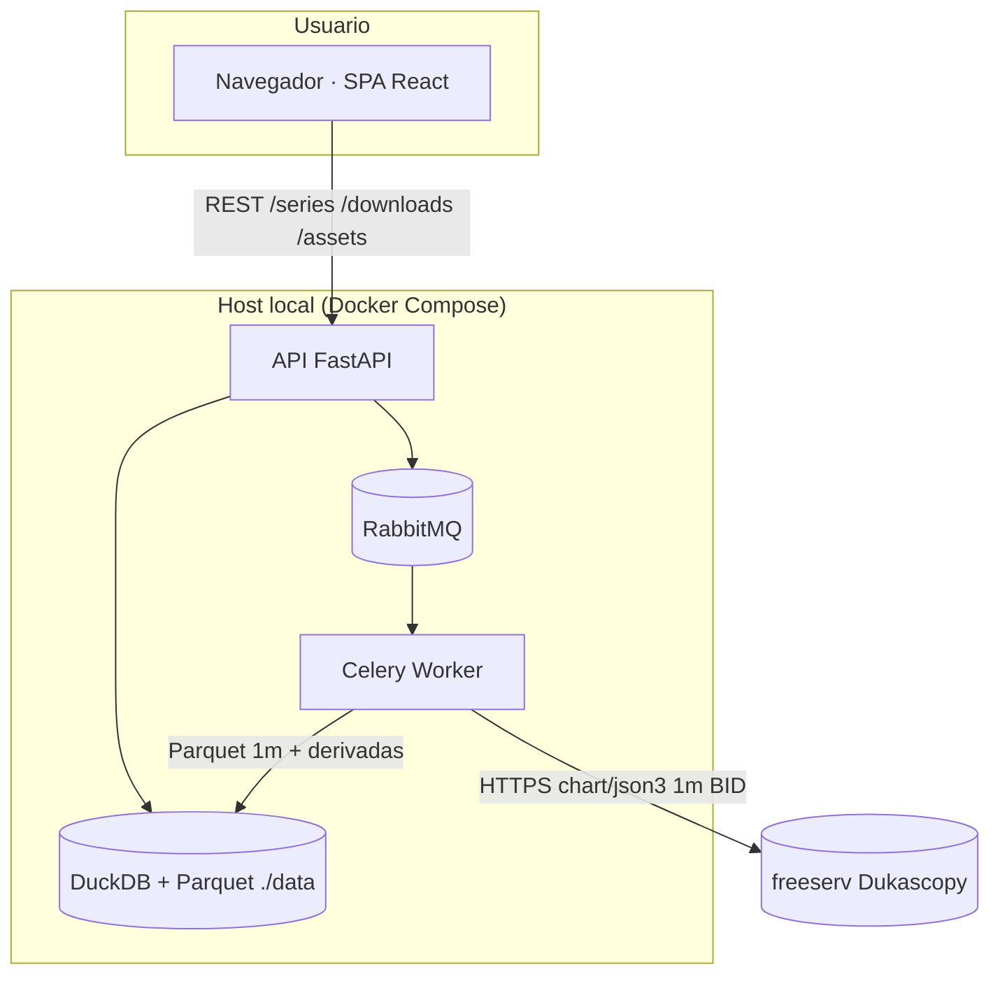

# Arquitectura del Sistema: Optimización de descarga y base 1m (Iteración 02)

> Fuente: `_docs/iterations/02-optimizacion-descarga/plan.md`, `requirements.md`
> Base: `_docs/iterations/01-mvp/architecture.md` (Aprobado)
> Fecha: 2026-09-28
> Estado: Borrador

## 1. Resumen ejecutivo

Se **conserva el monolito modular con worker asíncrono** de 01-mvp y se corrige
únicamente el núcleo de `ingest` y la resolución de la serie. La descarga pasa de
ticks agregados hora a hora a **velas de 1 minuto obtenidas directamente de
freeserv**, paginadas por **bloques de ≤ 30.000 velas** con **precálculo** y
**pacing de 20 s**. La serie canónica pasa de 1 s a **1 m** (BID), reduciendo la
volumetría de ~18M a ~726k velas/activo. Celery se conserva (mínimo riesgo). El
objetivo es 1 año en ≤ 900 s.

## 2. Restricciones que guían el diseño

| Origen | Restricción | Impacto arquitectónico |
|--------|-------------|------------------------|
| API | `limit` máximo 30.000 puntos por petición | Planificador de bloques ≤30k (ADR-013) |
| API | Solo un lado del libro por request (BID/ASK) | Semántica BID puro (ADR-014) |
| Decisión D-3 | Precálculo + pacing 20 s | Reintroduce pacing en `ingest` (ADR-013) |
| Decisión D-4 | Conservar Celery/RabbitMQ | Sin cambio de orquestación (ADR-016) |
| ADR-004 / RF-005 | Parquet + DuckDB obligatorios | `storage` sin cambio de tecnología |
| RNF-003 | Ventana 2 años | Tandas 6–12 m (ADR-015); `ingest.window` sin cambio |
| RNF-007 / RNF-006 | 2 semanas, $0 | Solo lógica en `ingest`; sin dependencias nuevas |
| RNF-004 | UTC exclusivo | `pipeline.normalize` sin cambio |

## 3. Estilo arquitectónico

### Elegido
**Monolito modular con worker asíncrono** — sin cambio respecto a 01-mvp (ADR-001).

### Justificación
- RNF-007 (2 semanas, 1 dev) y RNF-006 ($0): un solo despliegue; el cambio es
  interno a `ingest` + base temporal.
- RF-016 (extensible): las fronteras `ingest`/`pipeline`/`storage`/`api` permiten
  sustituir el transporte sin tocar el resto.
- Esta iteración es un **incremento**, no un rediseño: el estilo se mantiene.

### Alternativas descartadas
| Alternativa | Por qué se descartó |
|-------------|---------------------|
| Microservicios / serverless | RNF-006/007 (coste y plazo); descargas largas incompatibles con serverless |
| Rediseño completo del ingest a un servicio aparte | Superficie de cambio alta; contradice D-4/RNF-007 |

## 4. Vista lógica (módulos y capas)

| Módulo | Responsabilidad | Requisitos que cubre |
|--------|-----------------|----------------------|
| `ingest` | Descarga 1 m por bloques con precálculo/pacing, retry por bloque, tarea Celery | RF-101, RF-102, RF-104, RX-101, RX-001 |
| `ingest.window` | Validación de la ventana de 2 años | RNF-003 |
| `ingest.times` | Normalización a epoch UTC | RNF-004 |
| `pipeline` | Normalización, filtro mercado, resampling desde **1 m** | RF-103, RF-106, RNF-004 |
| `pipeline.persist` / `refresh` | Fusión 1 m + metadatos; regeneración de derivadas | RF-105, RI-102, RF-103 |
| `storage` | Parquet `{symbol}.1m.parquet` + DuckDB, upsert, caché | RF-105, RI-101, RI-102, RI-002, RNF-102 |
| `api` | REST de activos, descargas y series (contrato OHLC) | RF-007, RF-008 (01-mvp) |
| `charting`/`export` (frontend) | Velas, dibujos, indicadores, export | RF-010…015 (01-mvp), RNF-001 |
| `extensibility` | Interfaces y registro de indicadores | RF-016 |

## 5. Vista de datos

### Modelo entidad-relación

| Entidad | Persistencia | Sensibilidad | Volumen estimado | Retención |
|---------|--------------|--------------|------------------|-----------|
| ACTIVO | catálogo en código | pública | ~7 | — |
| SERIE_OHLC_BASE (1 m) | `{symbol}.1m.parquet` | pública | ~726k velas/activo (2 a) | Indefinida local |
| SERIE_OHLC_DERIVADA | `{symbol}.{tf}.parquet` | pública | base / factor TF | Regenerable |
| METADATA_DESCARGA | tabla DuckDB | interna | 1 registro/tanda | Indefinida |
| TANDA | tabla DuckDB / estado Celery | interna | decenas de miles de velas | Indefinida |

Esquema de la serie (RI-101): `time` BIGINT (epoch s UTC) + `open/high/low/close`
numéricos; sin columna de volumen.

## 6. Vista de integración

| Sistema externo | Protocolo | Dirección | Datos intercambiados | Requisito |
|-----------------|-----------|-----------|----------------------|-----------|
| freeserv `chart/json3` | HTTPS/JSONP | Entrada | OHLC 1 m BID, paginado ≤30k | RX-101, ADR-013/014 |
| Celery / RabbitMQ | AMQP | Interna | Tareas de descarga, estado/progreso | RF-104, ADR-016 |
| DuckDB / Parquet | Local | Interna | Series y metadatos | ADR-004 |

## 7. Vista física / despliegue

| Entorno | Propósito | Infraestructura |
|---------|-----------|-----------------|
| Dev | Desarrollo y pruebas | Docker Compose local (ADR-009) |
| Prod | Uso personal del usuario | Docker Compose local (sin staging, RNF-006/007) |

Sin cambio respecto a 01-mvp: servicios `api`, `worker`, `rabbitmq`, `frontend` y
volumen `./data`.

## 8. Stack tecnológico

| Capa | Tecnología | Versión | Justificación | ADR |
|------|-----------|---------|---------------|-----|
| Backend | Python + FastAPI | (existente) | ADR-002 | ADR-002 |
| Descarga | `dukascopy-python` (`INTERVAL_MIN_1`, BID) | >=4, <5 | RF-101, RX-101, RNF-101 | ADR-013, ADR-014 |
| Planificador | Módulo propio en `ingest` | — | RF-102, R-001 | ADR-013 |
| Persistencia | Parquet + DuckDB | (existente) | RF-005, ADR-004 | ADR-004, ADR-012 |
| Cola | Celery + RabbitMQ | (existente) | RF-104, D-4 | ADR-006, ADR-016 |
| Frontend | React + `lightweight-charts` | (existente) | RF-010…014, RNF-008 | ADR-003, ADR-005 |
| Infra | Docker Compose | (existente) | RNF-006/007 | ADR-009 |
| Observabilidad / CI-CD | structlog / GitHub Actions | (existente) | ADR-008/011 | ADR-008, ADR-011 |

**No se añade ninguna dependencia nueva.**

## 9. Atributos de calidad y su cobertura

| RNF | Meta | Componente/Práctica que lo satisface | Cómo se verifica |
|-----|------|--------------------------------------|------------------|
| RNF-101 | Descarga 1 año ≤ 900 s; 2 años ≤ 1800 s | Planificador de bloques + pacing (ADR-013); 1 request/bloque | Benchmark cronometrado de 1 año real |
| RNF-102 | ~726k velas/activo (2 a @ 1 m) | `storage` Parquet + caché (ADR-004/007, ADR-012) | Conteo de filas + consulta de rango |
| RNF-003 | Ventana 2 años | `ingest.window` (sin cambio) | Test de límite de ventana |
| RNF-004 | UTC exclusivo | `pipeline.normalize` + `ingest.times` | Test de esquema (time BIGINT UTC) |
| RNF-005 | Navegadores de escritorio | SPA React (ADR-003) | Smoke de navegador (01-mvp) |
| RNF-006 | Costo $0 | Stack OSS (ADR-008), sin dependencias nuevas | Auditoría de licencias |
| RNF-007 | 2 semanas | Alcance acotado a `ingest`+base | Cierre de iteración |
| RNF-008 | Datos sin hacks para el chart | Contrato `Candle` → `lightweight-charts` | Test de contrato TS/Python |

## 10. Riesgos arquitectónicos

| ID | Riesgo | Impacto | Mitigación |
|----|--------|---------|------------|
| R-001 | 503/timeout de freeserv | Alto | Pacing 20 s + backoff por bloque + tandas |
| R-002 | Huecos por paginación | Alto | Validado (S-2); test de integridad por tanda |
| R-003 | Ruptura por cambio 1 s→1 m | Medio | ADR-012 + actualizar naming, RNF-002, benchmark, UI |
| R-004 | BID vs `mid` | Bajo | ADR-014, documentado |
| R-005 | Corte a mitad de tanda | Medio | Tandas + estado parcial + reanudación (ADR-015) |

## 11. Decisiones registradas (ADRs)

| ADR | Título | Estado |
|-----|--------|--------|
| ADR-001…011 | Arquitectura y decisiones base de 01-mvp | Aceptados |
| ADR-012 | Base temporal canónica de 1 minuto | Aceptado |
| ADR-013 | Paginación por bloques ≤30.000 con precálculo y pacing 20 s | Aceptado |
| ADR-014 | Semántica de precio BID puro | Aceptado |
| ADR-015 | Descarga por tandas de 6–12 meses con progreso y reanudación | Aceptado |
| ADR-016 | Conservar Celery/RabbitMQ para la descarga | Aceptado |

## 12. Diagrama C4 (contenedores)

