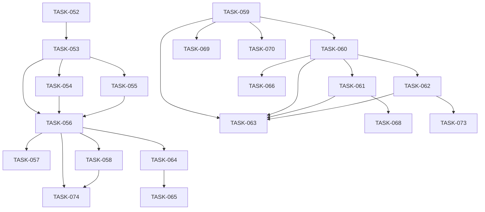

# Backlog del Proyecto: Optimización de descarga y base 1m (Iteración 02)

> Fuente: `_docs/iterations/02-optimizacion-descarga/requirements.md`, `architecture.md`, `adr/ADR-012…016`, `plan.md`
> Fecha: 2026-09-28
> Método de estimación: Tallas relativas XS-XL (XS=1 · S=2 · M=3 · L=5 · XL=8)
> Cadencia: Kanban / flujo continuo (un solo desarrollador)
> Versión: v1 (delta sobre el backlog cerrado de 01-mvp)

## 1. Resumen

| Métrica | Valor |
|---------|-------|
| Épicas de dominio | 4 (EP-005…EP-008) |
| Épicas de UI | 1 (EP-UI-007) |
| Épicas técnicas | 1 (TEC-005) |
| Historias | 5 (HU-020…HU-023, HU-UI-009) |
| Tareas backend | 12 |
| Tareas frontend | 1 |
| Tareas BD | 0 |
| Tareas infra | 0 |
| Tareas test | 8 |
| Tareas docs | 3 |
| Tareas totales | 24 |
| Esfuerzo total | 54 puntos |
| Deuda técnica | 1 (TECH-002) |
| Ruta crítica | TASK-052 → TASK-053 → TASK-056 → TASK-064 → TASK-065 (~15 pts) |

> **Incrementalidad:** se conserva el backlog cerrado de 01-mvp (TASK-001…051,
> TASK-UI-000…060, TECH-001). Esta iteración añade IDs **TASK-052…074** y
> **TASK-UI-061** para no colisionar. El nuevo backlog es el delta necesario para
> viabilizar la descarga y cambiar la base a 1 m.

## 2. Leyenda

- **Prioridad:** M (Must) · S (Should) · C (Could) · W (Won't)
- **Estado:** 📥 Backlog · 🔨 Doing · 👀 Review · ✅ Done · 🔴 Blocked
- **Estimación:** XS=1 · S=2 · M=3 · L=5 · XL=8
- **Capa:** `backend` · `frontend` · `bd` · `infra` · `docs` · `test`

## 3. Épicas de dominio

### EP-005: Descarga optimizada 1m

- **Tipo:** Dominio
- **Requisitos cubiertos:** RF-101, RF-102, RX-101, RX-001, RNF-101
- **Prioridad:** Must
- **Descripción:** Sustituir la descarga de ticks agregada hora a hora por velas
  OHLC de 1 minuto obtenidas directamente de freeserv, paginadas en bloques de
  ≤ 30.000 velas con precálculo y pacing de 20 s.
- **Criterio de aceptación de la épica:** Dado un activo y un rango de hasta 1 año,
  cuando se solicita la descarga, entonces se completa en ≤ 900 s con velas 1 m BID
  sin huecos atribuibles a la paginación.

#### HU-020: Descargar un rango en velas de 1 minuto

- **Requisito origen:** RF-101, RF-102, RX-101
- **Capa:** backend
- **Prioridad:** Must
- **Como** analista técnico **quiero** descargar un rango de datos en velas de 1
  minuto **para** obtener la materia prima del análisis en tiempos razonables.
- **Criterios de aceptación:**
  - Dado un activo y un rango válido, cuando inicio la descarga, entonces obtengo
    velas OHLC de 1 m con timestamps UTC.
  - Dado un rango que excede 30.000 velas, cuando se descarga, entonces se emiten
    bloques ≤ 30.000 con 20 s de espera entre ellos.
- **Tareas:**

| ID | Tarea | Capa | Est. | Deps | DoD | Estado |
|----|-------|------|------|------|-----|--------|
| TASK-052 | Planificador: precálculo de velas por calendario + bloques ≤30k | backend | M | — | Función pura con tests: rango de 1 año produce bloques ≤30k y suma de velas == estimación de calendario | 📥 |
| TASK-053 | `FreeservClient.download_range` con `INTERVAL_MIN_1` + BID (reemplaza `download_hour`) | backend | M | TASK-052 | Dado un bloque, devuelve `list[Candle]` 1 m desde `timestamp,open,high,low,close` sin transformación; test con fetcher simulado | 📥 |
| TASK-054 | Pacing de 20 s entre bloques (sleep inyectable) | backend | S | TASK-053 | Test con sleep falso verifica exactamente N−1 esperas entre N bloques | 📥 |
| TASK-055 | Retry/backoff **por bloque** (adaptar `retry.py`) | backend | S | TASK-053 | Un bloque que falla se reintenta con backoff y no aborta el rango; estado parcial/fallo correcto | 📥 |
| TASK-056 | Integrar planner+client en la tarea Celery (estado/progreso) | backend | M | TASK-053, TASK-054, TASK-055 | E2E de un rango pequeño desde directorio vacío deja Parquet 1 m + metadato y estado `exito` | 📥 |
| TASK-057 | Retirar `iter_hours`/`aggregate_to_ohlc` y tests de ticks | backend | S | TASK-056 | No queda código de ticks en producción; suite verde sin esos tests | 📥 |
| TASK-058 | Test de integridad de paginación (esperadas vs descargadas) | test | M | TASK-056 | Para un rango de prueba, las velas descargadas cubren el calendario sin huecos no explicados (KPI-5) | 📥 |
| TASK-074 | Benchmark cronometrado de descarga de 1 año (≤900 s) | test | M | TASK-056, TASK-058 | Se mide un año real a 1 m y el tiempo es ≤ 900 s (RNF-101); resultado registrado | 📥 |

### EP-006: Base 1m y derivadas

- **Tipo:** Dominio
- **Requisitos cubiertos:** RF-103, RI-101, RI-102, RNF-102
- **Prioridad:** Must
- **Descripción:** Fijar la serie canónica a 1 minuto, persistirla como
  `{symbol}.1m.parquet` y derivar 5 m/15 m/30 m/1 h/4 h/1 d por resampling.
- **Criterio de aceptación de la épica:** Dado un activo descargado a 1 m, cuando
  se consulta cualquier timeframe derivado, entonces la agregación es correcta y el
  esquema es `time` BIGINT UTC + OHLC numérico.

#### HU-021: Serie canónica de 1 minuto

- **Requisito origen:** RF-103, RI-101, RI-102
- **Capa:** backend
- **Prioridad:** Must
- **Como** analista técnico **quiero** que la serie base sea de 1 minuto **para**
  que los timeframes de estudio se deriven sin la resolución innecesaria de 1 s.
- **Criterios de aceptación:**
  - Dado un dataset 1 m, cuando se pide 1 h, entonces la vela agrega exactamente las
    60 velas 1 m correspondientes.
  - Dado un activo almacenado, cuando se revisa el disco, entonces existe
    `{symbol}.1m.parquet` y los derivados `{symbol}.{tf}.parquet`.
- **Tareas:**

| ID | Tarea | Capa | Est. | Deps | DoD | Estado |
|----|-------|------|------|------|-----|--------|
| TASK-059 | `pipeline.resample` origen canónico 1m | backend | S | — | `1m` es identidad; `1h == 60×1m`; fixtures actualizados; tests pipeline verdes | 📥 |
| TASK-060 | `storage` naming `{symbol}.1m.parquet` + validación de base | backend | M | TASK-059 | Archivos se escriben/leen con el naming 1 m; base distinta de `1m` rechazada con error | 📥 |
| TASK-061 | `persist`/`refresh` derivadas desde 1m | backend | M | TASK-060 | Tras el merge 1 m, las series derivadas se regeneran; consulta por TF no recalcula (ADR-007) | 📥 |
| TASK-062 | Ajustar `queries`/API a base 1m | backend | S | TASK-060 | `GET /series` sirve 1 m y derivados desde el Parquet correcto; tests de endpoint verdes | 📥 |
| TASK-063 | Regresión de tests pipeline/storage | test | M | TASK-059, TASK-060, TASK-061, TASK-062 | Suite backend completa verde tras el cambio de base | 📥 |
| TASK-066 | Reescribir `benchmark_parquet.py` a ~726k velas (2 a @ 1 m) | docs | S | TASK-060 | Script corre a ~726k filas, reporta µs/vela y proyección y verifica KPI-4 (0 duplicados); falla si hay duplicados | 📥 |
| TASK-070 | Verificar UTC + contrato OHLC | test | S | TASK-059 | `time` INT64 UTC y OHLC DOUBLE en DuckDB; contrato consumible por el chart sin transformación | 📥 |

### EP-007: Tandas y reanudación

- **Tipo:** Dominio
- **Requisitos cubiertos:** RF-104
- **Prioridad:** Must
- **Descripción:** Ejecutar la descarga por tandas de 6–12 meses con progreso y
  reanudación sobre la cola Celery.
- **Criterio de aceptación de la épica:** Dado un rango mayor a 12 meses, cuando se
  descarga, entonces se ejecuta en tandas, el estado refleja el progreso y una
  tanda interrumpida puede completarse con el rango restante.

#### HU-022: Descargar en tandas y reanudar

- **Requisito origen:** RF-104
- **Capa:** backend
- **Prioridad:** Must
- **Como** analista técnico **quiero** que las descargas largas se dividan en tandas
  reanudables **para** no perder el avance si se interrumpe una descarga.
- **Criterios de aceptación:**
  - Dado un rango de 2 años, cuando se descarga, entonces se ejecuta en 2 tandas de
    ≤ 12 meses cada una.
  - Dada una tanda en estado `parcial`, cuando solicito el rango restante, entonces
    se completa sin duplicar (RF-105).
- **Tareas:**

| ID | Tarea | Capa | Est. | Deps | DoD | Estado |
|----|-------|------|------|------|-----|--------|
| TASK-064 | Descomposición del rango en tandas de 6–12 m | backend | M | TASK-056 | Un rango de 2 años genera 2 tandas; cada tanda reporta bloques completados/total | 📥 |
| TASK-065 | Reanudación por rango restante (estado parcial) | backend | M | TASK-064 | Tras una tanda `parcial`, el complemento se descarga y fusiona sin duplicados | 📥 |
| TASK-071 | Verificar ventana de 2 años intacta | test | XS | — | `validate_request_window` sigue rechazando inicios fuera de 2 años | 📥 |

### EP-008: Integridad incremental y de mercado

- **Tipo:** Dominio
- **Requisitos cubiertos:** RF-105, RF-106, RI-002
- **Prioridad:** Must
- **Descripción:** Garantizar que el cambio de base no rompe la fusión incremental,
  los metadatos ni la exclusión de fines de semana y feriados.
- **Criterio de aceptación de la épica:** Dado un activo con datos, cuando se agrega
  un periodo nuevo, entonces no hay duplicados, queda el metadato y no hay filas en
  periodos sin mercado.
- **Tareas:**

| ID | Tarea | Capa | Est. | Deps | DoD | Estado |
|----|-------|------|------|------|-----|--------|
| TASK-068 | Verificar upsert + metadatos tras cambio de base | test | S | TASK-061 | Merge de un periodo nuevo sobre base existente sin duplicar `time` (KPI-4) y metadato registrado | 📥 |
| TASK-069 | Verificar exclusión de fines de semana/feriados | test | S | TASK-059 | El filtro no deja filas en fines de semana ni feriados con datos 1 m | 📥 |

## 4. Épicas de UI

### EP-UI-007: Ajuste de SCR-002 (nota 1m)

- **Tipo:** UI
- **Pantalla origen:** SCR-002 (Descargar datos)
- **Requisito origen:** RNF-005, RNF-008
- **Prioridad:** Must
- **Justificación:** La pantalla muestra "nota 1 s UTC"; con la base 1 m debe
  actualizarse para no inducir a error. No se añaden funcionalidades.
- **Criterios UX no negociables:**
  - Contraste WCAG AA verificado.
  - Navegación por teclado funcional.
  - No introducir componentes nuevos (reutilizar los existentes).
- **Tareas:**

| ID | Tarea | Capa | Est. | Deps | DoD | Estado |
|----|-------|------|------|------|-----|--------|
| TASK-UI-061 | Nota "1 s UTC" → "1 m UTC" en SCR-002 | frontend | XS | — | El texto refleja la base 1 m; lint/typecheck verdes | 📥 |
| TASK-073 | Smoke de la app tras cambio de base | test | S | TASK-062 | Recorrido de las rutas principales sin errores; `GET /series` 1 m renderiza | 📥 |

## 5. Épicas técnicas (transversales)

### TEC-005: Regresión y artefactos obsoletos

- **Origen:** RNF-003, RNF-004, RNF-006, RNF-007, benchmark
- **Justificación:** El cambio de base 1 s→1 m toca supuestos transversales; hay que
  verificar que no se rompen y actualizar artefactos que asumían 1 s.
- **Tareas:**

| ID | Tarea | Capa | Est. | Deps | DoD | Estado |
|----|-------|------|------|------|-----|--------|
| TASK-067 | Actualizar RNF-002→RNF-102 en docs/referencias | docs | XS | — | No quedan referencias obsoletas a "18M filas @1s" en artefactos de iteración 02 | 📥 |
| TASK-072 | Auditoría de licencias (sin dependencias nuevas) | docs | XS | — | Licencias re-verificadas; denylist copyleft/propietaria = 0 | 📥 |

## 6. Grafo de dependencias

## 7. Ruta crítica

`TASK-052 → TASK-053 → TASK-056 → TASK-064 → TASK-065` (~15 pts).

Rama paralela de base: `TASK-059 → TASK-060 → TASK-061`. La descarga (EP-005/007) y
la base (EP-006) pueden avanzar en paralelo tras TASK-056/060.

## 8. Deuda técnica y tareas sin requisito

| ID | Descripción | Justificación | Prioridad |
|----|-------------|---------------|-----------|
| TECH-002 | Cierre de la iteración 02 (verificación de plazo RNF-007 y alcance) | RNF-007 es una restricción de entrega, no un requisito funcional | M |

## 9. Cobertura UX

No aplica: esta iteración no tiene artefactos UX propios (solo el ajuste de texto de
SCR-002 en EP-UI-007). Sin pantallas ni componentes nuevos.

## 10. Decisiones de planificación

- **DP-1:** La numeración continúa desde 01-mvp (`TASK-052…074`, `TASK-UI-061`) para
  evitar colisiones con el backlog cerrado.
- **DP-2:** Los requisitos heredados (RNF-003/004/005/006/008, RF-105/106, RI-002) se
  cubren con tareas de **verificación/regresión**, dado que el cambio de base puede
  romperlos aunque ya estuvieran implementados.
- **DP-3:** Se mantiene Kanban y 1 desarrollador (plan.md); estimación por tallas.
- **DP-4:** `TASK-074` (benchmark de descarga real) es la evidencia de RNF-101 y
  bloquea el cierre de EP-005.

## 11. Preguntas abiertas

- **PA-1:** ¿La reanudación (TASK-065) se orquesta desde la UI o basta con solicitar
  manualmente el rango restante? (Impacta a EP-UI-007; hoy el MVP ya sugiere el rango
  en estado `parcial`).
