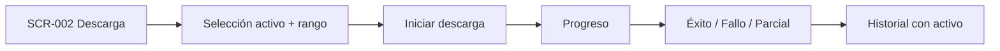
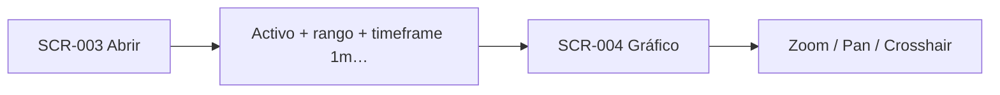
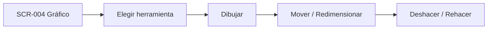
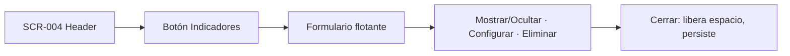
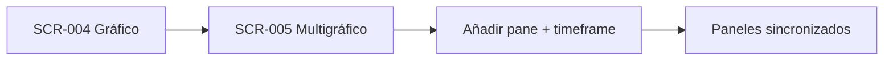
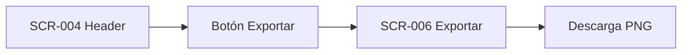
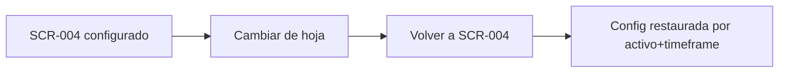

# Journeys — Ciclo 03 (Mejoras UX)

> Todos los journeys se rastrean a ≥ 1 RF de `_docs/requirements.md`.
> Persona única: P-001.
> Base: `_docs/iterations/01-mvp/ux/user-journeys.md` (evolucionado).

## J-001: Descargar datos (con activos nuevos)

- **Persona:** P-001
- **Objetivo:** Obtener un rango histórico de un activo, incluidos los 5 pares nuevos.
- **RF cubiertos:** RF-214, RF-215, RF-216, RF-217 (+ RI-002)
- **Precondiciones:** Backend local corriendo.
- **Postcondiciones:** Rango descargado y registrado, con el activo visible en el historial.

### Puntos de dolor
- No saber si un rango ya existe provoca descargas redundantes.

### Oportunidades de mejora
- La columna **Activo** del historial (RF-215) y el catálogo único (RF-220) permiten
  identificar de un vistazo qué falta.

## J-002: Cargar y analizar un activo

- **Persona:** P-001
- **Objetivo:** Ver velas con rango y timeframe elegidos, con escala legible.
- **RF cubiertos:** RF-218, RF-219, RF-206, RF-207
- **Precondiciones:** Activo con datos en la biblioteca.
- **Postcondiciones:** Gráfico con velas, ejes legibles y pan/zoom operativos.

### Oportunidades de mejora
- Eje X con fecha + hora:minuto (RF-206) y eje Y a 5 decimales a la derecha (RF-207).

## J-003: Dibujar, marcar y **editar**

- **Persona:** P-001
- **Objetivo:** Trazar y **ajustar** líneas/rectángulos/Fibonacci y simular entradas/salidas.
- **RF cubiertos:** RF-208, RF-209, RF-210, RF-212, RF-213
- **Precondiciones:** Gráfico cargado (J-002).
- **Postcondiciones:** Dibujos editados y reversibles (undo/redo), persistidos (J-007).

### Puntos de dolor (resueltos en este ciclo)
- Antes los dibujos solo se podían crear y borrar (RF-212).
- Sin undo/redo, un ajuste erróneo obligaba a recrear (RF-213).

## J-004: Gestionar indicadores **a petición**

- **Persona:** P-001
- **Objetivo:** Agregar/configurar indicadores solo cuando se necesiten, sin ruido.
- **RF cubiertos:** RF-201, RF-202, RF-203
- **Precondiciones:** Gráfico cargado (J-002).
- **Postcondiciones:** Indicadores agregados visibles; panel cerrado libera el espacio.

### Puntos de dolor (resueltos)
- Indicadores por defecto y panel inferior fijo (RF-201/RF-202).

## J-005: Comparar timeframes sincronizados

- **Persona:** P-001
- **Objetivo:** Ver hasta 3 gráficos del mismo activo, sincronizados.
- **RF cubiertos:** RF-202, RF-203, RF-205…RF-212 (heredados por pane)
- **Precondiciones:** Activo con datos.
- **Postcondiciones:** ≤ 3 panes sincronizados.

### Puntos de dolor
- Cada pane debe respetar las mejoras del Gráfico (indicadores a petición, edición, ejes).

## J-006: Exportar captura

- **Persona:** P-001
- **Objetivo:** Obtener PNG (gráfico + dibujos + indicadores) desde el header.
- **RF cubiertos:** RF-205 (+ RI-003 modificado: la config también persiste local)
- **Precondiciones:** Gráfico con contenido.
- **Postcondiciones:** Archivo PNG descargado.

### Oportunidades de mejora
- Export en 1 clic desde el header, junto al botón de indicadores (RF-205).

## J-007: Preservar y restaurar la configuración del gráfico

- **Persona:** P-001
- **Objetivo:** Volver a Gráfico y encontrar activo, timeframe, indicadores y dibujos tal cual.
- **RF cubiertos:** RF-204 (+ RI-201)
- **Precondiciones:** Gráfico configurado.
- **Postcondiciones:** Configuración restaurada tras cambiar de hoja o recargar.

### Puntos de dolor (resueltos)
- Pérdida de contexto al navegar; antes prohibido persistir (RI-003).

### Oportunidades de mejora
- Migración/descarte ante cambio de versión de esquema (R-203).
