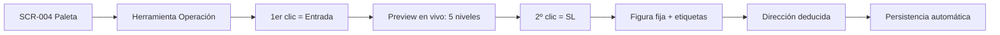
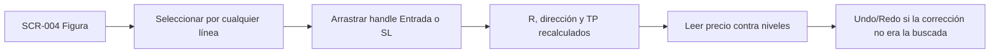
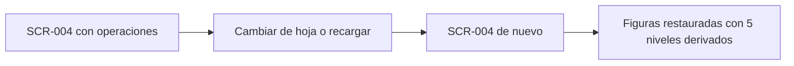

# Journeys — Ciclo 04 (Dibujo Referencia de Operación)

> Todos los journeys se rastrean a ≥1 RF de `_docs/requirements.md`.
> Persona única: P-001. Base: `_docs/iterations/03-mejoras-ux/ux/user-journeys.md`.
> Los journeys J-001, J-002, J-004, J-006, J-007 del ciclo 03 se heredan **sin cambios**.

## J-008: Crear una operación

- **Persona:** P-001
- **Objetivo:** Marcar una operación con Entrada, SL y tres objetivos, **sin calcular nada**,
  viendo el resultado antes de confirmar.
- **RF cubiertos:** RF-301, RF-302, RF-303, RF-304, RF-306, RF-309, RF-310
- **Precondiciones:** Gráfico cargado con datos (J-002); el usuario tiene un par y una
  entrada/salida hipotéticas en mente.
- **Postcondiciones:** Una figura con 5 niveles etiquetados, persistida por activo+timeframe.

### Puntos de dolor que resuelve

- **Calcula a mano** (`plan.md` §1.2-1): los 5 precios salen de dos clics.
- **No sabe en qué sentido va la operación**: el preview del paso D ya muestra los TP al
  lado correcto; si el usuario cruza el precio sobre la Entrada, ve la dirección "voltear".
- **Distinguir un nivel de otro de un vistazo**: el color de rol lo resuelve (rojo = SL,
  blanco = Entrada, verde = TP) sin ambigüedad, y los tres TP comparten verde pero llevan
  nombre distinto (RF-309), así que la información nunca depende solo del color.

### Decisiones de UX en este flujo

| Paso | Decisión | Origen |
|------|----------|--------|
| B | Herramienta "Operación" con icono `◎`, colocada **después de `Φ`** (agrupa figuras multi-nivel) | D-1 |
| C→E | Dirección **automática**: `Entrada > SL` → Compra, `Entrada < SL` → Venta. Sin control manual | RF-302 |
| D | **Preview en vivo**: los 5 niveles y etiquetas siguen al ratón; solo-render, no seleccionable ni persistido | D-4 |
| E | Si `Entrada == SL` → estado `zeroRisk`: se ocultan los TP y la etiqueta indica `R = 0` | D-5 |
| E | `Escape` anula el trazo en curso (comportamiento heredado) | D-6 |
| F | 5 niveles **de extremo a extremo**, etiquetas a la derecha del 2º ancla | D-2 |
| F | Cada nivel con su **color de rol** (SL rojo, Entrada blanco, TP verde); los 3 TP comparten color y se distinguen por etiqueta | RF-309 |

## J-009: Ajustar la operación y leer el desenlace

- **Persona:** P-001
- **Objetivo:** Corregir Entrada o SL después de crear la figura, y leer si se cumplió o se
  invalidó.
- **RF cubiertos:** RF-305, RF-307, RF-308, RF-312
- **Precondiciones:** Operación creada (J-008).
- **Postcondiciones:** Figura con niveles recalculados sobre el nuevo `R`, y reversible.

### Puntos de dolor que resuelve

- **No puede leer el desenlace** (`plan.md` §1.2-2): los niveles están marcados, así que la
  vela que cruza el SL o alcanza un TP es legible directamente (RF-312).
- **Editar no obliga a recrear**: mover/redimensionar conserva la proporción sobre `R`
  (RF-305), con los dos handles y `Shift` heredados, y todo es reversible.

### Puntos de fricción conocidos

- A zoom amplio (~1,2 px/pip) colocar el SL con precisión de pip es difícil: hay que hacer
  zoom antes de crear o ajustar. **No hay ruta por teclado ni entrada numérica** (ver §
  Brechas, abajo).
- Seleccionar arrastrando sobre una línea puede mover la figura entera (R-303); mitigado con
  radio por línea alineado con `fib`.

## J-010: Conservar la operación entre sesiones

- **Persona:** P-001
- **Objetivo:** Volver al gráfico y encontrar la operación **y** sus dibujos anteriores
  intactos.
- **RF cubiertos:** RF-311, RNF-304, RI-301 (+ KPI-305)
- **Precondiciones:** Configuración de gráfico con figuras.
- **Postcondiciones:** Todo restaurado por activo+timeframe; **0 dibujos previos perdidos**.

### Decisión de UX heredada del diseño

- La operación persiste **solo 2 puntos** (Entrada, SL); dirección, `R` y los 5 niveles se
  **recalculan** al deserializar (`RI-301`, ADR-023). Para el usuario es indistinguible: lo
  que ve es la misma figura.
- Garantía visible: ampliar el catálogo de dibujos **no descarta** nada previo
  (ampliación aditiva en v1; `RNF-304`, KPI-305).

## Extensión de journeys heredados

| Journey heredado | Cambio en el ciclo 04 |
|------------------|------------------------|
| **J-003** Dibujar, marcar y editar | La operación se dibuja, edita y deshace **igual** que las demás figuras; `RF-307` y `RF-308` se suman a su cobertura. `RF-209` se **extiende**: la operación usa colores semánticos, no la paleta mate. |
| **J-005** Comparar timeframes sincronizados | Cada pane recibe la herramienta (`RF-310`), sin trabajo adicional: la figura vive en la configuración del activo+timeframe de ese pane. |

## Brechas de UX que este ciclo NO cubre

Se reportan para un ciclo posterior; **ningún RF las pide**, así que no entran en alcance.

1. **Sin ruta por teclado ni entrada numérica para crear una operación.** A zoom de 2 años
   (1,2 px/pip) no se puede colocar el SL en `1.09500` con precisión de pip. El ciclo 03 ya
   asume la manipulación directa como "operación asistida" documentada, pero aquí el
   contenido **son 5 números exactos**, así que la limitación pesa más. Un formulario
   numérico (Entrada + SL) lo resolvería y además daría teclado; requiere requisitos propios.
2. **Sin series de operaciones ni vista de resultados** (`RF-W-301`): el backtesting manual
   sigue siendo "leer el gráfico", sin win rate ni curva de resultados.

## Cobertura RF ↔ journey

| RF | Journey |
|----|---------|
| RF-301, 302, 303, 304, 306, 309, 310 | J-008 |
| RF-305, 307, 308, 312 | J-009 |
| RF-311 | J-010 |
| RNF-301, 302, 305 · RI-301 · RX-301 | Atributos de SCR-004 (ver `interaction-specs.md`) |
| RNF-303, RNF-304 | J-010 (RNF-304) · transversal (RNF-303) |