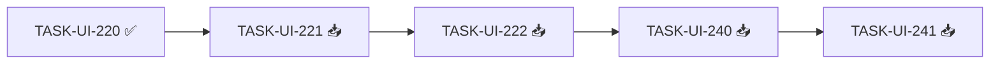

# Estado del Proyecto: Mejoras UX (Ciclo 03)

> Última actualización: 2026-09-29 10:40
> Fuente: `_docs/backlog.md`, `_docs/traceability.md`

## 1. Resumen ejecutivo

| Métrica | Valor | Δ vs última sesión |
|---------|-------|---------------------|
| Tareas totales | 35 | — |
| 📥 Backlog | 33 | -1 |
| 🔨 Doing | 0 | — |
| 👀 Review | 0 | — |
| ✅ Done | 2 | +1 |
| 🔴 Blocked | 0 | — |
| % Completado | 6% | +3% |
| Días sin movimiento | 0 | — |

**Estado general:** 🟢 En curso.

## 2. Tablero Kanban

### 📥 Backlog (33)

| ID | Tarea | Épica | Est. | Deps |
|----|-------|-------|------|------|
| TASK-201 | Catálogo +5 pares en `ASSET_CATALOG` | EP-201 | 3 | — |
| TASK-202 | `instrument_id` de los 5 pares en freeserv | EP-201 | 5 | 201 |
| TASK-203 | Contrato `GET /assets` con catálogo ampliado | EP-201 | 3 | 201 |
| TASK-204 | Consumir `GET /assets` y quitar espejo | EP-201 | 5 | 203 |
| TASK-205 | Retirar `1s` del contrato backend | EP-202 | 2 | — |
| TASK-206 | Retirar `1s` del espejo TS | EP-202 | 2 | 205 |
| TASK-UI-201 | Accesibilidad base | EP-UI-200 | 2 | UI-200 |
| TASK-UI-210 | `ChartHeader` | EP-UI-201 | 3 | UI-200 |
| TASK-UI-211 | Sin indicadores por defecto | EP-UI-201 | 2 | UI-210 |
| TASK-UI-212 | `IndicatorForm` flotante | EP-UI-201 | 5 | UI-210, UI-201 |
| TASK-UI-213 | Eliminar `IndicatorPanel` inferior | EP-UI-201 | 2 | UI-212 |
| TASK-UI-214 | Tests de estados/a11y del formulario | EP-UI-201 | 2 | UI-212 |
| TASK-UI-221 | Geometría editable + handles | EP-UI-202 | 8 | UI-220 |
| TASK-UI-222 | Command stack undo/redo | EP-UI-202 | 5 | UI-221 |
| TASK-UI-223 | Marcadores 10 pips + Shift H/V | EP-UI-202 | 5 | UI-220 |
| TASK-UI-224 | Tests de edición + profiling 60 FPS | EP-UI-202 | 3 | UI-222, UI-223 |
| TASK-UI-230 | Ejes X `{día} {HH:mm}` / Y 5 dec. derecha | EP-UI-203 | 5 | UI-200 |
| TASK-UI-231 | Gráfico fullscreen (H+V) | EP-UI-203 | 3 | UI-213 |
| TASK-UI-232 | Export desde el header | EP-UI-203 | 3 | UI-210 |
| TASK-UI-240 | `state/chart-config` localStorage versionado | EP-UI-204 | 5 | UI-212, UI-220 |
| TASK-UI-241 | Guardar/restaurar config | EP-UI-204 | 5 | UI-240 |
| TASK-UI-242 | Tests round-trip + migración | EP-UI-204 | 3 | UI-240 |
| TASK-UI-250 | Centrar Descarga | EP-UI-205 | 2 | UI-200 |
| TASK-UI-251 | Columna Activo en historial | EP-UI-205 | 3 | UI-250 |
| TASK-UI-252 | Selector de activos desde `GET /assets` | EP-UI-205 | 3 | 204 |
| TASK-UI-260 | Centrar Abrir | EP-UI-206 | 2 | UI-200 |
| TASK-UI-261 | Timeframe sin `1s` en Abrir | EP-UI-206 | 2 | 206, UI-260 |
| TASK-UI-270 | Biblioteca desde `GET /assets` | EP-UI-207 | 5 | 204, UI-200 |
| TASK-UI-280 | Multigráfico hereda mejoras | EP-UI-208 | 5 | UI-212, UI-221, UI-230 |
| TASK-TEC-210 | Suites sin regresiones | TEC-201 | 3 | — |
| TASK-TEC-211 | axe-core + teclado por pantalla | TEC-201 | 3 | UI-200 |
| TASK-TEC-212 | Profiling 60 FPS global | TEC-201 | 2 | UI-224 |
| TASK-TEC-213 | Documentación de cierre | TEC-201 | 2 | — |

### 🔨 Doing (0)

Sin tareas.

### 👀 Review (0)

Sin tareas.

### ✅ Done (2)

| ID | Tarea | Épica | Completada | Prueba |
|----|-------|-------|------------|--------|
| TASK-UI-200 | Tokens del design system (dibujos, popover, ejes, sombras, íconos) | EP-UI-200 | 2026-09-29 | `frontend/src/styles/__tests__/tokens.test.ts` · eslint/tsc OK |
| TASK-UI-220 | Modelo de dibujo + serialización + paleta mate | EP-UI-202 | 2026-09-29 | `frontend/src/charting/__tests__/drawings.test.ts` · 301 tests · cobertura 100% |

### 🔴 Blocked (0)

Sin tareas.

## 3. Ruta crítica — estado

**Avance de ruta crítica:** 1/5 tareas (20%). **ETA:** sin datos (primer tramo completado).
Nota: `TASK-UI-221` (geometría editable + handles) es ahora la cabeza de la ruta crítica y está desbloqueada.

## 4. Métricas

### 4.1 Velocidad (si hay histórico)

Sin histórico (no hay tareas Done).

### 4.2 Burn-down (si hay datos)

Sin datos.

### 4.3 Lead time / Cycle time

- Lead time promedio: sin datos.
- Cycle time promedio: sin datos.

## 5. Bloqueos activos

Ninguno.

## 6. Alertas

### 🔴 Críticas

- Ninguna.

### 🟡 Advertencias

- `TASK-TEC-210/211/212` (verificación final) deben ejecutarse al cierre; vigilar que no se omitan.

### 🟢 Informativas

- Backlog inicializado: 35 tareas, 121 puntos, 6/6 pantallas cubiertas.

## 7. Trazabilidad — salud

| Requisito | Tareas | Done | Cobertura |
|-----------|--------|------|-----------|
| RF-201 | 2 | 0 | 0% |
| RF-202 | 2 | 0 | 0% |
| RF-203 | 2 | 0 | 0% |
| RF-204 | 2 | 0 | 0% |
| RF-205 | 2 | 0 | 0% |
| RF-206 | 1 | 0 | 0% |
| RF-207 | 1 | 0 | 0% |
| RF-208 | 1 | 0 | 0% |
| RF-209 | 1 | 0 | 0% |
| RF-210 | 1 | 0 | 0% |
| RF-211 | 1 | 0 | 0% |
| RF-212 | 1 | 0 | 0% |
| RF-213 | 1 | 0 | 0% |
| RF-214 | 1 | 0 | 0% |
| RF-215 | 1 | 0 | 0% |
| RF-216 | 2 | 0 | 0% |
| RF-217 | 2 | 0 | 0% |
| RF-218 | 1 | 0 | 0% |
| RF-219 | 3 | 0 | 0% |
| RF-220 | 2 | 0 | 0% |
| RNF-201 | 3 | 0 | 0% |
| RNF-202 | 2 (+TEC-212) | 0 | 0% |
| RNF-203 | 1 | 0 | 0% |
| RNF-204 | 1 | 0 | 0% |
| RNF-205 | 2 | 0 | 0% |
| RI-201 | 3 | 0 | 0% |
| RI-202 | 2 | 0 | 0% |
| RX-201 | 1 | 0 | 0% |
| RX-202 | 2 | 0 | 0% |

**Requisitos sin tareas:** ninguno ✅ · **Requisitos 100% Done:** 0/29.

## 8. Próximas acciones sugeridas

1. Continuar la ruta crítica: `TASK-UI-221` (geometría editable + handles), ya desbloqueada por `TASK-UI-220`.
2. Avanzar en paralelo tareas sin dependencias: `TASK-201` (catálogo), `TASK-205` (contrato backend), `TASK-UI-201` (a11y base).
3. Reservar `TASK-TEC-210/211/212` para el cierre.

## 9. Historial de cambios (append-only)

| Fecha | Tarea | Transición | Motivo |
|-------|-------|-----------|--------|
| 2026-09-29 | — (todas) | — → 📥 Backlog | Inicialización de `status.md` desde `backlog.md` |
| 2026-09-29 | TASK-UI-200 | 📥 → ✅ Done | Tokens implementados y verificados (contraste + 289 tests, eslint/tsc OK); autorización explícita |
| 2026-09-29 | TASK-UI-220 | 📥 → ✅ Done | Modelo + serialización + paleta verificados (12 tests, cobertura 100% líneas); autorización explícita |
