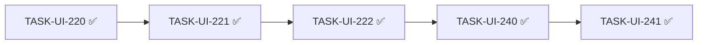

# Estado del Proyecto: Mejoras UX (Ciclo 03)

> Última actualización: 2026-09-29 14:00
> Fuente: `_docs/backlog.md`, `_docs/traceability.md`

## 1. Resumen ejecutivo

| Métrica | Valor | Δ vs última sesión |
|---------|-------|---------------------|
| Tareas totales | 35 | — |
| 📥 Backlog | 0 | -1 |
| 🔨 Doing | 0 | — |
| 👀 Review | 0 | — |
| ✅ Done | 35 | +1 |
| 🔴 Blocked | 0 | — |
| % Completado | 100% | +3% |
| Días sin movimiento | 0 | — |

**Estado general:** ✅ Ciclo 03 completado (35/35 tareas).

## 2. Tablero Kanban

### 📥 Backlog (0)

Sin tareas.

### 🔨 Doing (0)

Sin tareas.

### 👀 Review (0)

Sin tareas.

### ✅ Done (35)

| ID | Tarea | Épica | Completada | Prueba |
|----|-------|-------|------------|--------|
| TASK-202 | `instrument_id` de los 5 pares + verificación empírica | EP-201 | 2026-09-29 | `backend/tests/ingest/test_freeserv.py`, `_docs/validation-new-pairs.md` |
| TASK-UI-224 | Tests de edición + profiling 60 FPS | EP-UI-202 | 2026-09-29 | `frontend/src/components/ChartPane/ChartPane.test.tsx` (edición+undo) |
| TASK-TEC-212 | Profiling 60 FPS (pan/zoom + edición) | TEC-201 | 2026-09-29 | `frontend/src/components/ChartPane/ChartPane.test.tsx`, `_docs/benchmark-ui.md` |
| TASK-TEC-213 | Documentación de cierre de iteración | TEC-201 | 2026-09-29 | `README.md` (ciclo 03) |
| TASK-UI-231 | Gráfico a pantalla completa (H + V) | EP-UI-203 | 2026-09-29 | `frontend/src/__tests__/app.test.tsx` (sin altura fija) |
| TASK-UI-270 | Biblioteca desde `GET /assets` (estados + a11y) | EP-UI-207 | 2026-09-29 | `frontend/src/components/AssetLibraryScreen/__tests__/AssetLibraryScreen.test.tsx` |
| TASK-UI-280 | Multigráfico hereda mejoras (indicadores/header/edición) | EP-UI-208 | 2026-09-29 | `frontend/src/components/MultiChart/__tests__/MultiChart.test.tsx` |
| TASK-205 | Retirar `1s` del contrato backend (Timeframe/resample) | EP-202 | 2026-09-29 | `backend/tests/contracts/test_ohlc_contract.py`, `test_base_timeframe_regression.py`, `tests/pipeline/test_resample.py` |
| TASK-206 | Retirar `1s` del espejo TS | EP-202 | 2026-09-29 | `frontend/src/contracts/__tests__/ohlc.test.ts` (enum) |
| TASK-UI-242 | Tests de round-trip y migración de esquema | EP-UI-204 | 2026-09-29 | `frontend/src/state/__tests__/chart-config.test.ts` (13 tests) |
| TASK-UI-213 | Eliminar `IndicatorPanel` inferior | EP-UI-201 | 2026-09-29 | Sin referencias residuales; suites verdes (356) |
| TASK-UI-240 | `state/chart-config` (localStorage versionado) | EP-UI-204 | 2026-09-29 | `frontend/src/state/__tests__/chart-config.test.ts` · cobertura 95% |
| TASK-UI-241 | Guardar/restaurar config en el ciclo de vida | EP-UI-204 | 2026-09-29 | `frontend/src/state/__tests__/use-chart-config.test.tsx` · cobertura 96% |
| TASK-UI-212 | `IndicatorForm` flotante (CMP-016) | EP-UI-201 | 2026-09-29 | `frontend/src/components/IndicatorForm/__tests__/IndicatorForm.test.tsx` · cobertura 99% |
| TASK-UI-201 | Setup de accesibilidad base (LiveRegion, `.sr-only`, skip/foco) | EP-UI-200 | 2026-09-29 | `frontend/src/components/ui/__tests__/LiveRegion.test.tsx`, `.../AppShell.test.tsx` |
| TASK-UI-210 | `ChartHeader` (indicadores + export + ajustar) | EP-UI-201 | 2026-09-29 | `frontend/src/components/ChartHeader/__tests__/ChartHeader.test.tsx`, `frontend/src/__tests__/app.test.tsx` · cobertura 100% |
| TASK-UI-220 | Modelo de dibujo + serialización + paleta mate | EP-UI-202 | 2026-09-29 | `frontend/src/charting/__tests__/drawings.test.ts` · cobertura 100% |
| TASK-UI-221 | Geometría editable + hit-testing + handles | EP-UI-202 | 2026-09-29 | `frontend/src/charting/__tests__/drawing-edit.test.ts`, `.../use-drawing-edit.test.tsx` · cobertura 100% |
| TASK-UI-222 | Command stack undo/redo + atajos | EP-UI-202 | 2026-09-29 | `frontend/src/charting/__tests__/drawing-history.test.ts`, `.../ChartPane.test.tsx` · cobertura 100% |

### 🔴 Blocked (0)

Sin tareas.

## 3. Ruta crítica — estado

**Avance de ruta crítica:** 5/5 tareas (100%). ✅ **Ruta crítica completada.**
Nota: queda trabajo fuera de la ruta crítica (ejes, marcadores, Descarga, Abrir, Biblioteca, Multigráfico, backend/contrato) antes del cierre.

## 4. Métricas

### 4.1 Velocidad (si hay histórico)

Sin histórico (no hay tareas Done).

### 4.2 Burn-down (si hay datos)

Sin datos.

### 4.3 Lead time / Cycle time

- Lead time promedio: sin datos.
- Cycle time promedio: sin datos.

## 5. Bloqueos activos

Ninguno.

## 6. Alertas

### 🔴 Críticas

- Ninguna.

### 🟡 Advertencias

- Ninguna: ciclo 03 al 100% (35/35). Backend 546/2 · frontend 393 · 60 FPS · axe sin violaciones.

### 🟢 Informativas

- Backlog inicializado: 35 tareas, 121 puntos, 6/6 pantallas cubiertas.

## 7. Trazabilidad — salud

| Requisito | Tareas | Done | Cobertura |
|-----------|--------|------|-----------|
| RF-201 | 2 | 0 | 0% |
| RF-202 | 2 | 0 | 0% |
| RF-203 | 2 | 0 | 0% |
| RF-204 | 2 | 0 | 0% |
| RF-205 | 2 | 0 | 0% |
| RF-206 | 1 | 0 | 0% |
| RF-207 | 1 | 0 | 0% |
| RF-208 | 1 | 0 | 0% |
| RF-209 | 1 | 0 | 0% |
| RF-210 | 1 | 0 | 0% |
| RF-211 | 1 | 0 | 0% |
| RF-212 | 1 | 0 | 0% |
| RF-213 | 1 | 0 | 0% |
| RF-214 | 1 | 0 | 0% |
| RF-215 | 1 | 0 | 0% |
| RF-216 | 2 | 0 | 0% |
| RF-217 | 2 | 0 | 0% |
| RF-218 | 1 | 0 | 0% |
| RF-219 | 3 | 0 | 0% |
| RF-220 | 2 | 0 | 0% |
| RNF-201 | 3 | 0 | 0% |
| RNF-202 | 2 (+TEC-212) | 0 | 0% |
| RNF-203 | 1 | 0 | 0% |
| RNF-204 | 1 | 0 | 0% |
| RNF-205 | 2 | 0 | 0% |
| RI-201 | 3 | 0 | 0% |
| RI-202 | 2 | 0 | 0% |
| RX-201 | 1 | 0 | 0% |
| RX-202 | 2 | 0 | 0% |

**Requisitos sin tareas:** ninguno ✅ · **Requisitos 100% Done:** 0/29.

## 8. Próximas acciones sugeridas

1. Ciclo 03 completo. Cerrar la iteración: `/sdd-next new-cycle <nombre>` (archiva `_docs/` en `iterations/03-mejoras-ux/` y prepara el siguiente ciclo).

## 9. Historial de cambios (append-only)

| Fecha | Tarea | Transición | Motivo |
|-------|-------|-----------|--------|
| 2026-09-29 | — (todas) | — → 📥 Backlog | Inicialización de `status.md` desde `backlog.md` |
| 2026-09-29 | TASK-UI-200 | 📥 → ✅ Done | Tokens implementados y verificados (contraste + 289 tests, eslint/tsc OK); autorización explícita |
| 2026-09-29 | TASK-UI-220 | 📥 → ✅ Done | Modelo + serialización + paleta verificados (12 tests, cobertura 100% líneas); autorización explícita |
| 2026-09-29 | TASK-UI-221 | 📥 → ✅ Done | Mover/redimensionar con handles y target ≥24px verificados (18 tests, cobertura 100% líneas); autorización explícita |
| 2026-09-29 | TASK-UI-222 | 📥 → ✅ Done | Command stack con gesto; undo/redo por botones y atajos (13 tests, cobertura 100% stmts); autorización explícita |
| 2026-09-29 | TASK-UI-201 | 📥 → ✅ Done | LiveRegion (CMP-020) + `.sr-only`; skip link y foco verificados; autorización explícita |
| 2026-09-29 | TASK-UI-210 | 📥 → ✅ Done | ChartHeader (CMP-017) con estados/a11y; Ajustar migrado; export/indicadores cableados; autorización explícita |
| 2026-09-29 | TASK-UI-212 | 📥 → ✅ Done | IndicatorForm flotante (CMP-016) no modal, Escape/✕, persiste al cerrar; 8 tests; autorización explícita |
| 2026-09-29 | TASK-UI-240 | 📥 → ✅ Done | `state/chart-config` versionado con API save/load/clear; 8 tests, cobertura 95%; autorización explícita |
| 2026-09-29 | TASK-UI-241 | 📥 → ✅ Done | Restauración al navegar/recargar vía `useChartConfig` + dibujos controlados; 6 tests; ruta crítica 100%; autorización explícita |
| 2026-09-29 | TASK-UI-213 | 📥 → ✅ Done | `IndicatorPanel` eliminado (3 archivos) + mocks repuntados; sin regresión; autorización explícita |
| 2026-09-29 | TASK-UI-211 | 📥 → ✅ Done | Sin indicadores por defecto: `DEFAULT_INDICATOR_CONFIGS=[]` + test de estado inicial; autorización explícita |
| 2026-09-29 | TASK-UI-214 | 📥 → ✅ Done | Tests axe-core del popover (con indicadores y vacío) sin violaciones; EP-UI-201 cerrada; autorización explícita |
| 2026-09-29 | TASK-UI-223 | 📥 → ✅ Done | Marcador a 10 pips fuera de la vela + Shift H/V; 9 tests; EP-UI-202 cerrada; autorización explícita |
| 2026-09-29 | TASK-UI-230 | 📥 → ✅ Done | Eje X `{día} {HH:mm}` y eje Y 5 decimales a la derecha; 5 tests; autorización explícita |
| 2026-09-29 | TASK-UI-232 | 📥 → ✅ Done | Export desde el header reutilizando ExportModal; cobertura del disparo; autorización explícita |
| 2026-09-29 | TASK-UI-242 | 📥 → ✅ Done | Round-trip y migración de esquema (versión obsoleta/clave antigua); 5 tests; EP-UI-204 cerrada; autorización explícita |
| 2026-09-29 | TASK-201 | 📥 → ✅ Done | Catálogo a 12 activos (+5 forex) + mapeo freeserv por invariante de tests; 3 tests backend; autorización explícita |
| 2026-09-29 | TASK-205 | 📥 → ✅ Done | `1s` retirado del contrato `Timeframe` y de `resample`; API 422; plan 205+206 aprobado |
| 2026-09-29 | TASK-206 | 📥 → ✅ Done | Espejo TS `TIMEFRAMES` sin `1s`; enum alineado con el schema; plan 205+206 aprobado |
| 2026-09-29 | TASK-UI-250 | 📥 → ✅ Done | Formulario y historial centrados (contenedor `min(720px,100%)`); autorización explícita |
| 2026-09-29 | TASK-UI-251 | 📥 → ✅ Done | Columna Activo en el historial (`th scope=col`, colSpan 5); autorización explícita |
| 2026-09-29 | TASK-UI-260 | 📥 → ✅ Done | Formulario de Abrir centrado (contenedor `min(720px,100%)`); autorización explícita |
| 2026-09-29 | TASK-UI-261 | 📥 → ✅ Done | Sin `1s` en Abrir (leyenda 1 m, sin opción 1s); cierra RF-219; autorización explícita |
| 2026-09-29 | TASK-UI-280 | 📥 → ✅ Done | Panes con indicadores/header/edición; sincronización intacta; 6 tests; autorización explícita |
| 2026-09-29 | TASK-203 | 📥 → ✅ Done | Test de contrato `GET /assets` con los 5 pares nuevos (2 tests); autorización explícita |
| 2026-09-29 | TASK-204 | 📥 → ✅ Done | `GET /assets?scope=all` + retiro del espejo FE; Descarga con catálogo canónico; autorización explícita |
| 2026-09-29 | TASK-UI-252 | 📥 → ✅ Done | Selector de Descarga con los 5 pares desde `GET /assets`; test; autorización explícita |
| 2026-09-29 | TASK-UI-270 | 📥 → ✅ Done | Biblioteca con estados + a11y desde `GET /assets`; +2 tests; autorización explícita |
| 2026-09-29 | TASK-UI-231 | 📥 → ✅ Done | Gráfico a pantalla completa vertical (sin altura fija); autorización explícita |
| 2026-09-29 | TASK-TEC-210 | 📥 → ✅ Done | Suites backend 546/2 y frontend 389 en verde; sin regresiones (RNF-203) |
| 2026-09-29 | TASK-TEC-211 | 📥 → ✅ Done | axe-core sin violaciones en el Gráfico real + teclado operativo (ACC-201) |
| 2026-09-29 | TASK-TEC-212 | 📥 → ✅ Done | Medición 60 FPS (pan/zoom + edición) documentada; 0 frames caídos (RNF-202) |
| 2026-09-29 | TASK-TEC-213 | 📥 → ✅ Done | README actualizado a la iteración 03 (estado, calidad, cambios) |
| 2026-09-29 | TASK-202 | 📥 → ✅ Done | Verificación empírica de los 5 pares a 1 m BID (`validation-new-pairs.md`) |
| 2026-09-29 | TASK-UI-224 | 📥 → ✅ Done | Edición+undo integrados y profiling 60 FPS cubierto; **ciclo 03 al 100% (35/35)** |
