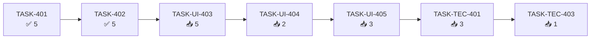

# Estado del Proyecto: fxtrad

> Última actualización: 2026-10-06
> Ciclo actual: **05** — `mejoras-ux-grafico`
> Fuente: `_docs/backlog.md`, `_docs/traceability.md`

## 1. Resumen ejecutivo

| Métrica | Valor | Δ vs estado anterior |
|---------|-------|----------------------|
| Tareas totales | **26** | +24 |
| 📥 Backlog | **23** | +21 |
| 🔨 Doing | 0 | 0 |
| 👀 Review | 0 | 0 |
| ✅ Done | **3** | +3 |
| 🔴 Blocked | 0 | 0 |
| % Completado | **12 %** | — |
| Esfuerzo planificado | **76 pts** | — |
| Ruta crítica | **2/7 · 24 pts** | — |
| Historias aceptadas | **0/9** | — |
| Días sin movimiento | 0 | — |

**Estado general:** 🟢 **Ciclo 05 en ejecución.** 3/26 tareas cerradas (`TASK-401`, `TASK-402`,
`TASK-UI-402`); la ruta crítica avanza 2/7.

El ciclo 04 quedó **cerrado y archivado** en `_docs/iterations/04-dibujo-referencia-operacion/`
(20/20 tareas · 56/56 pts · 19/19 requisitos propios 🟢 · CI en verde).

## 2. Tablero Kanban

### 📥 Backlog (23)

| ID | Tarea | Épica | Prioridad | Est. | Deps |
|----|-------|-------|-----------|------|------|
| TASK-403 | Tests de migración y de contrato v2 | EP-401 | **Must** | 3 | TASK-402 |
| TASK-404 | Resolución de la selección (URL > persistido > defecto) | EP-402 | **Must** | 3 | TASK-401 |
| TASK-405 | Tests de precedencia y de ida y vuelta | EP-402 | **Must** | 2 | TASK-404 |
| TASK-UI-400 | Tokens: `color-draw-line` `#7D8590` + `AXIS_TOKENS` en dos filas | EP-UI-400 | Should | 2 | — |
| TASK-UI-401 | Tests de contraste y de formato del eje | EP-UI-400 | Should | 2 | TASK-UI-400 |
| TASK-UI-403 | Integración del selector + estados `switching-tf`/`tf-ready`/`tf-error` | EP-UI-401 | **Must** | 5 | TASK-UI-402, TASK-402, TASK-404 |
| TASK-UI-404 | Indicadores del activo recalculados por TF | EP-UI-401 | **Must** | 2 | TASK-UI-403 |
| TASK-UI-405 | Tests de la épica de escala + frame budget | EP-UI-401 | **Must** | 3 | TASK-UI-404 |
| TASK-UI-406 | Render del eje X en dos filas | EP-UI-402 | Should | 3 | TASK-UI-400 |
| TASK-UI-407 | Tests del eje | EP-UI-402 | Should | 2 | TASK-UI-406 |
| TASK-UI-408 | `CMP-024 CandleContextMenu` | EP-UI-403 | Should | 5 | — |
| TASK-UI-409 | Tests y accesibilidad del menú contextual | EP-UI-403 | Should | 3 | TASK-UI-408 |
| TASK-UI-410 | `CMP-025 OperationNumericFields` | EP-UI-404 | Should | 5 | TASK-401 |
| TASK-UI-411 | Integración con command stack y `LiveRegion` | EP-UI-404 | Should | 3 | TASK-UI-410 |
| TASK-UI-412 | Tests del popover numérico | EP-UI-404 | Should | 3 | TASK-UI-411 |
| TASK-UI-413 | Diagnóstico y corrección de la condición de cobertura | EP-UI-405 | **Must** | 2 | — |
| TASK-UI-414 | Tests de borde de la cobertura | EP-UI-405 | **Must** | 2 | TASK-UI-413 |
| TASK-UI-415 | Retirada de Multigráfico (ruta, pantalla, `chart-sync`, props `sync`) | EP-UI-406 | Should | 3 | — |
| TASK-UI-416 | Limpieza de tests de la retirada | EP-UI-406 | Should | 2 | TASK-UI-415 |
| TASK-UI-417 | Evaluación de `Exportar` con decisión documentada | EP-UI-406 | Could | 2 | — |
| TASK-TEC-401 | Suite completa + medición del cambio de TF + gate de calidad | EP-TEC-400 | **Must** | 3 | TASK-UI-405, TASK-UI-412, TASK-UI-414, TASK-UI-416 |
| TASK-TEC-402 | Accesibilidad (axe + teclado) de los componentes nuevos | EP-TEC-400 | **Must** | 2 | TASK-UI-409, TASK-UI-412 |
| TASK-TEC-403 | Verificación de «sin dependencias nuevas» | EP-TEC-400 | **Must** | 1 | TASK-TEC-401 |

### 🔨 Doing (0)

Ninguna.

### 👀 Review (0)

Ninguna.

### ✅ Done (1)

| ID | Tarea | Épica | Est. | Cerrada | Prueba |
|----|-------|-------|------|---------|--------|
| TASK-401 | Contrato único del documento v2 por activo (clave sin TF, `selection`, `charting/` cede el contrato) | EP-401 | 5 | 2026-10-06 | `state/__tests__/chart-config.test.ts` (17) + `state/__tests__/use-chart-config.test.tsx` (8) + `charting/__tests__/drawings.test.ts` (7) |
| TASK-402 | Migración v1→v2 pura y aditiva (unión deduplicada por `id`, indicadores del TF preferido, sin borrar v1) | EP-401 | 5 | 2026-10-06 | `state/__tests__/migrate-chart-config.test.ts` (12) + `state/__tests__/chart-config.test.ts` (22, incluye el cableado en `load`) |
| TASK-UI-402 | `CMP-023 TimeframeSelector` (radiogroup, roving tabindex, flechas y `Home`/`End`, `disabled`) | EP-UI-401 | 3 | 2026-10-06 | `components/TimeframeSelector/__tests__/TimeframeSelector.test.tsx` (8) |

### 🔴 Blocked (0)

Ninguna.

## 3. Ruta crítica

**Avance de ruta crítica:** **2/7 · 24 pts.** El tramo que domina el ciclo es
`TASK-401 → TASK-402 → TASK-UI-403` (tres tareas de 5 puntos encadenadas: contrato v2, migración e
integración del cambio de escala).

**Pueden empezar en paralelo** (sin dependencias): `TASK-UI-400`, `TASK-UI-408`,
`TASK-UI-413`, `TASK-UI-415` y `TASK-UI-417`.

## 4. Métricas

### 4.1 Velocidad

| Ciclo | Completadas | Esfuerzo |
|-------|-------------|----------|
| 03 — Mejoras UX | 35 | 121 pts |
| 04 — Dibujo Referencia de Operación | 20 | 56 pts |
| **05 — planificado** | **0/26** | **76 pts** |

### 4.2 Burn-down

No aplica: el ciclo no ha empezado (0 tareas en 🔨).

### 4.3 Lead time / cycle time

No medidos. Se registrarán con el primer cierre de tarea del ciclo.

## 5. Bloqueos activos

Ninguno.

## 6. Alertas

### 🔴 Críticas

Ninguna.

### 🟡 Advertencias

- **El ciclo planifica 76 pts frente a los 56 del ciclo 04.** Si el plazo de 2 semanas (RNF-007)
  aprieta, el orden de recorte lo fija `DP-3`: primero `RF-411` (Could, `TASK-UI-417`) y después los
  Should de UI pura (eje, menú contextual, precios numéricos, retirada).
- **Deuda fuera del ciclo 05** (`D-8`): `TECH-305` (motivos de waiver imprecisos), `TECH-306`
  (límites de tamaño: 8 funciones >50 líneas, `ChartPane.tsx` 874) y `TECH-307` (contrato de
  logging autocontradictorio). Provienen de la auditoría `CR-002`, en CHANGES_REQUESTED.
- **Preguntas abiertas que condicionan tareas**: `PA-1` (¿el aviso de cobertura es falso positivo?
  se resuelve **dentro** de `TASK-UI-413`) · `PA-2` (¿desaparece el dolor de Multigráfico al
  arreglar `RF-401`? comprobar **antes** de `TASK-UI-415`) · `PA-3` (criterio de viabilidad de
  `Exportar`, `TASK-UI-417`) · `PA-4` (quién verifica los 12 frentes del insumo y con qué guion).
- **2 commits locales sin empujar** (`e67ba78`, `cde739f`): el push es manual por política
  (`_docs/git-profile.toml`); el remoto está declarado.

### 🟢 Informativas

- **Pipeline de planificación completo**: `plan.md`, `requirements.md` (19 requisitos `4xx`),
  `glossary.md`, `architecture.md` + ADR-027/028/029, 9 contratos de `ux/` y el backlog con 10
  épicas y 26 tareas.
- **Gate de calidad en verde**: `quality_gate.py --level gate` = **PASS** (0 incumplidos, 25
  marcas waived, 0 `not_measured`) con `_docs/quality-profile.toml`.
- **Deuda promovida**: `TECH-302` pasa a `RNF-405` (la cubren `TASK-UI-400/401`) y `TECH-303` pasa
  a `RF-410` (la cubren `TASK-UI-410/411/412`): dejan de ser deuda sin requisito.
- **`TASK-UI-000…003`** (design system, componentes base, layout/routing, accesibilidad base) siguen
  **✅ Done desde el ciclo 01**: el ciclo 05 no las repite.

## 7. Salud de trazabilidad

| Grupo | Requisitos | Con tarea | Sin tarea |
|-------|-----------|-----------|-----------|
| RF (funcionales) | 11 | 11 | 0 |
| RNF (no funcionales) | 5 | 5 | 0 |
| RI (información) | 2 | 2 | 0 |
| RX (integración) | 1 | 1 | 0 |
| **Total del ciclo 05** | **19** | **19** | **0** ✅ |

**Requisitos sin tareas:** ninguno. **Cobertura UX:** 3/3 pantallas afectadas (SCR-004 modificada,
SCR-005 retirada, SCR-006 en evaluación); SCR-001/002/003 heredadas sin cambios.
**Historias sin aceptación:** 9/9 pendientes (exigen QA `PASS` y `/sdd-track accept`).

## 8. Próximas acciones sugeridas

1. **`/sdd-cycle`** para tomar **`TASK-404`** (resolución de la selección: URL > persistido > defecto),
   última dependencia pendiente del nodo 3 de la ruta crítica (`TASK-UI-403`).
2. **Antes de `TASK-UI-415`**, resolver `PA-2`: si el dolor de Multigráfico lo causaba el bug de
   selección (`RF-401`), reconsiderar la retirada.
3. **Antes de `TASK-UI-413`**, cerrar el diagnóstico de `PA-1` (bucket del TF vs hueco de mercado).
4. **`git push origin master`** cuando se quiera publicar los 2 commits locales (manual).

## 9. Historial de cambios (append-only)

| Fecha | Tarea | Transición | Motivo |
|-------|-------|-----------|--------|
| 2026-10-02 | — | 📦 Archivo | Ciclo 04 archivado en `iterations/04-dibujo-referencia-operacion/` (20/20 · 56/56 · 19/19 · CI #31 en verde) |
| 2026-10-02 | — | 🆕 Ciclo 05 | Raíz re-sembrada: backlog/status/traceability nuevos con la deuda heredada (TECH-302, TECH-303) |
| 2026-10-06 | — | 🆕 Tablero | Inicialización del ciclo 05: 26 tareas en 📥 (76 pts · ruta crítica 7/24 · 10 épicas · 9 historias) |
| 2026-10-06 | TASK-401 | 📥 → 🔨 | Inicio de desarrollo (contrato único del documento v2, ADR-027) |
| 2026-10-06 | TASK-401 | 🔨 → 👀 | Tests verdes: 455/455 frontend (32 de los archivos tocados) · typecheck, eslint y prettier en verde · `quality_gate --level gate` PASS |
| 2026-10-06 | TASK-401 | 👀 → ✅ | DoD verificada: `CHART_CONFIG_VERSION = 2`, clave por activo sin TF, `deserializeChartConfig` → null ante versión desconocida, `charting/` sin dependencia de `indicators/`; prueba en `traceability.md` |
| 2026-10-06 | TASK-402 | 📥 → 🔨 | Inicio de desarrollo (migración v1→v2 aditiva, ADR-027) |
| 2026-10-06 | TASK-402 | 🔨 → 👀 | Tests verdes: 472/472 frontend (42 en `state/`) · typecheck, eslint y prettier en verde · `quality_gate --level gate` PASS |
| 2026-10-06 | TASK-402 | 👀 → ✅ | DoD verificada: módulo puro con `Storage` inyectable, dedupe por `id`, idempotente (el v2 manda), ninguna clave v1 borrada; prueba en `traceability.md` |
| 2026-10-06 | TASK-UI-402 | 📥 → 🔨 | Inicio de desarrollo (CMP-023 TimeframeSelector, RF-406) |
| 2026-10-06 | TASK-UI-402 | 🔨 → 👀 | Tests verdes: 480/480 frontend (8 del componente) · typecheck, eslint y prettier en verde · `quality_gate --level gate` PASS |
| 2026-10-06 | TASK-UI-402 | 👀 → ✅ | DoD verificada: `radiogroup` con `aria-label="Timeframe"`, `aria-checked` y roving tabindex, flechas y `Home`/`End` sin vuelta, `disabled` bloquea clic y teclado; prueba en `traceability.md`. Se corrige en el contrato UX la cita de WCAG 2.5.5 (AAA, 44×44) por 2.5.8 (AA, ≥24×24) |
