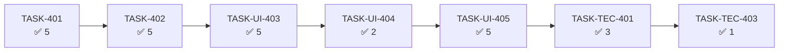

# Estado del Proyecto: fxtrad

> Última actualización: 2026-10-07
> Ciclo actual: **05** — `mejoras-ux-grafico`
> Fuente: `_docs/backlog.md`, `_docs/traceability.md`

## 1. Resumen ejecutivo

| Métrica | Valor | Δ vs estado anterior |
|---------|-------|----------------------|
| Tareas totales | **26** | +24 |
| 📥 Backlog | **0** | +8 |
| 🔨 Doing | 0 | +3 |
| 👀 Review | 0 | 0 |
| ✅ Done | **26** | +14 |
| 🔴 Blocked | 0 | 0 |
| % Completado | **100 %** | — |
| Esfuerzo planificado | **76 pts** | — |
| Ruta crítica | **7/7 · 26 pts** | — |
| Historias aceptadas | **5/8** | — |
| Días sin movimiento | 0 | — |

**Estado general:** 🟢 **Ciclo 05 completo (26/26 · 76/76 pts) tras el arreglo del eje (D-19).**
Se revirtió el eje X a su **formato original de una fila** sobre el eje nativo: recupera la
manipulación del eje y devuelve la geometría del overlay a 1:1 con el host (precisión al crear,
edición/borrado y estabilidad al hacer zoom). `RF-407` modificado; ruta crítica **completa (7/7)**.

El ciclo 04 quedó **cerrado y archivado** en `_docs/iterations/04-dibujo-referencia-operacion/`
(20/20 tareas · 56/56 pts · 19/19 requisitos propios 🟢 · CI en verde).

## 2. Tablero Kanban

### 📥 Backlog (0)

Ninguna.

### 🔨 Doing (0)

Ninguna.

### 👀 Review (0)

Ninguna.

### ✅ Done (26)

| ID | Tarea | Épica | Est. | Cerrada | Prueba |
|----|-------|-------|------|---------|--------|
| TASK-401 | Contrato único del documento v2 por activo (clave sin TF, `selection`, `charting/` cede el contrato) | EP-401 | 5 | 2026-10-06 | `state/__tests__/chart-config.test.ts` (17) + `state/__tests__/use-chart-config.test.tsx` (8) + `charting/__tests__/drawings.test.ts` (7) |
| TASK-402 | Migración v1→v2 pura y aditiva (unión deduplicada por `id`, indicadores del TF preferido, sin borrar v1) | EP-401 | 5 | 2026-10-06 | `state/__tests__/migrate-chart-config.test.ts` (12) + `state/__tests__/chart-config.test.ts` (22, incluye el cableado en `load`) |
| TASK-UI-402 | `CMP-023 TimeframeSelector` (radiogroup, roving tabindex, flechas y `Home`/`End`, `disabled`) | EP-UI-401 | 3 | 2026-10-06 | `components/TimeframeSelector/__tests__/TimeframeSelector.test.tsx` (8) |
| TASK-404 | Resolución de la selección (URL > persistido > defecto) + puntero `fxtrad.chart.last` (ADR-030) | EP-402 | 3 | 2026-10-06 | `app/__tests__/routes.test.ts` (12) + `state/__tests__/chart-config.test.ts` (26) + `__tests__/app.test.tsx` (7, ida y vuelta) |
| TASK-UI-403 | Selector en `ChartHeader` + estados `switching-tf`/`tf-ready`/`tf-error` con reversión por error | EP-UI-401 | 5 | 2026-10-06 | `components/ChartHeader/__tests__` (8) + `components/ChartPane/__tests__` (60, +2 de `onStatusChange`) + `__tests__/app.test.tsx` (9, cambio de TF, anuncio y reversión) |
| TASK-UI-404 | Indicadores del activo recalculados por TF — **cerrada sin código: ya cubierta** | EP-UI-401 | — | 2026-10-06 | Evidencia en `traceability.md` RF-405: `ChartPane.tsx:500` (deps `[status, indicators]`) + remonte por `key` en `App.tsx`. Prueba explícita en `TASK-UI-405` (DP-7) |
| TASK-UI-405 | Tests de la épica de escala (indicadores recalculados, serie corta, ida y vuelta, frame budget) | EP-UI-401 | 5 | 2026-10-06 | `ChartPane.test.tsx` (+3: recálculo con las velas del TF nuevo, sin `NaN` y frame budget) + `ChartHeader.test.tsx` (+1: `aria-checked` sigue al TF) + `app.test.tsx` (+1: ida y vuelta conserva dibujos e indicadores) |
| TASK-UI-410 | `CMP-025 OperationNumericFields`: popover con dos campos, validación inline y foco gestionado | EP-UI-404 | 5 | 2026-10-06 | `components/OperationNumericFields/__tests__/OperationNumericFields.test.tsx` (14) + `charting/__tests__/operation-price-input.test.ts` (12) |
| TASK-UI-411 | Integración de `CMP-025` con el command stack y `LiveRegion` | EP-UI-404 | 3 | 2026-10-06 | `components/ChartPane/ChartPane.test.tsx` (+7: botón «Precios» anclado, popover, mutación reversible, `Ctrl+Z`/`Ctrl+Y`, anuncio con los 5 valores y foco devuelto) |
| TASK-UI-412 | Tests de aceptación del popover numérico | EP-UI-404 | 3 | 2026-10-06 | `components/ChartPane/ChartPane.test.tsx` (+5: `Enter` aplica y anuncia, `Escape` cancela sin mutar, no numérico bloquea `Aplicar`, `Ctrl+Z` restaura exacto, orden de foco Entrada→SL) |
| TASK-UI-413 | Cobertura honesta con **ventana semanal de cierre** (`hasCoverageGap`) — reapertura | EP-UI-405 | 2 | 2026-10-06 | `charting/__tests__/coverage.test.ts` (17, +4: solo viernes, solo domingo, semana `Lun→Vie`, hueco real en la mañana del viernes) |
| TASK-UI-414 | Tests de borde de la cobertura en pantalla — reapertura | EP-UI-405 | 2 | 2026-10-06 | `components/ChartPane/ChartPane.test.tsx` (6 de borde, +3: solo viernes, solo domingo y semana `Lun→Vie`, sin aviso) |
| TASK-UI-415 | Retirada de Multigráfico y de `chart-sync` (ADR-029) | EP-UI-406 | 3 | 2026-10-06 | `__tests__/app.test.tsx` (sin enlace «Multigráfico») + `grep` con 0 referencias en `src/`; −11 tests por retirada de código |
| TASK-UI-416 | Limpieza de tests de la retirada y guardia de `ROUTES` | EP-UI-406 | 2 | 2026-10-06 | `app/__tests__/routes.test.ts` (+2: sin `/multichart`/`SCR-005`; `routeFor('/multichart')` → `/chart`); 6 mocks huérfanos retirados; 548/548 |
| TASK-TEC-401 | Suite completa + medición del cambio de TF + gate | EP-TEC-400 | 3 | 2026-10-06 | Backend 546/546 + 2 skip; frontend 549/549 en 58 archivos; `coverage/tf-switch-measurement.json` (medición client-side); `quality_gate --level gate` PASS |
| TASK-TEC-403 | Sin dependencias nuevas: diff de manifiestos y `backend/` vacío | EP-TEC-400 | 1 | 2026-10-06 | `git diff --exit-code e67ba78..HEAD -- frontend/package.json frontend/package-lock.json backend/` → exit 0 y 0 archivos |
| TASK-405 | Tests de precedencia y de ida y vuelta (query explícito gana; hidratación con rango; defecto; ida y vuelta) | EP-402 | 2 | 2026-10-07 | `__tests__/app.test.tsx` (4 casos nuevos: query explícito gana y pasa a ser la nueva, hidratación de activo+TF+rango, defecto `EURUSD`/`1h`, ida y vuelta por «Biblioteca») |
| TASK-403 | Aceptación de la migración v1→v2 y del contrato v2 | EP-401 | 3 | 2026-10-07 | `state/__tests__/chart-config.test.ts` (4 casos: v1 mixto de 5 `kind` en 3 TF sin pérdidas ni duplicados, idempotencia estricta, claves v1 intactas, v3 rechazado) |
| TASK-UI-408 | `CMP-024 CandleContextMenu`: panel de la vela con cabecera `fecha · hora` y OHLC en dos columnas | EP-UI-403 | 5 | 2026-10-07 | `CandleContextMenu.tsx` (`role="dialog"`, `font-num`, reposicionamiento y cierre con retorno de foco) integrado por clic derecho en `ChartPane`; suite 578/578 sin regresiones (los tests de aceptación son de TASK-UI-409) |
| TASK-UI-409 | Tests y accesibilidad de `CMP-024` | EP-UI-403 | 3 | 2026-10-07 | `CandleContextMenu.test.tsx` (5: valores, `Escape` con foco, clic fuera/dentro, 4 bordes sin desbordar, axe sin violaciones) + `ChartPane.test.tsx` (+1: clic derecho abre con la vela del cursor) |
| TASK-TEC-402 | Accesibilidad de los tres componentes nuevos (axe + teclado) | EP-TEC-400 | 2 | 2026-10-07 | `ChartPane.test.tsx` (+2: axe sin violaciones con popover y menú abiertos; recorrido solo con teclado con foco devuelto). Se añade el disparador `Shift+F10`/`ContextMenu` de CMP-024 (WCAG 2.1.1) |
| TASK-UI-417 | Evaluación de `Exportar` (SCR-006) con decisión documentada: **mantener** | EP-UI-406 | 2 | 2026-10-07 | `ADR-029` → «Evaluación de PA-3» (criterio de viabilidad + evidencia: `RF-015` vigente, 5 ficheros de test, modal sin duplicar superficie); `RF-411` 🟢 y `PA-3` resuelta |
| TASK-UI-400 | Tokens: `drawLine` `#7D8590` y `xFormat` original (**D-19**: sin tokens de dos filas) | EP-UI-400 | 2 | 2026-10-07 | `styles/__tests__/tokens.test.ts` (anti-drift verde con `--axis-x-format`; contraste 5.25:1 / 4.64:1); `xFormatTop`/`xFormatBottom`/`axisRowGap` retirados |
| TASK-UI-401 | Tests de contraste y del formato original del eje | EP-UI-400 | 2 | 2026-10-07 | `styles/__tests__/tokens.test.ts` (+2: AA de `drawLine` sobre los dos fondos y guardia anti-drift) + `charting/__tests__/axis-format.test.ts` (6: `formatAxisLabel` → `1 00:15`, formato del menú y `xFormat` original) |
| TASK-UI-406 | Eje X original de una fila sobre el eje nativo (revert del de dos filas, D-19) | EP-UI-402 | 3 | 2026-10-07 | `ChartPane` con `tickMarkFormatter` nativo (arrastre/zoom del eje) y sin franja; geometría del overlay 1:1 con el host; `ChartTimeAxis` eliminado |
| TASK-UI-407 | Tests del eje original y guardia de geometría del overlay | EP-UI-402 | 2 | 2026-10-07 | `charting/__tests__/axis-format.test.ts` (6) + `ChartPane.test.tsx` (85, con la guardia de que el canvas del overlay no excede el host) |

### 🔴 Blocked (0)

Ninguna.

## 3. Ruta crítica

**Avance de ruta crítica:** **7/7 · 26 pts — completa** (los 2 pts que `TASK-UI-404` traspasó a
`TASK-UI-405` incluidos). El tramo que dominó el ciclo fue `TASK-401 → TASK-402 → TASK-UI-403`
(tres tareas de 5 puntos encadenadas: contrato v2, migración e integración del cambio de escala).

**Puede empezar**: ninguna — **26/26 cerradas**. Pendiente la **re-verificación manual** del usuario.

## 4. Métricas

### 4.1 Velocidad

| Ciclo | Completadas | Esfuerzo |
|-------|-------------|----------|
| 03 — Mejoras UX | 35 | 121 pts |
| 04 — Dibujo Referencia de Operación | 20 | 56 pts |
| **05 — cerrado** | **26/26 · 76 pts** | **76 pts** |

### 4.2 Burn-down

26 de 26 tareas cerradas (**100 %**), 76 de 76 pts; 0 en 📥, 0 en 🔨, 0 bloqueadas. La
**ruta crítica está completa (7/7)**.

### 4.3 Lead time / cycle time

No medidos; todas las tareas del ciclo se cerraron el mismo día (2026-10-06), así que el lead time
no es informativo. El ciclo 05 tiene la ruta crítica completa (**7/7**).

## 5. Bloqueos activos

Ninguno.

## 6. Alertas

### 🔴 Críticas

Ninguna. *(La crítica de D-19 —eje de dos filas— está **resuelta**: revert al eje original de una
fila; pendiente solo la re-verificación manual del usuario.)*

### 🟡 Advertencias

- **`RF-407` resuelto por secuencia (D-16)**: `TASK-UI-406` se ejecutó **antes** que `TASK-UI-401`
  porque el DoD de este último exige el formateador de dos filas, que vive en el primero. La
  inversión de dependencia ya no está pendiente; `RF-407` queda 🔵 hasta los tests de `TASK-UI-407`.
- **`PA-1` cerrada tras reapertura**: `RF-402` vuelve a 🟢 con la ventana semanal de cierre
  `[viernes 19:00, lunes 00:00)` UTC y los bordes de viernes/domingo probados en pantalla. Límite
  conocido: los festivos en día laborable siguen avisando (6/594 días del histórico).
- **El ciclo planifica 76 pts frente a los 56 del ciclo 04.** Si el plazo de 2 semanas (RNF-007)
  aprieta, el orden de recorte lo fija `DP-3`: primero `RF-411` (Could, `TASK-UI-417`) y después los
  Should de UI pura (eje, menú contextual, precios numéricos, retirada).
- **Deuda fuera del ciclo 05** (`D-8`): `TECH-305` (motivos de waiver imprecisos), `TECH-306`
  (límites de tamaño: 8 funciones >50 líneas, `ChartPane.tsx` 874) y `TECH-307` (contrato de
  logging autocontradictorio). Provienen de la auditoría `CR-002`, en CHANGES_REQUESTED.
- **Preguntas abiertas que condicionan tareas**: `PA-1` **resuelta** (defecto de borde reproducido
  y corregido con la ventana semanal; bordes de viernes/domingo probados) · `PA-2` **resuelta**
  antes de `TASK-UI-415` (se confirma la retirada: la decisión D-3/ADR-029 no dependía de `RF-401`)
  · `PA-3` **resuelta** (`Exportar` se **mantiene**; criterio y evidencia en ADR-029 → «Evaluación de
  PA-3») · `PA-4` (quién verifica los 12 frentes del insumo y con qué guion) sigue abierta.
- **0 commits locales sin empujar**: `origin/master` está al día tras el push manual
  (`_docs/git-profile.toml`); árbol limpio.

### 🟢 Informativas

- **Pipeline de planificación completo**: `plan.md`, `requirements.md` (19 requisitos `4xx`),
  `glossary.md`, `architecture.md` + ADR-027/028/029, 9 contratos de `ux/` y el backlog con 10
  épicas y 26 tareas.
- **Gate de calidad en verde**: `quality_gate.py --level gate` = **PASS** (0 incumplidos, 25
  marcas waived, 0 `not_measured`) con `_docs/quality-profile.toml`.
- **Deuda promovida**: `TECH-302` pasa a `RNF-405` (la cubren `TASK-UI-400/401`) y `TECH-303` pasa
  a `RF-410` (la cubren `TASK-UI-410/411/412`): dejan de ser deuda sin requisito.
- **`TASK-UI-000…003`** (design system, componentes base, layout/routing, accesibilidad base) siguen
  **✅ Done desde el ciclo 01**: el ciclo 05 no las repite.

## 7. Salud de trazabilidad

| Grupo | Requisitos | Con tarea | Sin tarea |
|-------|-----------|-----------|-----------|
| RF (funcionales) | 11 | 11 | 0 |
| RNF (no funcionales) | 5 | 5 | 0 |
| RI (información) | 2 | 2 | 0 |
| RX (integración) | 1 | 1 | 0 |
| **Total del ciclo 05** | **19** | **19** | **0** ✅ |

**Requisitos sin tareas:** ninguno. **Cobertura UX:** 3/3 pantallas afectadas (SCR-004 modificada,
SCR-005 retirada, SCR-006 en evaluación); SCR-001/002/003 heredadas sin cambios.
**Historias sin aceptación:** 8/8 pendientes (exigen QA `PASS` y `/sdd-track accept`); `HU-401`,
`HU-402`, `HU-UI-403` y `HU-UI-406` tienen sus tareas ✅, pero los informes `PASS` de **`HU-UI-401` y
`HU-UI-402`** quedan **a re-verificar** por la reapertura del eje. *(El backlog declara 9 historias;
existen 8: hallazgo de contrato pendiente de corregir.)*

## 8. Próximas acciones sugeridas

1. **Re-verificación manual del usuario (bloqueante):** (a) manipular el eje (arrastre/zoom),
   (b) precisión al crear dibujos, (c) edición y borrado de dibujos/líneas/operación, (d) estabilidad
   al hacer zoom.
2. **Re-QA** de las historias afectadas (`HU-UI-402` y `HU-UI-401`): sus informes `PASS` quedaron
   obsoletos con D-19; hay que emitir QAR nuevos y `/sdd-track accept` cuando den `PASS`.
3. **Corregir el recuento de historias** (el backlog declara 9; existen 8).
4. **Publicar:** `git push origin master` (manual) con los commits locales.

## 9. Historial de cambios (append-only)

| Fecha | Tarea | Transición | Motivo |
|-------|-------|-----------|--------|
| 2026-10-02 | — | 📦 Archivo | Ciclo 04 archivado en `iterations/04-dibujo-referencia-operacion/` (20/20 · 56/56 · 19/19 · CI #31 en verde) |
| 2026-10-02 | — | 🆕 Ciclo 05 | Raíz re-sembrada: backlog/status/traceability nuevos con la deuda heredada (TECH-302, TECH-303) |
| 2026-10-06 | — | 🆕 Tablero | Inicialización del ciclo 05: 26 tareas en 📥 (76 pts · ruta crítica 7/24 · 10 épicas · 9 historias) |
| 2026-10-06 | TASK-401 | 📥 → 🔨 | Inicio de desarrollo (contrato único del documento v2, ADR-027) |
| 2026-10-06 | TASK-401 | 🔨 → 👀 | Tests verdes: 455/455 frontend (32 de los archivos tocados) · typecheck, eslint y prettier en verde · `quality_gate --level gate` PASS |
| 2026-10-06 | TASK-401 | 👀 → ✅ | DoD verificada: `CHART_CONFIG_VERSION = 2`, clave por activo sin TF, `deserializeChartConfig` → null ante versión desconocida, `charting/` sin dependencia de `indicators/`; prueba en `traceability.md` |
| 2026-10-06 | TASK-402 | 📥 → 🔨 | Inicio de desarrollo (migración v1→v2 aditiva, ADR-027) |
| 2026-10-06 | TASK-402 | 🔨 → 👀 | Tests verdes: 472/472 frontend (42 en `state/`) · typecheck, eslint y prettier en verde · `quality_gate --level gate` PASS |
| 2026-10-06 | TASK-402 | 👀 → ✅ | DoD verificada: módulo puro con `Storage` inyectable, dedupe por `id`, idempotente (el v2 manda), ninguna clave v1 borrada; prueba en `traceability.md` |
| 2026-10-06 | TASK-UI-402 | 📥 → 🔨 | Inicio de desarrollo (CMP-023 TimeframeSelector, RF-406) |
| 2026-10-06 | TASK-UI-402 | 🔨 → 👀 | Tests verdes: 480/480 frontend (8 del componente) · typecheck, eslint y prettier en verde · `quality_gate --level gate` PASS |
| 2026-10-06 | TASK-UI-402 | 👀 → ✅ | DoD verificada: `radiogroup` con `aria-label="Timeframe"`, `aria-checked` y roving tabindex, flechas y `Home`/`End` sin vuelta, `disabled` bloquea clic y teclado; prueba en `traceability.md`. Se corrige en el contrato UX la cita de WCAG 2.5.5 (AAA, 44×44) por 2.5.8 (AA, ≥24×24) |
| 2026-10-06 | TASK-404 | 📥 → 🔨 | Inicio de desarrollo (resolución de la selección + puntero `fxtrad.chart.last`, ADR-030) |
| 2026-10-06 | TASK-404 | 🔨 → 👀 | Tests verdes: 490/490 frontend · typecheck, eslint y prettier en verde · `quality_gate --level gate` PASS |
| 2026-10-06 | TASK-404 | 👀 → ✅ | DoD verificada: precedencia URL > persistido > defecto, un query explícito nunca se pisa, URL enriquecida con `replaceState` (sin historial) y puntero validado al leer; prueba en `traceability.md`. Nuevo ADR-030 |
| 2026-10-06 | TASK-UI-403 | 📥 → 🔨 | Inicio de desarrollo (selector en `ChartHeader` + estados de cambio de escala, RF-403/405/406) |
| 2026-10-06 | TASK-UI-403 | 🔨 → 👀 | Tests verdes: 497/497 frontend · typecheck, eslint y prettier en verde · `quality_gate --level gate` PASS |
| 2026-10-06 | TASK-UI-403 | 👀 → ✅ | DoD verificada: selector a la izquierda de Indicadores, estados `switching-tf`/`tf-ready`/`tf-error` con **reversión al TF anterior**, anuncio en `LiveRegion` y selección persistida; prueba en `traceability.md` |
| 2026-10-06 | TASK-UI-404 | 📥 → 🔨 | Verificación de cobertura de RF-405 **antes** de escribir código (regla: no inventar trabajo) |
| 2026-10-06 | TASK-UI-404 | 🔨 → 👀 | Verificado: RF-405 ya se cumple — `ChartPane.tsx:500` recalcula con las velas cargadas y `App.tsx` remonta el panel por `key` al cambiar de TF |
| 2026-10-06 | TASK-UI-404 | 👀 → ✅ | Cerrada **sin código** como ya cubierta por TASK-401/TASK-UI-403 (DP-7); evidencia en `traceability.md` y 2 pts traspasados a TASK-UI-405 (3 → 5) |
| 2026-10-06 | TASK-UI-405 | 📥 → 🔨 | Inicio de desarrollo (tests de aceptación de la épica de escala, solo capa `test`) |
| 2026-10-06 | TASK-UI-405 | 🔨 → 👀 | Tests verdes: 502/502 frontend (+5 casos nuevos) · typecheck, eslint y prettier en verde · `quality_gate --level gate` PASS |
| 2026-10-06 | TASK-UI-405 | 👀 → ✅ | DoD verificada: indicadores recalculados con las velas del TF nuevo, sin `NaN` con serie corta, ida y vuelta conserva dibujos e indicadores, `aria-checked` sigue al TF y frame budget intacto; prueba en `traceability.md`. `EP-UI-401` cerrada |
| 2026-10-06 | TASK-UI-410 | 📥 → 🔨 | Inicio de desarrollo (CMP-025 OperationNumericFields, RF-410; componente + lógica pura; la integración con el command stack es TASK-UI-411) |
| 2026-10-06 | TASK-UI-410 | 🔨 → 👀 | Tests verdes: 528/528 frontend (+26 casos nuevos) · typecheck, eslint y prettier en verde · `quality_gate --level gate` PASS |
| 2026-10-06 | TASK-UI-410 | 👀 → ✅ | DoD verificada: labels visibles `Entrada`/`Stop Loss`, `inputMode` decimal, error inline `role="alert"` asociado al campo, `Aplicar` deshabilitado si el valor no es numérico o `Entrada == SL`, `Escape`/`Cancelar` devuelven el foco a la figura; prueba en `traceability.md` |
| 2026-10-06 | TASK-UI-411 | 📥 → 🔨 | Inicio de desarrollo (integración de CMP-025 con el command stack y `LiveRegion`, RF-410) |
| 2026-10-06 | TASK-UI-411 | 🔨 → 👀 | Tests verdes: 535/535 frontend (+7 de integración) · typecheck, eslint y prettier en verde · `quality_gate --level gate` PASS |
| 2026-10-06 | TASK-UI-411 | 👀 → ✅ | DoD verificada: botón «Precios» anclado a la figura seleccionada, `Aplicar`/`Enter` mutan por `history.update` (un paso reversible: `Ctrl+Z` revierte y `Ctrl+Y` rehace), dirección/`R`/TP se derivan de las anclas y el anuncio reusa `operationAnnouncement`; prueba en `traceability.md` |
| 2026-10-06 | TASK-UI-412 | 📥 → 🔨 | Inicio de desarrollo (tests de aceptación del popover numérico, RF-410) |
| 2026-10-06 | TASK-UI-412 | 🔨 → 👀 | Tests verdes: 540/540 frontend (+5 de aceptación) · typecheck, eslint y prettier en verde · `quality_gate --level gate` PASS |
| 2026-10-06 | TASK-UI-412 | 👀 → ✅ | DoD verificada: `Enter` aplica y el anuncio lleva los 5 valores, `Escape` cancela sin mutar, valor no numérico bloquea `Aplicar` y asocia el error al campo, `Ctrl+Z` restaura la figura exactamente y el orden de foco es Entrada→SL; sin regresión en los tests de la operación. RF-410 🟢 |
| 2026-10-06 | TASK-UI-413 | 📥 → 🔨 | Inicio de desarrollo (diagnóstico y corrección de la condición de cobertura, RF-402) |
| 2026-10-06 | TASK-UI-413 | 🔨 → 👀 | Tests verdes: 554/554 frontend (+14: 13 de `coverage` y 1 de `ChartPane`) · typecheck, eslint y prettier en verde · `quality_gate --level gate` PASS |
| 2026-10-06 | TASK-UI-413 | 👀 → ✅ | Diagnóstico (bucket vs hueco) en el AUDIT LOG; DoD verificada: `hasCoverageGap` avisa solo si falta ≥1 bucket que no sea cierre de fin de semana; el desfase de bucket en los bordes y el weekend no disparan; prueba en `traceability.md` |
| 2026-10-06 | TASK-UI-414 | 📥 → 🔨 | Inicio de desarrollo (tests de borde de la cobertura, RF-402) |
| 2026-10-06 | TASK-UI-414 | 🔨 → 👀 | Tests verdes: 557/557 frontend (+3 de borde) · typecheck, eslint y prettier en verde · `quality_gate --level gate` PASS |
| 2026-10-06 | TASK-UI-414 | 👀 → ✅ | DoD verificada: cierre de fin de semana (interno, al inicio y al final del rango) **sin** aviso; hueco interno real **con** aviso y borde desfasado por bucket **sin** aviso (casos de TASK-UI-413); el test heredado del ciclo 04 quedó sustituido con criterio explícito. RF-402 🟢 y `EP-UI-405` cerrada |
| 2026-10-06 | TASK-UI-415 | 📥 → 🔨 | PA-2 resuelta (se confirma la retirada); inicio de desarrollo (RF-409, ADR-029) |
| 2026-10-06 | TASK-UI-415 | 🔨 → 👀 | Tests verdes: 546/546 frontend en 58 archivos (−11 tests retirados con su código) · typecheck, eslint y prettier en verde · `quality_gate --level gate` PASS |
| 2026-10-06 | TASK-UI-415 | 👀 → ✅ | DoD verificada: `SCR-005` fuera de `ScreenId` y `/multichart` fuera de `ROUTES`; sin rama en `App.tsx`; borrados `components/MultiChart/` y `charting/chart-sync.ts`; `sync`/`syncId` fuera de `ChartPane`; `grep` con **0** referencias en `src/`; la Operación sigue en `Gráfico`; prueba en `traceability.md` |
| 2026-10-06 | TASK-UI-416 | 📥 → 🔨 | Inicio de desarrollo (limpieza de tests de la retirada, RF-409) |
| 2026-10-06 | TASK-UI-416 | 🔨 → 👀 | Tests verdes: 548/548 frontend en 58 archivos (+2 de guardia) · typecheck, eslint y prettier en verde · `quality_gate --level gate` PASS |
| 2026-10-06 | TASK-UI-416 | 👀 → ✅ | DoD verificada: los 11 tests de `MultiChart`/`chart-sync`/`sync` quedaron borrados en TASK-UI-415; se retiran 6 mocks de sincronización huérfanos del arnés, se añade la guardia de `ROUTES` (`/multichart` y `SCR-005` fuera; `routeFor` cae en `/chart`) y el recuento real (548/58) queda anotado; sin `skip` ni directorios vacíos. RF-409 🟢 |
| 2026-10-06 | TASK-TEC-401 | 📥 → 🔨 | Inicio de desarrollo (suite completa + medición del cambio de TF + gate, RNF-402/403/404) |
| 2026-10-06 | TASK-TEC-401 | 🔨 → 👀 | Suites verdes: backend 546/546 + 2 skip · frontend 549/549 en 58 archivos · typecheck, eslint y prettier en verde · `quality_gate --level gate` PASS |
| 2026-10-06 | TASK-TEC-401 | 👀 → ✅ | DoD verificada: recuentos reales de ambas suites anotados, gate PASS pegado en el AUDIT LOG y medición del cambio de TF registrada en `coverage/tf-switch-measurement.json`. RNF-402 🟢; RNF-404 medido y registrado, con la comparación client-side marcada como no concluyente (D-5, sin umbral bloqueante). Ruta crítica 6/7 |
| 2026-10-06 | TASK-TEC-403 | 📥 → 🔨 | Inicio de desarrollo (verificación de «sin dependencias nuevas», RX-401) |
| 2026-10-06 | TASK-TEC-403 | 🔨 → 👀 | Evidencia recogida: `git diff --exit-code e67ba78..HEAD -- frontend/package.json frontend/package-lock.json backend/` = exit 0 y 0 archivos · `quality_gate --level gate` PASS |
| 2026-10-06 | TASK-TEC-403 | 👀 → ✅ | DoD verificada: el diff de los manifiestos y de `backend/` es **vacío** (ninguna dependencia nueva en el ciclo). RX-401 🟢. **Ruta crítica completa 7/7** |
| 2026-10-06 | TASK-UI-413 | ✅ Done → 🔨 Doing | **Reapertura** por defecto reproducido (`RF-402`): la condición avisa en 103/103 rangos `Lun→Vie`, 103/103 viernes y 79/79 domingos (188/594 días) con `data/EURUSD.1h.parquet`; el cierre real del viernes (20:00/21:00) y la apertura del domingo (21:00) no son «desfase de bucket». Evidencia en el commit |
| 2026-10-06 | TASK-UI-414 | ✅ Done → 🔨 Doing | **Reapertura** arrastrada: sus tests de borde no cubrían viernes/domingo y el DoD «fin de semana → sin aviso» no se cumple con datos reales |
| 2026-10-06 | TASK-UI-413 | 🔨 → 👀 | Reapertura corregida: `hasCoverageGap` exime ahora el hueco de la ventana semanal `[vie 19:00, lun 00:00)`; 17 tests de `coverage` verdes (+4), suite 553/553 · typecheck, eslint y prettier en verde · `quality_gate --level gate` PASS |
| 2026-10-06 | TASK-UI-413 | 👀 → ✅ | DoD verificada (reapertura): solo viernes, solo domingo y semana `Lun→Vie` **sin** aviso; sigue avisando el hueco real en la mañana del viernes y el hueco interno entre semana. Queda `TASK-UI-414` |
| 2026-10-06 | TASK-UI-414 | 🔨 → 👀 | Reapertura ampliada: 3 casos nuevos de pantalla (solo viernes, solo domingo y semana `Lun→Vie`); 556/556 frontend · typecheck, eslint y prettier en verde · `quality_gate --level gate` PASS |
| 2026-10-06 | TASK-UI-414 | 👀 → ✅ | DoD verificada (reapertura): los bordes de viernes/domingo y la semana `Lun→Vie` no disparan el aviso en pantalla; `EP-UI-405` cerrada y `RF-402` 🟢. `PA-1` resuelta |
| 2026-10-07 | — | 🔧 Corrección de tablero | Alineación backlog→status (`TASK-UI-410` ✅), ruta crítica 7/7 · 26 pts, push al día (0 pendientes) y cabecera de trazabilidad. `/sdd-track verify` |
| 2026-10-07 | TASK-405 | 📥 → 🔨 | Inicio de desarrollo (tests de precedencia y de ida y vuelta, RF-401/RI-402) |
| 2026-10-07 | TASK-405 | 🔨 → 👀 | Tests verdes: 560/560 frontend en 58 archivos (+4 casos nuevos) · backend 546 + 2 skip · typecheck, eslint y prettier en verde · `quality_gate --level gate` PASS |
| 2026-10-07 | TASK-405 | 👀 → ✅ | DoD verificada: un query explícito gana a la memoria y pasa a ser la nueva; `/chart` sin query hidrata activo, TF y rango; sin selección previa → `EURUSD`/`1h`; ida y vuelta por «Biblioteca» conserva la selección; prueba en `traceability.md`. RF-401 y RI-402 🟢 |
| 2026-10-07 | TASK-403 | 📥 → 🔨 | Inicio de desarrollo (tests de aceptación de la migración v1→v2 y del contrato v2, RI-401/RNF-401) |
| 2026-10-07 | TASK-403 | 🔨 → 👀 | Tests verdes: 564/564 frontend en 58 archivos (+4 casos) · backend 546 + 2 skip · typecheck, eslint y prettier en verde · `quality_gate --level gate` PASS |
| 2026-10-07 | TASK-403 | 👀 → ✅ | DoD verificada: v1 mixto de los 5 `kind` en 3 TF → v2 con los 5 `id` una sola vez (0 pérdidas y 0 duplicados); idempotencia estricta del v2 persistido; claves v1 de los 3 TF intactas; un v3 no se interpreta como v2; prueba en `traceability.md`. RI-401, RNF-401 y RF-404 🟢 |
| 2026-10-07 | TASK-UI-400 | 📥 → 🔨 | Inicio de desarrollo (tokens del eje: contraste de `drawLine` y formato en dos filas, RNF-405/RF-407) |
| 2026-10-07 | TASK-UI-400 | 🔨 → 👀 | Tests verdes: 564/564 frontend en 58 archivos · anti-drift verde con las 3 properties nuevas · typecheck, eslint y prettier en verde · `quality_gate --level gate` PASS |
| 2026-10-07 | TASK-UI-400 | 👀 → ✅ | DoD verificada: `drawLine` = `#7D8590` en TS y CSS; `AXIS_TOKENS` con `xFormatTop`/`xFormatBottom`/`axisRowGap: 12` y `xFormat` retirado (0 consumidores); anti-drift verde; prueba en `traceability.md`. RNF-405 y RF-407 quedan 🔵 (los cierra `TASK-UI-401`/`TASK-UI-406`) |
| 2026-10-07 | — | 🔀 Reordenación (D-16) | Inversión de dependencia detectada: el DoD de `TASK-UI-401` exige el formateador de dos filas de `TASK-UI-406`; se ejecuta `TASK-UI-406` antes (sin cambiar `Deps` del backlog) |
| 2026-10-07 | TASK-UI-406 | 📥 → 🔨 | Inicio de desarrollo (render del eje X en dos filas: franja propia de ~40 px, RF-407) |
| 2026-10-07 | TASK-UI-406 | 🔨 → 👀 | Tests verdes: 569/569 frontend en 58 archivos (+5) · `ChartTimeAxis` con dos filas y umbral sin solape a 2 años · typecheck, eslint y prettier en verde · `quality_gate --level gate` PASS |
| 2026-10-07 | TASK-UI-406 | 👀 → ✅ | DoD verificada: fecha arriba / `hh:mm` abajo con `axisRowGap`; el eje nativo de la librería se oculta (`timeScale.visible: false`, no soporta dos filas) y el canvas cede los ~40 px de la franja sin scroll; eje Y intacto; sin solape a zoom de 2 años por umbral en `axis-format`; prueba en `traceability.md`. RF-407 queda 🔵 hasta `TASK-UI-407` |
| 2026-10-07 | TASK-UI-401 | 📥 → 🔨 | Inicio de desarrollo (tests de contraste de `drawLine` y de formato del eje, RNF-405/RF-407) |
| 2026-10-07 | TASK-UI-401 | 🔨 → 👀 | Tests verdes: 573/573 frontend en 58 archivos (+4) · `drawLine` 5.25:1 / 4.64:1 y patrones del eje · typecheck, eslint y prettier en verde · `quality_gate --level gate` PASS |
| 2026-10-07 | TASK-UI-401 | 👀 → ✅ | DoD verificada: `color-draw-line` ≥4.5:1 sobre `#0A0C10` (5.25:1) y `#161B22` (4.64:1); el anti-drift exige el valor en TS y CSS a la vez y `xFormat` ya no existe; `xFormatTop`/`xFormatBottom` rinden `18-nov-25` / `00:15`; prueba en `traceability.md`. RNF-405 🟢 |
| 2026-10-07 | TASK-UI-407 | 📥 → 🔨 | Inicio de desarrollo (tests del eje en dos filas: formato, 15m a zoom mínimo y layout, RF-407) |
| 2026-10-07 | TASK-UI-407 | 🔨 → 👀 | Tests verdes: 578/578 frontend en 59 archivos (+5: 4 de `ChartTimeAxis` y 1 de 15m a zoom mínimo) · typecheck, eslint y prettier en verde · `quality_gate --level gate` PASS |
| 2026-10-07 | TASK-UI-407 | 👀 → ✅ | DoD verificada: formato por filas (fecha arriba / `hh:mm` abajo) con posición por marca; ambas filas respetan su umbral con ticks de 15m a zoom mínimo; la franja es un ítem flex de 40 px en columna y el canvas cede el alto sin scroll; prueba en `traceability.md`. RF-407 🟢 y `EP-UI-402` cerrada |
| 2026-10-07 | TASK-UI-408 | 📥 → 🔨 | Inicio de desarrollo (CMP-024 CandleContextMenu: panel de datos de la vela, RF-408) |
| 2026-10-07 | TASK-UI-408 | 🔨 → 👀 | Suite verde: 578/578 frontend en 59 archivos (sin regresiones) · typecheck, eslint y prettier en verde · `quality_gate --level gate` PASS |
| 2026-10-07 | TASK-UI-408 | 👀 → ✅ | DoD verificada: `role="dialog"` + `aria-label="Datos de la vela"`, cabecera `fecha · hora` y OHLC a 5 decimales con `font-num`; reposiciona sin recortar; `Escape`/clic fuera cierran y devuelven el foco; cierra al cambiar de TF; fondo y sombra estáticos. Suite 578/578 sin regresiones; prueba en `traceability.md`. Los tests de aceptación son de TASK-UI-409 |
| 2026-10-07 | TASK-UI-409 | 📥 → 🔨 | Inicio de desarrollo (tests y accesibilidad de CMP-024: valores, cierre, foco, reposicionamiento y axe, RF-408) |
| 2026-10-07 | TASK-UI-409 | 🔨 → 👀 | Tests verdes: 584/584 frontend en 60 archivos (+6) · axe-core sin violaciones en el menú · typecheck, eslint y prettier en verde · `quality_gate --level gate` PASS |
| 2026-10-07 | TASK-UI-409 | 👀 → ✅ | DoD verificada: el menú abre con los valores de la vela (5 decimales), cierra por `Escape` y clic fuera devolviendo el foco, reposiciona en los 4 bordes sin desbordar el viewport y pasa axe-core sin violaciones; prueba en `traceability.md`. RF-408 🟢 y `EP-UI-403` cerrada |
| 2026-10-07 | TASK-TEC-402 | 📥 → 🔨 | Inicio de desarrollo (accesibilidad de los 3 componentes nuevos; se añade el disparador de teclado de CMP-024, RNF-403) |
| 2026-10-07 | TASK-TEC-402 | 🔨 → 👀 | Tests verdes: 586/586 frontend en 60 archivos (+2) · axe-core sin violaciones con popover y menú abiertos · typecheck, eslint y prettier en verde · `quality_gate --level gate` PASS |
| 2026-10-07 | TASK-TEC-402 | 👀 → ✅ | DoD verificada: axe sin violaciones en SCR-004 con la operación, el menú y el popover abiertos; recorrido **solo con teclado** (`Shift+F10` abre CMP-024, `Escape` cierra menú y popover devolviendo el foco al gráfico); contraste AA verificado por tokens (el zoom no altera colores). Se añade el disparador de teclado de CMP-024 (WCAG 2.1.1); prueba en `traceability.md`. RNF-403 🟢 |
| 2026-10-07 | TASK-UI-417 | 📥 → 🔨 | Inicio de desarrollo (evaluación de `Exportar` con decisión documentada, RF-411/PA-3) |
| 2026-10-07 | TASK-UI-417 | 🔨 → 👀 | Decisión documentada en `ADR-029` («Evaluación de PA-3»): **mantener** `SCR-006`; `RF-411` 🟢 · suite 586/586 sin regresiones · `quality_gate --level gate` PASS |
| 2026-10-07 | TASK-UI-417 | 👀 → ✅ | DoD verificada: decisión mantener con el criterio de viabilidad (requisito vigente `RF-015`, cobertura de tests y no duplicar superficie) y la evidencia citada; sin requisito modificado; `PA-3` resuelta; prueba en `traceability.md`. **Ciclo 05 completo: 26/26 · 76/76 pts** |
| 2026-10-07 | TASK-UI-406 | ✅ Done → 🔨 Doing | **Reapertura por defecto reproducido** (verificación manual, D-19): (1) el eje nativo oculto impide manipular el eje; (2) la franja dentro de `.chart-pane__graph` estira el canvas del overlay (buffer = host, caja CSS = graph + 40 px) → dibujos desplazados; (3) sin edición ni borrado; (4) pérdida de ubicación al hacer zoom. Remedio: volver al eje original de una fila |
| 2026-10-07 | TASK-UI-400 | ✅ Done → 🔨 Doing | Reapertura arrastrada: `RF-407` se modifica a una fila y `xFormat` vuelve a existir; se retiran los tokens de dos filas (`xFormatTop`/`xFormatBottom`/`axisRowGap`). Se conserva `drawLine` `#7D8590` (RNF-405) |
| 2026-10-07 | TASK-UI-401 | ✅ Done → 🔨 Doing | Reapertura arrastrada: sus tests de formato de dos filas quedan obsoletos; se conservan los de contraste de `drawLine` |
| 2026-10-07 | TASK-UI-407 | ✅ Done → 🔨 Doing | Reapertura arrastrada: los tests de la franja se sustituyen por los del eje original y una guardia de geometría del overlay |
| 2026-10-07 | TASK-UI-406 | 🔨 → 👀 → ✅ | Revert verificado (D-19): se restaura el eje nativo (`tickMarkFormatter` → `{día} {HH:mm}`), se elimina la franja/`ChartTimeAxis` y la caja del overlay vuelve a coincidir con el host (precisión, edición y zoom). Suite 577/577 en 59 archivos · backend 546 + 2 skip · lint/typecheck/format y `quality_gate --level gate` PASS |
| 2026-10-07 | TASK-UI-400 | 🔨 → 👀 → ✅ | `xFormat` restaurado y tokens de dos filas retirados; `drawLine` `#7D8590` se conserva (RNF-405); anti-drift verde |
| 2026-10-07 | TASK-UI-401 | 🔨 → 👀 → ✅ | Tests reescritos: contraste de `drawLine` (5.25:1 / 4.64:1) y formato original `1 00:15`; sin aserciones del eje de dos filas |
| 2026-10-07 | TASK-UI-407 | 🔨 → 👀 → ✅ | Tests del eje original (6) y guardia de geometría del overlay en `ChartPane.test.tsx` (85); `RF-407` 🟢. **Ciclo 05: 26/26 · 76/76 pts** |
| 2026-10-07 | HU-401 | 👀 → ✅ Aceptada | QA `PASS` (`QAR-HU-401-001.md`) |
| 2026-10-07 | HU-402 | 👀 → ✅ Aceptada | QA `PASS` (`QAR-HU-402-001.md`) |
| 2026-10-07 | HU-UI-401 | 👀 → ✅ Aceptada | QA `PASS` (`QAR-HU-UI-401-002.md`) |
| 2026-10-07 | HU-UI-402 | 👀 → ✅ Aceptada | QA `PASS` (`QAR-HU-UI-402-002.md`) |
| 2026-10-07 | HU-UI-403 | 👀 → ✅ Aceptada | QA `PASS` (`QAR-HU-UI-403-001.md`) |
