# Estado del Proyecto: Plataforma de Análisis Técnico (estilo TradingView)

> Última actualización: 2026-09-25 10:15
> Fuente: `_docs/backlog.md` (v2), `_docs/traceability.md` (v2)

## 1. Resumen ejecutivo

| Métrica | Valor | Δ vs última sesión |
|---------|-------|---------------------|
| Tareas totales | 62 | +1 (TASK-048) |
| 📥 Backlog | 9 | — |
| 🔨 Doing | 0 | — |
| 👀 Review | 0 | -1 |
| ✅ Done | 53 | +1 |
| 🔴 Blocked | 0 | — |
| % Completado | 85.5% (53/62) | +1.6 |
| Días sin movimiento | 0 | — |

**Estado general:** 🟢 En curso

## 2. Tablero Kanban

### 📥 Backlog (9)

| ID | Tarea | Épica | Est. | Deps |
|----|-------|-------|------|------|
| TASK-UI-010 | SCR-001 Biblioteca (AssetList CMP-006) | EP-UI-001 | L | TASK-020, TASK-UI-001, TASK-UI-003 |
| TASK-UI-021 | SCR-002 Progreso + historial + estados | EP-UI-002 | L | TASK-006, TASK-047, TASK-UI-020 |
| TASK-UI-030 | SCR-003 Estados y validación cobertura | EP-UI-003 | M | TASK-020, TASK-026 |
| TASK-038 | Docker Compose (4 servicios) | TEC-001 | M | TASK-037 |
| TASK-039 | GHA lint + tests | TEC-001 | S | TASK-037 |
| TASK-040 | Auditoría licencias OSS ($0) | TEC-001 | S | TASK-037 |
| TASK-041 | Logging structlog + correlación Celery | TEC-002 | S | TASK-037 |
| TASK-042 | Interfaces/contratos de módulos | TEC-003 | S | TASK-037 |
| TASK-043 | Registro extensible de indicadores | TEC-003 | M | TASK-031, TASK-042 |

### 🔨 Doing (0)

Sin tareas.

### 👀 Review (0)

Sin tareas.

### ✅ Done (53)

| ID | Tarea | Épica | Completada | Prueba |
|----|-------|-------|------------|--------|
| TASK-045 | Invalidación de caché por actualización incremental | TEC-004 | 2026-09-25 | `backend/tests/storage/test_cache.py` (10 tests: 3 de integración con `store.merge` real → ventana 300→360 velas; `invalidate(symbol)`; token de versión) + `backend/tests/api/test_series_endpoint.py::TestDefaultSeriesWiring::test_incremental_download_is_reflected_in_the_next_response` |
| TASK-044 | Caché in-memory por ventana (Karst) | TEC-004 | 2026-09-25 | `backend/tests/storage/test_cache.py` (18 tests: la 2ª lectura no llama al almacén — se borra el Parquet y sigue sirviendo; aislamiento de clave por símbolo/timeframe/rango; copia defensiva; LRU y límite por ventanas/velas; ventana de 200k velas servida en 0,04 s < 2 s de KPI-3) + `backend/tests/api/test_series_endpoint.py::TestDefaultSeriesWiring` (payload idéntico y 1 acierto/1 fallo por `GET /series`, límite por env y fallback ante valor inválido); suite 359 ✅ + 2 skip, cobertura 100% de `cache.py`/`app.py`/`routes.py`, ruff/black/mypy OK — RNF-001/RNF-002 |
| TASK-047 | Endpoint GET /downloads (historial RI-002) | EP-004 | 2026-09-25 | `backend/tests/api/test_download_history.py` (8 tests: contrato `[{date, active, range, status, rows}]`, orden descendente por fecha, estados exito/parcial/fallo, lista vacía, integración DuckDB de TASK-018) + `test_download_status.py::TestRouting` (`/downloads/` 307 → `/downloads`); suite 336 ✅ + 2 skip, ruff/black/mypy OK — RI-002 |
| TASK-022 | Contrato respuesta TS (lightweight-charts) | EP-002 | 2026-09-24 | `frontend/src/contracts/__tests__/ohlc.test.ts` (puente DTO → `CandlestickData`: cast sin transformación de datos, aserción compile-time `Candle ⊆ CandlestickData`, `@ts-expect-error` por `UTCTimestamp` nominal; validado por `tsc --noEmit`) — RNF-008/RX-002 |
| TASK-011 | Normalización UTC y esquema | EP-002 | 2026-09-24 | `backend/tests/pipeline/test_normalize.py` (31 tests: `time` int/float-entero/str/datetime aware y naive → epoch UTC, fracción 1s rechazada, clave ausente, diagnóstico con índice) + `backend/tests/pipeline/test_schema.py` (7 tests: test de esquema con `time` INT64/BIGINT y OHLC DOUBLE en DuckDB, roundtrip sin cambios, RI-001) — RNF-004/RF-002 |
| TASK-020 | Endpoint GET /assets | EP-004 | 2026-09-24 | `backend/tests/api/test_assets_endpoint.py` (10 tests: contrato CMP-006, activos con datos almacenados, cobertura min/max del Parquet 1s, status del último registro de descarga, integración real Parquet+DuckDB) + `backend/tests/storage/test_series.py::TestCoverage` (4 tests) — RF-007 |
| TASK-019 | Upsert incremental (merge time) | EP-003 | 2026-09-24 | `backend/tests/storage/test_upsert.py` (12 tests: merge por `time` sin duplicar ni borrar — KPI-4 COUNT=COUNT(DISTINCT), colisión gana la nueva, primer periodo ≡ write, pre-resampling `1m`) — RF-006/RI-001 |
| TASK-018 | MetadatosDescarga | EP-003 | 2026-09-24 | `backend/tests/storage/test_metadata.py` (17 tests: tabla DuckDB `download_metadata` PK activo/inicio/fin, INSERT OR REPLACE idempotente, historial por `fecha_descarga` DESC/ASC + LIMIT, get/count, validación rango) — RF-006/RI-002 |
| TASK-036 | Export PNG (toBlob) | EP-UI-006 | 2026-09-24 | `frontend/src/export/__tests__/png.test.ts` (toBlob→blob, ExportError/EmptyExportError, filename `fxtrad-**-2x.png`, download+revoke sin localStorage) + `app.test.tsx` (harness dev export) — RF-015/RI-003; descarga manual atestada |
| TASK-035 | Composición canvas velas+ind+dibs | EP-UI-006 | 2026-09-24 | `frontend/src/export/__tests__/compose.test.ts` (6 tests: capas chart/overlay + anotación ticker·TF, escala 1x/2x/4x, empty=`null`, partial) + `ChartPane.test.tsx` (handle `compose`) — RF-015; DoD visual atestada |
| TASK-015 | SerieOHLC Parquet (time único) | EP-003 | 2026-09-21 | `test_series.py` (12 tests, 100% cobertura) |
| TASK-016 | Consulta DuckDB activo/rango/TF | EP-003 | 2026-09-21 | `test_queries.py` (11 tests, 100% cobertura) |
| TASK-009 | Contrato OHLC compartido | EP-002 | 2026-09-18 | `test_ohlc_contract.py` + `ohlc.test.ts` (alineación canónica) |
| TASK-012 | Calendario de mercado | EP-002 | 2026-09-18 | `test_calendar.py` (marzo-2026, 100% cobertura) |
| TASK-013 | Filtro sin mercado | EP-002 | 2026-09-18 | `test_filter.py` (9 tests, 100% cobertura) |
| TASK-001 | Catálogo de activos + modelo de request | EP-001 | 2026-09-18 | `test_catalog.py` + `test_requests.py` (19 tests, 100% cobertura) |
| TASK-002 | Cliente Dukascopy vía API chart freeserv (ADR-010) | EP-001 | 2026-09-21 | `test_freeserv.py` (mapeo, agregación, hora conocida; 100% cobertura ingest) |
| TASK-003 | Endpoint POST /downloads | EP-001 | 2026-09-18 | `test_downloads.py` (10 tests, broker stub, api+ingest 100%) |
| TASK-010 | Pipeline limpieza e imputación | EP-002 | 2026-09-18 | `test_clean.py` (18 tests, cobertura pipeline 100%, política PA-3) |
| TASK-004 | Celery + RabbitMQ (download_asset) | EP-001 | 2026-09-18 | `test_tasks.py` (15 tests, E2E eager 3 h + adapter); E2E dev en vivo compose worker/rabbitmq |
| TASK-005 | Retry/backoff 20 s y manejo de fallos parciales | EP-001 | 2026-09-21 | `test_retry.py` (reintento backoff 20 s, agotamiento) + `test_tasks.py::TestPartialFailures` (exito/parcial/fallo); 136 ✅ + 2 skip |
| TASK-006 | Endpoint GET /downloads/{task_id} | EP-001 | 2026-09-21 | `test_download_status.py` (4 estados + filas) + `test_tasks.py::TestCeleryDownloadStatus` (mapeo AsyncResult); 147 ✅ + 2 skip |
| TASK-007 | Normalización a segundos UTC | EP-001 | 2026-09-21 | `test_times.py` (TZ no-UTC Madrid/NY/offset fijo → 1786442400, naive→UTC, identidad UTC); 153 ✅ + 2 skip |
| TASK-008 | Validación ventana ≤ 2 años | EP-001 | 2026-09-21 | `test_window.py` (rechazo >2 años con mensaje, límite inclusivo, integración DownloadRequest); 162 ✅ + 2 skip |
| TASK-014 | Agregación OHLC 1m/5m/15m/1h/4h/1d | EP-002 | 2026-09-22 | `backend/tests/pipeline/test_resample.py` (16 tests, 100% cobertura) — RF-009 |
| TASK-017 | Parquet pre-resampling | EP-003 | 2026-09-22 | `backend/tests/storage/test_timeframes.py` (13 tests, fichas por TF sin recomputar) — RF-005/RF-009/RNF-002/RI-001 |
| TASK-021 | Endpoint GET /series | EP-004 | 2026-09-22 | `backend/tests/api/test_series_endpoint.py` (12 tests, contrato OhlcResponse + integración DuckDB) — RF-008/RF-009/RX-002 |
| TASK-023 | Scaffold React 18 + Vite 5 + TS 5 | EP-UI-000 | 2026-09-22 | `frontend/`: `npm run dev` (Vite 5, HTTP 200) + `npm run lint`/`typecheck`/`test` (6 tests, App 100%) verdes — RNF-005 |
| TASK-024 | lightweight-charts + datos API | EP-UI-004 | 2026-09-22 | `frontend/` `ChartPane.test.tsx` (6: estados loading/empty/error+retry/success, leyenda OHLC, atajos +/−/1, dispose) + `series.test.ts` (4); suite 16/16, cobertura 96.18% — RF-009/RF-010 |
| TASK-025 | Zoom/pan fluido a 60 FPS (2 años) | EP-UI-004 | 2026-09-22 | `frontend/` `frame-rate.test.ts` + `frame-batch.test.ts` (FrameRateMeter rAF, métricas avgFps/p95/max/dropped, presupuesto 16.67 ms) + `ChartPane.test.tsx` (pan/zoom dataset 2 años sin re-feed ni drops; leyenda batcheada — RF-010/RNF-001; sesión real → TASK-UI-040) |
| TASK-027 | Overlay canvas sincronizado | EP-UI-004 | 2026-09-22 | `frontend/` `overlay-geometry.test.ts` + `OverlayCanvas.test.tsx` (13 tests: re-proyección de anclas en pan/zoom/resize, coalescing 1 frame, aria-hidden) — RF-011 |
| TASK-030 | Marcadores entrada/salida | EP-UI-004 | 2026-09-22 | `ChartPane.test.tsx` (6 tests marcadores: crear buy, toggle sell+aria-pressed, dedupe, selección+borrado con confirm, cancel, Escape) + `overlay-geometry.test.ts` (proyección/hit-test) — RF-012 |
| TASK-031 | Cálculo MA, RSI, ATR | EP-002 | 2026-09-24 | `backend/tests/pipeline/test_indicators.py` (21 tests, fixture golden MA20/RSI14/ATR14 Wilder) — RF-013 |
| TASK-032 | Render indicadores + panel | EP-UI-004 | 2026-09-24 | `indicators.test.ts` (23) + `IndicatorPanel.test.tsx` (4) + `ChartPane.test.tsx` (redibujo al cambiar parámetros) — RF-013 |
| TASK-UI-000 | Setup tokens design system | EP-UI-000 | 2026-09-24 | `frontend/src/styles/__tests__/tokens.test.ts` (contraste WCAG + anti-drift CSS↔TS) — EP-UI-000 |
| TASK-UI-001 | Primitivas form | EP-UI-000 | 2026-09-24 | `frontend/src/components/ui/__tests__/` (Button/Input/Select/RadioGroup/DateRange; 24 tests) — EP-UI-000 |
| TASK-UI-002 | Feedback/overlay | EP-UI-000 | 2026-09-24 | `frontend/src/components/ui/__tests__/` (StatusBanner/ProgressBar/Toast/Modal/Tab; 23 tests) — EP-UI-000 |
| TASK-UI-060 | Modal export | EP-UI-006 | 2026-09-24 | `frontend/src/components/ExportModal/__tests__/ExportModal.test.tsx` (7 tests) + `app.test.tsx` — RF-015 |
| TASK-048 | Fix marcadores compra/venta | EP-UI-004 | 2026-09-24 | `ChartPane.test.tsx` (marcadores vía subscribeClick) + `OverlayCanvas.test.tsx` (z-index≥3 y tamaño 100%) + verificación navegador real dpr=2 — RF-012 |
| TASK-028 | Línea y rectángulo (crear/borrar) | EP-UI-004 | 2026-09-24 | `overlay-geometry.test.ts` (rect + hitTestFragment) + `OverlayCanvas.test.tsx` (strokeRect) + `ChartPane.test.tsx` (crear/borrar línea y rect, preview, erase, aria-pressed) — RF-011 |
| TASK-029 | Retrocesos de Fibonacci (crear/borrar) | EP-UI-004 | 2026-09-24 | `overlay-geometry.test.ts` (niveles fib + hit-test) + `OverlayCanvas.test.tsx` (7 niveles + etiquetas) + `ChartPane.test.tsx` (Fibonacci a 2 clics) — RF-011 |
| TASK-UI-041 | Toolbar + DrawTool | EP-UI-004 | 2026-09-24 | `DrawTool.test.tsx` (aria-pressed/tooltip/disabled) + `ChartToolbar.test.tsx` (role=toolbar, Ajustar vista) + `ChartPane.test.tsx` (ajuste de vista) — RF-011 |
| TASK-UI-040 | ChartPane estados + leyenda OHLC | EP-UI-004 | 2026-09-24 | `ChartPane.test.tsx` (skeleton role=status, empty, error+retry, partial con StatusBanner, leyenda OHLC) — RF-010 |
| TASK-UI-003 | Layout + routing | EP-UI-000 | 2026-09-24 | `AppShell.test.tsx` (appbar 48px, main, skip link WCAG 2.4.1, aria-current, navegación) + `app.test.tsx` (routing SCR-001…006) — RNF-005 |
| TASK-UI-004 | A11y base | EP-UI-000 | 2026-09-24 | `frontend/src/__tests__/a11y.test.tsx` (axe-core sin violaciones) + `styles.css` (foco visible `--color-focus`, `prefers-reduced-motion`) — RNF-005 |
| TASK-UI-020 | Form descarga + validación | EP-UI-002 | 2026-09-24 | `DownloadForm.test.tsx` (6: campos, tipo→activo, inicio≤fin, ventana 2 años, POST 202 + task_id, error preserva valores) + `downloads.test.ts` — RF-001/RNF-003 |
| TASK-UI-042 | IndicatorItem + panel config | EP-UI-004 | 2026-09-24 | `IndicatorItem.test.tsx` (5: default/config-open, visibilidad, aria-expanded, quitar) + `IndicatorPanel.test.tsx` (añadir/quitar/ocultar/reconfigurar + toIndicatorParameters) + `ChartPane.test.tsx` (RSI/ATR ocultos) — RF-013 |
| TASK-026 | Selector activo/rango/timeframe | EP-UI-003 | 2026-09-24 | `ChartSelector.test.tsx` (4) + `routes.test.ts` (parse/build de la selección) + `app.test.tsx` (SCR-003 → SCR-004) — RF-007/RF-008 |
| TASK-033 | Layout 3 paneles | EP-UI-005 | 2026-09-24 | `MultiChart.test.tsx` (2 paneles independientes, añadir hasta 3, quitar, timeframe por panel) + `app.test.tsx` (ruta SCR-005) — RF-014 |
| TASK-034 | Sincronización crosshair/zoom | EP-UI-005 | 2026-09-24 | `chart-sync.test.ts` (bus con source) + `ChartPane.test.tsx` (ventana temporal UTC + crosshair replicado, eco ignorado) — RF-014 |
| TASK-UI-050 | Tabs WAI-ARIA + tope 3 panes | EP-UI-005 | 2026-09-24 | `MultiChart.test.tsx` (tablist con flechas, añadir deshabilitado a 3 + tooltip, cierre por tab, leyenda combinada) + fix overlay/toolbar y sync robusto — RF-014 |
| TASK-046 | Smoke test navegadores desktop | TEC-001 | 2026-09-24 | `frontend/smoke-test.md` (build de producción OK, preview 200, 6 rutas + chart sin errores en Chromium/Brave; Firefox manual) — RNF-005 |
| TASK-037 | Monorepo + lint/formato | TEC-001 | 2026-09-24 | `.editorconfig` + `Makefile` (`make lint`/`format`/`test`/`build`) + `README.md`; `make lint` y `make test` verdes — RNF-006 |

### 🔴 Blocked (0)

Sin tareas.

## 3. Ruta crítica — estado

Estado: 12/12 completadas (100%) · ETA: desconocido (sin velocidad histórica).

```mermaid
graph LR
  T9[TASK-009 ✅] --> T10[TASK-010 ✅]
  T10 --> T12[TASK-012 ✅]
  T12 --> T14[TASK-014 ✅]
  T14 --> T17[TASK-017 ✅]
  T17 --> T21[TASK-021 ✅]
  T21 --> T24[TASK-024 ✅]
  T24 --> T27[TASK-027 ✅]
  T27 --> T30[TASK-030 ✅]
  T30 --> T35[TASK-035 ✅]
  T35 --> T36[TASK-036 ✅]
  T36 --> U60[TASK-UI-060 ✅]
```

## 4. Métricas

Sin histórico de sprints, burn-down ni lead/cycle time (primera sesión; backlog v2 recién aprobado).

## 5. Bloqueos activos

Ninguno.

## 6. Alertas

### 🔴 Críticas

- Ninguna.

### 🟡 Advertencias

- **Cobertura de requisitos con brecha real** (§7): RF-016 0% (TASK-042/043 📥) y RNF-007 0% (TASK-038/039/041 📥) — sin verificación ni tareas cerradas; RNF-006 33% (TASK-038/040 📥).
- **TASK-UI-021** es la única tarea desbloqueada y cierra 3 brechas a la vez (RF-001 86→100%, RF-002 75→100%, RF-006 67→100%, RI-002 67→100%).
- PA-1 y PA-2 siguen sin resolver, pero sus tareas afectadas (TASK-005/008 y TASK-036/TASK-UI-060) ya están ✅ → pasa de riesgo de bloqueo a deuda de decisión abierta.
- **AR-1 (observado 2026-09-18):** Dukascopy devolvía 503/timeout desde esta IP (4/4 intentos en el E2E de TASK-004); mitigado por retry/backoff 20 s de TASK-005 (✅) y ADR-006. Sin reverificación en vivo posterior → el tramo de datos reales sigue sin confirmarse.
- DP-8: 184 pts > capacidad nominal de 2 semanas → priorizar; 51/62 tareas cerradas (82,3%).
- `traceability.md` normalizado (2026-09-25): columna `Estado` recalculada desde el backlog → 🟢 18 requisitos al 100%, 🔵 9 parciales, 🟡 2 sin avanzar (RF-016, RNF-007). Pendiente de decisión: TASK-045 sigue sin requisito IN asociado en la matriz.

### 🟢 Informativas

- TASK-047 👀 → ✅ Done (2026-09-25): DoD completa — `GET /downloads` con contrato `[{date, active, range, status, rows}]` sobre `DownloadMetadataStore` (TASK-018), orden descendente por fecha y estados exito/parcial/fallo; `test_download_history.py` 8 ✅ (suite 336 ✅ + 2 skip, ruff/black/mypy OK); **RI-002 backend cerrado (2/3)** — queda TASK-UI-021; desbloquea TASK-UI-021 (deps TASK-006 ✅ + TASK-UI-020 ✅ + TASK-047 ✅).
- TASK-036 👀 → ✅ Done tras review (2026-09-24): DoD completa — `export/png.ts` (`canvasToBlob`/`exportChartPng`/`downloadBlob`/`buildExportFilename`, PNG 2x default + WebP, sin persistencia RI-003); `png.test.ts` + `app.test.tsx` → suite 104/104, lint/typecheck OK; prueba RF-015/RI-003 registrada; descarga manual atestada por usuario ('confirme el png manual ok'); **ruta crítica 11/12 (92%)**; habilita TASK-UI-060 (último nodo).
- TASK-035 👀 → ✅ Done tras review (2026-09-24): DoD completa — verificación visual del lienzo compuesto atestada por usuario ('confirme visual'); `compose.test.ts` (6) + integración `ChartPane.test.tsx` (21) ✅, lint/typecheck OK; prueba RF-015 registrada; **ruta crítica 10/12 (83%)**; habilita TASK-036 (ruta crítica) y TASK-UI-060.
- TASK-035 📥 → 👀 Review (2026-09-24): salto confirmado por usuario (precedente TASK-027/030). `frontend/src/export/` (`compose.ts` + `index.ts`); `compose.test.ts` 6/6 ✅ (fondo + capas chart/overlay + anotación ticker·TF, escala 1x/2x/4x, empty=`null`, partial) + `ChartPane.test.tsx` 21/21 ✅ (handle `compose` expuesto, capas escaladas + anotación, parcial si el chart no está listo); traceability RF-015 ya registra `compose.test.ts → TASK-035`. DoD parcial: **verificación visual pendiente en review**. Habilita TASK-036/UI-060 (ruta crítica, último eslabón).
- TASK-025 👀 → ✅ Done tras review aprobada (2026-09-22): DoD completa (pan/zoom 60 FPS medido con `FrameRateMeter` rAF + leyenda OHLC batcheada por frame; suite frontend 31/31, cobertura 99.73%, lint/typecheck/build/prettier OK); prueba registrada (RF-010/RNF-001); habilita TASK-UI-040 (deps TASK-024 + TASK-025 ✅). Nota: validación de sesión en navegador real diferida a TASK-UI-040.
- TASK-027 👀 → ✅ Done tras review aprobada (2026-09-22): DoD aceptada (anclaje verificado por tests de re-proyección en pan/zoom/resize; verificación manual aceptada en review); 13 tests charting ✅, lint/typecheck OK; prueba registrada (RF-011); ruta crítica 8/12 (67%); habilita TASK-028/030 (siguiente en ruta crítica: TASK-030).
- Backlog v2 aprobado: 61 tareas (46 heredadas + 15 nuevas) con épicas de UI por pantalla.
- status.md resincronizado contra backlog v2.
- TASK-009 ✅ Done (primer nodo de la ruta crítica implementado y validado).
- TASK-001 ✅ Done (catálogo + request RF-001/HU-001): 19 tests, cobertura 100% en `ingest`; habilita TASK-002/003/004.
- TASK-002 ✅ Done (cliente Dukascopy, RF-001/RF-002/RX-001): 41 tests (80 ✅ + 1 skip optativo), cobertura 100% en `ingest`; DoD cumplida (hora conocida EURUSD 2026-08-11 10:00 UTC → OHLC 1s exacto); habilita TASK-005/007/008.
- TASK-003 ✅ Done (endpoint POST /downloads, RF-001): 10 tests con broker stub, cobertura api+ingest 100%; habilita TASK-004/006 y TASK-UI-020.
- PA-3 resuelto (2026-09-18): política de imputación "Eliminar + FF acotado" (G_MAX=60 s) aprobada; **desbloquea TASK-010** (ruta crítica).
- TASK-010 implementada → 👀 Review (18 tests, cobertura pipeline 100%, política PA-3 testeada con NaN/gaps); habilita TASK-011, TASK-014, TASK-031.
- TASK-010 ✅ Done tras review validada (111 tests ✅ + 1 skip; se eliminó constante muerta `_OHLC_KEYS`); RF-003 queda con prueba de limpieza/imputación.
- TASK-004 ✅ Done (implementada en feature/TASK-004-celery, merge 2026-09-18): Celery + RabbitMQ (ADR-006), tarea `download_asset` E2E validada en vivo con compose worker/rabbitmq (task_id correlacionado, registración OK); datos reales bloqueados por AR-1 (Dukascopy 503/timeout) — evidencia para TASK-005.
- TASK-005 ✅ Done tras review: retry/backoff 20 s (R-001) con política configurable, estados `exito|parcial|fallo` en el resumen; 136 tests ✅ + 2 skip, ruff/black/mypy OK; **mitiga AR-1**.
- TASK-006 ✅ Done tras review: GET /downloads/{task_id} con estados encolada/éxito/parcial/fallo + filas; result_backend `rpc://` con amqp (resultados compartidos worker↔API); 147 tests ✅ + 2 skip, ruff/black/mypy OK; DoD completa.
- TASK-015 implementada → 👀 Review (2026-09-21): módulo `storage` (`ParquetSeriesStore`, `DuplicateTimeError`) con Parquet por activo, `time BIGINT` único (RI-001) y consulta DuckDB de rango; 12 tests nuevos (`test_series.py`) → 174 ✅ + 2 skip, ruff/black/mypy OK; habilita TASK-016/017/018.
- TASK-016 implementada → 👀 Review (2026-09-21): capa `SeriesQuery` (`InvalidTimeframeError`, `InvalidRangeError`) sobre `ParquetSeriesStore`; valida timeframe base `1s` / rango invertido (RF-005, RNF-002) y delega en `read_range` de TASK-015; 11 tests nuevos (`test_queries.py`) → 185 ✅ + 2 skip, ruff/black/mypy OK; habilita TASK-017/018/019/020/021.
- TASK-016 👀 → ✅ Done tras review aprobada (2026-09-21): DoD completa — `SeriesQuery.read` valida timeframe base `1s` y range invertido → `InvalidRangeError`, delega en `read_range` de TASK-015; 11 tests (`test_queries.py`) → 186 ✅ + 2 skip, cobertura `queries` 100%, ruff/black/mypy OK; prueba registrada (RF-005/RNF-002/RI-001); habilita TASK-017/018/019/020/021.
- TASK-017 implementada → 👀 Review (2026-09-22): pre-resampling persistido por TF (`{symbol}.{tf}.parquet`, TASK-014-TF canónico; ADR-007), consulta por TF sin recomputar (RF-009, RNF-008); 13 tests nuevos (`test_timeframes.py`) + `test_queries.py` ajustado (rechazo solo no canónicos) → suite 214 ✅ + 2 skip, cobertura storage 94% (series 97%, queries 83%), ruff/black/mypy OK; DoD cubierta (persistidos + consulta sin recomputar); habilita TASK-021/044.
- TASK-017 👀 → ✅ Done tras review aprobada (2026-09-22): DoD completa (Parquet por TF persistido + consulta sin recomputar); `test_timeframes.py` (13 tests); prueba registrada (RF-005/RF-009/RNF-002/RI-001); ruta crítica 5/12 (42%); desbloquea TASK-021 (siguiente en ruta crítica) y TASK-044.
- TASK-021 implementada → 👀 Review (2026-09-22): `GET /series` (activo/rango/timeframe) devuelve `OhlcResponse` desde el Parquet pre-resampling sin recomputar (RF-008/RX-002/RF-009); inyección `series_query` en `create_app` (default `FXTRAD_DATA_DIR`); 12 tests nuevos (`test_series_endpoint.py`, integración real DuckDB — DoD "coincide con consulta directa") → suite 226 ✅ + 2 skip, cobertura api 100%, ruff/black/mypy OK; habilita TASK-024/026/022.
- TASK-021 👀 → ✅ Done tras review aprobada (2026-09-22): DoD completa (respuesta en contrato OhlcResponse, coincidencia con DuckDB); prueba registrada (RF-008/RF-009/RX-002); ruta crítica 6/12 (50%); desbloquea TASK-024 (siguiente en ruta crítica), TASK-026, TASK-022 y TASK-044.
- TASK-023 implementada → 👀 Review (2026-09-22): scaffold SPA React 18 + Vite 5 + TS 5 en `frontend/` (ADR-003) sobre el paquete de contrato TS (TASK-009) conservado; dev server HTTP 200, lint/typecheck/build verdes, 6 tests (cobertura App 100%); habilita EP-UI-000, TASK-024 y TASK-UI-000/003.
- TASK-023 👀 → ✅ Done tras review aprobada (2026-09-22): DoD completa (app levanta en dev, lint y typecheck en verde); prueba registrada (RNF-005); habilita TASK-024 (ruta crítica) y EP-UI-000.
- TASK-024 implementada → 👀 Review (2026-09-22): ChartPane base CMP-007 con lightweight-charts v4 (ADR-005) consumiendo `GET /series` (TASK-021) en contrato OHLC sin transformación (RNF-008); `ChartPane.test.tsx` (6 tests: estados loading/empty/error+retry/success, leyenda OHLC, atajos +/−/1, dispose) + `series.test.ts` (4 tests) → suite frontend 16/16, cobertura 96.18% (ChartPane 91.72%, series 96.96%); lint/typecheck/build/prettier OK; dev server HTTP 200 con proxy `/series` → `http://localhost:8000`; prueba registrada (RF-009/RF-010); pasa a revisión. Deps TASK-021/TASK-023 ✅; nota: velas validadas con fetch mockeado sobre el contrato real (sin E2E con backend en vivo).
- TASK-024 👀 → ✅ Done tras review aprobada (2026-09-22): DoD completa (velas reales vía GET /series en contrato OHLC sin transformación — RNF-008; suite frontend 16/16, cobertura 96.18%, lint/typecheck/build verdes, dev HTTP 200); prueba registrada (RF-009/RF-010); ruta crítica 7/12 (58%); desbloquea TASK-025 (siguiente en ruta crítica), TASK-027, TASK-026, TASK-032, TASK-033, TASK-UI-040. Nota: E2E con backend en vivo diferido a TASK-026/TASK-UI-040.

## 7. Trazabilidad — salud

Calculado desde la columna `Tarea` de `traceability.md` (29 requisitos IN) cruzado con el estado real en `backlog.md` (52 ✅ / 10 📥). Cobertura = tareas Done del requisito / tareas mapeadas.

| Requisito | Tareas | Done | Cobertura | Pendientes |
|-----------|--------|------|-----------|------------|
| RF-001 | 7 | 6 | 86% | TASK-UI-021 |
| RF-002 | 4 | 3 | 75% | TASK-UI-021 |
| RF-003 | 2 | 2 | 100% | — |
| RF-004 | 2 | 2 | 100% | — |
| RF-005 | 3 | 3 | 100% | — |
| RF-006 | 3 | 2 | 67% | TASK-UI-021 |
| RF-007 | 3 | 2 | 67% | TASK-UI-010 |
| RF-008 | 3 | 2 | 67% | TASK-UI-030 |
| RF-009 | 4 | 4 | 100% | — |
| RF-010 | 3 | 3 | 100% | — |
| RF-011 | 4 | 4 | 100% | — |
| RF-012 | 3 | 3 | 100% | — |
| RF-013 | 3 | 3 | 100% | — |
| RF-014 | 3 | 3 | 100% | — |
| RF-015 | 3 | 3 | 100% | — |
| RF-016 | 2 | 0 | 0% | TASK-042, TASK-043 |
| RNF-001 | 3 | 3 | 100% | — |
| RNF-002 | 4 | 4 | 100% | — |
| RNF-003 | 2 | 2 | 100% | — |
| RNF-004 | 2 | 2 | 100% | — |
| RNF-005 | 4 | 4 | 100% | — |
| RNF-006 | 3 | 1 | 33% | TASK-038, TASK-040 |
| RNF-007 | 3 | 0 | 0% | TASK-038, TASK-039, TASK-041 |
| RNF-008 | 3 | 3 | 100% | — |
| RI-001 | 4 | 4 | 100% | — |
| RI-002 | 3 | 2 | 67% | TASK-UI-021 |
| RI-003 | 2 | 2 | 100% | — |
| RX-001 | 4 | 4 | 100% | — |
| RX-002 | 2 | 2 | 100% | — |

**Requisitos sin tareas:** ninguno ✓ (29/29 con ≥1 tarea mapeada) · **Requisitos 100% Done:** 20/29 (69%) · **Cobertura global:** 78/91 mapeos de tarea Done (86%).

**Brechas reales:** RF-016 (0%) → TASK-042 + TASK-043 siguen 📥 · RNF-007 (0%) → TASK-038/039/041 siguen 📥 · RNF-006 (33%) → TASK-038 + TASK-040.

**Tareas Done fuera de la columna `Tarea`:** TASK-UI-001, TASK-UI-002 (transversal EP-UI-000, sin RF directo) y TASK-045 (TEC-004, sin RF directo) — sin requisito IN asociado en la matriz.

**Brecha de mapeo pendiente:** TASK-045 (invalidación de caché, TEC-004, ✅ Done) no tiene requisito IN propio en la columna `Tarea`; su prueba se registra bajo RNF-001/RNF-002, que es lo que sirve. Pendiente de `/sdd-backlog`.

## 8. Próximas acciones sugeridas

1. **Iniciar TASK-UI-021** (SCR-002 Progreso + historial + estados, EP-UI-002, L) — desbloqueada: deps TASK-006 ✅ + TASK-UI-020 ✅ + TASK-047 ✅; cierra RI-002 (2/3 → 3/3).
2. **Iniciar TASK-038/039/040/041/042** (deps TASK-037 ✅) — CI/Docker/logging/contratos.
3. Paralela: **TASK-UI-010/UI-030** (requieren `GET /assets` = TASK-020).

> EP-UI-005 (SCR-005) completa: TASK-033 + TASK-034 + TASK-UI-050 ✅.

## 9. Historial de cambios (append-only)

| Fecha | Tarea | Transición | Motivo |
|-------|-------|-----------|--------|
| 2026-09-17 | — | Inicialización | status.md creado desde backlog (46 tareas 📥) |
| 2026-09-17 | — | Resync v2 | backlog v2 aprobado: 61 tareas 📥 (Δ +15: TASK-047 + TASK-UI-000…060); épicas remapeadas a EP-UI-XXX; ruta crítica v2 (12 nodos) |
| 2026-09-18 | TASK-009 | 📥 → 🔨 | Inicio de desarrollo |
| 2026-09-18 | TASK-009 | 🔨 → 👀 Review | Implementación completada (Pydantic + TS, alineación canónica), pasa a revisión |
| 2026-09-18 | TASK-009 | 👀 → ✅ Done | DoD validada (review): contrato alineado y documentado |
| 2026-09-18 | TASK-009 | Resync backlog.md | Estado reflejado en backlog.md (📥→✅), saldando desync con status.md; tests backend 16 ✅ y frontend 5 ✅ |
| 2026-09-18 | TASK-012 | 📥 → 🔨 | Inicio de desarrollo (calendario de mercado, RF-004) |
| 2026-09-18 | TASK-012 | 🔨 → 👀 Review | Implementación + 14 tests (100% cobertura), ruff/black/mypy OK, DoD cumplida; pasa a revisión |
| 2026-09-18 | TASK-012 | 👀 → ✅ Done | Revisión validada: 30 tests ✅, ruff/mypy OK, prueba registrada en traceability (RF-004) |
| 2026-09-18 | TASK-013 | 📥 → 🔨 | Inicio de desarrollo (filtro de periodos sin mercado, RF-004) |
| 2026-09-18 | TASK-013 | 🔨 → 👀 Review | Implementación + 9 tests (100% cobertura), ruff/black/mypy OK, DoD cumplida; pasa a revisión |
| 2026-09-18 | TASK-013 | 👀 → ✅ Done | Revisión validada: 39 tests ✅, ruff/mypy OK; RF-004 queda 100% cubierto (TASK-012 + TASK-013) |
| 2026-09-18 | TASK-001 | 📥 → 🔨 | Inicio de desarrollo (catálogo de activos + request de descarga, RF-001/HU-001) |
| 2026-09-18 | TASK-001 | 🔨 → 👀 Review | Implementación + 19 tests (100% cobertura en ingest), ruff/black/mypy OK, DoD cumplida; pasa a revisión |
| 2026-09-18 | TASK-001 | 👀 → ✅ Done | Revisión validada: 58 tests ✅, ruff/mypy OK; DoD completa (catálogo 3 tipos + request validado); RF-001 avanza (prueba registrada) |
| 2026-09-18 | TASK-002 | 📥 → 🔨 | Inicio de desarrollo (cliente Dukascopy bi5, RF-001/RF-002/RX-001) |
| 2026-09-18 | TASK-002 | 🔨 → 👀 Review | Implementación + 41 tests (80 ✅ + 1 skip optativo live), cobertura 100% en `ingest`, ruff/black/mypy OK, DoD cumplida (hora conocida EURUSD 2026-08-11 10:00 UTC); pasa a revisión |
| 2026-09-18 | TASK-002 | 👀 → ✅ Done | Revisión validada: 41 tests ✅ + 1 skip optativo, cobertura ingest 100%, ruff/mypy OK; DoD completa; RF-001/RF-002/RX-001 avanzan (pruebas registradas) |
| 2026-09-18 | TASK-003 | 📥 → 🔨 | Inicio de desarrollo (endpoint POST /downloads, RF-001/HU-001) |
| 2026-09-18 | TASK-003 | 🔨 → 👀 Review | Implementación + 10 tests con broker mockeado, cobertura api+ingest 100%, ruff/black/mypy OK, DoD cumplida (202 + task_id, 422 sin encolar); pasa a revisión |
| 2026-09-18 | TASK-003 | 👀 → ✅ Done | Revisión validada: 90 tests ✅ + 1 skip, cobertura api+ingest 100%, ruff/mypy OK; DoD completa; RF-001 avanza (prueba registrada) |
| 2026-09-18 | TASK-010 | 📥 → 🔨 | Inicio de desarrollo (pipeline de limpieza e imputación, RF-003/HU-004; política PA-3 aprobada) |
| 2026-09-18 | TASK-010 | 🔨 → 👀 Review | Implementación + 18 tests (cobertura pipeline 100%), ruff/black/mypy OK, DoD PA-3 cumplida (NaN eliminados + FF acotado 60 s); pasa a revisión |
| 2026-09-18 | TASK-010 | 👀 → ✅ Done | Revisión validada: 111 tests ✅ + 1 skip, cobertura pipeline 100%, ruff/mypy OK; se eliminó código muerto; DoD completa; RF-003 avanza (prueba registrada) |
| 2026-09-18 | TASK-004 | 📥 → 🔨 | Inicio de desarrollo (Celery + RabbitMQ, download_asset, ADR-006) |
| 2026-09-18 | TASK-004 | 🔨 → 👀 Review | Implementación + 15 tests (E2E eager 3 h + adapter), cobertura ingest 100%, ruff/black/mypy OK, DoD cumplida (compose levanta worker, tarea registrada y ejecutada E2E en vivo); pasa a revisión |
| 2026-09-18 | TASK-004 | 👀 → ✅ Done | Revisión validada: 126 tests ✅ + 2 skip, cobertura ingest 100%, ruff/mypy OK; DoD completa (merge 2026-09-18); RF-001/RX-001 avanzan (prueba registrada); datos reales limitados por AR-1 (Dukascopy 503/timeout) → mitiga TASK-005 |
| 2026-09-21 | TASK-005 | 📥 → 🔨 | Inicio de desarrollo (retry/backoff 20 s y manejo de fallos parciales, RF-001/RX-001/RNF-003) |
| 2026-09-21 | TASK-005 | 🔨 → 👀 Review | Implementación: política RetryPolicy (3 intentos, backoff 20 s), estados exito/parcial/fallo en el resumen; 16 tests nuevos → 136 ✅ + 2 skip, ruff/black/mypy OK; DoD cumplida (fallo HTTP simulado reintentado + estado en resumen); pasa a revisión |
| 2026-09-21 | TASK-005 | Resync backlog.md | Estado reflejado en backlog.md (📥→👀), saldando desync con status.md; 136 tests ✅ + 2 skip |
| 2026-09-21 | TASK-005 | 👀 → ✅ Done | Review validada: DoD completa (fallo HTTP simulado → backoff 20 s; estado parcial/fallo en resumen); 136 tests ✅ + 2 skip, ruff/black/mypy OK; prueba registrada (RF-001/RX-001/RNF-003); **mitiga AR-1** |
| 2026-09-21 | TASK-005 | Resync backlog.md | Estado reflejado en backlog.md (👀→✅), saldando desync con status.md |
| 2026-09-21 | TASK-006 | 📥 → 🔨 | Inicio de desarrollo (endpoint GET /downloads/{task_id}, RF-001/RX-001/HU-002) |
| 2026-09-21 | TASK-006 | 🔨 → 👀 Review | Implementación: GET estado (encolada/éxito/parcial/fallo) + filas; CeleryDownloadStatus mapea AsyncResult; result_backend rpc:// con amqp (resultados compartidos worker↔API); 11 tests nuevos → 147 ✅ + 2 skip, ruff/black/mypy OK; pasa a revisión |
| 2026-09-21 | TASK-006 | Resync backlog.md | Estado reflejado en backlog.md (📥→👀), saldando desync con status.md |
| 2026-09-21 | TASK-006 | 👀 → ✅ Done | Review validada: DoD completa (GET devuelve encolada/éxito/parcial/fallo + filas); 147 tests ✅ + 2 skip, ruff/black/mypy OK; prueba registrada (RF-001/RX-001) |
| 2026-09-21 | TASK-006 | Resync backlog.md | Estado reflejado en backlog.md (👀→✅), saldando desync con status.md |
| 2026-09-21 | TASK-007 | 📥 → 🔨 | Inicio de desarrollo (normalización de timestamps a segundos UTC, RF-002/RNF-004) |
| 2026-09-21 | TASK-007 | 🔨 → 👀 Review | Implementación: `to_epoch_seconds` en ingest/times.py (TZ no-UTC → epoch UTC, naive asumido UTC); 6 tests nuevos → 153 ✅ + 2 skip, ruff/black/mypy OK; DoD cumplida (fixtures Madrid/NY/offset fijo convergen a 1786442400); pasa a revisión |
| 2026-09-21 | TASK-007 | Resync backlog.md | Estado reflejado en backlog.md (→👀), saldando desync con status.md |
| 2026-09-21 | TASK-007 | 👀 → ✅ Done | Review validada: DoD completa (fixtures TZ no-UTC convergen a 1786442400; naive asumido UTC); 153 tests ✅ + 2 skip, ruff/black/mypy OK; prueba registrada (RF-002/RNF-004) |
| 2026-09-21 | TASK-007 | Resync backlog.md | Estado reflejado en backlog.md (👀→✅), saldando desync con status.md |
| 2026-09-21 | TASK-008 | 📥 → 🔨 | Inicio de desarrollo (validación ventana ≤ 2 años, RF-002/RNF-003/HU-003) |
| 2026-09-21 | TASK-008 | 🔨 → 👀 Review | Implementación: `validate_request_window` en ingest/window.py (rechazo con mensaje > 2 años), integrado en DownloadRequest (422 sin encolar); 9 tests nuevos → 162 ✅ + 2 skip, ruff/black/mypy OK; DoD cumplida; pasa a revisión |
| 2026-09-21 | TASK-008 | Resync backlog.md | Estado reflejado en backlog.md (→👀), saldando desync con status.md |
| 2026-09-21 | TASK-008 | 👀 → ✅ Done | Review validada: DoD completa (solicitud > 2 años rechazada con mensaje explícito, límite inclusivo); 162 tests ✅ + 2 skip, ruff/black/mypy OK; prueba registrada (RNF-003) |
| 2026-09-21 | TASK-015 | 👀 → ✅ Done | Review validada: DoD completa (SerieOHLC Parquet por activo, time único BIGINT, consulta DuckDB de rango `1s`); `test_series.py` (12 tests, 100% cobertura) + integración `test_queries.py`; 186 ✅ + 2 skip, ruff/black/mypy OK; DoD cumplida; habilita TASK-017/018/019/020/021 |
| 2026-09-21 | TASK-008 | Resync backlog.md | Estado reflejado en backlog.md (👀→✅), saldando desync con status.md |
| 2026-09-22 | TASK-014 | 📥 → 👀 | Implementación verificada: `backend/src/fxtrad/pipeline/resample.py` + `test_resample.py` (16 tests, cobertura 100%, suite 201 ✅ + 2 skip, ruff/black/mypy OK); DoD de resampling confirmada (1h == 60×1m; fixture por timeframe); pasa a revisión |
| 2026-09-22 | TASK-014 | 👀 → ✅ | Review validada: DoD completa (resampling 1h=60×1m, fixture por timeframe, cobertura pipeline 100%); prueba registrada (RF-009); habilita TASK-017 |
| 2026-09-22 | TASK-017 | 📥 → 👀 | Implementación verificada: pre-resampling persistido por TF (`{symbol}.{tf}.parquet`, ADR-007) y consultado sin recomputar; `test_timeframes.py` (13 tests) + `test_queries.py` ajustado (1m→canónico, rechazo 3m); cobertura storage 94% (series 97%, queries 83%); suite 214 ✅ + 2 skip, ruff/black/mypy OK; prueba registrada (RF-005/RF-009/RNF-002/RI-001); pasa a revisión. Deps TASK-014/TASK-015 ✅ |
| 2026-09-22 | TASK-017 | 👀 → ✅ | Review validada: DoD completa (archivos `{symbol}.{tf}.parquet` persistidos y consultados sin recomputar); `test_timeframes.py` (13 tests); suite 214 ✅ + 2 skip, cobertura storage 94%, ruff/black/mypy OK; prueba registrada (RF-005/RF-009/RNF-002/RI-001); habilita TASK-021/044 |
| 2026-09-22 | TASK-015 | Limpieza historial | Eliminada fila duplicada/malformada del historial (TASK-015 ⭐, sintaxis rota y columnas de más); la entrada válida TASK-015 👀→✅ se conserva intacta (append-only) |
| 2026-09-22 | TASK-021 | 📥 → 👀 | Implementación verificada: `GET /series` (activo, rango, timeframe) en `api/routes.py` devolviendo `OhlcResponse` (RX-002/RNF-008), inyección de `series_query` en `create_app` (default `FXTRAD_DATA_DIR`); `test_series_endpoint.py` (12 tests: contrato + integración real Parquet/DuckDB comparando contra consulta directa — DoD); suite 226 ✅ + 2 skip, cobertura api 100%, ruff/black/mypy OK; prueba registrada (RF-008/RF-009/RX-002); pasa a revisión |
| 2026-09-22 | TASK-021 | 👀 → ✅ | Review validada: DoD completa (GET /series sirve OHLC por activo/rango/timeframe en contrato OhlcResponse y coincide con la consulta directa a DuckDB); `test_series_endpoint.py` (12 tests); suite 226 ✅ + 2 skip, cobertura api 100%, ruff/black/mypy OK; prueba registrada (RF-008/RF-009/RX-002); ruta crítica 6/12 (50%); habilita TASK-024/026/022/044 |
| 2026-09-22 | TASK-023 | 📥 → 👀 | Implementación verificada: scaffold SPA en `frontend/` (fxtrad-web, React 18 + Vite 5 + TS 5, ADR-003; `src/contracts/` de TASK-009 conservado); dev server Vite 5.4.21 HTTP 200, `npm run lint` + `npm run typecheck` + `npm run build` OK, 6 tests (smoke App 100% + alineación contrato), prettier OK; prueba registrada (RNF-005); pasa a revisión. Nota: contracts reformateados (solo estilo) al adoptar prettier |
| 2026-09-22 | TASK-023 | 👀 → ✅ | Review validada: DoD completa (app levanta en dev — Vite 5.4.21 HTTP 200, lint + typecheck en verde); `frontend/` SPA con dev/build/prettier OK y 6 tests (cobertura App 100%); prueba registrada (RNF-005); habilita TASK-024 y EP-UI-000 (TASK-UI-000/001/002/003) |
| 2026-09-22 | TASK-024 | 📥 → 👀 | Implementación verificada: ChartPane base CMP-007 (lightweight-charts v4, ADR-005) consumiendo GET /series en contrato OHLC sin transformación (RNF-008); `ChartPane.test.tsx` (6) + `series.test.ts` (4) → suite frontend 16/16, cobertura 96.18%, lint/typecheck/build/prettier OK, dev server HTTP 200 con proxy `/series`; prueba registrada (RF-009/RF-010); pasa a revisión. Deps TASK-021/TASK-023 ✅ |
| 2026-09-22 | TASK-024 | 👀 → ✅ | Review validada: DoD completa (ChartPane v4 renderiza velas reales vía GET /series en contrato OHLC sin transformación RNF-008; suite frontend 16/16, cobertura 96.18%, lint/typecheck/build verdes, dev HTTP 200); prueba registrada (RF-009/RF-010); ruta crítica 7/12 (58%); habilita TASK-025/027/026/032/033/TASK-UI-040. E2E con backend vivo diferido a TASK-026/TASK-UI-040 |
| 2026-09-22 | TASK-025 | 📥 → 👀 | Implementación verificada: `FrameRateMeter` rAF + `createFrameBatcher` + leyenda OHLC batcheada en `ChartPane.tsx`; `frame-rate.test.ts` + `frame-batch.test.ts` + smoke pan/zoom dataset 2 años (SRC-004, RNF-001) → suite frontend 31/31, cobertura 99.73%, lint/typecheck/build/prettier OK; prueba registrada (RF-010/RNF-001); pasa a revisión. Dep TASK-024 ✅; habilita TASK-UI-040. Nota: profiling con scheduler inyectado (jsdom); sesión real difiere a TASK-UI-040 |
| 2026-09-22 | TASK-025 | 👀 → ✅ | Review validada: DoD completa (pan/zoom 60 FPS con `FrameRateMeter` rAF y leyenda OHLC batcheada, RNF-001/KPI-2; suite frontend 31/31, cobertura 99.73%, lint/typecheck/build verdes); prueba registrada (RF-010/RNF-001); habilita TASK-UI-040 (deps TASK-024 + TASK-025 ✅). Validación de sesión en navegador real diferida a TASK-UI-040 |
| 2026-09-22 | TASK-027 | 📥 → 🔨 → 👀 | Implementación verificada (commit `e5724ae`, overlay-geometry + OverlayCanvas + chart-binding + tests); prueba ya en traceability RF-011; salto Doing→Review confirmado por usuario; DoD manual de anclaje zoom/pan pendiente de validar en review. Habilita TASK-028/030 al aprobar |
| 2026-09-22 | TASK-027 | 👀 → ✅ | Review validada: DoD aceptada por usuario (anclaje precio/tiempo cubierto por tests de re-proyección en pan/zoom; verificación manual aceptada en review); 13 tests charting ✅, lint/typecheck OK; prueba registrada (RF-011); ruta crítica 8/12 (67%); habilita TASK-028/030 (siguiente en ruta crítica: TASK-030) |
| 2026-09-22 | TASK-030 | 📥 → 🔨 → 👀 | Implementación verificada (commit `e965fe9`, marcadores buy/sell superpuestos con precio de barra bajo cursor, borrables, no persistentes — RI-003); prueba ya en traceability RF-012 (ChartPane.test.tsx: crear, toggle, dedupe, borrado con confirm/Escape); salto Doing→Review confirmado por usuario; DoD cubierta por tests. Ruta crítica: siguiente nodo |
| 2026-09-22 | TASK-030 | 👀 → ✅ | Review validada: DoD completa (precio barra bajo cursor, borrables con confirm/Escape, no persistentes — RI-003); `ChartPane.test.tsx` (6 tests marcadores) + geometría; suite 57/57, lint/typecheck OK; prueba registrada (RF-012); ruta crítica 9/12 (75%); habilita TASK-035 (parcial) y TASK-UI-041 |
| 2026-09-24 | TASK-031 | 📥 → 👀 | Implementación verificada (`indicators.py` + `test_indicators.py`, 21 tests, suite 247 ✅ + 2 skip; ruff/black/mypy OK); fixture golden MA20/RSI14/ATR14 Wilder; prueba RF-013 en traceability; pasa a revisión |
| 2026-09-24 | TASK-031 | 👀 → ✅ | Review validada: DoD completa (fixture golden MA20/RSI14/ATR14 Wilder + 21 tests; suite 247 ✅ + 2 skip, ruff/black/mypy OK); prueba RF-013 registrada; habilita TASK-032/043 |
| 2026-09-24 | TASK-032 | 📥 → 👀 | Implementación verificada (port TS indicadores, overlays MA/ATR + banda RSI, IndicatorPanel; 87 tests frontend ✅, lint/typecheck OK; prueba RF-013 en traceability); DoD de redibujo pendiente de validación manual en review |
| 2026-09-24 | TASK-032 | 👀 → ✅ | Review validada: DoD completa (redibujo al cambiar parámetros cubierto por `ChartPane.test.tsx` + panel; verificación manual atestada por usuario); 87 tests frontend ✅, lint/typecheck OK; prueba RF-013 registrada; desbloquea TASK-035 (ruta crítica) y TASK-UI-042 |
| 2026-09-24 | TASK-035 | 📥 → 🔨 → 👀 | Salto a Review confirmado por usuario (precedente TASK-027/030); `frontend/src/export/` (`compose.ts`) + `compose.test.ts` 6/6 (+ integración `ChartPane.test.tsx` 21/21); traceability RF-015 ya registrada; DoD parcial — verificación visual pendiente en review; deps TASK-030/TASK-032 ✅; habilita TASK-036 (ruta crítica) y TASK-UI-060 |
| 2026-09-24 | TASK-035 | 👀 → ✅ | Review validada: DoD completa — verificación visual del lienzo compuesto atestada por usuario ('confirme visual'); `compose.test.ts` (6) + `ChartPane.test.tsx` (21) ✅, lint/typecheck OK; prueba RF-015 registrada; ruta crítica 10/12 (83%); habilita TASK-036 (ruta crítica) y TASK-UI-060 |
| 2026-09-24 | TASK-036 | 📥 → 👀 | Export PNG `toBlob` (`export/png.ts`): `canvasToBlob`/`exportChartPng`/`downloadBlob`/`buildExportFilename`; PNG 2x default + WebP; sin persistencia (RI-003); 104 tests frontend ✅, `png.ts` 100%, lint/typecheck OK; prueba RF-015/RI-003 en traceability; DoD manual (descarga) pendiente en review |
| 2026-09-24 | TASK-036 | 👀 → ✅ | Review validada: DoD completa — descarga PNG 2x con velas+indicadores+dibujos atestada por usuario ('confirme el png manual ok'); `png.test.ts` (toBlob/ExportError/EmptyExportError/download+revoke sin localStorage) + `app.test.tsx`; suite 104/104, lint/typecheck OK; prueba RF-015/RI-003 registrada; ruta crítica 11/12 (92%); habilita TASK-UI-060 (último nodo) |
| 2026-09-24 | TASK-048 | alta backlog | Deuda detectada en verificación visual: los marcadores compra/venta (RF-012, TASK-030) no se plasman en el navegador pese a pasar los tests (probada vía `subscribeClick` sin éxito); registrada para corrección con repro y verificación en navegador |
| 2026-09-24 | TASK-UI-000 | 📥 → 🔨 → 👀 → ✅ | Tokens del design system (`src/styles/tokens.ts`/`tokens.css`, `contrast.ts`); contraste WCAG AA verificado + anti-drift CSS↔TS; verificación visual del tema OK (usuario): 113 tests |
| 2026-09-24 | TASK-UI-001 | 📥 → 🔨 → 👀 → ✅ | Primitivas form (`components/ui/`: Button/Input/Select/RadioGroup/DateRange); labels asociadas, errores `role=alert`, tokens; 24 tests; verificación visual OK (usuario) |
| 2026-09-24 | TASK-UI-002 | 📥 → 🔨 → 👀 → ✅ | Feedback/overlay (`components/ui/`: StatusBanner/ProgressBar/Toast/Modal/Tab); focus trap/Escape/restauración, `aria-live`, WAI-ARIA tablist; 23 tests; verificación visual OK (usuario) |
| 2026-09-24 | TASK-UI-060 | 📥 → 🔨 → 👀 → ✅ | Modal export (`components/ExportModal/`): RadioGroup resolución/formato, preview con alt, estados loading/empty/error/partial/success, descarga + Toast; focus trap vía Modal; 7 tests; verificación visual OK (usuario: 'el resto funciona bien') |
| 2026-09-24 | TASK-048 | 📥 → 🔨 → 👀 → ✅ | Fix RF-012: overlay tras los canvas del chart (z-index 3) y canvas reemplazado estirado ×dpr (width/height 100%); handler vía subscribeClick; 163 tests + verificación navegador real dpr=2 (commit 175bd5d) |
| 2026-09-24 | TASK-028 | 📥 → 🔨 → 👀 | Motor de dibujo: `rect` en `overlay-geometry`, `strokeRect` en `OverlayCanvas`, tools line/rect/erase con creación a 2 clics (`coordinateToPrice`), preview por crosshair y borrado (`hitTestFragment`); 176 tests frontend ✅ (ChartPane 82.96% ramas); prueba RF-011 en traceability; DoD manual pendiente en review |
| 2026-09-24 | TASK-028 | 👀 → ✅ | Review validada: DoD completa — línea y rectángulo se crean a 2 clics y se borran (RI-003, efímero, sin persistencia); 176 tests frontend ✅ (ChartPane 82.96% ramas); prueba RF-011 registrada; habilita TASK-029 y TASK-UI-041 |
| 2026-09-24 | TASK-029 | 📥 → 🔨 → 👀 | Fibonacci (RF-011): 7 niveles `FIB_LEVELS` entre 2 anclas, etiquetas, preview y borrado; 182 tests frontend ✅ (charting 93.4% ramas); prueba RF-011 en traceability; validado en navegador por el usuario |
| 2026-09-24 | TASK-029 | 👀 → ✅ | Review validada: DoD completa — niveles de Fibonacci dibujados y borrables con anclas correctas (RI-003, efímero, validado en navegador); 182 tests frontend ✅; prueba RF-011 registrada; habilita TASK-UI-041 |
| 2026-09-24 | TASK-UI-041 | 📥 → 🔨 → 👀 → ✅ | Toolbar de dibujo (CMP-008/009): `ChartToolbar` (`role="toolbar"`, `Ajustar vista`) + `DrawTool` icon-only (`aria-pressed`/tooltip/disabled), integrados en `ChartPane` (atajos `+`/`-`/`1`); 191 tests frontend ✅; validado en navegador por el usuario; prueba RF-011 |
| 2026-09-24 | TASK-UI-040 | 📥 → 🔨 → 👀 | Estados CMP-007: skeleton de velas accesible (`role="status"`), empty, error+retry, partial por cobertura recortada (`StatusBanner`) y leyenda OHLC textual; 194 tests frontend ✅; prueba RF-010 en traceability; DoD manual pendiente en review (partial por test) |
| 2026-09-24 | TASK-UI-040 | 👀 → ✅ | Review validada: DoD completa — estados CMP-007 (skeleton accesible, empty, error+retry, partial) + leyenda OHLC textual; partial cubierto por test (no visible desde App); 194 tests frontend ✅; prueba RF-010 registrada |
| 2026-09-24 | TASK-UI-003 | 📥 → 🔨 → 👀 → ✅ | Layout + routing: `AppShell` (appbar 48px, nav, skip link WCAG 2.4.1) + router por hash (6 rutas SCR-001…006, single-window); 198 tests frontend ✅; validado en navegador por el usuario; prueba RNF-005 |
| 2026-09-24 | TASK-UI-004 | 📥 → 🔨 → 👀 → ✅ | Accesibilidad base: foco visible global (`--color-focus`), `prefers-reduced-motion`, `color-scheme: dark` y escaneo axe-core sin violaciones (ADR-011); 199 tests frontend ✅; validado en navegador; prueba RNF-005 |
| 2026-09-24 | TASK-UI-020 | 📥 → 🔨 → 👀 → ✅ | Form SCR-002: Tipo/Activo/DateRange + nota 1s UTC, validación inline (inicio≤fin, ventana ≤2 años), POST /downloads 202 + feedback y valores preservados; servicio `downloads.ts`; 207 tests frontend ✅; validado en navegador; prueba RF-001/RNF-003 |
| 2026-09-24 | TASK-UI-042 | 📥 → 🔨 → 👀 → ✅ | Panel CMP-010: `IndicatorItem` (default/config-open, visibilidad, aria-expanded) + `IndicatorPanel` (añadir/quitar/ocultar/reconfigurar) + `toIndicatorParameters` y ocultar RSI/ATR en el ChartPane; 215 tests frontend ✅; validado en navegador; prueba RF-013 |
| 2026-09-24 | TASK-026 | 📥 → 🔨 → 👀 → ✅ | Selector SCR-003: `ChartSelector` (activo/DateRange/timeframe radiogroup) navega a SCR-004 con la selección en la URL (`parseLocation`/`buildChartUrl`); `ChartScreen` carga activo/timeframe/rango; 227 tests frontend ✅; validado en navegador; prueba RF-007/RF-008 |
| 2026-09-24 | TASK-033 | 📥 → 🔨 → 👀 → ✅ | Layout multigráfico SCR-005: `MultiChart` con hasta 3 paneles independientes (timeframe por panel, añadir/quitar con límite), ruta `/multichart`; 231 tests frontend ✅; validado en navegador; prueba RF-014 |
| 2026-09-24 | TASK-034 | 📥 → 🔨 → 👀 → ✅ | Sincronización de paneles: `ChartSyncController` (pub/sub con `source`); ventana temporal por tiempo UTC (`setVisibleRange`) y crosshair replicado (`setCrosshairPosition`), eco ignorado; 235 tests frontend ✅; validado en navegador; prueba RF-014 |
| 2026-09-24 | TASK-UI-050 | 📥 → 🔨 → 👀 → ✅ | Tabs WAI-ARIA del multigráfico (CMP-011): tope 3 deshabilitado + tooltip, cierre por tab, leyenda combinada textual; fix de overlay que cubría la toolbar y sync robusto (evita "Value is null" en el panel con datos); 237 tests frontend ✅; validado en navegador; prueba RF-014 |
| 2026-09-24 | TASK-046 | 📥 → 🔨 → 👀 → ✅ | Smoke de escritorio: `frontend/smoke-test.md` con checklist; build de producción OK, `vite preview` 200 y recorrido de las 6 rutas sin errores en Chromium/Brave; Firefox manual; prueba RNF-005 |
| 2026-09-24 | TASK-037 | 📥 → 🔨 → 👀 → ✅ | Monorepo y tooling: `.editorconfig`, `Makefile` (`make lint`/`format`/`test`/`build` sobre backend+frontend) y `README.md` con la estructura; `make lint` (ruff/black/mypy src + eslint/tsc/prettier) y `make test` (pytest + 237 vitest) verdes; prueba RNF-006 |
| 2026-09-24 | TASK-018 | 📥 → 👀 | Salto confirmado por usuario (precedente TASK-027/030/035). Tabla DuckDB `download_metadata` (`DownloadMetadataStore` en `storage/metadata.py`, PK activo/inicio/fin, `INSERT OR REPLACE`; historial por `fecha_descarga` DESC/ASC + `LIMIT`); `test_metadata.py` 17 ✅ → suite 264 ✅ + 2 skip; ruff/black/mypy OK; prueba RF-006/RI-002 registrada; habilita TASK-019/047 |
| 2026-09-24 | TASK-018 | 👀 → ✅ | Review validada: DoD completa (tabla DuckDB creada; inserta y lee registros de descarga; test unitario); `test_metadata.py` 17 ✅, suite 264 ✅ + 2 skip, ruff/black/mypy OK; prueba RF-006/RI-002 registrada; habilita TASK-019 y TASK-047 |
| 2026-09-24 | TASK-019 | 📥 → 👀 | Salto confirmado por usuario (precedente TASK-018/027/030/035). `ParquetSeriesStore.merge()` (upsert por `time`, RF-006/RI-001/KPI-4) + helpers `_write_parquet`/`_read_rows`/`_merge_rows`; `write()` refactorizado sin regresión; `test_upsert.py` 12 ✅ → suite 276 ✅ + 2 skip; ruff/black/mypy OK; prueba RF-006/RI-001 registrada |
| 2026-09-24 | TASK-019 | 👀 → ✅ | Review validada: DoD completa (periodo nuevo sobre base existente sin duplicar `time` ni borrar filas; KPI-4 = 0 duplicados verificado con COUNT = COUNT(DISTINCT time)); `test_upsert.py` 12 ✅, suite 276 ✅ + 2 skip, ruff/black/mypy OK; prueba RF-006/RI-001 registrada; **RF-006 backend completo** — resta TASK-UI-021; habilita TASK-045 |
| 2026-09-24 | TASK-020 | 📥 → 👀 | Salto confirmado por usuario (precedente TASK-018/019/027/030/035). `GET /assets` (RF-007/CMP-006): `ParquetSeriesStore.coverage()` (min/max time base 1s) + `CatalogQuery` (activos con datos almacenados, status del último registro: exito→completo, parcial/fallo→parcial) + endpoint con inyección `catalog_query`; `test_assets_endpoint.py` 10 ✅ (contrato, stubs, integración real) + `TestCoverage` 4 ✅ → suite 290 ✅ + 2 skip; ruff/black/mypy OK; prueba RF-007 registrada; habilita TASK-UI-010 y TASK-UI-030 |
| 2026-09-24 | TASK-020 | 👀 → ✅ | Review validada: DoD completa (catálogo de activos con datos almacenados en contrato CMP-006; cobertura min/max del Parquet 1s; status del último registro de descarga; excluye sin datos; vista vacía = []); `test_assets_endpoint.py` 10 ✅ + `TestCoverage` 4 ✅, suite 290 ✅ + 2 skip, ruff/black/mypy OK; prueba RF-007 registrada; **RF-007 backend completo** — habilita TASK-UI-010 y TASK-UI-030 |
| 2026-09-24 | TASK-022 | 📥 → 👀 | Salto confirmado por usuario (precedente TASK-018/019/020/027/030/035). Contrato TS alineado a lightweight-charts (RNF-008/RX-002): puente DTO→chart con cast sin transformación de datos, aserción compile-time de claves (Candle ⊆ CandlestickData) y `@ts-expect-error` por `UTCTimestamp` nominal; tsc --noEmit/eslint/prettier OK, 240 tests frontend ✅ (+3); prueba RNF-008/RX-002 registrada — cerrado contrato TS |
| 2026-09-24 | TASK-011 | 📥 → 👀 | Salto confirmado por usuario (precedente TASK-018/019/020/022/027/030/035). Normalización UTC y esquema (RNF-004/RF-002/ADR-004): `normalize_schema`/`normalize_time`/`normalize_price` garantizan time BIGINT entero UTC (int/float-entero/str/datetime aware y naive; fracción 1s rechazada) y precios float; `SchemaViolationError` con índice/campo; test de esquema (`test_schema.py`): time INT64/OHLC DOUBLE en DuckDB, roundtrip sin cambios y RI-001; ruff/black/mypy OK, 328 tests backend ✅ (+38) + 2 skip; prueba RNF-004/RF-002 registrada — normalización pipeline cerrada |
| 2026-09-24 | TASK-011 | 👀 → ✅ | Review validada: DoD completa (normalización estricta time BIGINT UTC + tipos numéricos, test de esquema en DuckDB); implementación con evidencia, lint/typecheck verdes; prueba registrada en traceability (RNF-004 y RF-002). **RNF-004 completo** (TASK-007 ingest + TASK-011 pipeline) |
| 2026-09-24 | TASK-022 | 👀 → ✅ | Review validada: DoD completa (tipos TS comparten esquema con TASK-009 y compilan sin transformaciones; verificado con cast runtime + aserción compile-time de claves + `@ts-expect-error` por `UTCTimestamp` nominal); tsc --noEmit/eslint/prettier OK, 240 tests frontend ✅ (+3); prueba RNF-008/RX-002 registrada — **contrato TS cerrado: espejo canónico completo** |
| 2026-09-25 | TASK-047 | 📥 → 👀 | Salto confirmado por usuario (precedente TASK-018/019/020/022/027/030/035). `GET /downloads` con contrato `[{date, active, range, status, rows}]` sobre `DownloadMetadataStore` (TASK-018), orden descendente por fecha y estados `exito`/`parcial`/`fallo`; `test_download_history.py` 8 ✅ → suite 336 ✅ + 2 skip; ruff/black/mypy OK; cobertura `downloads.py` 85,2% (medida con `trace`; sin `pytest-cov`); prueba RI-002 registrada; DoD de Review completa, pendiente aprobación |
| 2026-09-25 | TASK-047 | 👀 → ✅ | Review validada: DoD completa (`GET /downloads` devuelve historial con fecha, activo, rango, estado y filas ordenado por fecha descendente; test unitario + integración DuckDB); `test_download_history.py` 8 ✅ + `test_download_status.py::TestRouting` (`/downloads/` → 307), suite 336 ✅ + 2 skip, ruff/black/mypy OK; prueba RI-002 registrada; **RI-002 backend cerrado (2/3)** — resta TASK-UI-021; desbloquea TASK-UI-021 |
| 2026-09-25 | TASK-044 | 📥 → 🔨 → 👀 Review | Salto autorizado por el usuario (implementación ejecutada en sesión): caché in-memory por ventana de activo+timeframe (ADR-007 nivel 1, KPI-3) — `SeriesWindowCache` LRU 8 ventanas × 200k velas + `CachedSeriesQuery`; la 2ª carga del mismo rango se sirve desde memoria (200k velas ≈ 0,05 s < 2 s); 35 tests nuevos, suite backend 359 ✅ + 2 skip, cobertura 100% de `cache.py`/`app.py`/`routes.py`, ruff/black/mypy limpios; prueba registrada (RNF-001/RNF-002); desbloquea TASK-045 al cerrar review |
| 2026-09-25 | TASK-044 | 👀 → ✅ | Review validada: DoD completa — la 2ª carga del mismo rango se sirve desde memoria (200k velas en 0,04 s < 2 s de KPI-3) sin volver a consultar DuckDB; `test_cache.py` (18 tests) + `test_series_endpoint.py::TestDefaultSeriesWiring` (5); suite 359 ✅ + 2 skip, cobertura 100% de `cache.py`/`app.py`/`routes.py`, ruff/black/mypy OK; prueba registrada (RNF-001 3/3 🟢, RNF-002 4/4 🟢); desbloquea TASK-045 |
| 2026-09-25 | TASK-045 | 📥 → 🔨 → 👀 Review | Salto autorizado por el usuario (implementación ejecutada en sesión): token de versión del Parquet (`st_mtime_ns:st_size`) por ventana + `invalidate(symbol)` (ADR-007); ventana 300→360 velas tras `store.merge` y por API; 378 tests backend ✅ + 2 skip, cobertura 100% `cache/series/queries`, ruff/black/mypy limpios |
| 2026-09-25 | TASK-045 | 👀 → ✅ | Review validada: DoD completa — ventana 300→360 velas tras `store.merge` real y por API; `invalidate(symbol)` + token de versión del Parquet por ventana (ADR-007/ADR-009); 378 tests backend ✅ + 2 skip, cobertura 100% `cache/series/queries`, ruff/black/mypy limpios |
