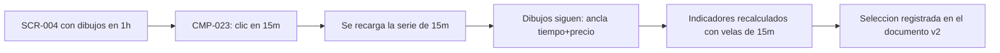
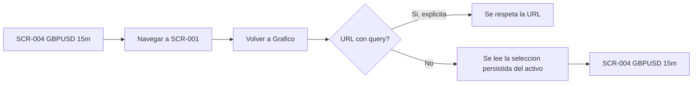
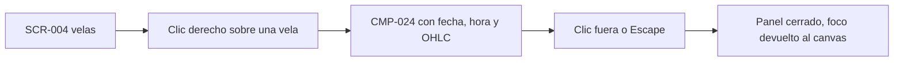

# Journeys — Ciclo 05 (Mejoras UX del Gráfico y Cierre de Deuda)

> Todos los journeys se rastrean a ≥1 RF de `_docs/requirements.md`.
> Persona única: P-001. Base: `_docs/iterations/04-dibujo-referencia-operacion/ux/user-journeys.md`.
> Los journeys J-001…J-007 del ciclo 03 y J-008…J-010 del ciclo 04 se heredan **vigentes**;
> este ciclo añade J-011, J-012 y J-013, y **extiende** J-002 y J-009.

## J-011: Cambiar de timeframe sin perder el trabajo

- **Persona:** P-001
- **Objetivo:** Pasar de `1h` a `15m` (y volver) **sin salir del gráfico**, conservando los
  dibujos, los indicadores y el activo.
- **RF cubiertos:** RF-403, RF-404, RF-405, RF-406
- **Precondiciones:** Gráfico cargado con datos (J-002) y, opcionalmente, con dibujos hechos en
  el TF actual (J-008).
- **Postcondiciones:** El gráfico muestra el nuevo TF, con los mismos dibujos y los indicadores
  recalculados; la selección queda persistida (J-012).

### Puntos de dolor que resuelve

- **"El timeframe es una jaula"** (frustración 2): el dibujo ya no pertenece a la escala en que
  se trazó; comparar escalas deja de exigir redibujar (RF-404, ADR-027).
- **Salir al formulario para cambiar de TF**: el selector vive en la cabecera del gráfico
  (RF-406), junto a Indicadores, sin cambiar de pantalla.

### Decisiones de UX en este flujo

| Paso | Decisión | Origen |
|------|----------|--------|
| B | `TimeframeSelector` (CMP-023) en `ChartHeader`, **a la izquierda** de Indicadores; `radiogroup` con un solo TF activo | RF-406 |
| B | El cambio de TF **no** pide confirmación ni descarta nada: es reversible y no destructivo | RNF-401 |
| C | Mientras carga el nuevo TF: skeleton de velas; los dibujos **permanecen** dibujados (no dependen de la serie) | RNF-403 |
| D | Los dibujos se re-proyectan con el nuevo eje temporal; su ancla es `(tiempo, precio)`, así que **no se mueven** | ADR-027 |
| E | Los indicadores muestran los mismos tipos y parámetros, recalculados con las velas del TF visible | RF-405 |
| F | La selección se guarda en el documento v2 del activo y en la URL | ADR-028 |

## J-012: Retomar la sesión de análisis donde se dejó

- **Persona:** P-001
- **Objetivo:** Ir a otra hoja (Biblioteca, Descarga, Abrir) y **volver a `Gráfico`** con el mismo
  activo, timeframe y rango; y que eso valga también al recargar la app.
- **RF cubiertos:** RF-401, RI-402
- **Precondiciones:** Una selección usada al menos una vez.
- **Postcondiciones:** La hoja `Gráfico` se abre con la última selección; la URL queda enriquecida.

### Puntos de dolor que resuelve

- **"La selección se resetea"** (frustración 1): la memoria vive en el documento v2, no en el
  enlace de navegación (ADR-028).
- **Un enlace explícito manda**: `/chart?symbol=GBPJPY` carga GBPJPY aunque la memoria diga otra
  cosa, así que compartir o marcar una URL sigue funcionando.

### Puntos de fricción conocidos

- Si no hay ninguna selección previa, se aplican los valores por defecto (`EURUSD`, `1h`, rango
  del ciclo anterior): el usuario nuevo no ve una pantalla vacía, pero tampoco un aviso de que son
  valores de ejemplo.

## J-013: Consultar el dato exacto de una vela

- **Persona:** P-001
- **Objetivo:** Saber fecha, hora y OHLC de **una vela concreta** sin tener que apuntar con el
  ratón al píxel exacto y leer la leyenda inferior.
- **RF cubiertos:** RF-408, RF-407
- **Precondiciones:** Gráfico con datos en `success`.
- **Postcondiciones:** Panel con los valores de la vela; se cierra con clic fuera o `Escape`; la
  leyenda inferior queda como estaba.

### Puntos de dolor que resuelve

- **Leer cifras del eje es indirecto**: el menú da el OHLC exacto (5 decimales, `font-num`) en el
  punto señalado, sin depender de la posición del cursor.
- **El eje pasa a dos filas** (RF-407): la fecha y la hora se leen sin apelotonarse, lo que hace
  el eje útil para situar la vela antes de abrir el menú.

### Decisión de UX

| Paso | Decisión | Origen |
|------|----------|--------|
| B | Clic derecho (ratón de escritorio, RNF-005). El menú **no sustituye** la leyenda `🎯`: la leyenda sigue al cursor, el menú **fija** una vela | RF-408 |
| C | Se reposiciona si no cabe en el viewport; nunca recorta el dato | CMP-024 |
| D | `Escape` y clic fuera cierran; el foco vuelve al elemento que lo abrió (accesibilidad) | WCAG 2.1 AA |

## Extensión de journeys heredados

| Journey heredado | Cambio en el ciclo 05 |
|------------------|------------------------|
| **J-002** Cargar el gráfico | El eje X pasa a **dos filas** (fecha / hora, RF-407) y el aviso de cobertura solo aparece cuando la serie no cubre el rango (RF-402). |
| **J-009** Ajustar la operación y leer el desenlace | Se cierra la brecha de precisión: con la figura seleccionada, el popover numérico (CMP-025) permite fijar Entrada y SL por teclado con 5 decimales y deshacer (RF-410). |
| **J-010** Conservar la operación entre sesiones | La persistencia deja de ser por activo+TF: pasa a un **documento v2 por activo** con migración aditiva desde v1 (RI-401, RNF-401). |

## Brechas de UX que este ciclo NO cubre

Se reportan para un ciclo posterior; **ningún RF las pide**, así que no entran en alcance.

1. **Sin series de operaciones ni vista de resultados** (`RF-W-401`): el backtesting manual sigue
   siendo "leer el gráfico", sin win rate ni curva de resultados.
2. **Sin soporte táctil** (`RF-W-407`): el menú contextual y los handles son de ratón.
3. **Sin panel visual de resumen de la operación**: los valores siguen saliendo por `LiveRegion`
   (accesibilidad) y por las etiquetas del canvas.

> La brecha del ciclo 04 «sin ruta por teclado ni entrada numérica» **queda cerrada** por RF-410.

## Cobertura RF ↔ journey

| RF | Journey |
|----|---------|
| RF-401, RI-402 | J-012 |
| RF-402 | J-002 (extendido) · estado `partial` de SCR-004 |
| RF-403, RF-404, RF-405, RF-406 | J-011 |
| RF-407 | J-002 (extendido) · J-013 |
| RF-408 | J-013 |
| RF-409 | Retirada de SCR-005 (no es un journey; ver ADR-029) |
| RF-410 | J-009 (extendido) |
| RF-411 | Evaluación de SCR-006 (decisión de cierre, no un journey) |
| RNF-401, RI-401 | J-010 (extendido) |
| RNF-402, RNF-403, RNF-404 | Transversales (ver `interaction-specs.md`) |
| RNF-405 | Atributo de SCR-004: `color-draw-line` en `design-system.md` §2 |
| RX-401 | Transversal (sin dependencias nuevas) |
